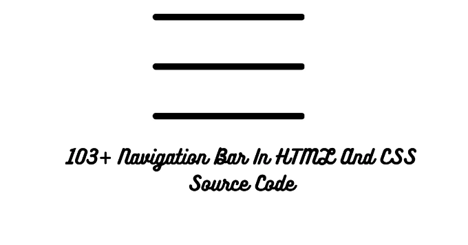

# HTML과 CSS를 사용한 내비게이션 바

안녕하세요 개발자 여러분! 코딩랜덤에 오신 것을 환영합니다. 오늘은 소스 코드와 함께 내비게이션 바를 만드는 방법을 살펴보겠습니다. HTML과 CSS로 작성된 무료 내비게이션 바 코드의 최신 컬렉션을 제공합니다. 이는 2023년 4월에 추가된 36개의 새로운 내비게이션 바 소스 코드를 포함한 업데이트된 컬렉션입니다.

# 내비게이션 바란 무엇인가요?

<!-- ui-log 수평형 -->
<ins class="adsbygoogle"
  style="display:block"
  data-ad-client="ca-pub-4877378276818686"
  data-ad-slot="9743150776"
  data-ad-format="auto"
  data-full-width-responsive="true"></ins>
<component is="script">
(adsbygoogle = window.adsbygoogle || []).push({});
</component>

내비게이션 바 또는 사이드 메뉴는 웹 사이트의 중요한 부분으로, 빠른 이동 링크, 검색 창, 로그인/가입 링크, 회사 로고 등을 제공합니다. 내비게이션 바가 없으면 어떤 웹 사이트도 불완전해 보입니다.

여기서는 HTML과 CSS로 간단한 내비게이션 바를 만드는 방법과 100가지 이상의 예제를 보여 드리겠습니다.

관련 기사 - 소스 코드가 포함된 100가지 이상의 HTML, CSS, JavaScript 프로젝트 (초보자부터 고급까지)

소스 코드를 사용한 HTML 및 CSS를 활용한 레스토랑 웹사이트

<!-- ui-log 수평형 -->
<ins class="adsbygoogle"
  style="display:block"
  data-ad-client="ca-pub-4877378276818686"
  data-ad-slot="9743150776"
  data-ad-format="auto"
  data-full-width-responsive="true"></ins>
<component is="script">
(adsbygoogle = window.adsbygoogle || []).push({});
</component>

HTML 및 CSS에서 멋진 내비게이션 바를 살펴보죠.

1. 반응형 측면 내비게이션 바

간단하고 밝은 테마의 왼쪽 내비게이션 바로 목록을 시작해봅시다. 페이지 로드 시 내비게이션 아이콘만 표시되지만 햄버거 아이콘을 클릭하면 사이드바가 확장됩니다.

2. 부트스트랩 내비게이션 바

<!-- ui-log 수평형 -->
<ins class="adsbygoogle"
  style="display:block"
  data-ad-client="ca-pub-4877378276818686"
  data-ad-slot="9743150776"
  data-ad-format="auto"
  data-full-width-responsive="true"></ins>
<component is="script">
(adsbygoogle = window.adsbygoogle || []).push({});
</component>

간단하고 반응형 내비게이션 바입니다. 여러 가지 다른 카테고리가 상단에 있고 검색 창도 있습니다. 게다가 로그인 및 가입 버튼도 있습니다.

자바스크립트를 사용하여 이자 계산기를 만드는 방법

3. 투명 내비게이션

이것은 Manas Yadav가 만든 매우 잘 만든 내비게이션 바입니다. 내비게이션 바 버튼을 클릭하면 페이지에서 해당 위치로 자동 스크롤됩니다. 홈페이지에 사용할 수 있습니다.

<!-- ui-log 수평형 -->
<ins class="adsbygoogle"
  style="display:block"
  data-ad-client="ca-pub-4877378276818686"
  data-ad-slot="9743150776"
  data-ad-format="auto"
  data-full-width-responsive="true"></ins>
<component is="script">
(adsbygoogle = window.adsbygoogle || []).push({});
</component>

4. 스티키 슬라이더 내비게이션 (반응형)

또 다른 내비게이션 바가 자동으로 스크롤되지만 이것은 더욱 만족스러운 애니메이션과 디자인으로 더욱 향상되어 있습니다.

5. 내비게이션 바 디자인

배경에 그라데이션이 적용된 내비게이션 바로, 호버 시 멋진 그라데이션과 깜박임 효과가 있습니다.

<!-- ui-log 수평형 -->
<ins class="adsbygoogle"
  style="display:block"
  data-ad-client="ca-pub-4877378276818686"
  data-ad-slot="9743150776"
  data-ad-format="auto"
  data-full-width-responsive="true"></ins>
<component is="script">
(adsbygoogle = window.adsbygoogle || []).push({});
</component>

이제 여기까지입니다. 이 글에서는 멋진 다양한 디자인을 갖춘 HTML 및 CSS 소스 코드로 내비게이션 바를 공유했습니다. 간단하고 심플한 내비게이션 바부터 자동 스크롤, 멋진 전환 효과, 심지어 3D 아이콘까지 모두 다루었습니다. 이 글이 마음에 들었기를 바랍니다. 동료 개발자들과 공유해보세요. 아래에 의견과 제안을 남겨주세요.

Codewithrandom의 다른 글을 확인하고 프론트엔드 개발에서 지식을 쌓아보세요.

감사합니다.

전체 기사를 읽고 완전한 소스 코드를 얻으세요