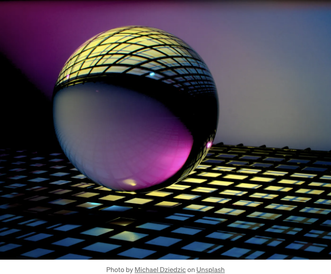

CSS 스타일을 활용하여 웹사이트 디자인을 강화할 수 있는 필수 기술 10가지를 알아보세요! CSS Grid 및 Flexbox를 활용하여 아름다운 레이아웃을 만드는 방법, 동적 테마로 사이트 모양을 맞추는 방법, 그리고 부드러운 전환과 3D 효과로 멋을 더하는 방법을 배워보세요. 온라인 세계에서 여러분의 디자인 역량을 높여 시청자에게 남는 인상을 줘 보세요.



### 1. CSS Grid의 파워:

CSS Grid의 auto-fill 속성을 활용하여 열 너비를 동적으로 조절하여 최적의 레이아웃 유연성을 유지하세요.

<!-- ui-log 수평형 -->
<ins class="adsbygoogle"
  style="display:block"
  data-ad-client="ca-pub-4877378276818686"
  data-ad-slot="9743150776"
  data-ad-format="auto"
  data-full-width-responsive="true"></ins>
<component is="script">
(adsbygoogle = window.adsbygoogle || []).push({});
</component>

```css
.container {
  display: grid;
  grid-template-columns: repeat(auto-fill, minmax(300px, 1fr));
  gap: 20px;
}
```

## 2. Flexbox 마스터하기::

Flexbox의 space-between 속성을 사용하여 flex 항목 사이의 공간을 고르게 배치하여 노력을 줄이고 균형있는 레이아웃을 구현하세요.

```css
.container {
  display: flex;
  justify-content: space-between;
  align-items: stretch;
}
```

<!-- ui-log 수평형 -->
<ins class="adsbygoogle"
  style="display:block"
  data-ad-client="ca-pub-4877378276818686"
  data-ad-slot="9743150776"
  data-ad-format="auto"
  data-full-width-responsive="true"></ins>
<component is="script">
(adsbygoogle = window.adsbygoogle || []).push({});
</component>

## 3. CSS 변수를 활용한 동적 테마:

CSS 변수의 힘을 빌려 동적 테마를 만들어 보세요. 이를 통해 웹 사이트 전반에 걸쳐 쉬운 사용자 정의와 일관된 브랜딩이 가능해집니다.

```js
:root {
  --primary: #007bff;
  --secondary: #6c757d;
}
.element {
  color: var(--primary);
  background-color: var(--secondary);
}
```

<!-- ui-log 수평형 -->
<ins class="adsbygoogle"
  style="display:block"
  data-ad-client="ca-pub-4877378276818686"
  data-ad-slot="9743150776"
  data-ad-format="auto"
  data-full-width-responsive="true"></ins>
<component is="script">
(adsbygoogle = window.adsbygoogle || []).push({});
</component>

사용자 장치에 필수 CSS 프로퍼티를 사용하여 타이포그래피를 구현하면 다양한 화면 크기에서 최적의 가독성을 보장하며 유동적인 크기 조정이 가능합니다.

```js
.text {
  font-size: calc(0.5rem + 2vw);
}
```

## 5. 부드러운 전환과 애니메이션:

CSS를 활용하여 디자인에 광택과 상호작용성을 더하고 부드러운 전환과 애니메이션으로 사용자 경험을 향상시키세요.

<!-- ui-log 수평형 -->
<ins class="adsbygoogle"
  style="display:block"
  data-ad-client="ca-pub-4877378276818686"
  data-ad-slot="9743150776"
  data-ad-format="auto"
  data-full-width-responsive="true"></ins>
<component is="script">
(adsbygoogle = window.adsbygoogle || []).push({});
</component>

```js
.button {
  transition: transform 0.3s ease;
}
.button:hover {
  transform: scale(1.1);
}
```

## 6. 복잡한 그라데이션 배경:

원형 그라데이션을 사용하여 시각적으로 멋진 배경을 만들어 웹사이트 디자인에 깊이와 세련미를 더하세요.

```js
.background {
  background: radial-gradient(circle, #ff416c 0%, #ff4b2b 100%);
}
```

<!-- ui-log 수평형 -->
<ins class="adsbygoogle"
  style="display:block"
  data-ad-client="ca-pub-4877378276818686"
  data-ad-slot="9743150776"
  data-ad-format="auto"
  data-full-width-responsive="true"></ins>
<component is="script">
(adsbygoogle = window.adsbygoogle || []).push({});
</component>

## 7. 고급 블렌드 모드:

창의적인 구성과 놀라운 시각 효과를 가능하게 하는 이미지를 매끄럽게 오버레이하는 고급 블렌드 모드로 실험해보세요.

```js
.element {
  background: url('image.jpg') no-repeat center center / cover;
  mix-blend-mode: overlay;
}
```

## 8. 다이나믹 박스 그림자:

<!-- ui-log 수평형 -->
<ins class="adsbygoogle"
  style="display:block"
  data-ad-client="ca-pub-4877378276818686"
  data-ad-slot="9743150776"
  data-ad-format="auto"
  data-full-width-responsive="true"></ins>
<component is="script">
(adsbygoogle = window.adsbygoogle || []).push({});
</component>

요소에 동적 박스 그림자를 적용하여 디자인에 깊이와 차원을 더하고 응답성과 성능을 유지하세요.

```js
.box {
  box-shadow: 0 20px 40px rgba(0, 0, 0, 0.2);
}
```

## 9. 깊이를 위한 3D 변형:

평면을 벗어나 3D 변환을 활용하여 원근 및 회전을 결합하여 몰입적이고 매력적인 사용자 경험을 만드세요.

<!-- ui-log 수평형 -->
<ins class="adsbygoogle"
  style="display:block"
  data-ad-client="ca-pub-4877378276818686"
  data-ad-slot="9743150776"
  data-ad-format="auto"
  data-full-width-responsive="true"></ins>
<component is="script">
(adsbygoogle = window.adsbygoogle || []).push({});
</component>

```js
.element {
  transform: perspective(1000px) rotateX(45deg) rotateY(45deg);
}
```

## 10. SVG 애니메이션으로 사용자 정의 커서 만들기:

SVG 애니메이션을 사용하여 커서의 동작을 사용자 정의하고, 시각적 피드백을 제공하고, 사용자 상호 작용을 안내하여 상호 작용성을 향상시킵니다.

```js
.button {
  cursor: url('custom-cursor.svg'), auto;
}
```

<!-- ui-log 수평형 -->
<ins class="adsbygoogle"
  style="display:block"
  data-ad-client="ca-pub-4877378276818686"
  data-ad-slot="9743150776"
  data-ad-format="auto"
  data-full-width-responsive="true"></ins>
<component is="script">
(adsbygoogle = window.adsbygoogle || []).push({});
</component>

축하합니다! 이제 10가지 고급 CSS 트릭을 배웠어요. 각각 실험해보고 프론트엔드 프로젝트에 통합해보세요.

이 트릭들이 유용하고 실용적이었기를 바랍니다. 생각이나 경험을 댓글로 공유해주세요.

감사합니다!

프론트엔드 개발을 향상시키고 싶나요? 지금 가입하세요!