# 소개

CSS에서 display는 브라우저에서 웹 페이지의 HTML 요소가 어떻게 표시되어야 하는지 정의하는 중요한 속성입니다. 이 글에서는 CSS display 속성과 그 다양한 값에 대해 알아볼 거에요.

바로 시작해 볼까요? 🚀

<!-- ui-log 수평형 -->
<ins class="adsbygoogle"
  style="display:block"
  data-ad-client="ca-pub-4877378276818686"
  data-ad-slot="9743150776"
  data-ad-format="auto"
  data-full-width-responsive="true"></ins>
<component is="script">
(adsbygoogle = window.adsbygoogle || []).push({});
</component>

# display 속성이란 무엇인가요?

display 속성은 HTML 요소가 웹 페이지에서 어떻게 표시되어야 하는지를 정의합니다. 주요 역할은 요소의 레이아웃과 위치를 제어하는 것입니다.

기본 구문:

```js
element {
  display: value;
}
```

<!-- ui-log 수평형 -->
<ins class="adsbygoogle"
  style="display:block"
  data-ad-client="ca-pub-4877378276818686"
  data-ad-slot="9743150776"
  data-ad-format="auto"
  data-full-width-responsive="true"></ins>
<component is="script">
(adsbygoogle = window.adsbygoogle || []).push({});
</component>

가장 일반적인 표시 값으로 들어가 봅시다.

## display: block;

요소의 display 속성을 'block'으로 설정하면 새로운 줄에서 시작하고 부모 컨테이너의 전체 너비를 차지합니다.

해당 요소에 너비와 높이 속성을 설정할 수 있습니다.

<!-- ui-log 수평형 -->
<ins class="adsbygoogle"
  style="display:block"
  data-ad-client="ca-pub-4877378276818686"
  data-ad-slot="9743150776"
  data-ad-format="auto"
  data-full-width-responsive="true"></ins>
<component is="script">
(adsbygoogle = window.adsbygoogle || []).push({});
</component>

기본 블록 레벨 요소의 예시로는 'div', 'p', 'h1'~'h6', 'header', 'footer'가 있습니다.

HTML:

```js
<div>이것은 블록 레벨 요소입니다.</div>
<span>이것은 span입니다.</span>
```

CSS:

<!-- ui-log 수평형 -->
<ins class="adsbygoogle"
  style="display:block"
  data-ad-client="ca-pub-4877378276818686"
  data-ad-slot="9743150776"
  data-ad-format="auto"
  data-full-width-responsive="true"></ins>
<component is="script">
(adsbygoogle = window.adsbygoogle || []).push({});
</component>

```js
div {
  border: 2px solid red;
}
span {
  border: 2px solid green;
}
```

결과:

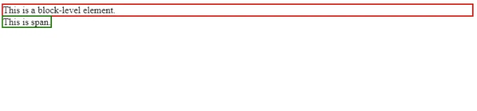

여기서 `div`는 기본적으로 블록 수준 요소로 설정되어 있어 컨테이너의 전체 너비를 차지합니다. 반면에 `span`은 기본 블록 수준 동작을 가지지 않고 내용에 필요한 너비만 차지합니다.

<!-- ui-log 수평형 -->
<ins class="adsbygoogle"
  style="display:block"
  data-ad-client="ca-pub-4877378276818686"
  data-ad-slot="9743150776"
  data-ad-format="auto"
  data-full-width-responsive="true"></ins>
<component is="script">
(adsbygoogle = window.adsbygoogle || []).push({});
</component>

`span` 요소를 블록 수준 요소로 변환하려면 display 속성을 'block'으로 설정하면 됩니다.

```js
span {
  border: 2px solid green;
  display: block;
}
```

결과:

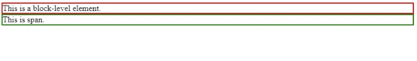

<!-- ui-log 수평형 -->
<ins class="adsbygoogle"
  style="display:block"
  data-ad-client="ca-pub-4877378276818686"
  data-ad-slot="9743150776"
  data-ad-format="auto"
  data-full-width-responsive="true"></ins>
<component is="script">
(adsbygoogle = window.adsbygoogle || []).push({});
</component>

이제 `span`은 블록 수준 요소로, 컨테이너의 전체 너비를 차지합니다.

## display: inline;

요소의 display 속성을 'inline'으로 설정하면 새로운 줄에서 시작하지 않고 콘텐츠에 필요한 너비를 차지합니다.

해당 요소의 너비와 높이 속성을 설정할 수 없습니다.

<!-- ui-log 수평형 -->
<ins class="adsbygoogle"
  style="display:block"
  data-ad-client="ca-pub-4877378276818686"
  data-ad-slot="9743150776"
  data-ad-format="auto"
  data-full-width-responsive="true"></ins>
<component is="script">
(adsbygoogle = window.adsbygoogle || []).push({});
</component>

기본 인라인 요소 예시에는 `span`, `a`, `img` 등이 포함됩니다.

HTML:

```js
<span>This is a span inline element.</span>
<a>This is a hyperlink inline element.</a>
<section>This is not a default inline element.</section>
```

CSS:

<!-- ui-log 수평형 -->
<ins class="adsbygoogle"
  style="display:block"
  data-ad-client="ca-pub-4877378276818686"
  data-ad-slot="9743150776"
  data-ad-format="auto"
  data-full-width-responsive="true"></ins>
<component is="script">
(adsbygoogle = window.adsbygoogle || []).push({});
</component>

```css
span {
  border: 2px solid green;
}
a {
  border: 2px solid red;
}
section {
  border: 2px solid blue;
}
```

Output:

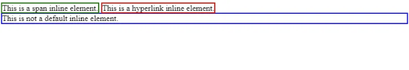

여기서 `span`과 `a`는 기본적으로 인라인 요소이며, 새로운 줄을 시작하거나 콘텐츠에 필요한 너비를 차지하지 않습니다. 반면에 `section`은 기본적으로 인라인 요소가 아니기 때문에 새로운 줄에서 시작합니다.

<!-- ui-log 수평형 -->
<ins class="adsbygoogle"
  style="display:block"
  data-ad-client="ca-pub-4877378276818686"
  data-ad-slot="9743150776"
  data-ad-format="auto"
  data-full-width-responsive="true"></ins>
<component is="script">
(adsbygoogle = window.adsbygoogle || []).push({});
</component>

`section` 요소를 인라인 요소로 변환하려면 display 속성을 'inline'으로 설정하세요.

```js
section {
  border: 2px solid blue;
  display: inline;
}
```

결과:

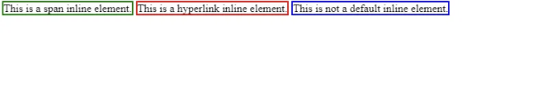

<!-- ui-log 수평형 -->
<ins class="adsbygoogle"
  style="display:block"
  data-ad-client="ca-pub-4877378276818686"
  data-ad-slot="9743150776"
  data-ad-format="auto"
  data-full-width-responsive="true"></ins>
<component is="script">
(adsbygoogle = window.adsbygoogle || []).push({});
</component>

지금 `section`은 인라인 요소로 설정되어 있어요.

# display: inline-block;

요소의 display 속성을 'inline-block'으로 설정하면 블록 요소와 인라인 요소의 기능을 모두 가질 수 있어요. 필요한 만큼의 너비만 차지하지만 높이와 너비 속성을 설정할 수 있어요.

HTML:

<!-- ui-log 수평형 -->
<ins class="adsbygoogle"
  style="display:block"
  data-ad-client="ca-pub-4877378276818686"
  data-ad-slot="9743150776"
  data-ad-format="auto"
  data-full-width-responsive="true"></ins>
<component is="script">
(adsbygoogle = window.adsbygoogle || []).push({});
</component>

```js
<div>이것은 기본 블록 수준 요소입니다.</div>
<span>이것은 기본 인라인 요소입니다.</span>
```

CSS:

```js
div {
  border: 2px solid red;
}
span {
  border: 2px solid green;
  height: 200px;
}
```

출력:

<!-- ui-log 수평형 -->
<ins class="adsbygoogle"
  style="display:block"
  data-ad-client="ca-pub-4877378276818686"
  data-ad-slot="9743150776"
  data-ad-format="auto"
  data-full-width-responsive="true"></ins>
<component is="script">
(adsbygoogle = window.adsbygoogle || []).push({});
</component>

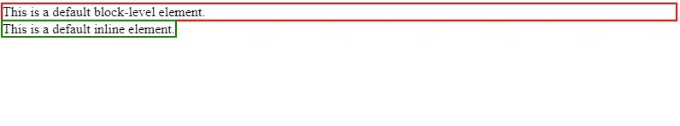

여기서 `span` 요소에 높이 속성을 할당하려고 시도했지만, 인라인 속성 때문에 영향을 미치지 못하는 것 같아요.

`display` 속성을 'inline-block'으로 변경함으로써 `span` 요소에 높이 속성을 성공적으로 적용할 수 있어요.

```js
span {
  border: 2px solid green;
  height: 200px;
  display: inline-block;
}
```

<!-- ui-log 수평형 -->
<ins class="adsbygoogle"
  style="display:block"
  data-ad-client="ca-pub-4877378276818686"
  data-ad-slot="9743150776"
  data-ad-format="auto"
  data-full-width-responsive="true"></ins>
<component is="script">
(adsbygoogle = window.adsbygoogle || []).push({});
</component>

결과:

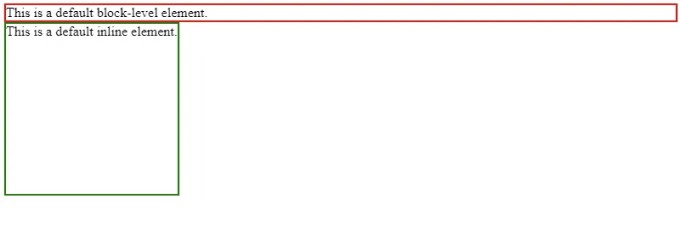

# display: flex;

display: flex; 속성은 유연한 레이아웃을 만들기 위해 사용할 수 있는 플랙스 컨테이너를 생성합니다.

<!-- ui-log 수평형 -->
<ins class="adsbygoogle"
  style="display:block"
  data-ad-client="ca-pub-4877378276818686"
  data-ad-slot="9743150776"
  data-ad-format="auto"
  data-full-width-responsive="true"></ins>
<component is="script">
(adsbygoogle = window.adsbygoogle || []).push({});
</component>


```html
<div class="container">
   <div class="item">Item 1</div>
   <div class="item">Item 2</div>
   <div class="item">Item 3</div>
</div>
```

CSS:

```css
.container {
  display: flex;
  border: 2px solid black;
}
.item {
  height: 100px;
  width: 100px;
  border: 1px solid green;
  margin: 10px;
}
```

<!-- ui-log 수평형 -->
<ins class="adsbygoogle"
  style="display:block"
  data-ad-client="ca-pub-4877378276818686"
  data-ad-slot="9743150776"
  data-ad-format="auto"
  data-full-width-responsive="true"></ins>
<component is="script">
(adsbygoogle = window.adsbygoogle || []).push({});
</component>

출력:

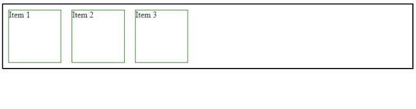

# display: inline-flex;

display: inline-flex; 속성은 display: flex;와 유사하지만 display: inline-flex;가 적용된 컨테이너는 인라인 요소처럼 동작합니다.

<!-- ui-log 수평형 -->
<ins class="adsbygoogle"
  style="display:block"
  data-ad-client="ca-pub-4877378276818686"
  data-ad-slot="9743150776"
  data-ad-format="auto"
  data-full-width-responsive="true"></ins>
<component is="script">
(adsbygoogle = window.adsbygoogle || []).push({});
</component>

Markdown:

```html
<div class="container">
   <div class="item">Item 1</div>
   <div class="item">Item 2</div>
   <div class="item">Item 3</div>
</div>
```

CSS:

```css
.container {
  display: inline-flex;
  border: 2px solid black;
}
.item {
  height: 100px;
  width: 100px;
  border: 1px solid green;
  margin: 10px;
}
```

<!-- ui-log 수평형 -->
<ins class="adsbygoogle"
  style="display:block"
  data-ad-client="ca-pub-4877378276818686"
  data-ad-slot="9743150776"
  data-ad-format="auto"
  data-full-width-responsive="true"></ins>
<component is="script">
(adsbygoogle = window.adsbygoogle || []).push({});
</component>

출력:

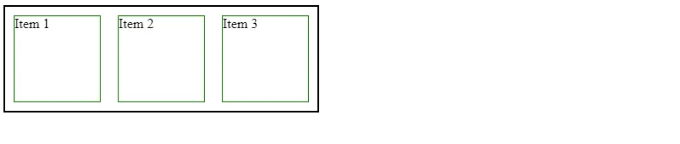

# display: grid;

display: grid; 속성은 컨테이너를 그리드 컨테이너로 변환하고 자식 요소를 그리드 항목으로 변환합니다. 그리드 레이아웃을 사용하면 행과 열에 대해 정밀한 제어가 가능합니다.

<!-- ui-log 수평형 -->
<ins class="adsbygoogle"
  style="display:block"
  data-ad-client="ca-pub-4877378276818686"
  data-ad-slot="9743150776"
  data-ad-format="auto"
  data-full-width-responsive="true"></ins>
<component is="script">
(adsbygoogle = window.adsbygoogle || []).push({});
</component>

Markdown:

```md
- div.container {
  - display: grid;
  - border: 2px solid black;
- }
- div.item {
  - border: 1px solid green;
  - margin: 10px;
  - padding: 10px;
- }
```

<!-- ui-log 수평형 -->
<ins class="adsbygoogle"
  style="display:block"
  data-ad-client="ca-pub-4877378276818686"
  data-ad-slot="9743150776"
  data-ad-format="auto"
  data-full-width-responsive="true"></ins>
<component is="script">
(adsbygoogle = window.adsbygoogle || []).push({});
</component>

출력:

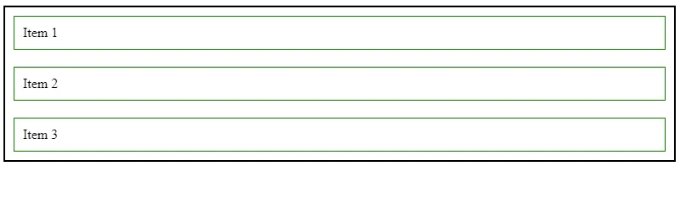

# display: inline-grid;

display: inline-grid; 속성은 display: grid;와 비슷하지만 display: inline-grid;가 적용된 컨테이너는 인라인 요소처럼 동작합니다.

<!-- ui-log 수평형 -->
<ins class="adsbygoogle"
  style="display:block"
  data-ad-client="ca-pub-4877378276818686"
  data-ad-slot="9743150776"
  data-ad-format="auto"
  data-full-width-responsive="true"></ins>
<component is="script">
(adsbygoogle = window.adsbygoogle || []).push({});
</component>

Markdown:

| HTML                                                                           | CSS                                                             |
|--------------------------------------------------------------------------------|-----------------------------------------------------------------|
| <div class="container"> <br> <div class="item">Item 1</div> <br> <div class="item">Item 2</div> <br> <div class="item">Item 3</div> <br> </div> |   .container { <br> display: inline-grid; <br> border: 2px solid black; <br> } <br> .item { <br> border: 1px solid green; <br> margin: 10px; <br> padding: 10px; <br> } |

<!-- ui-log 수평형 -->
<ins class="adsbygoogle"
  style="display:block"
  data-ad-client="ca-pub-4877378276818686"
  data-ad-slot="9743150776"
  data-ad-format="auto"
  data-full-width-responsive="true"></ins>
<component is="script">
(adsbygoogle = window.adsbygoogle || []).push({});
</component>

아래 이미지를 확인해주세요.

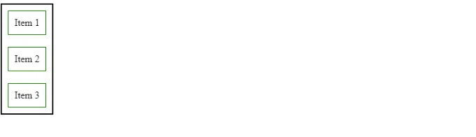

만약 요소의 display 속성을 'none'으로 설정하면, 해당 요소는 완전히 보이지 않고 문서 내에서 공간을 차지하지 않습니다.

<!-- ui-log 수평형 -->
<ins class="adsbygoogle"
  style="display:block"
  data-ad-client="ca-pub-4877378276818686"
  data-ad-slot="9743150776"
  data-ad-format="auto"
  data-full-width-responsive="true"></ins>
<component is="script">
(adsbygoogle = window.adsbygoogle || []).push({});
</component>

CSS:

```css
div {
  display: none;
  height: 200px;
}
p {
  border: 2px solid green;
}
```

<!-- ui-log 수평형 -->
<ins class="adsbygoogle"
  style="display:block"
  data-ad-client="ca-pub-4877378276818686"
  data-ad-slot="9743150776"
  data-ad-format="auto"
  data-full-width-responsive="true"></ins>
<component is="script">
(adsbygoogle = window.adsbygoogle || []).push({});
</component>

변경된 표를 마크다운 형식으로 보여드리겠습니다.


| Property | Description |
|----------|-------------|
| visibility: hidden;  | 보이지 않게 요소를 숨김. hidden으로 설정된 요소는 공간을 계속 차지함. |
| display: none; | 요소를 화면에서 숨김. hidden과 달리 공간을 차지하지 않음. |

위의 코드를 복사하여 사용하시면 됩니다!

<!-- ui-log 수평형 -->
<ins class="adsbygoogle"
  style="display:block"
  data-ad-client="ca-pub-4877378276818686"
  data-ad-slot="9743150776"
  data-ad-format="auto"
  data-full-width-responsive="true"></ins>
<component is="script">
(adsbygoogle = window.adsbygoogle || []).push({});
</component>

출력:

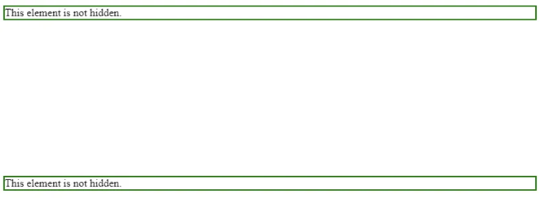

# display: inherit;

요소의 display 속성을 'inherit'로 설정하면 해당 요소가 부모 요소로부터 display 값을 상속받습니다.

<!-- ui-log 수평형 -->
<ins class="adsbygoogle"
  style="display:block"
  data-ad-client="ca-pub-4877378276818686"
  data-ad-slot="9743150776"
  data-ad-format="auto"
  data-full-width-responsive="true"></ins>
<component is="script">
(adsbygoogle = window.adsbygoogle || []).push({});
</component>

Markdown:

```html
<div>
  <span>This will inherit the display value from its parent.</span>
</div>
```

<!-- ui-log 수평형 -->
<ins class="adsbygoogle"
  style="display:block"
  data-ad-client="ca-pub-4877378276818686"
  data-ad-slot="9743150776"
  data-ad-format="auto"
  data-full-width-responsive="true"></ins>
<component is="script">
(adsbygoogle = window.adsbygoogle || []).push({});
</component>

```js
span {
  display: inherit;
  border: 2px solid green;
  padding: 10px;
}
```

`span` 요소의 display 속성은 'inherit'로 설정되어 있으므로, 부모 요소인 `div`로부터 display 값을 상속받아 블록 수준 요소처럼 작동합니다.

결과:

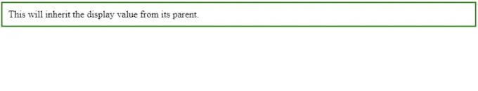


<!-- ui-log 수평형 -->
<ins class="adsbygoogle"
  style="display:block"
  data-ad-client="ca-pub-4877378276818686"
  data-ad-slot="9743150776"
  data-ad-format="auto"
  data-full-width-responsive="true"></ins>
<component is="script">
(adsbygoogle = window.adsbygoogle || []).push({});
</component>

# display: initial;

display: initial; 속성은 요소의 display 속성을 일반적으로 대부분의 요소에 대해 인라인으로 설정하는 초기 값으로 설정합니다.

HTML:

```js
<div>Lorem ipsum dolor sit, amet consectetur adipisicing elit. Saepe, a?</div>
```

<!-- ui-log 수평형 -->
<ins class="adsbygoogle"
  style="display:block"
  data-ad-client="ca-pub-4877378276818686"
  data-ad-slot="9743150776"
  data-ad-format="auto"
  data-full-width-responsive="true"></ins>
<component is="script">
(adsbygoogle = window.adsbygoogle || []).push({});
</component>

CSS:

```js
div {
  display: initial;
  border: 1px solid green;
}
```

Output:

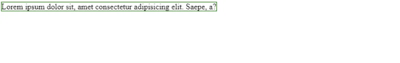

<!-- ui-log 수평형 -->
<ins class="adsbygoogle"
  style="display:block"
  data-ad-client="ca-pub-4877378276818686"
  data-ad-slot="9743150776"
  data-ad-format="auto"
  data-full-width-responsive="true"></ins>
<component is="script">
(adsbygoogle = window.adsbygoogle || []).push({});
</component>

# 결론

이러한 표시 속성을 이해하면 잘 구조화되고 응답성 있는 웹 레이아웃을 만들 수 있습니다. HTML 요소에 적절한 표시 값을 선택하여 웹 페이지에서 그들의 동작과 시각적 표현에 대해 정밀한 제어를 할 수 있게 됩니다.

읽어 주셔서 감사합니다.

자세한 내용은 [여기를 클릭](링크)하세요.

<!-- ui-log 수평형 -->
<ins class="adsbygoogle"
  style="display:block"
  data-ad-client="ca-pub-4877378276818686"
  data-ad-slot="9743150776"
  data-ad-format="auto"
  data-full-width-responsive="true"></ins>
<component is="script">
(adsbygoogle = window.adsbygoogle || []).push({});
</component>

위의 내용은 다음과 같이 번역할 수 있습니다.

친구야, 웹 개발에 대한 매일 팁을 받으려면 X(트위터)에서도 저를 팔로우할 수 있어.

코딩을 계속 해보세요!!


# 스택데미닉

<!-- ui-log 수평형 -->
<ins class="adsbygoogle"
  style="display:block"
  data-ad-client="ca-pub-4877378276818686"
  data-ad-slot="9743150776"
  data-ad-format="auto"
  data-full-width-responsive="true"></ins>
<component is="script">
(adsbygoogle = window.adsbygoogle || []).push({});
</component>

끝까지 읽어주셔서 감사합니다. 떠나시기 전에:

- 저자를 클로닝하고 팔로우해주세요! 👏
- 트위터(X), 링크드인, 유튜브에서 팔로우하기
- Stackademic.com 방문하여 전세계에서 무료 프로그래밍 교육을 민주화하는 방법에 대해 더 알아보기