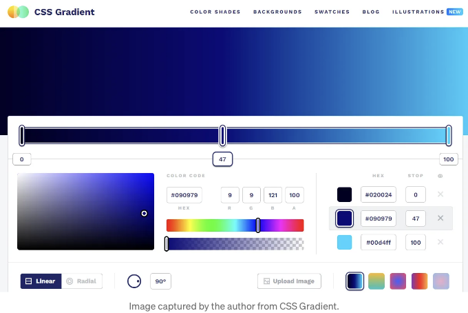
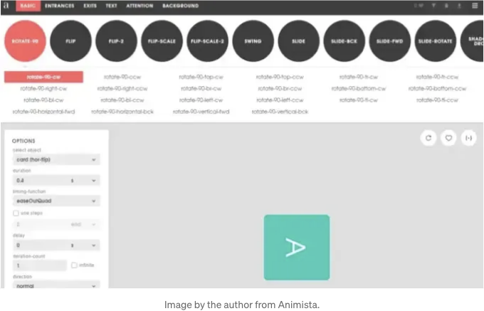
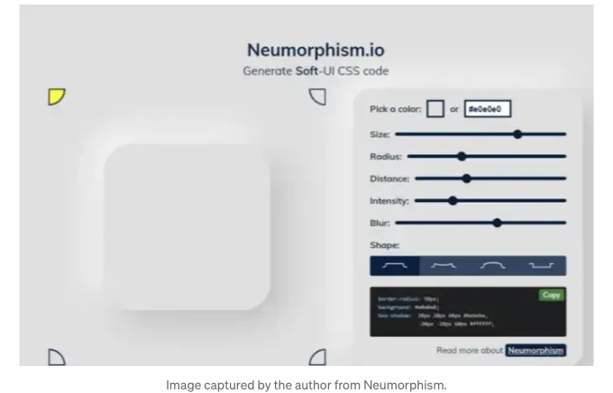
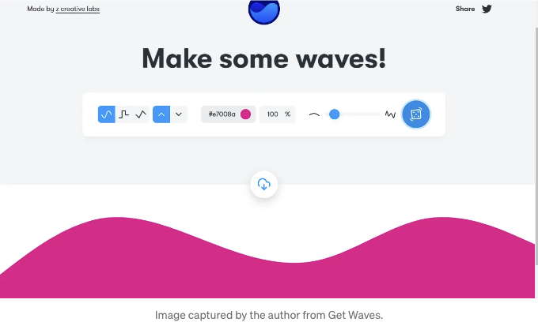
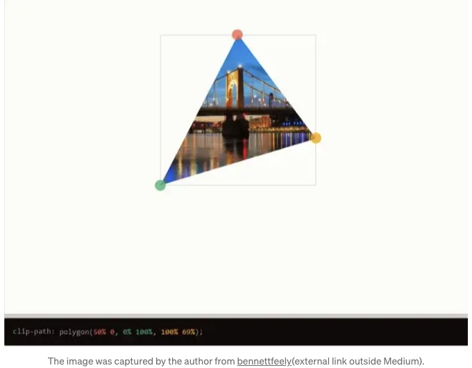
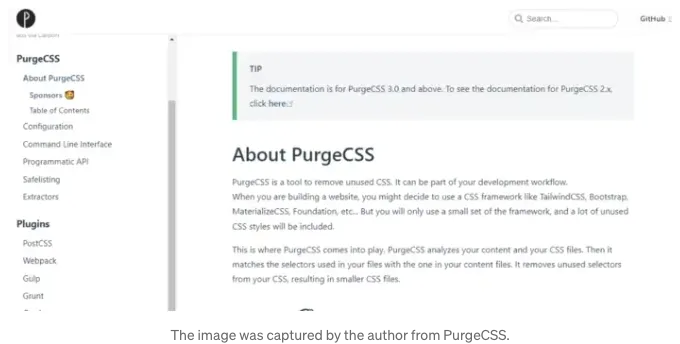
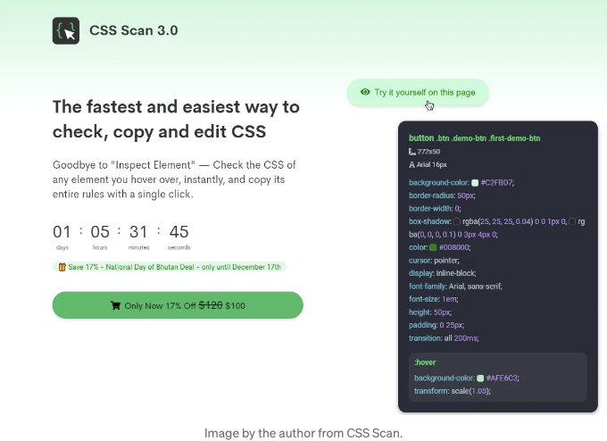
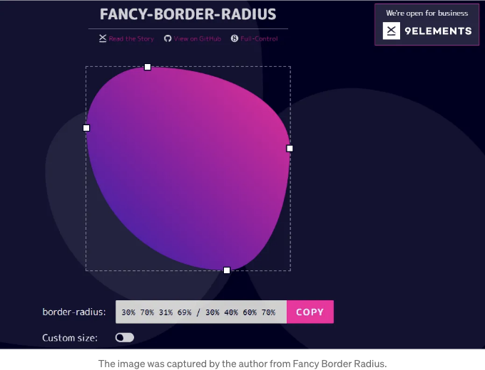
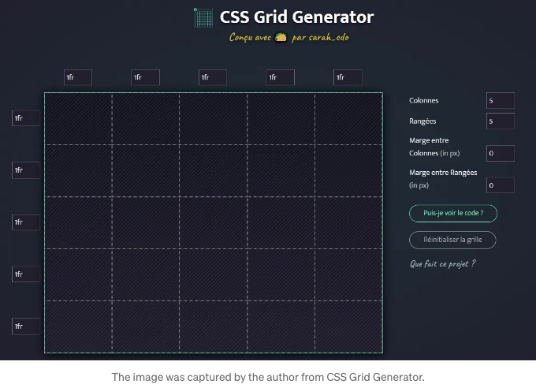

CSS에 대해 이야기할 때, 프로젝트를 스타일링하는 데 많은 코드 라인을 작성해야 하는 것이 보통입니다. 물론 프론트 엔드를 위한 좋은 CSS를 작성하는 데 집중하는 것이 중요하지만, 그 과정은 많은 시간이 소요될 수 있습니다.

웹 개발자로서, 프로젝트를 작업할 때 CSS는 필수 언어 중 하나입니다. 요즘에는 CSS 코드 작성을 매우 간편하게 만드는 여러 프레임워크들이 많이 있습니다.

하지만 코딩할 때 우리의 삶을 더 쉽게 만들어주는 단축키나 도구가 필요합니다. 다행히도 개발자들의 생산성을 향상시켜주는 많은 무료 오픈 소스 CSS 도구와 생성기들이 있습니다.

<!-- ui-log 수평형 -->
<ins class="adsbygoogle"
  style="display:block"
  data-ad-client="ca-pub-4877378276818686"
  data-ad-slot="9743150776"
  data-ad-format="auto"
  data-full-width-responsive="true"></ins>
<component is="script">
(adsbygoogle = window.adsbygoogle || []).push({});
</component>

가끔 우리에겐 시간이 부족할 때도 있고, 프로젝트를 제 시간에 완료해야 할 때도 있죠. 그래서 프로젝트를 위한 CSS 코드를 생성하는 데 도움이 되는 몇 가지 CSS 생성기를 사용하는 것이 좋습니다.

이 글에서는 2023년에 사용할 수 있는 유용한 CSS 생성기 목록을 공유하겠습니다. 그러면 시작해볼까요?

# 1. CSS Gradient

CSS Gradient는 현재 작업 중인 프로젝트에 그라데이션 배경을 생성하는 데 도움이 되는 멋진 도구입니다.

<!-- ui-log 수평형 -->
<ins class="adsbygoogle"
  style="display:block"
  data-ad-client="ca-pub-4877378276818686"
  data-ad-slot="9743150776"
  data-ad-format="auto"
  data-full-width-responsive="true"></ins>
<component is="script">
(adsbygoogle = window.adsbygoogle || []).push({});
</component>

마음에 드는 색상을 선택하고 편집할 수 있어요. 이 도구를 사용하면 원하는 그라디언트 배경을 많은 옵션으로 얻을 수 있고 CSS 코드를 생성할 수 있어요.

## 2. Animista

CSS 웹 애니메이션과 전환에 관해 얘기할 때 Animista는 프로젝트에서 사용할 수 있는 CSS 애니메이션 전체 라이브러리를 제공하는 매우 유용한 도구에요.

<!-- ui-log 수평형 -->
<ins class="adsbygoogle"
  style="display:block"
  data-ad-client="ca-pub-4877378276818686"
  data-ad-slot="9743150776"
  data-ad-format="auto"
  data-full-width-responsive="true"></ins>
<component is="script">
(adsbygoogle = window.adsbygoogle || []).push({});
</component>

이 도구는 사용할 수 있는 사전 제작된 CSS 애니메이션 모음을 제공합니다. 각 유형의 애니메이션을 재생하고 원하는 대로 편집할 수 있습니다. 필요한 완벽한 애니메이션을 얻기 위해 사용자 정의할 수 있는 다양한 옵션이 제공됩니다.

또한 이 도구에서 애니메이션을 위한 CSS 코드를 생성할 수 있습니다. 물론, 프로젝트에서 사용할 수 있도록요.

# 3. Neumorphism

<!-- ui-log 수평형 -->
<ins class="adsbygoogle"
  style="display:block"
  data-ad-client="ca-pub-4877378276818686"
  data-ad-slot="9743150776"
  data-ad-format="auto"
  data-full-width-responsive="true"></ins>
<component is="script">
(adsbygoogle = window.adsbygoogle || []).push({});
</component>

요즘에는 Neumorphism 디자인이 인기를 끌면서 많은 디자이너와 웹 개발자들이 웹 프로젝트에 이 유형의 디자인을 사용합니다.

Neumorphism은 디자인에 대해 부드러운 UI CSS 코드를 생성하는 유용한 도구입니다. 또한 Neumorphism 디자인을 만들 때 도움이 되는 놀라운 도구입니다.

이 도구는 여러 옵션을 제공합니다. 색상, 크기, 반경, UI 거리 등을 선택하고 편집할 수 있습니다. 한번 시도해보세요. 정말 좋아하게 될 거에요.

<!-- ui-log 수평형 -->
<ins class="adsbygoogle"
  style="display:block"
  data-ad-client="ca-pub-4877378276818686"
  data-ad-slot="9743150776"
  data-ad-format="auto"
  data-full-width-responsive="true"></ins>
<component is="script">
(adsbygoogle = window.adsbygoogle || []).push({});
</component>

# 4. 웨이브 가져오기

만약 당신이 웹사이트 디자인을 위해 아름다운 SVG 웨이빙 모양을 생성하고 싶다면, Get Waves가 도움이 될 것입니다.

이 도구는 프로젝트를 위해 눈길을 끄는 SVG 모양과 웨이브를 생성하는 데 도움을 줍니다.

<!-- ui-log 수평형 -->
<ins class="adsbygoogle"
  style="display:block"
  data-ad-client="ca-pub-4877378276818686"
  data-ad-slot="9743150776"
  data-ad-format="auto"
  data-full-width-responsive="true"></ins>
<component is="script">
(adsbygoogle = window.adsbygoogle || []).push({});
</component>

테이블 태그를 Markdown 형식으로 변경해주시면 됩니다.

<!-- ui-log 수평형 -->
<ins class="adsbygoogle"
  style="display:block"
  data-ad-client="ca-pub-4877378276818686"
  data-ad-slot="9743150776"
  data-ad-format="auto"
  data-full-width-responsive="true"></ins>
<component is="script">
(adsbygoogle = window.adsbygoogle || []).push({});
</component>

이 도구를 사용하면 CSS로 작성할 필요없이 아름답고 멋진 그림자를 만드는 것이 쉬워집니다.

레이어 및 투명도와 같은 몇 가지 디자인 옵션을 사용자 정의한 다음 도구가 모두를 위해 CSS 코드를 생성합니다.

## 6. CSS 클립-패스 만들기

CSS 클립-패스 메이커는 멋진 복잡한 모양을 쉽게 만들고 그에 대한 CSS 코드를 생성해 주는 도구입니다.

<!-- ui-log 수평형 -->
<ins class="adsbygoogle"
  style="display:block"
  data-ad-client="ca-pub-4877378276818686"
  data-ad-slot="9743150776"
  data-ad-format="auto"
  data-full-width-responsive="true"></ins>
<component is="script">
(adsbygoogle = window.adsbygoogle || []).push({});
</component>

이 도구는 다양한 모양(다각형, 원, 타원 등)을 만들 수 있는 CSS 속성 clip-path를 기반으로 합니다.

만약 이 CSS 속성에 익숙하지 않다면 걱정하지 마세요. 이 clip-path 메이커 도구는 여러분이 CSS로 완전히 처음부터 작성하지 않고도 복잡한 모양을 만들 수 있도록 도와줍니다.

# 7. PurgeCSS

<!-- ui-log 수평형 -->
<ins class="adsbygoogle"
  style="display:block"
  data-ad-client="ca-pub-4877378276818686"
  data-ad-slot="9743150776"
  data-ad-format="auto"
  data-full-width-responsive="true"></ins>
<component is="script">
(adsbygoogle = window.adsbygoogle || []).push({});
</component>

만약 CSS 파일에서 사용되지 않는 코드를 쉽게 제거하고 싶다면, PurgeCSS가 매우 유용한 도구입니다.

특히 CSS 프레임워크를 사용하고 있다면 이 도구가 특히 좋습니다. 대부분의 우리가 사용하는 프레임워크는 실제로 필요하지 않은 많은 코드 라인이 함께 제공되기 때문입니다.

그래서 PurgeCSS는 CSS 파일의 크기를 줄이고 웹사이트나 애플리케이션의 성능을 향상시킬 수 있는 도구입니다. 더 많은 정보는 문서를 확인해보세요.

<!-- ui-log 수평형 -->
<ins class="adsbygoogle"
  style="display:block"
  data-ad-client="ca-pub-4877378276818686"
  data-ad-slot="9743150776"
  data-ad-format="auto"
  data-full-width-responsive="true"></ins>
<component is="script">
(adsbygoogle = window.adsbygoogle || []).push({});
</component>

# 8. CSS Scan

CSS Scan은 어떤 웹 페이지를 탐색 중일 때 CSS 코드를 볼 수 있게 해주는 멋진 프리미엄 도구입니다. 웹 페이지의 요소 위로 마우스를 올리기만 하면, 도구가 CSS 코드를 생성해줍니다.

또한 한 번의 클릭으로 CSS 코드를 쉽게 복사하고 편집할 수 있습니다. "요소 검사" 브라우저 기능을 항상 확인해야 하는 번거로움을 덜어줄 수 있는 훌륭한 도구입니다.

<!-- ui-log 수평형 -->
<ins class="adsbygoogle"
  style="display:block"
  data-ad-client="ca-pub-4877378276818686"
  data-ad-slot="9743150776"
  data-ad-format="auto"
  data-full-width-responsive="true"></ins>
<component is="script">
(adsbygoogle = window.adsbygoogle || []).push({});
</component>

# 9. 멋진 테두리 반경 생성기

CSS 속성 border-radius를 사용하여 복잡한 모양을 만들고 싶다면, 속성 값 지정 시 여덟 가지 값이 필요합니다.

그래서 멋진 테두리 반경 생성기가 필요하며, 여러분이 처음부터 CSS 코드를 작성하지 않아도 복합적이고 유기적인 모양을 만들어내고 해당 CSS 코드를 생성하는 데 도움이 됩니다.

<!-- ui-log 수평형 -->
<ins class="adsbygoogle"
  style="display:block"
  data-ad-client="ca-pub-4877378276818686"
  data-ad-slot="9743150776"
  data-ad-format="auto"
  data-full-width-responsive="true"></ins>
<component is="script">
(adsbygoogle = window.adsbygoogle || []).push({});
</component>

# 10. CSS Grid Generator

최근에는 CSS 그리드를 사용하는 것이 웹 페이지에서 반응형 그리드 레이아웃을 만드는 좋은 방법입니다. 웹 사이트나 앱을 위한 그리드 레이아웃을 만들 때 사용할 수 있는 다양한 CSS 그리드 속성과 기능이 있습니다.

그래서 CSS 그리드 생성기가 도움이 될 수 있습니다. 이 놀라운 도구는 CSS 그리드 코드를 생성해주며 CSS 그리드에 대해 더 많이 이해하도록 도와주고 작업을 쉽게 할 수 있도록 도와줍니다.

<!-- ui-log 수평형 -->
<ins class="adsbygoogle"
  style="display:block"
  data-ad-client="ca-pub-4877378276818686"
  data-ad-slot="9743150776"
  data-ad-format="auto"
  data-full-width-responsive="true"></ins>
<component is="script">
(adsbygoogle = window.adsbygoogle || []).push({});
</component>

테이블 태그를 Markdown 형식으로 변경하세요.

<!-- ui-log 수평형 -->
<ins class="adsbygoogle"
  style="display:block"
  data-ad-client="ca-pub-4877378276818686"
  data-ad-slot="9743150776"
  data-ad-format="auto"
  data-full-width-responsive="true"></ins>
<component is="script">
(adsbygoogle = window.adsbygoogle || []).push({});
</component>

이 도구에는 멋진 CSS 호버 효과가 적용된 많은 멋진 버튼이 포함되어 있어요. 원하는 버튼을 클릭하기만 하면 CSS 코드를 받을 수 있어요.

# 결론

위 목록에서 보이듯이, 이 도구들은 시간을 절약하고 CSS 코딩 생산성을 높이고 싶다면 굉장히 유용할 수 있어요.

이 도구들을 사용하면 많은 CSS 코드를 작성하지 않고도 짧은 시간 내에 멋진 것들을 만들 수 있어요.

<!-- ui-log 수평형 -->
<ins class="adsbygoogle"
  style="display:block"
  data-ad-client="ca-pub-4877378276818686"
  data-ad-slot="9743150776"
  data-ad-format="auto"
  data-full-width-responsive="true"></ins>
<component is="script">
(adsbygoogle = window.adsbygoogle || []).push({});
</component>

이 글을 읽어 주셔서 감사합니다. 또한, 내 컨텐츠가 유용하다고 느꼈거나 Medium 회원이 아니신 경우, Medium 멤버십을 구독하여 Medium의 모든 기사에 무제한 액세스하고 작가로써 저희를 지원할 수 있습니다(Medium 추천 링크).

추가로 읽어보세요:

PlainEnglish.io에서 더 많은 콘텐츠를 만나보세요. 무료 주간 뉴스레터를 구독하세요. Twitter, LinkedIn, YouTube, Discord에서 저희를 팔로우하세요.

소프트웨어 스타트업 확장에 관심이 있으신가요? Circuit을 확인해보세요.