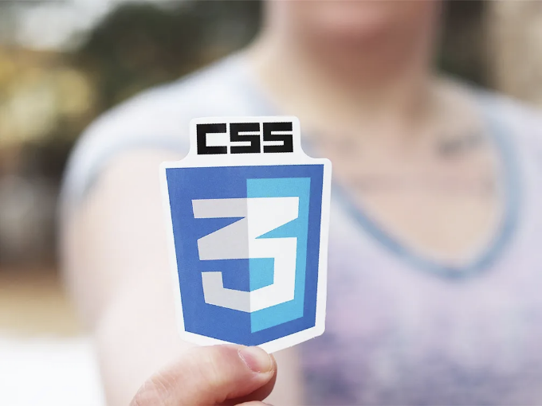

가끔 더 알지 못한 CSS 요소가 있는지 궁금했던 적이 있나요? 웹 디자인 스킬을 레벨업할 수 있는 10가지 잘 알려지지 않은 CSS 트릭으로 빠른 여행을 떠나보세요. 새로운 CSS 트릭을 배우기 위해 준비하세요.

# 01. 웹사이트에서 스무스 스크롤링

전체 페이지에 스무스 스크롤링을 활성화하려면 `html` 요소에 scroll-behavior: smooth를 추가하세요.

<!-- ui-log 수평형 -->
<ins class="adsbygoogle"
  style="display:block"
  data-ad-client="ca-pub-4877378276818686"
  data-ad-slot="9743150776"
  data-ad-format="auto"
  data-full-width-responsive="true"></ins>
<component is="script">
(adsbygoogle = window.adsbygoogle || []).push({});
</component>

```js
html{
    scroll-behavior: smooth;
  }
```

# 02. 링크를 위한 속성 선택자

이 선택자는 „https.“로 시작하는 href 속성을 가진 링크를 대상으로 합니다.

```js
a[href^="https"]{
    color: blue;
  }
```

<!-- ui-log 수평형 -->
<ins class="adsbygoogle"
  style="display:block"
  data-ad-client="ca-pub-4877378276818686"
  data-ad-slot="9743150776"
  data-ad-format="auto"
  data-full-width-responsive="true"></ins>
<component is="script">
(adsbygoogle = window.adsbygoogle || []).push({});
</component>

# 03. ~ 형제를 결합하는 `table` 태그

`h2` 뒤에 나오는 모든 `p` 요소를 선택합니다.

```js
h2 ~ p {
    color: blue;
}
```

# 04. `:not()` 가상 클래스

<!-- ui-log 수평형 -->
<ins class="adsbygoogle"
  style="display:block"
  data-ad-client="ca-pub-4877378276818686"
  data-ad-slot="9743150776"
  data-ad-format="auto"
  data-full-width-responsive="true"></ins>
<component is="script">
(adsbygoogle = window.adsbygoogle || []).push({});
</component>

이 선택기는 특별한 클래스를 가지지 않은 리스트 항목에 스타일을 적용합니다.

```js
li:not(.special){
        font-stlye: italic;
    }
```

# 05. 반응형 텍스트에 대한 뷰포트 단위

뷰포트 단위(vw, vh, vmin, vmax)를 사용하면 폰트 크기를 뷰포트 크기에 반응하는 방식으로 조절할 수 있습니다.

<!-- ui-log 수평형 -->
<ins class="adsbygoogle"
  style="display:block"
  data-ad-client="ca-pub-4877378276818686"
  data-ad-slot="9743150776"
  data-ad-format="auto"
  data-full-width-responsive="true"></ins>
<component is="script">
(adsbygoogle = window.adsbygoogle || []).push({});
</component>

```js
h1{
    font-size: 5vw;
}
```

# 06. :empty for empty elements

이 선택자는 비어있는 `p` 요소를 선택하여 숨깁니다.

```js
p:empty{
    display: none;
}
```

<!-- ui-log 수평형 -->
<ins class="adsbygoogle"
  style="display:block"
  data-ad-client="ca-pub-4877378276818686"
  data-ad-slot="9743150776"
  data-ad-format="auto"
  data-full-width-responsive="true"></ins>
<component is="script">
(adsbygoogle = window.adsbygoogle || []).push({});
</component>

# 07. 사용자 지정 속성 (변수)

더 쉬운 테마화와 유지 관리를 위해 사용자 지정 속성을 정의하고 사용할 수 있습니다.

```js
:root{
    --main-color: #3498db;
  }
  
  h1{
    color: var(--main-color);
  }
```

# 08. 이미지 제어를 위한 object-fit 속성

<!-- ui-log 수평형 -->
<ins class="adsbygoogle"
  style="display:block"
  data-ad-client="ca-pub-4877378276818686"
  data-ad-slot="9743150776"
  data-ad-format="auto"
  data-full-width-responsive="true"></ins>
<component is="script">
(adsbygoogle = window.adsbygoogle || []).push({});
</component>

object-fit은 대체 요소의 내용(예: `img`)이 어떻게 조절되어야 하는지를 결정합니다.

```js
img{
    width: 100px; 
    height: 100px;
    object-fit: cover;
  }
```

# 09. 단순화된 레이아웃을 위한 그리드

CSS 그리드는 더 간편한 방식으로 레이아웃을 생성하는 강력한 도구를 제공합니다.

<!-- ui-log 수평형 -->
<ins class="adsbygoogle"
  style="display:block"
  data-ad-client="ca-pub-4877378276818686"
  data-ad-slot="9743150776"
  data-ad-format="auto"
  data-full-width-responsive="true"></ins>
<component is="script">
(adsbygoogle = window.adsbygoogle || []).push({});
</component>

```css
.container{
    display: grid;
    grid-tempalte-columns: 1fr 2fr 1fr;
 }
```

# 10. :focus-within 의사 클래스

:focus-within은 해당 요소의 자식 요소 중 :focus가 있는 경우 해당 요소를 선택합니다.

```css
form:focus-within{
    box-shadow: 0 0 5px rgba(0, 0, 0, 0, 0.2);
 }
```