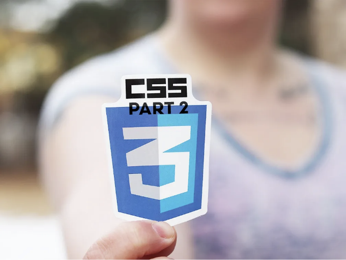

# 10가지 잘 알려지지 않은 CSS 트릭 파트 2

아직 들어보지 못한 CSS 트릭은 10개 이상이 있습니다. 그래서 우리는 잘 알려지지 않은 CSS 트릭 시리즈의 두 번째 부분에 뛰어들어 봅니다. 즐겁게 즐기며 이러한 트릭이 웹 디자인 실력을 향상하는 데 도움이 될 것입니다. 그럼 무엇을 기다리고 있나요?

## 01. flexbox를 사용한 수직 중앙 정렬

<!-- ui-log 수평형 -->
<ins class="adsbygoogle"
  style="display:block"
  data-ad-client="ca-pub-4877378276818686"
  data-ad-slot="9743150776"
  data-ad-format="auto"
  data-full-width-responsive="true"></ins>
<component is="script">
(adsbygoogle = window.adsbygoogle || []).push({});
</component>

컨테이너 안에 컨텐츠를 가로 및 세로로 쉽게 가운데 정렬하려면 플렉스박스를 사용하세요.

```js
.container {
   display: flex;
   align-items: center;
   justify-content: center;
}
```

## 02. 선택 사항을 위한 사용자 정의 하이라이트 색상

웹페이지에서 텍스트를 선택할 때 하이라이트 색상을 사용자 정의하세요.

<!-- ui-log 수평형 -->
<ins class="adsbygoogle"
  style="display:block"
  data-ad-client="ca-pub-4877378276818686"
  data-ad-slot="9743150776"
  data-ad-format="auto"
  data-full-width-responsive="true"></ins>
<component is="script">
(adsbygoogle = window.adsbygoogle || []).push({});
</component>

```js
::selection {
   background-color: #ffcc00;
   color: #333;
}
```

## 03. 입력란 플레이스홀더 텍스트 스타일링

입력란 내부의 플레이스홀더 텍스트 스타일링.

```js
::placeholder {
   color: #999;
   font-style: italic;
}
```

<!-- ui-log 수평형 -->
<ins class="adsbygoogle"
  style="display:block"
  data-ad-client="ca-pub-4877378276818686"
  data-ad-slot="9743150776"
  data-ad-format="auto"
  data-full-width-responsive="true"></ins>
<component is="script">
(adsbygoogle = window.adsbygoogle || []).push({});
</component>

## 04. 그라데이션 테두리

테두리를 만들 때 background-clip 속성을 사용하여 그라데이션으로 테두리를 만들어보세요.

```js
.element {
   border: 2px solid transparent;
   background-clip: padding-box;
   background-image: linear-gradient(to right, red, blue);
}
```

## 05. vw 단위를 사용한 변수 글꼴 크기

<!-- ui-log 수평형 -->
<ins class="adsbygoogle"
  style="display:block"
  data-ad-client="ca-pub-4877378276818686"
  data-ad-slot="9743150776"
  data-ad-format="auto"
  data-full-width-responsive="true"></ins>
<component is="script">
(adsbygoogle = window.adsbygoogle || []).push({});
</component>

화면 너비에 따라 글꼴 크기를 조정하여 민첩한 반응형 글꼴을 만들어보세요.

```js
body {
   font-size: calc(16px + 1vw);
}
```

## 06. 다채로운 요소에 대한 원뿔 그라데이션

원뿔 그라데이션을 사용하여 다채롭고 동적인 배경을 만들어보세요.

<!-- ui-log 수평형 -->
<ins class="adsbygoogle"
  style="display:block"
  data-ad-client="ca-pub-4877378276818686"
  data-ad-slot="9743150776"
  data-ad-format="auto"
  data-full-width-responsive="true"></ins>
<component is="script">
(adsbygoogle = window.adsbygoogle || []).push({});
</component>

```js
.element {
   background: conic-gradient(#ff5733, #33ff57, #5733ff);
}
```

## 07. 반응형 텍스트를 위한 Clamp() 함수

clamp() 함수를 사용하여 폰트 크기의 범위를 설정하여 다양한 화면 크기에서 가독성을 보장하세요.

```js
.text {
   font-size: clamp(16px, 4vw, 24px);
}
```

<!-- ui-log 수평형 -->
<ins class="adsbygoogle"
  style="display:block"
  data-ad-client="ca-pub-4877378276818686"
  data-ad-slot="9743150776"
  data-ad-format="auto"
  data-full-width-responsive="true"></ins>
<component is="script">
(adsbygoogle = window.adsbygoogle || []).push({});
</component>

## 08. 폰트 디스플레이 스왑을 통한 효율적인 폰트 로딩

폰트 디스플레이: 스왑; 속성을 사용하여 사용자 정의 폰트가 로딩되는 동안 대체 폰트를 표시하여 웹 폰트의 성능을 향상시킬 수 있습니다.

```js
@font-face {
   font-family: 'YourFont';
   src: url('your-font.woff2') format('woff2');
   font-display: swap;
}
```

## 09. 커스텀 스크롤 스냅 포인트

<!-- ui-log 수평형 -->
<ins class="adsbygoogle"
  style="display:block"
  data-ad-client="ca-pub-4877378276818686"
  data-ad-slot="9743150776"
  data-ad-format="auto"
  data-full-width-responsive="true"></ins>
<component is="script">
(adsbygoogle = window.adsbygoogle || []).push({});
</component>

다음과 같이 Markdown 형식의 표로 변경하십시오.

구현자 맞춤 스크롤 스냅 포인트를 사용하여 더 부드러운 스크롤 경험을 제공하십니다. 특히 이미지 갤러리나 슬라이더에 유용합니다.

```js
.scroll-container {
    scroll-snap-type: y mandatory;
}

.scroll-item {
    scroll-snap-align: start;
}
```

## 10. 폰트 변형 설정을 사용한 가변 폰트 스타일링

가변 폰트와 font-variation-settings 속성을 활용하여 글꼴 두께, 스타일 및 기타 변형에 대한 세밀한 제어를 얻을 수 있습니다.

<!-- ui-log 수평형 -->
<ins class="adsbygoogle"
  style="display:block"
  data-ad-client="ca-pub-4877378276818686"
  data-ad-slot="9743150776"
  data-ad-format="auto"
  data-full-width-responsive="true"></ins>
<component is="script">
(adsbygoogle = window.adsbygoogle || []).push({});
</component>

```js
.text {
   font-family: 'YourVariableFont', sans-serif;
   font-variation-settings: 'wght' 500, 'ital' 1;
}
```