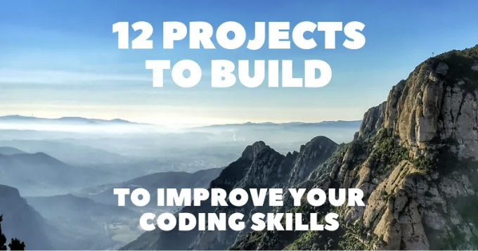

안녕하세요!

웹 개발의 다이나믹한 세계에서, 입문 개발자들은 종종 이론적 지식에서 실무 경험으로 전환하는 도전에 직면할 수 있습니다.

프로젝트를 만들며 코딩을 익히는 것은 여러 가지 이유로 매우 중요합니다. 개발자들이 실험을 할 수 있고, 실수를 하고, 그로부터 배울 수 있게 해줍니다. 또한, 웹 개발 분야에서 강력한 포트폴리오를 구축하고 진출하는 데 중요합니다.

이 글은 BigDevSoon의 후원을 받은 파트너십 기사입니다.

<!-- ui-log 수평형 -->
<ins class="adsbygoogle"
  style="display:block"
  data-ad-client="ca-pub-4877378276818686"
  data-ad-slot="9743150776"
  data-ad-format="auto"
  data-full-width-responsive="true"></ins>
<component is="script">
(adsbygoogle = window.adsbygoogle || []).push({});
</component>

이 기사는 대시보드 레이아웃 및 갤러리, 실용적인 웹 애플리케이션 및 재미있는 게임을 포함한 12가지 매력적인 프로젝트 아이디어를 제공하여 이 문제를 다루고자 합니다.

문제 해결 능력을 강화하고 코딩 원칙을 이해하는 데 도움을 받을 수 있으며, 개발 프로세스에 대한 값진 통찰을 얻을 것입니다.

각 프로젝트에 대한 직접 링크, 설명 및 시각 자료를 포함했으므로 각 프로젝트에 대한 초기 인상을 즉시 얻을 수 있습니다.

## 1. 대시보드 패널

<!-- ui-log 수평형 -->
<ins class="adsbygoogle"
  style="display:block"
  data-ad-client="ca-pub-4877378276818686"
  data-ad-slot="9743150776"
  data-ad-format="auto"
  data-full-width-responsive="true"></ins>
<component is="script">
(adsbygoogle = window.adsbygoogle || []).push({});
</component>

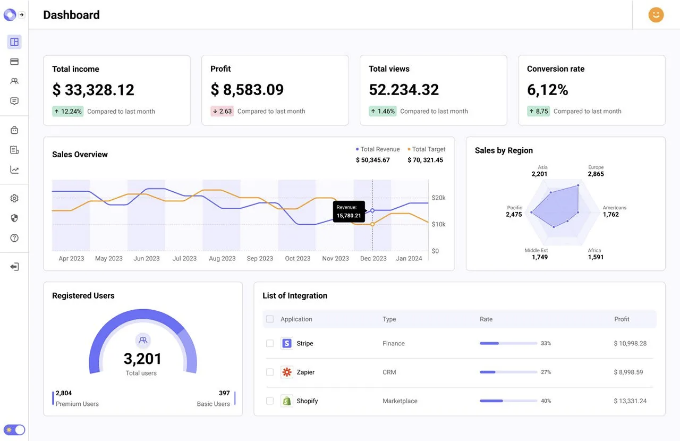

## ➡️ 이 프로젝트 만들기

이 프로젝트는 동적 데이터 처리 대시보드를 만들어 코딩 스킬을 향상시키는 데에 목적을 두고 있습니다. 데이터 시각화와 관리에 도움이 되는 실용적인 도구로 활용될 것입니다.

이 프로젝트에는 웹 개발의 다양한 측면에서 독특한 학습 기회를 제공하는 다양한 컴포넌트가 포함될 것이며, 특히 데이터 처리, UI 디자인 및 상호 작용에 중점을 둘 것입니다.

<!-- ui-log 수평형 -->
<ins class="adsbygoogle"
  style="display:block"
  data-ad-client="ca-pub-4877378276818686"
  data-ad-slot="9743150776"
  data-ad-format="auto"
  data-full-width-responsive="true"></ins>
<component is="script">
(adsbygoogle = window.adsbygoogle || []).push({});
</component>

## 2. 블로그 앱

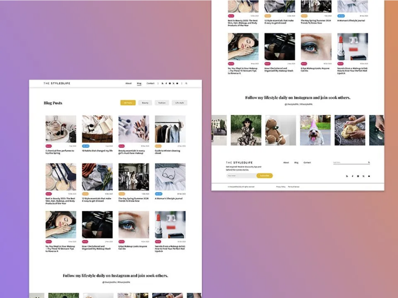

## ➡️ 이 프로젝트 만들기

라이프스타일 주제에 관심 있는 사용자들에게 매력적인 세련되고 기능적인 블로그를 개발하여 코딩 능력을 향상시킵니다.

<!-- ui-log 수평형 -->
<ins class="adsbygoogle"
  style="display:block"
  data-ad-client="ca-pub-4877378276818686"
  data-ad-slot="9743150776"
  data-ad-format="auto"
  data-full-width-responsive="true"></ins>
<component is="script">
(adsbygoogle = window.adsbygoogle || []).push({});
</component>

각각 웹 개발의 다양한 측면에서 학습 경험이 되도록 만들어진 다양한 요소가 특징이 될 것입니다.

## 3. 포켓몬 도감

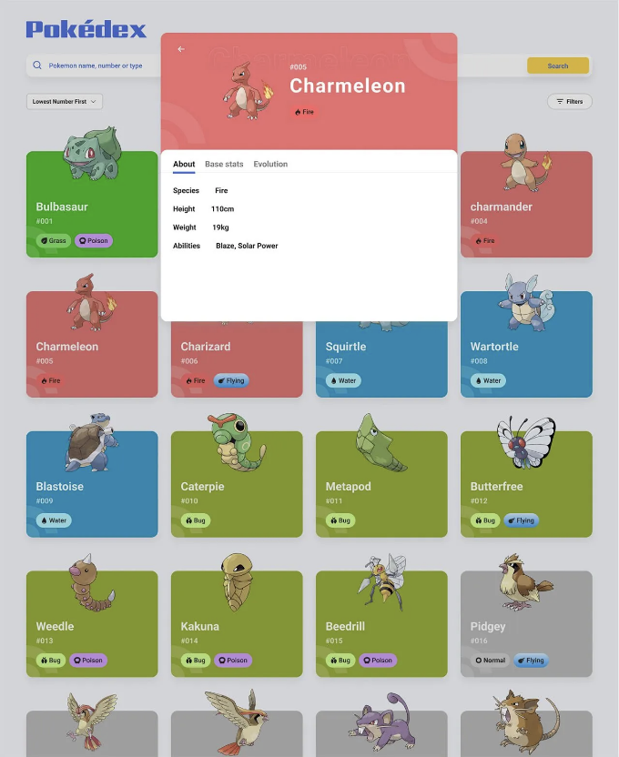

## ➡️ 이 프로젝트 만들기

<!-- ui-log 수평형 -->
<ins class="adsbygoogle"
  style="display:block"
  data-ad-client="ca-pub-4877378276818686"
  data-ad-slot="9743150776"
  data-ad-format="auto"
  data-full-width-responsive="true"></ins>
<component is="script">
(adsbygoogle = window.adsbygoogle || []).push({});
</component>

이 프로젝트는 사용자가 다양한 포켓몬을 탐험할 수 있는 매력적인 포켓몬 도감 애플리케이션을 만드는 것을 포함합니다.

API에서 데이터를 가져오고 포켓몬 카드를 렌더링하며, 반응형 디자인, 검색, 정렬 및 필터링 기능을 구현합니다.

## 4. 할 일 관리 앱

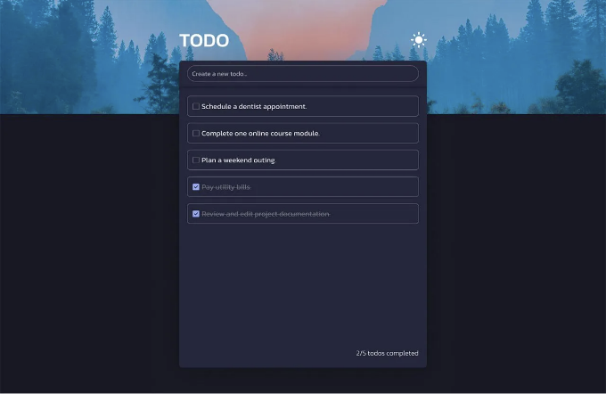

<!-- ui-log 수평형 -->
<ins class="adsbygoogle"
  style="display:block"
  data-ad-client="ca-pub-4877378276818686"
  data-ad-slot="9743150776"
  data-ad-format="auto"
  data-full-width-responsive="true"></ins>
<component is="script">
(adsbygoogle = window.adsbygoogle || []).push({});
</component>

## ➡️ 이 프로젝트 만들기

사용자가 손쉽게 일일 업무를 관리할 수 있는 응용 프로그램을 만듭니다.

작업 추가, 삭제, 표시 및 세련된 라이트/다크 모드 토글과 같은 주요 기능에 초점을 맞춘 이 프로젝트는 실용적인 웹 애플리케이션을 만드는 데 역량을 향상하고 싶은 사람에게 이상적인 선택입니다.

## 5. 틱택토

<!-- ui-log 수평형 -->
<ins class="adsbygoogle"
  style="display:block"
  data-ad-client="ca-pub-4877378276818686"
  data-ad-slot="9743150776"
  data-ad-format="auto"
  data-full-width-responsive="true"></ins>
<component is="script">
(adsbygoogle = window.adsbygoogle || []).push({});
</component>

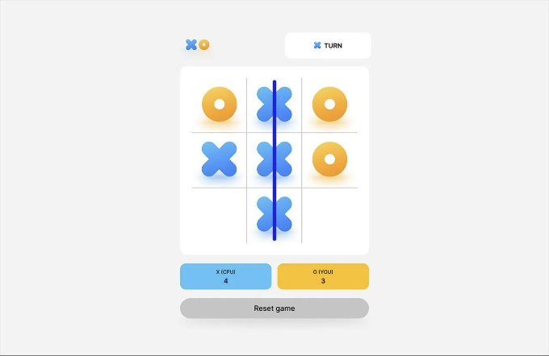

## ➡️ 이 프로젝트 만들기

시간을 초월한 전략 게임의 웹 기반 버전을 만들어보세요.

CPU와 대결할 수 있는 플레이어들이 상호작용할 수 있는 플랫폼을 만들어보며, 게임에 몰입하고 승리를 경험하거나 결론을 도출해보세요.

<!-- ui-log 수평형 -->
<ins class="adsbygoogle"
  style="display:block"
  data-ad-client="ca-pub-4877378276818686"
  data-ad-slot="9743150776"
  data-ad-format="auto"
  data-full-width-responsive="true"></ins>
<component is="script">
(adsbygoogle = window.adsbygoogle || []).push({});
</component>

## 6. 퀴즈 앱

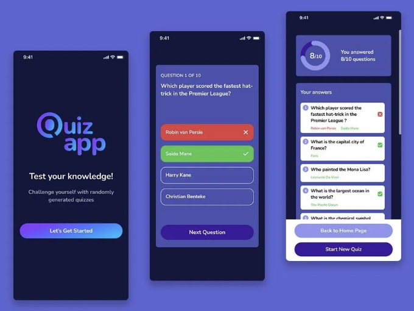

## ➡️ 이 프로젝트 만들기

매번 플레이할 때마다 새로운 10개의 랜덤 질문 세트를 생성하는 멋진 웹 애플리케이션을 만들어보세요. 각 세션마다 새롭고 흥미진진한 도전을 제공합니다.

<!-- ui-log 수평형 -->
<ins class="adsbygoogle"
  style="display:block"
  data-ad-client="ca-pub-4877378276818686"
  data-ad-slot="9743150776"
  data-ad-format="auto"
  data-full-width-responsive="true"></ins>
<component is="script">
(adsbygoogle = window.adsbygoogle || []).push({});
</component>

트리비아 실력을 테스트할 수 있는 각종 주제와 난이도를 다루는 간편하고 상호작용적인 방법입니다.

## 7. 음악 플레이어

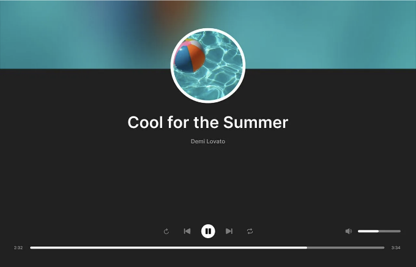

## ➡️ 이 프로젝트 만들기

<!-- ui-log 수평형 -->
<ins class="adsbygoogle"
  style="display:block"
  data-ad-client="ca-pub-4877378276818686"
  data-ad-slot="9743150776"
  data-ad-format="auto"
  data-full-width-responsive="true"></ins>
<component is="script">
(adsbygoogle = window.adsbygoogle || []).push({});
</component>

웹 기반 음악 플레이어는 노래를 재생하고 재생 옵션을 관리하며 다양한 트랙을 탐험하는 몰입형 경험을 제공합니다.

음악 애호가이든 가볍게 음악을 즐기는 사람이든, 이 음악 플레이어는 즐거운 오디오 여행을 약속합니다.

## 8. 레벨 편집기

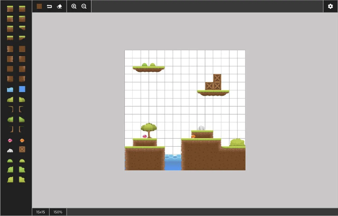

<!-- ui-log 수평형 -->
<ins class="adsbygoogle"
  style="display:block"
  data-ad-client="ca-pub-4877378276818686"
  data-ad-slot="9743150776"
  data-ad-format="auto"
  data-full-width-responsive="true"></ins>
<component is="script">
(adsbygoogle = window.adsbygoogle || []).push({});
</component>

## ➡️ 이 프로젝트 만들기

이 웹 기반 편집기는 사용하기 쉬운 플랫폼을 제공하여 높은 퀄리티의 게임 레벨과 에셋을 제작할 수 있습니다.

다양한 게임 에셋을 매끄럽게 통합하고 반응형 확대 기능을 활용하여 여러분의 작품이 세션 간에도 보존될 수 있게 해보세요.

## 9. AI 포스트 생성기

<!-- ui-log 수평형 -->
<ins class="adsbygoogle"
  style="display:block"
  data-ad-client="ca-pub-4877378276818686"
  data-ad-slot="9743150776"
  data-ad-format="auto"
  data-full-width-responsive="true"></ins>
<component is="script">
(adsbygoogle = window.adsbygoogle || []).push({});
</component>

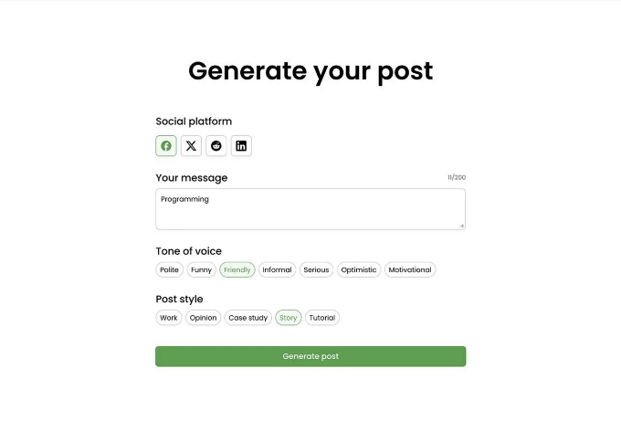

## ➡️ 이 프로젝트 만들기

실용적인 AI 포스트 생성기를 만들어보세요. 사용자의 의도와 AI 기반 콘텐츠 생성의 정밀도가 조화롭게 어우러지는 프로젝트입니다.

소셜 미디어를 위한 콘텐츠 작성 경험을 제공하며 OpenAI의 능력을 활용합니다.

<!-- ui-log 수평형 -->
<ins class="adsbygoogle"
  style="display:block"
  data-ad-client="ca-pub-4877378276818686"
  data-ad-slot="9743150776"
  data-ad-format="auto"
  data-full-width-responsive="true"></ins>
<component is="script">
(adsbygoogle = window.adsbygoogle || []).push({});
</component>

## 10. GIF 갤러리

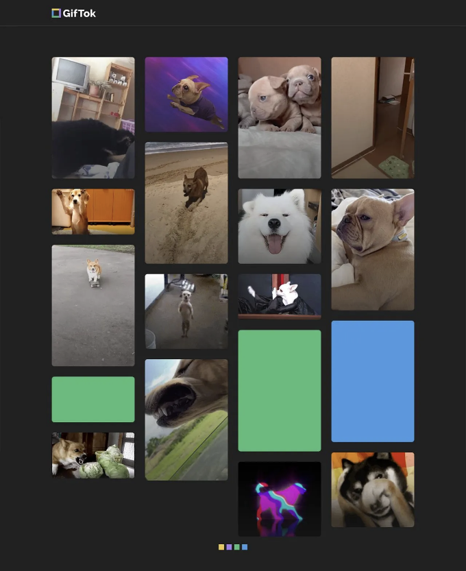

## ➡️ 이 프로젝트 만들기

끝없는 GIF 탐험을 위해 디자인된 플랫폼을 만들어보세요.

<!-- ui-log 수평형 -->
<ins class="adsbygoogle"
  style="display:block"
  data-ad-client="ca-pub-4877378276818686"
  data-ad-slot="9743150776"
  data-ad-format="auto"
  data-full-width-responsive="true"></ins>
<component is="script">
(adsbygoogle = window.adsbygoogle || []).push({});
</component>

휴대폰과 데스크톱 레이아웃 사이를 전환하면 사용자를 망설임 없이 시각적 이야기로 안내하여 GIF 세계에서 제공하는 최고의 콘텐츠를 사랑스럽게 탐험할 수 있습니다.

## 11. 채팅 앱

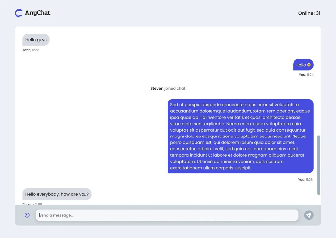

## ➡️ 이 프로젝트 만들기

<!-- ui-log 수평형 -->
<ins class="adsbygoogle"
  style="display:block"
  data-ad-client="ca-pub-4877378276818686"
  data-ad-slot="9743150776"
  data-ad-format="auto"
  data-full-width-responsive="true"></ins>
<component is="script">
(adsbygoogle = window.adsbygoogle || []).push({});
</component>

즉각적으로 사용자를 연결하는 실시간 메시징 플랫폼을 만들어보세요.

직관적인 온보딩을 통해, 본 어플리케이션은 전통적인 대화 방식을 현대적인 디자인과 기능과 결합하여 부드럽고 상호작용적인 채팅 경험을 제공합니다.

## 12. 컬러 메모리 게임

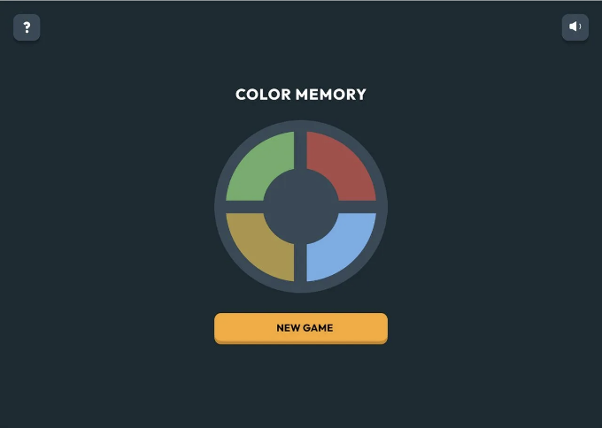

<!-- ui-log 수평형 -->
<ins class="adsbygoogle"
  style="display:block"
  data-ad-client="ca-pub-4877378276818686"
  data-ad-slot="9743150776"
  data-ad-format="auto"
  data-full-width-responsive="true"></ins>
<component is="script">
(adsbygoogle = window.adsbygoogle || []).push({});
</component>

## ➡️ 이 프로젝트 만들기

컬러 메모리 게임을 만들어 보세요. 이 아이코닉한 시몬 게임을 찬사하는 생동감 넘치는 게임이 될 겁니다.

바르게 디자인된, 반응형이며 매혹적인 대화형 인터페이스 안에서 복잡한 기억력 테스트를 통해 사용자들을 동시에 놀라게 하고 도전하게 만들어 보세요.

글쓰기는 항상 제 열정이었고, 사람들을 돕고 영감을 주는 것이 저에게 기쁨을 줍니다. 궁금한 점이 있으면 언제든지 연락해 주세요!

<!-- ui-log 수평형 -->
<ins class="adsbygoogle"
  style="display:block"
  data-ad-client="ca-pub-4877378276818686"
  data-ad-slot="9743150776"
  data-ad-format="auto"
  data-full-width-responsive="true"></ins>
<component is="script">
(adsbygoogle = window.adsbygoogle || []).push({});
</component>

가장 좋은 자료, 도구, 생산성 팁, 그리고 경력 성장 팁을 발견하고 있는 제 뉴스레터를 구독해보세요!

또, 제 트위터, 링크드인, 그리고 깃허브와 연결해보세요!

# Stackademic 🎓

끝까지 읽어주셔서 감사합니다. 떠나시기 전에:

<!-- ui-log 수평형 -->
<ins class="adsbygoogle"
  style="display:block"
  data-ad-client="ca-pub-4877378276818686"
  data-ad-slot="9743150776"
  data-ad-format="auto"
  data-full-width-responsive="true"></ins>
<component is="script">
(adsbygoogle = window.adsbygoogle || []).push({});
</component>

- 작가를 박수로 격려해주세요! 👏
- 팔로우하기: X | LinkedIn | YouTube | Discord
- 다른 플랫폼 방문하기: In Plain English | CoFeed | Venture | Cubed
- 더 많은 콘텐츠: Stackademic.com