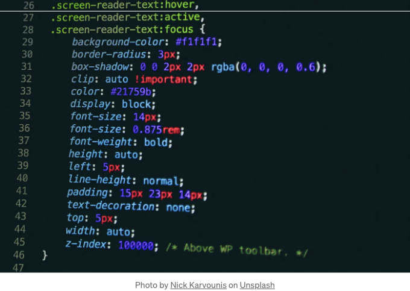

# *CSS 개발 여정을 효율화하고 창의력을 불러일으키는 다양한 시간 절약 도구와 기능 향상 기능을 소개합니다! 이제 함께 워크플로우를 간소화하고 창의력을 불러 일으킬 15개의 웹 사이트를 살펴보세요:

- CSS 버튼:

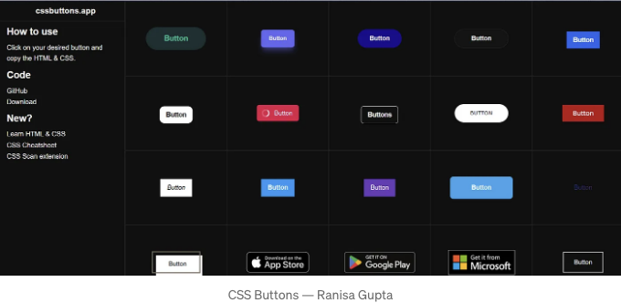

<!-- ui-log 수평형 -->
<ins class="adsbygoogle"
  style="display:block"
  data-ad-client="ca-pub-4877378276818686"
  data-ad-slot="9743150776"
  data-ad-format="auto"
  data-full-width-responsive="true"></ins>
<component is="script">
(adsbygoogle = window.adsbygoogle || []).push({});
</component>

## 🔼 커스터마이즈 가능한 스타일로 버튼 디자인을 간단하게 만들어보세요. 귀찮은 버튼 작성 작업과 이별하세요!

2. Neumorphism.io:

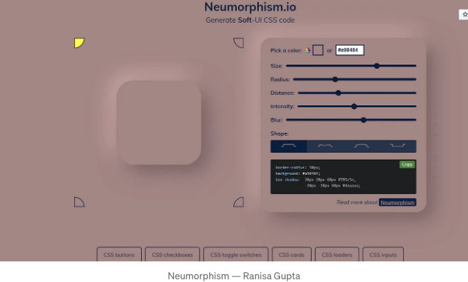

## 🔼 물리적 물체를 흉내 내는 뉴모피즘 요소로 UI를 높여보세요. 세련된 현대적인 외관을 위한 준비된 CSS 코드를 받아보세요.

<!-- ui-log 수평형 -->
<ins class="adsbygoogle"
  style="display:block"
  data-ad-client="ca-pub-4877378276818686"
  data-ad-slot="9743150776"
  data-ad-format="auto"
  data-full-width-responsive="true"></ins>
<component is="script">
(adsbygoogle = window.adsbygoogle || []).push({});
</component>

3. CSS Strips Generator:

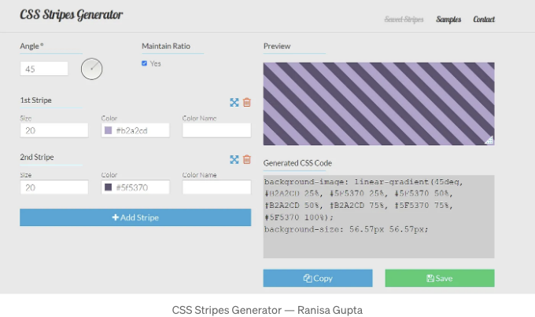

## 🔼 스트라이프 배경으로 디자인에 깊이를 더하세요. 시각적 매력을 간편하게 향상시킵니다!

4. Google Fonts:

<!-- ui-log 수평형 -->
<ins class="adsbygoogle"
  style="display:block"
  data-ad-client="ca-pub-4877378276818686"
  data-ad-slot="9743150776"
  data-ad-format="auto"
  data-full-width-responsive="true"></ins>
<component is="script">
(adsbygoogle = window.adsbygoogle || []).push({});
</component>

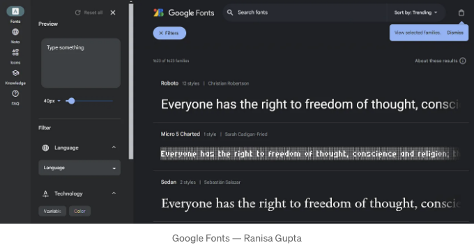

## 🔼 방대한 무료 폰트 컬렉션으로 타이포그래피 영역을 확장해보세요. 프로젝트에 매끄럽게 통합하여 세련된 마무리를 만들어보세요.

5. Get Waves:

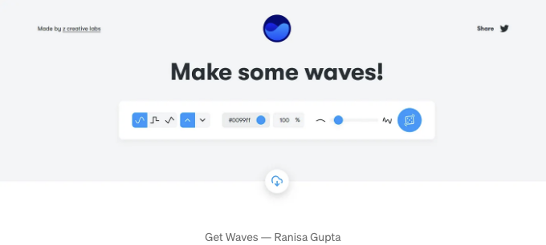

<!-- ui-log 수평형 -->
<ins class="adsbygoogle"
  style="display:block"
  data-ad-client="ca-pub-4877378276818686"
  data-ad-slot="9743150776"
  data-ad-format="auto"
  data-full-width-responsive="true"></ins>
<component is="script">
(adsbygoogle = window.adsbygoogle || []).push({});
</component>

## 🔼 멋진 SVG 패턴으로 창의력의 파도를 타보세요. 쉽게 웹사이트에 활력을 불어넣어보세요.

6. Can I Use:

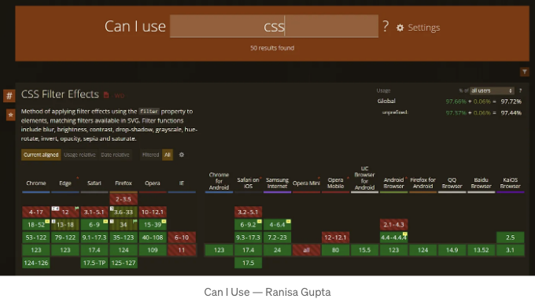

## 🔼 브라우저 호환성 문제를 앞서 나아가 보세요. 플랫폼 간에 CSS가 원활하게 작동하는지 확인하기 위해 실시간 지원 테이블을 확인하세요.

<!-- ui-log 수평형 -->
<ins class="adsbygoogle"
  style="display:block"
  data-ad-client="ca-pub-4877378276818686"
  data-ad-slot="9743150776"
  data-ad-format="auto"
  data-full-width-responsive="true"></ins>
<component is="script">
(adsbygoogle = window.adsbygoogle || []).push({});
</component>

7. 색 공간:

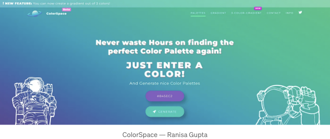

## 🔼 손쉽게 완벽한 팔레트를 찾으세요. 웹사이트를 시각적으로 멋지게 만들기 위해 다양한 색상의 세계를 탐험해보세요.

8. CSS 그리드 생성기:

<!-- ui-log 수평형 -->
<ins class="adsbygoogle"
  style="display:block"
  data-ad-client="ca-pub-4877378276818686"
  data-ad-slot="9743150776"
  data-ad-format="auto"
  data-full-width-responsive="true"></ins>
<component is="script">
(adsbygoogle = window.adsbygoogle || []).push({});
</component>

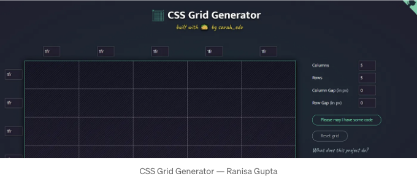

## 🔼 복잡한 레이아웃을 쉽게 마스터하세요. 내용물을 매끄럽게 정리하기 위한 CSS 그리드를 생성하세요.

9. BEM Cheat Sheet:

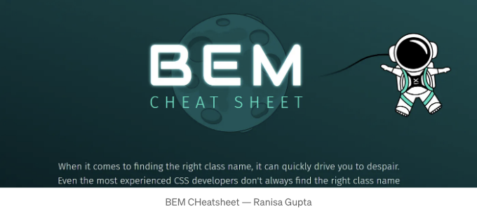

<!-- ui-log 수평형 -->
<ins class="adsbygoogle"
  style="display:block"
  data-ad-client="ca-pub-4877378276818686"
  data-ad-slot="9743150776"
  data-ad-format="auto"
  data-full-width-responsive="true"></ins>
<component is="script">
(adsbygoogle = window.adsbygoogle || []).push({});
</component>

## 🔼 BEM 네이밍 규칙을 활용하여 코딩을 간편하게 만들어보세요. 더 깔끔하고 효율적인 CSS를 위한 빠른 참고서를 제공합니다.

10. Blobmaker:

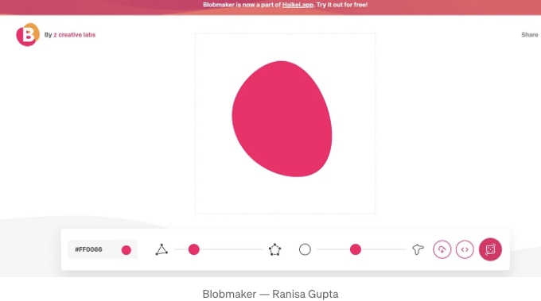

## 🔼 맞춤형 SVG 블롭으로 창의력을 펼쳐보세요. 독특한 모양으로 배경과 삽화를 향상시킵니다.

<!-- ui-log 수평형 -->
<ins class="adsbygoogle"
  style="display:block"
  data-ad-client="ca-pub-4877378276818686"
  data-ad-slot="9743150776"
  data-ad-format="auto"
  data-full-width-responsive="true"></ins>
<component is="script">
(adsbygoogle = window.adsbygoogle || []).push({});
</component>

11. CSS 그라데이션 생성기:

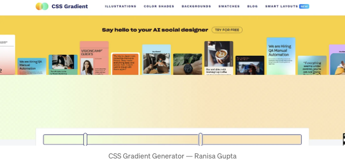

## 🔼 아름다운 그라데이션을 손쉽게 만들어보세요. 멋진 색상 전환을 위한 즉시 CSS 코드입니다.

12. Animate.css:

<!-- ui-log 수평형 -->
<ins class="adsbygoogle"
  style="display:block"
  data-ad-client="ca-pub-4877378276818686"
  data-ad-slot="9743150776"
  data-ad-format="auto"
  data-full-width-responsive="true"></ins>
<component is="script">
(adsbygoogle = window.adsbygoogle || []).push({});
</component>

## 🔼 Bring your website to life with ready-to-use animations. Engage visitors with dynamic elements.

13. Glassmorphism:

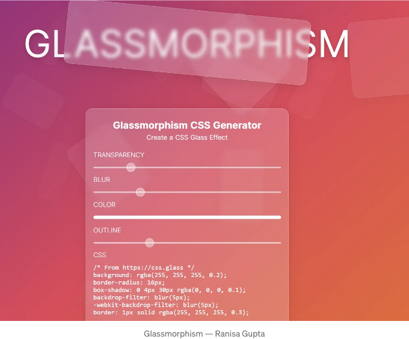

<!-- ui-log 수평형 -->
<ins class="adsbygoogle"
  style="display:block"
  data-ad-client="ca-pub-4877378276818686"
  data-ad-slot="9743150776"
  data-ad-format="auto"
  data-full-width-responsive="true"></ins>
<component is="script">
(adsbygoogle = window.adsbygoogle || []).push({});
</component>

## 🔼 트렌디한 퍼스트 글래스 효과를 손쉽게 구현하세요. 멋진 UI 요소를 위해 투명도, 흐림 및 색상을 사용자 정의하세요.

14. Clippy — CSS Clip-Path Maker:

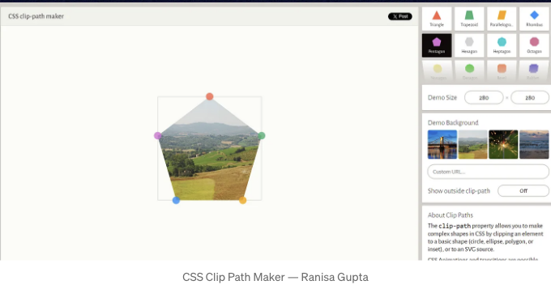

## 🔼 디자인을 정밀하게 다듬어보세요. CSS clip-path로 손쉽게 복잡한 모양을 만드세요.

<!-- ui-log 수평형 -->
<ins class="adsbygoogle"
  style="display:block"
  data-ad-client="ca-pub-4877378276818686"
  data-ad-slot="9743150776"
  data-ad-format="auto"
  data-full-width-responsive="true"></ins>
<component is="script">
(adsbygoogle = window.adsbygoogle || []).push({});
</component>

15. CSS Validator:

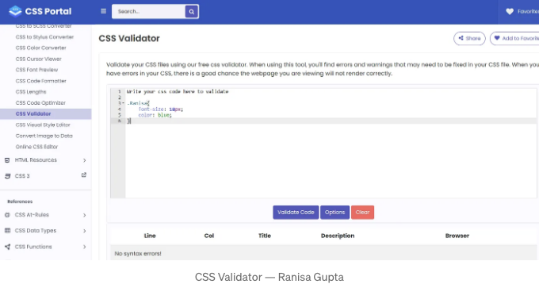

## 웹 표준을 완벽하게 충족하는 CSS를 확인하세요. 코드를 유효성 검사하여 원활한 사용자 경험을 유지하세요.

오늘은 여기까지 입니다. 하지만 여정은 여기서 끝나지 않아요! 이 도구들을 탐험하고, 창의력을 일으키고, CSS 게임을 높여보세요. 이와 유사한 컨텐츠와 매일의 웹 개발 팁을 받으려면 Medium에서 저를 팔로우하세요. 계속해서 코딩하고 걸작을 만들어보세요!