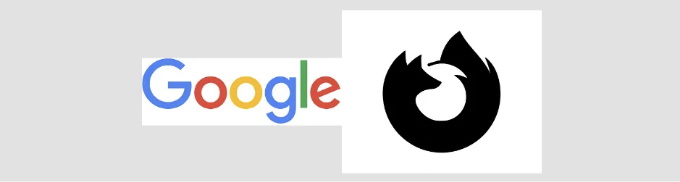

CSS(Cascading Style Sheets)은 개발자들이 멋진 웹 페이지를 디자인할 수 있도록 해주는 강력한 도구입니다. 이 기사에서는 웹 디자인 기술을 한 단계 더 발전시킬 수 있는 5가지 CSS 트릭을 살펴보겠습니다.

# 1. CSS를 사용하여 HTML 속성 값 가져오기

CSS의 attr() 함수를 사용하면 스타일 시트 내에서 HTML 속성의 값을 검색할 수 있습니다. 다음 예제에서 나는 attr() 함수를 사용하여 ::after 의 가상 클래스의 span HTML 요소의 데이터-값 속성을 이용하여 텍스트 내용을 나타냅니다.

<!-- ui-log 수평형 -->
<ins class="adsbygoogle"
  style="display:block"
  data-ad-client="ca-pub-4877378276818686"
  data-ad-slot="9743150776"
  data-ad-format="auto"
  data-full-width-responsive="true"></ins>
<component is="script">
(adsbygoogle = window.adsbygoogle || []).push({});
</component>

```html
<span id="counter" data-value="1"></span>
```

```css
#counter::after {
  content: attr(data-value);
}
```

이 CSS 속성을 사용하면 JS가 HTML 요소의 텍스트 내용을 직접 조작하지 않고 값 변경을 쉽게 할 수 있습니다. 이 코드를 실제로 확인하려면 이 CodePen 예시를 살펴보세요.

# 2. CSS를 사용하여 크기 조정하기

<!-- ui-log 수평형 -->
<ins class="adsbygoogle"
  style="display:block"
  data-ad-client="ca-pub-4877378276818686"
  data-ad-slot="9743150776"
  data-ad-format="auto"
  data-full-width-responsive="true"></ins>
<component is="script">
(adsbygoogle = window.adsbygoogle || []).push({});
</component>

CSS의 resize 속성을 사용하면 사용자가 텍스트 영역 HTML 요소와 같은 크기 조절 컨트롤을 사용하여 요소의 너비와 높이를 동적으로 조정할 수 있습니다. 수평, 수직 또는 양쪽으로 조절할 수 있습니다.

```css
.resize{
  resize: both;
}
``` 

빠른 데모를 확인하려면 아래 CodePen을 확인해보세요.

# 3. CSS를 사용한 증가

<!-- ui-log 수평형 -->
<ins class="adsbygoogle"
  style="display:block"
  data-ad-client="ca-pub-4877378276818686"
  data-ad-slot="9743150776"
  data-ad-format="auto"
  data-full-width-responsive="true"></ins>
<component is="script">
(adsbygoogle = window.adsbygoogle || []).push({});
</component>

CSS 카운터 기능은 숫자 값을 자동으로 생성하고 표시하여 개발자가 명시적으로 제공해야 하는 필요성을 제거합니다. 이를 위해 counter-reset, counter-increment 및 counter() 함수라는 3가지 CSS 속성이 필요합니다.

- counter-reset — 새로운 카운터를 만들거나 현재 카운터를 재설정하는 데 사용됩니다. 기본적으로 0으로 할당됩니다.

```js
counter-reset: item-counter; /* 변수 이름처럼 */
```

카운터의 시작 번호를 설정하려면 다음과 같이 할 수 있습니다:

<!-- ui-log 수평형 -->
<ins class="adsbygoogle"
  style="display:block"
  data-ad-client="ca-pub-4877378276818686"
  data-ad-slot="9743150776"
  data-ad-format="auto"
  data-full-width-responsive="true"></ins>
<component is="script">
(adsbygoogle = window.adsbygoogle || []).push({});
</component>

```js
counter-reset: item-counter 5;
```

2. counter-increment — 현재 카운터를 증가시킵니다. 기본적으로 1씩 증가합니다.

```js
counter-increment: item-counter
```

현재 카운터를 특정 숫자만큼 증가시키고 싶다면 다음과 같이 할 수 있습니다.```

<!-- ui-log 수평형 -->
<ins class="adsbygoogle"
  style="display:block"
  data-ad-client="ca-pub-4877378276818686"
  data-ad-slot="9743150776"
  data-ad-format="auto"
  data-full-width-responsive="true"></ins>
<component is="script">
(adsbygoogle = window.adsbygoogle || []).push({});
</component>

```js
 counter-increment: item-counter 3;
```

3. counter(): 현재 카운터의 값을 검색합니다

```js
content: "Item " counter(item-counter);
```

이 CodePen은 아래 div에 자동으로 h1 요소를 추가하는 방법을 보여줍니다. CSS는 각 h1 태그 앞에 숫자를 자동으로 추가하여 수동으로 개발자 입력이나 JS 사용이 필요하지 않습니다. 이는 훨씬 깔끔한 코드를 제공합니다.

<!-- ui-log 수평형 -->
<ins class="adsbygoogle"
  style="display:block"
  data-ad-client="ca-pub-4877378276818686"
  data-ad-slot="9743150776"
  data-ad-format="auto"
  data-full-width-responsive="true"></ins>
<component is="script">
(adsbygoogle = window.adsbygoogle || []).push({});
</component>

```js
<div class="container">
 <h1>토피</h1>
</div>
```


아래 CodePen을 확인해보세요.

# 4. CSS만 사용하여 이미지의 배경 제거하기

<!-- ui-log 수평형 -->
<ins class="adsbygoogle"
  style="display:block"
  data-ad-client="ca-pub-4877378276818686"
  data-ad-slot="9743150776"
  data-ad-format="auto"
  data-full-width-responsive="true"></ins>
<component is="script">
(adsbygoogle = window.adsbygoogle || []).push({});
</component>

이를 위해 mix-blend-mode CSS 속성을 사용할 수 있습니다. 이를 이용하여 요소의 콘텐츠가 부모 요소와 배경과 어떻게 혼합되어야 하는지 설정할 수 있습니다. 이 경우 img 요소입니다.

여기서 두 개의 이미지를 사용했습니다: 하나는 색이 칠해진 이미지이고, 다른 하나는 검은 색인 이미지이며, 두 이미지 모두 흰 배경을 가지고 있습니다. CSS를 사용하여 이미지의 배경을 제거하려고 합니다. 어떤 이미지 편집 소프트웨어도 사용하지 않고요.



색이 칠해진 이미지로부터 흰 배경을 제거하려면 mix-blend-mode CSS 속성을 multiply 값을 사용하여 적용할 수 있습니다. 두 레이어의 색이 값을 곱해서 혼합되어 더 어둡고 혼합된 모습으로 표시됩니다. 이는 색이 칠해진 이미지에서 흰 배경을 제거할 때 유용하며, 흰 부분이 투명해져서 기존 배경이 나타납니다. 이렇게 하면 이미지가 약간 어두워지는 효과가 있을 수 있습니다.

<!-- ui-log 수평형 -->
<ins class="adsbygoogle"
  style="display:block"
  data-ad-client="ca-pub-4877378276818686"
  data-ad-slot="9743150776"
  data-ad-format="auto"
  data-full-width-responsive="true"></ins>
<component is="script">
(adsbygoogle = window.adsbygoogle || []).push({});
</component>

```js
.blend-multiply{
  mix-blend-mode:multiply;
}
```

흰색 배경을 검은 이미지에서 제거하려면 mix-blend-mode CSS 속성을 사용할 수 있습니다. 값으로 color-burn을 사용합니다. 이 속성은 요소의 색상을 배경과 혼합하여 어둡게 만드는 효과를 적용합니다. 이 방법은 어두운 영역을 강조하여 화상 또는 그림자 모양을 만듭니다. 이러한 경우에 사용하기에 완벽합니다.

```js
.burn-color{
  mix-blend-mode:color-burn;
}
```

CSS를 적용한 후 최종 결과는 다음과 같습니다. 

<!-- ui-log 수평형 -->
<ins class="adsbygoogle"
  style="display:block"
  data-ad-client="ca-pub-4877378276818686"
  data-ad-slot="9743150776"
  data-ad-format="auto"
  data-full-width-responsive="true"></ins>
<component is="script">
(adsbygoogle = window.adsbygoogle || []).push({});
</component>


아래 CodePen을 확인해보세요.

## 5. 필요한 곳에만 그림자 추가하기

요소에 그림자를 추가하려면 일반적으로 CSS 속성 box-shadow를 사용합니다. 이 속성은 요소 주변에 그림자를 추가합니다. 투명 배경을 가진 PNG 이미지에 box-shadow 속성을 추가하면 여전히 이미지 주변에 정사각형 모양의 배경이 나타납니다.

<!-- ui-log 수평형 -->
<ins class="adsbygoogle"
  style="display:block"
  data-ad-client="ca-pub-4877378276818686"
  data-ad-slot="9743150776"
  data-ad-format="auto"
  data-full-width-responsive="true"></ins>
<component is="script">
(adsbygoogle = window.adsbygoogle || []).push({});
</component>

```js
img {
  width: 250px;
  box-shadow: 15px 15px 15px #555;
}
```


하지만 box-shadow 대신 drop-shadow() CSS 함수를 사용하여 filter CSS 속성을 사용하면 PNG의 투명 배경을 포함하지 않고 실제 이미지 부분에만 그림자를 추가할 수 있습니다.

```js
img {
  width: 250px;
  filter: drop-shadow(15px 15px 15px #555)
}
```

<!-- ui-log 수평형 -->
<ins class="adsbygoogle"
  style="display:block"
  data-ad-client="ca-pub-4877378276818686"
  data-ad-slot="9743150776"
  data-ad-format="auto"
  data-full-width-responsive="true"></ins>
<component is="script">
(adsbygoogle = window.adsbygoogle || []).push({});
</component>

최종 결과는 이렇게 보입니다.


아래 CodePen도 꼭 확인하지 않도록해요!

그래서 여기에 5가지의 최상위 CSS 요령이 있어요. 각 요령은 독특한 터치를 더해주기 때문에, 자유롭게 결합하여 멋진 웹 디자인을 만들어보세요.

<!-- ui-log 수평형 -->
<ins class="adsbygoogle"
  style="display:block"
  data-ad-client="ca-pub-4877378276818686"
  data-ad-slot="9743150776"
  data-ad-format="auto"
  data-full-width-responsive="true"></ins>
<component is="script">
(adsbygoogle = window.adsbygoogle || []).push({});
</component>

만약 여러분이 멋진 웹 디자인을 만들기 위한 더 많은 CSS 요령을 원하신다면, 이 기사의 후속편을 놓치지 마세요!

즐거운 코딩하세요!!!