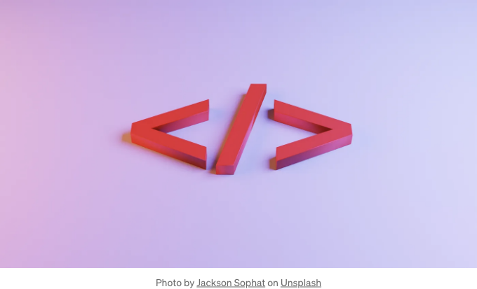

가장 간단한 방법으로 div를 가운데 정렬하는 방법



시간을 낭비하지 않고 div를 가운데 정렬하는 가장 좋은 방법을 살펴보겠습니다.

- display: flex 사용하기: 이 방법은 CSS 플렉스박스 레이아웃을 사용하여 div를 부모 컨테이너 내에서 가로 및 세로 중앙에 배치합니다. 부모 컨테이너에 다음 CSS를 추가할 수 있습니다:

<!-- ui-log 수평형 -->
<ins class="adsbygoogle"
  style="display:block"
  data-ad-client="ca-pub-4877378276818686"
  data-ad-slot="9743150776"
  data-ad-format="auto"
  data-full-width-responsive="true"></ins>
<component is="script">
(adsbygoogle = window.adsbygoogle || []).push({});
</component>

```js
.container {
  display: flex;
  align-items: center;
  justify-content: center;
  height: 100vh;
}
```

그런 다음 아래 CSS를 div에 추가하세요.

```js
div {
  width: 50%;
  height: 50%;
}
```

- display: grid 사용: 이 방법은 CSS 그리드 레이아웃을 사용하여 div를 수평 및 수직으로 부모 컨테이너 내에서 가운데 정렬합니다. 아래 CSS를 부모 컨테이너에 추가할 수 있습니다.:```

<!-- ui-log 수평형 -->
<ins class="adsbygoogle"
  style="display:block"
  data-ad-client="ca-pub-4877378276818686"
  data-ad-slot="9743150776"
  data-ad-format="auto"
  data-full-width-responsive="true"></ins>
<component is="script">
(adsbygoogle = window.adsbygoogle || []).push({});
</component>

```js
.container {
  display: grid;
  place-items: center;
  height: 100vh;
}
```

이후에 다음 CSS를 div에 추가하세요:

```js
div {
  width: 50%;
  height: 50%;
}
```

- position: absolute 및 transform: translate 사용: 이 방법은 절대 위치 지정과 transform 속성을 사용하여 div를 부모 컨테이너의 가로와 세로 중앙에 배치합니다. 부모 컨테이너에 다음과 같은 CSS를 추가할 수 있습니다:```

<!-- ui-log 수평형 -->
<ins class="adsbygoogle"
  style="display:block"
  data-ad-client="ca-pub-4877378276818686"
  data-ad-slot="9743150776"
  data-ad-format="auto"
  data-full-width-responsive="true"></ins>
<component is="script">
(adsbygoogle = window.adsbygoogle || []).push({});
</component>

```css
.container {
  position: relative;
  height: 100vh;
}
```

그리고 다음 CSS를 div에 추가하세요:

```css
div {
  position: absolute;
  top: 50%;
  left: 50%;
  transform: translate(-50%, -50%);
  width: 50%;
  height: 50%;
}
```

- table 및 table-cell 표시 속성 사용: 이 방법은 표 셀의 동작을 모방하기 위해 display 속성을 사용하며, div를 수평 및 수직으로 부모 컨테이너 내에서 가운데 정렬합니다. 부모 컨테이너에 다음 CSS를 추가할 수 있습니다:

<!-- ui-log 수평형 -->
<ins class="adsbygoogle"
  style="display:block"
  data-ad-client="ca-pub-4877378276818686"
  data-ad-slot="9743150776"
  data-ad-format="auto"
  data-full-width-responsive="true"></ins>
<component is="script">
(adsbygoogle = window.adsbygoogle || []).push({});
</component>

```css
.container {
  display: table;
  height: 100vh;
  width: 100%;
}
```

그런 다음 다음 CSS를 div에 추가하세요:

```css
div {
  display: table-cell;
  vertical-align: middle;
  text-align: center;
  width: 50%;
  height: 50%;
}
```

- line-height를 사용하는 방법: 이 방법은 line-height 속성을 사용하여 div를 수직 및 수평으로 부모 컨테이너 내에서 가운데 정렬합니다. 부모 컨테이너에 다음 CSS를 추가할 수 있습니다:```

<!-- ui-log 수평형 -->
<ins class="adsbygoogle"
  style="display:block"
  data-ad-client="ca-pub-4877378276818686"
  data-ad-slot="9743150776"
  data-ad-format="auto"
  data-full-width-responsive="true"></ins>
<component is="script">
(adsbygoogle = window.adsbygoogle || []).push({});
</component>

```js
.container {
  height: 100vh;
  width: 100%;
  text-align: center;
}
```

다음 CSS를 div에 추가하세요:

```js
div {
  display: inline-block;
  line-height: 100vh;
  vertical-align: middle;
  width: 50%;
  height: 50%;
}
```

이것들은 CSS를 사용하여 div를 수평 및 수직으로 가운데 정렬하는 5가지 간단한 방법입니다. 구체적인 사용 사례에 따라 특정 방법을 선택할 수 있습니다.```

<!-- ui-log 수평형 -->
<ins class="adsbygoogle"
  style="display:block"
  data-ad-client="ca-pub-4877378276818686"
  data-ad-slot="9743150776"
  data-ad-format="auto"
  data-full-width-responsive="true"></ins>
<component is="script">
(adsbygoogle = window.adsbygoogle || []).push({});
</component>

## 결론

요약하면, CSS에서 div를 가로 및 세로 중앙 정렬하는 다양한 방법이 있습니다. display: flex 및 display: grid 속성, position: absolute 및 transform: translate, display: table 및 display: table-cell, 그리고 line-height를 활용하는 등 다양한 방법이 있습니다. 각각의 방법에는 장단점이 있으며, 여러분의 프로젝트의 맥락과 요구 사항에 따라 가장 적합한 방법이 달라질 수 있습니다. 선택한 방법에 상관없이 CSS에서 div를 가운데 정렬하는 것은 웹 페이지의 디자인과 사용성을 크게 향상시킬 수 있습니다.

"만약 제 콘텐츠를 즐겼다면, Ko-fi에서 저에게 커피 한 잔 사주시는 것을 고려해보세요. 여러분의 기부금이 제 창의력을 촉진시키고 품질 높은 콘텐츠 제작을 돕습니다. 모든 커피 후원은 깊이 감사히 받아들입니다! 멋진 후원자가 되어 주셔서 감사합니다! 커피 사기"

감사합니다