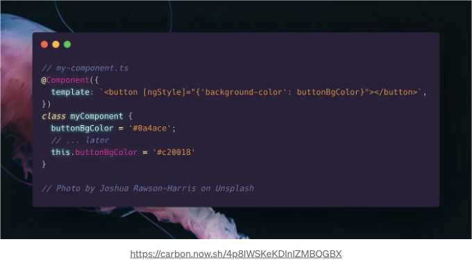
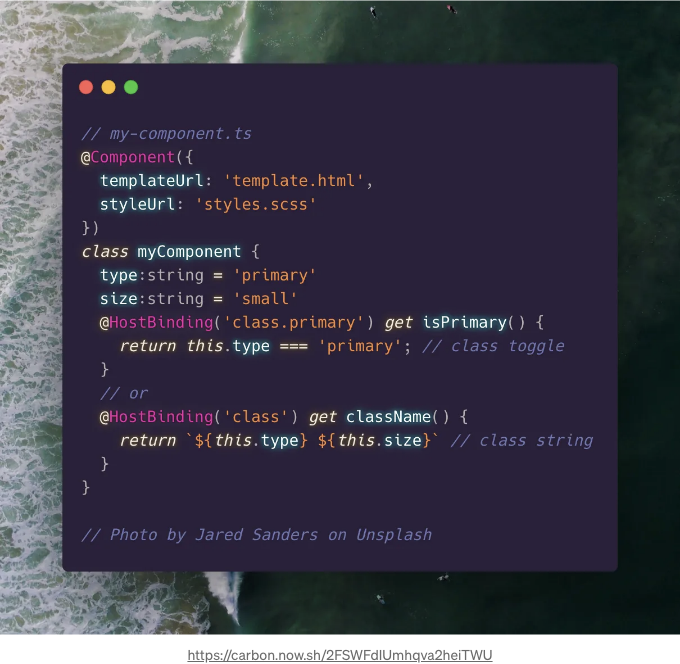
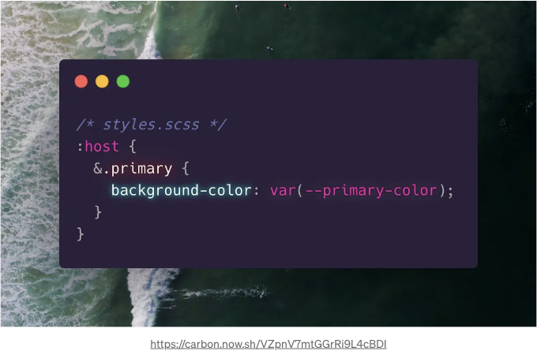
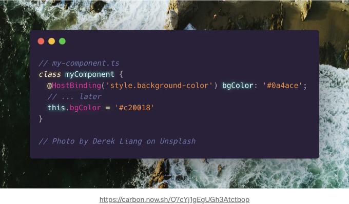
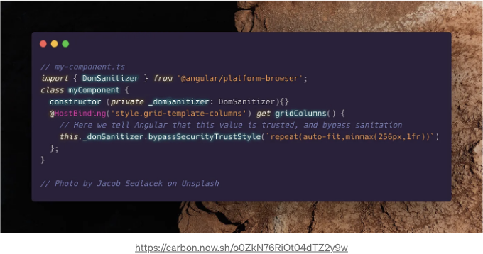
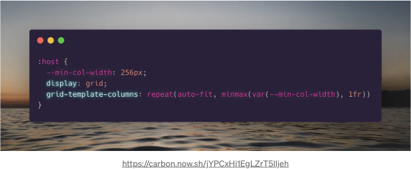
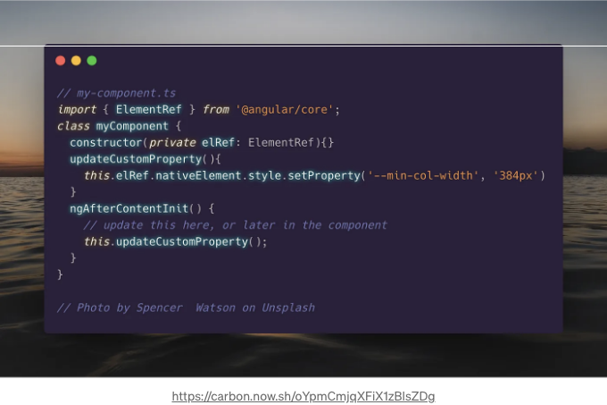
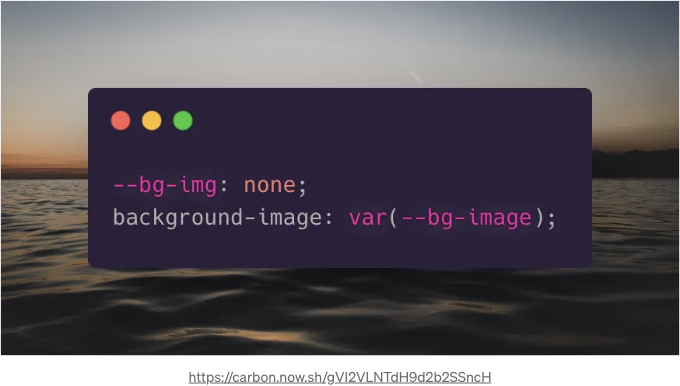
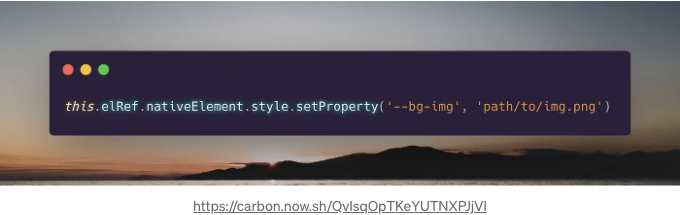

웹에서 구성 요소 상태에 따라 업데이트되는 쓰기 스타일은 정말 흔한 패턴입니다. 하고 싶은 작업에 따라 스타일을 동적으로 업데이트하는 여러 가지 방법이 있습니다. 몇 가지 방법을 살펴보겠습니다.

# Class 및 Style 지시문

## ngClass 사용

구성 요소의 스타일을 업데이트하는 가장 간단한 방법은 ngClass를 사용하는 것입니다. 이 지시문은 구성 요소 내에서 요소의 클래스 이름을 동적으로 추가하거나 변경할 수 있습니다. 버튼 요소를 기본 또는 보조로 표시하고 싶다고 가정해 봅시다. 다음과 같이 작성할 수 있습니다:

<!-- ui-log 수평형 -->
<ins class="adsbygoogle"
  style="display:block"
  data-ad-client="ca-pub-4877378276818686"
  data-ad-slot="9743150776"
  data-ad-format="auto"
  data-full-width-responsive="true"></ins>
<component is="script">
(adsbygoogle = window.adsbygoogle || []).push({});
</component>

위의 코드를 사용하면 변수 isPrimary에 따라 버튼에 있는 주요 클래스를 토글합니다. 하지만 특정한 값으로 클래스를 설정하고 싶다면 어떻게 해야 할까요? Angular를 사용하면 다음과 같이 할 수 있습니다:

여기서 buttonClass를 아무 문자열이나 설정할 수 있으며, 해당 문자열을 버튼 요소에 클래스로 사용할 수 있습니다. 우리의 SCSS에 유효한 선택자(예: .secondary)만 있다면, 이는 버튼 컴포넌트의 스타일을 동적으로 변경할 것입니다. Angular 문서에서 ngClass에 대해 더 읽어보세요.

<!-- ui-log 수평형 -->
<ins class="adsbygoogle"
  style="display:block"
  data-ad-client="ca-pub-4877378276818686"
  data-ad-slot="9743150776"
  data-ad-format="auto"
  data-full-width-responsive="true"></ins>
<component is="script">
(adsbygoogle = window.adsbygoogle || []).push({});
</component>

# ngStyle으로 사용자 정의하기

요소의 스타일링을 좀 더 세밀하게 제어해야 할 경우 ngStyle을 사용하여 인라인 스타일을 적용할 수 있습니다. 이 방법은 CSS 선언에 불필요한 특이성을 추가해 코드를 덮어쓰기 어렵게 만들 수 있으므로 권장되지는 않습니다. 그렇지만 다음과 같이 버튼 스타일을 동적으로 업데이트할 수도 있습니다:



# Host binding

<!-- ui-log 수평형 -->
<ins class="adsbygoogle"
  style="display:block"
  data-ad-client="ca-pub-4877378276818686"
  data-ad-slot="9743150776"
  data-ad-format="auto"
  data-full-width-responsive="true"></ins>
<component is="script">
(adsbygoogle = window.adsbygoogle || []).push({});
</component>

그러한 지시사항들은 훌륭하지만, 요소 내부가 아닌 구성요소 자체의 스타일을 업데이트하려면 어떻게 해야 할까요? 이를 위해 HostBinding과 :host 선택자를 사용합니다.

# 클래스에 호스트 바인딩하기

클래스에 호스트 바인딩하는 것은 ngClass 지시문을 구성 요소 선택기 자체에 적용하는 것과 같습니다. ngClass와 마찬가지로 클래스를 켜거나 끄거나, 또는 클래스 이름을 문자열로 설정할 수 있습니다.

어떤 방법을 사용할지 결정할 때 트레이드오프가 있습니다. 각 클래스에 토글을 사용하여 보다 간단한 코드를 작성할 수 있지만, 이는 잠재적으로 클래스 충돌을 초래할 수 있습니다('primary'와 'secondary' 클래스가 모두 적용되는 경우 등). 잠재적으로 긴 클래스 문자열을 유지하거나 충돌을 제거하기 위해 토글을 유지할지 사용 사례에 따라 결정하세요.

<!-- ui-log 수평형 -->
<ins class="adsbygoogle"
  style="display:block"
  data-ad-client="ca-pub-4877378276818686"
  data-ad-slot="9743150776"
  data-ad-format="auto"
  data-full-width-responsive="true"></ins>
<component is="script">
(adsbygoogle = window.adsbygoogle || []).push({});
</component>





# 호스트 바인딩 인라인 스타일

ngStyle처럼 호스트 요소에 직접 스타일을 적용할 수 있습니다. 다시 한 번 말씀드리지만 인라인 스타일링은 스타일을 작성하는 권장되지 않는 방법입니다. 그러나 때로는 필요할 수 있습니다. 호스트 스타일을 동적으로 변경하려면 다시 HostBinding을 사용합니다.

<!-- ui-log 수평형 -->
<ins class="adsbygoogle"
  style="display:block"
  data-ad-client="ca-pub-4877378276818686"
  data-ad-slot="9743150776"
  data-ad-format="auto"
  data-full-width-responsive="true"></ins>
<component is="script">
(adsbygoogle = window.adsbygoogle || []).push({});
</component>



호스트 바인딩과 ngStyles는 스타일을 동적으로 업데이트하는 좋은 방법을 제공합니다. 그러나 Angular가 우리의 스타일 값을 안전하지 않다고 판단하고 다음 경고를 받으면 어떻게 될까요?:

```js
WARNING: sanitizing unsafe style value {some value}
```

# 인라인 스타일의 보안 방어하기

<!-- ui-log 수평형 -->
<ins class="adsbygoogle"
  style="display:block"
  data-ad-client="ca-pub-4877378276818686"
  data-ad-slot="9743150776"
  data-ad-format="auto"
  data-full-width-responsive="true"></ins>
<component is="script">
(adsbygoogle = window.adsbygoogle || []).push({});
</component>

위의 경고는 Angular가 XSS 공격을 방지하기 위해 자동으로 살균 처리할 수 없는 값 때문에 발생합니다. 제가 경험한 일반적인 값은 이미지 URL 및 복잡한 그리드 열/행 템플릿입니다.

이 경고를 방지하려면 Angular에게 해당 값을 신뢰하고 보안을 우회할 수 있도록 허용해야 합니다.



그러나 이 접근 방식은 XSS 공격에 취약할 수 있으며 대부분의 프로젝트에서 권장되지 않습니다. 동적 스타일을 안전하게 업데이트할 수 있는 방법이 필요합니다.

<!-- ui-log 수평형 -->
<ins class="adsbygoogle"
  style="display:block"
  data-ad-client="ca-pub-4877378276818686"
  data-ad-slot="9743150776"
  data-ad-format="auto"
  data-full-width-responsive="true"></ins>
<component is="script">
(adsbygoogle = window.adsbygoogle || []).push({});
</component>

# 사용자 정의 속성

사용자 정의 속성은 Angular 구성 요소에서 스타일을 동적으로 업데이트하는 훌륭한 방법이며, 설정하는 과정은 간단합니다.

먼저 사용하려는 기본 SCSS를 작성하고, 사용자 정의 속성을 초기화합니다.



<!-- ui-log 수평형 -->
<ins class="adsbygoogle"
  style="display:block"
  data-ad-client="ca-pub-4877378276818686"
  data-ad-slot="9743150776"
  data-ad-format="auto"
  data-full-width-responsive="true"></ins>
<component is="script">
(adsbygoogle = window.adsbygoogle || []).push({});
</component>

다음으로 Angular 컴포넌트에서 사용자 정의 속성을 업데이트합니다:



우리는 사용자 정의 속성을 값의 일부로 또는 전체 값으로 사용할 수 있습니다. 아래와 같이요:



<!-- ui-log 수평형 -->
<ins class="adsbygoogle"
  style="display:block"
  data-ad-client="ca-pub-4877378276818686"
  data-ad-slot="9743150776"
  data-ad-format="auto"
  data-full-width-responsive="true"></ins>
<component is="script">
(adsbygoogle = window.adsbygoogle || []).push({});
</component>



여기에 있습니다. Angular에서 상태에 따라 컴포넌트 스타일을 동적으로 업데이트하는 방법은 적어도 6가지가 있습니다. 어떤 방법을 사용할지는 선호도와 원하는 결과에 따라 다릅니다.

저는 뉴욕에 있는 New Visions for Public Schools에서 디자이너 및 개발자로 일하고 있습니다. 온라인 상태이며 가끔씩 트윗을 올립니다.