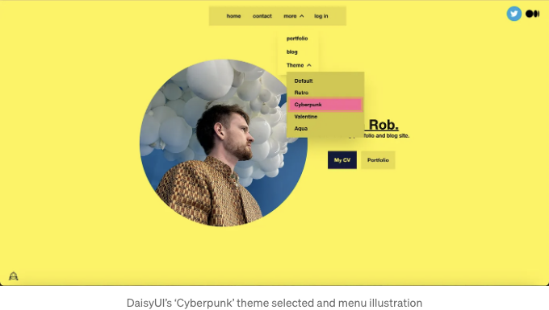

최근에 DaisyUI를 사용하여 포트폴리오와 블로그 사이트에 완전한 변화를 주었어요. 이 기사에서는 이전과 이후의 스샷을 포함하고, DaisyUI와 같은 CSS 컴포넌트 라이브러리의 장점에 대한 생각을 소개했어요. 제 사이트를 확인해보세요: https://robbettison.com.



DaisyUI는 Tailwind CSS의 매우 인기 있는 컴포넌트 라이브러리입니다. 이는 프론트엔드 코드 전체에 사용할 수 있는 컴포넌트 클래스 이름을 제공하여 종종 번잡한 Tailwind CSS 태그들을 숨겨줍니다. 컴포넌트 클래스 이름들에는 기본적인 버튼 컴포넌트부터 더 정교한 메뉴 컴포넌트까지 다양한 Tailwind CSS 태그가 숨어 있어, 품질 높은 스타일링을 바로 사용할 수 있습니다. 이 결과로 코드를 많이 줄일 수 있으며, 아름답고 표준화된, 제품으로 출시할 수 있는 사용자 인터페이스를 얻을 수 있습니다. 저는 컴포넌트 라이브러리가 전문의 UX 및 디자인 팀 없이 프로젝트에 참여하는 열정적인 사람들에게 최고의 선택이라고 생각해요. 일관된 멋진 웹사이트를 만들기 위해 최소한의 노력만 필요합니다.

DaisyUI는 여러 가지 좋은 실천 방법을 촉진합니다. 앞서 언급했듯이, DaisyUI 컴포넌트 클래스 이름은 Tailwind CSS 태그가 그만큼 덜 필요하기에 코드 반복이 줄어들고 파일 크기가 훨씬 작아집니다. 아래의 버튼 예제를 살펴보세요. 여기서는 버튼을 스타일링하기 위해 필요한 Tailwind CSS가 있습니다:

<!-- ui-log 수평형 -->
<ins class="adsbygoogle"
  style="display:block"
  data-ad-client="ca-pub-4877378276818686"
  data-ad-slot="9743150776"
  data-ad-format="auto"
  data-full-width-responsive="true"></ins>
<component is="script">
(adsbygoogle = window.adsbygoogle || []).push({});
</component>

```js
<button class="bg-indigo-600 px-4 py-3 
  text-center text-sm font-semibold inline-block 
  text-white cursor-pointer uppercase transition 
  duration-200 ease-in-out rounded-md hover:bg-indigo-700 
  focus-visible:outline-none focus-visible:ring-2 
  focus-visible:ring-indigo-600 focus-visible:ring-offset-2 
  active:scale-95">
  Tailwind 버튼
</button>
```

다음은 동일한 버튼이지만 DaisyUI 컴포넌트 클래스 이름을 사용한 것입니다:

```js
<button class="btn btn-primary">
  DaisyUI 버튼
</button>
```

DaisyUI는 웹사이트 프론트엔드를 구축할 때 올바른 색상 사용을 장려하는 색상 시스템에 의해 움직입니다. 웹사이트에 기능이나 페이지를 추가할 때 색깔을 임의로 선택해서는 안 됩니다. 이상적으로는 개발자가 어떤 색상이 전경, 배경, 글꼴, 알림, 비활성화된 아이콘, 텍스트 등에서 사용해야 하는지 알기 위해 색상 시스템을 참조해야 합니다. DaisyUI는 개발자가 주(primary), 보조(secondary), 강조(accent), 기본(base) 및 주-콘텐츠(primary-content), 보조-콘텐츠(secondary-content), 강조-콘텐츠(accent-content) 및 기본-콘텐츠(base-content) 색상을 사용하도록 강제함으로써 임의 색상 사용의 위험을 없앱니다. 우리는 html 태그에 클래스 이름으로 이러한 색상을 사용하여 요소에 색상을 입힙니다. DaisyUI의 테마(확장 가능한 것으로 보도록 하겠습니다)는 모든 요소가 가독성 있게 보이도록 할 것입니다. 예를 들어, 주-콘텐츠 색상의 텍스트가 주 색상 배경에 항상 가독성 있게 보입니다.

<!-- ui-log 수평형 -->
<ins class="adsbygoogle"
  style="display:block"
  data-ad-client="ca-pub-4877378276818686"
  data-ad-slot="9743150776"
  data-ad-format="auto"
  data-full-width-responsive="true"></ins>
<component is="script">
(adsbygoogle = window.adsbygoogle || []).push({});
</component>

좋은 주제로 넘어가 보죠. DaisyUI에는 프로젝트에 포함할 수 있는 다양한 주제가 함께 제공됩니다. tailwind.config.js 파일에 한 줄로 추가할 수 있습니다. 각 주제는 컴포넌트 클래스 이름의 Tailwind CSS를 약간 다르게 정의합니다. 예를 들어, 버튼은 더 둥글 수 있습니다. 색상은 가장 눈에 띄는 변경 사항입니다만, 여전히 주요 콘텐츠 텍스트가 주요 배경에 대해 가독성 있게 유지될 수 있다는 것에 확신할 수 있습니다. 주제 컴포넌트를 사용하면 사용자가 그들 사이를 전환할 수 있는 주제 스위치를 추가할 수 있습니다. 원하는 주제를 확장하거나 직접 만드는 것도 가능하며, 이에 대한 자세한 내용은 DaisyUI 웹사이트에서 문서화되어 있습니다.

저는 사용한 유용한 컴포넌트 중 하나가 메뉴 컴포넌트입니다. 구현하기가 정말 쉬우며 여러 가지 다양한 변형이 있어 웹사이트에 깔끔하고 반응형 메뉴를 10분만에 구현할 수 있습니다.

물론, DaisyUI의 컴포넌트 스타일링의 특정 측면을 무시하고 싶은 특별한 경우가 있을 수 있습니다. Tailwind CSS가 컴포넌트 클래스명 아래에 있기 때문에, 스타일을 적용하는 태그의 클래스에 포함하여 컴포넌트 정의에 정의된 Tailwind CSS를 간단히 재정의할 수 있습니다. 제가 여전히 grid 및 flex와 같은 위치 지정 태그를 적극적으로 사용하고 있다는 것을 발견했습니다.

DaisyUI 대 Tailwind CSS 및 다른 컴포넌트 라이브러리에 대한 여러분의 생각은 무엇인가요?