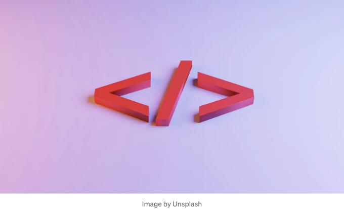

## Box-shadow와 Text-shadow

웹페이지의 요소를 스타일링할 때 CSS는 시각적 매력을 높이기 위한 다양한 옵션을 제공합니다. 그 중 그림자는 깊이와 차원을 만드는 데 중요한 역할을 합니다. 이러한 속성이 어떻게 작동하는지 배우고 웹 프로젝트를 더욱 향상시키는 데 어떻게 활용할 수 있는지 알아봅시다.



# Box-shadow:

<!-- ui-log 수평형 -->
<ins class="adsbygoogle"
  style="display:block"
  data-ad-client="ca-pub-4877378276818686"
  data-ad-slot="9743150776"
  data-ad-format="auto"
  data-full-width-responsive="true"></ins>
<component is="script">
(adsbygoogle = window.adsbygoogle || []).push({});
</component>

상자 그림자 속성은 div나 이미지와 같은 요소의 상자 모델에 그림자를 추가할 수 있게 해줍니다.

## 상자 그림자 사용 방법

기본 구문은 다음과 같습니다:

```js
box-shadow: 수평-오프셋 수직-오프셋 흐림 확장 색상;
```

<!-- ui-log 수평형 -->
<ins class="adsbygoogle"
  style="display:block"
  data-ad-client="ca-pub-4877378276818686"
  data-ad-slot="9743150776"
  data-ad-format="auto"
  data-full-width-responsive="true"></ins>
<component is="script">
(adsbygoogle = window.adsbygoogle || []).push({});
</component>

h-offset: 그림자의 수평 오프셋입니다.
v-offset: 그림자의 수직 오프셋입니다.
blur: 선택 사항입니다. 흐림 반경입니다. 값이 높을수록 그림자가 더 흐릿해집니다.
spread: 선택 사항입니다. 확산 반경입니다. 양수 값은 그림자를 확장시키고, 음수 값은 그림자를 압축시킵니다.
color: 선택 사항입니다. 그림자의 색상입니다.

예시:

간단한 그림자 만들기:

```js
box-shadow: 5px 5px 10px #888888;
```

<!-- ui-log 수평형 -->
<ins class="adsbygoogle"
  style="display:block"
  data-ad-client="ca-pub-4877378276818686"
  data-ad-slot="9743150776"
  data-ad-format="auto"
  data-full-width-responsive="true"></ins>
<component is="script">
(adsbygoogle = window.adsbygoogle || []).push({});
</component>

더 많은 흐림 효과를 추가하려면:

```js
box-shadow: 0 0 20px 5px rgba(0, 0, 0, 0.5);
```

그림자를 더 크게 만들려면:

```js
box-shadow: 0 0 20px 10px rgba(0, 0, 0, 0.5);
```

<!-- ui-log 수평형 -->
<ins class="adsbygoogle"
  style="display:block"
  data-ad-client="ca-pub-4877378276818686"
  data-ad-slot="9743150776"
  data-ad-format="auto"
  data-full-width-responsive="true"></ins>
<component is="script">
(adsbygoogle = window.adsbygoogle || []).push({});
</component>

## 왜 그림자를 사용해야 할까요?

- 깊이: 그림자를 사용하면 요소가 두드러지게 보이는 깊이감을 만들 수 있습니다.
- 시각 효과: 그림자를 사용하여 부유하는 요소를 만들거나 빛과 그림자를 모방하는 다양한 시각 효과를 만들 수 있습니다.

# 텍스트 그림자:

텍스트 그림자를 추가하면 배경으로부터 돋보이고 돋보이게 할 수 있는 섬세한 터치가 추가됩니다.

<!-- ui-log 수평형 -->
<ins class="adsbygoogle"
  style="display:block"
  data-ad-client="ca-pub-4877378276818686"
  data-ad-slot="9743150776"
  data-ad-format="auto"
  data-full-width-responsive="true"></ins>
<component is="script">
(adsbygoogle = window.adsbygoogle || []).push({});
</component>

## 텍스트 그림자 사용법

다음은 쓰는 방법입니다:

```js
text-shadow: h-오프셋 v-오프셋 흐림 색상;
```

h-오프셋: 그림자의 가로 오프셋입니다.
v-오프셋: 그림자의 세로 오프셋입니다.
흐림: 선택 사항입니다. 흐림 반경입니다. 값이 높을수록 그림자가 더 흐릿해집니다.
색상: 선택 사항입니다. 그림자의 색상입니다.

<!-- ui-log 수평형 -->
<ins class="adsbygoogle"
  style="display:block"
  data-ad-client="ca-pub-4877378276818686"
  data-ad-slot="9743150776"
  data-ad-format="auto"
  data-full-width-responsive="true"></ins>
<component is="script">
(adsbygoogle = window.adsbygoogle || []).push({});
</component>

예시:

간단한 텍스트 그림자 만들기:

```js
text-shadow: 2px 2px 4px #000000;
```

더 많은 흐림 효과 추가하기:

<!-- ui-log 수평형 -->
<ins class="adsbygoogle"
  style="display:block"
  data-ad-client="ca-pub-4877378276818686"
  data-ad-slot="9743150776"
  data-ad-format="auto"
  data-full-width-responsive="true"></ins>
<component is="script">
(adsbygoogle = window.adsbygoogle || []).push({});
</component>

```js
text-shadow: 2px 2px 10px rgba(0, 0, 0, 0.5);
```

## 텍스트 그림자를 사용하는 이유

- 강조: 텍스트에 강조 효과를 주어 더욱 눈에 띄도록 합니다.
- 스타일링: 네온 또는 3D 텍스트와 같은 멋진 효과를 만드는 데 사용할 수 있습니다.

여기서 설명드렸습니다! box-shadow와 text-shadow와 같은 CSS 속성을 사용하면 웹 디자인에 깊이와 시각적 흥미를 더하는 간단하면서도 효과적인 방법입니다. 이러한 속성들이 어떻게 작용하는지 이해하고 다양한 값을 실험해 보면 디자인을 한 단계 끌어올려 관객의 주목을 사로잡는 멋진 효과를 만들어낼 수 있습니다.```

<!-- ui-log 수평형 -->
<ins class="adsbygoogle"
  style="display:block"
  data-ad-client="ca-pub-4877378276818686"
  data-ad-slot="9743150776"
  data-ad-format="auto"
  data-full-width-responsive="true"></ins>
<component is="script">
(adsbygoogle = window.adsbygoogle || []).push({});
</component>

웹 개발의 멋진 세계로 더 많은 통찰을 기대해주세요. 코딩 즐기세요!