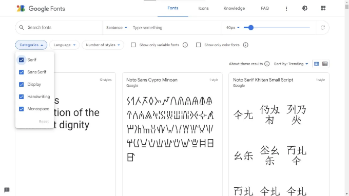
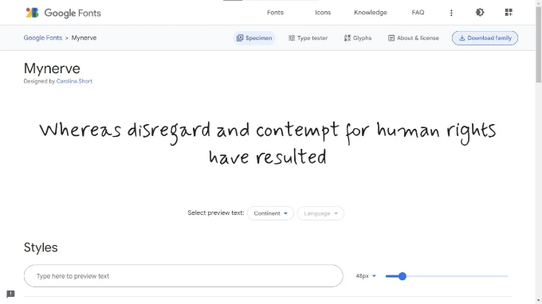
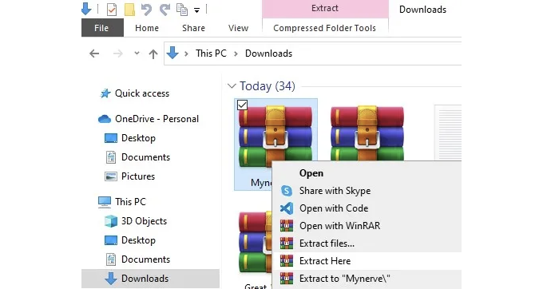
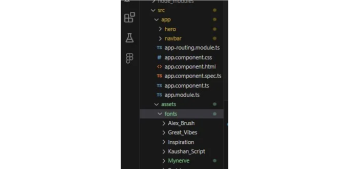
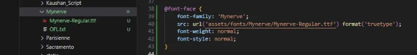
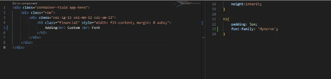
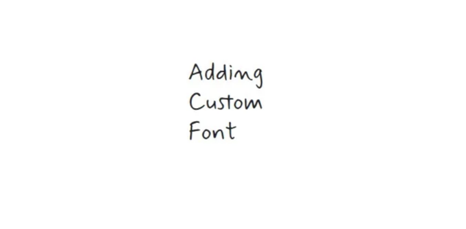

간혹 개인 프로젝트, 학술 프로젝트 또는 고객을 위한 프로젝트를 진행할 때, 최종 목표에 따라 선택한 글꼴은 사이트 전반적인 느낌과 조화를 이루어야 합니다. 오펜하이머 영화에 바비 영화 글꼴을 사용하지 않겠죠?

처음에는 이를 어떻게 해야 할지 몰랐어요. 그래서 구글에서 조금 검색해보니 해결책을 찾았어요. 다만 마음에 들지 않았던 건, 다른 사이트를 왔다 갔다 하며 어떻게 하는지 맞추려고 노력해야 했던 점이었어요. 이 글에서는 처음부터 끝까지 전체 과정을 설명하고 있어요 — 여러분들이 선호하는 글꼴을 적용할 수 있게 될 거예요.

그럼 시작해봅시다.

단계 1: 글꼴 다운로드

<!-- ui-log 수평형 -->
<ins class="adsbygoogle"
  style="display:block"
  data-ad-client="ca-pub-4877378276818686"
  data-ad-slot="9743150776"
  data-ad-format="auto"
  data-full-width-responsive="true"></ins>
<component is="script">
(adsbygoogle = window.adsbygoogle || []).push({});
</component>

Google Fonts에 방문해보세요. 거기서 여러 폰트들을 스크롤하며 선택할 수 있어요. 필터 기능은 원하는 것이 무엇인지 아는 경우 유용하게 사용할 수 있어요.



관심 있는 폰트를 선택하고 '패밀리 다운로드' 버튼을 사용해 다운로드하세요.



<!-- ui-log 수평형 -->
<ins class="adsbygoogle"
  style="display:block"
  data-ad-client="ca-pub-4877378276818686"
  data-ad-slot="9743150776"
  data-ad-format="auto"
  data-full-width-responsive="true"></ins>
<component is="script">
(adsbygoogle = window.adsbygoogle || []).push({});
</component>

단계 2: 파일 추출 및 프로젝트로 가져오기

압축 파일로 다운로드되며 해제해야 합니다.



추출 후에는 해당 파일을 assets 폴더에 복사해야 합니다. 여기서 모든 폰트를 fonts 폴더에 넣거나 단순히 assets 하위에 배치할 수 있는 선택권이 있습니다. 프로젝트를 정리하기 위해 제 경우 fonts 폴더에 넣었습니다.

<!-- ui-log 수평형 -->
<ins class="adsbygoogle"
  style="display:block"
  data-ad-client="ca-pub-4877378276818686"
  data-ad-slot="9743150776"
  data-ad-format="auto"
  data-full-width-responsive="true"></ins>
<component is="script">
(adsbygoogle = window.adsbygoogle || []).push({});
</component>

단계 3: CSS 파일에 추가하기



이제 프로젝트 내에 폰트가 준비되었으니, styles.css 파일로 이동해봅시다.

```css
@font-face {
    font-family: 'Mynerve';
    src: url('assets/fonts/Mynerve/Mynerve-Regular.ttf') format('truetype');
    font-weight: normal;
    font-style: normal;
}
```

<!-- ui-log 수평형 -->
<ins class="adsbygoogle"
  style="display:block"
  data-ad-client="ca-pub-4877378276818686"
  data-ad-slot="9743150776"
  data-ad-format="auto"
  data-full-width-responsive="true"></ins>
<component is="script">
(adsbygoogle = window.adsbygoogle || []).push({});
</component>



### 단계 4: 폰트 적용

폰트를 적용하려면 아래와 같이 font-family를 참조하고 따옴표(단일 또는 이중 - 상관없음)를 사용해야합니다.



<!-- ui-log 수평형 -->
<ins class="adsbygoogle"
  style="display:block"
  data-ad-client="ca-pub-4877378276818686"
  data-ad-slot="9743150776"
  data-ad-format="auto"
  data-full-width-responsive="true"></ins>
<component is="script">
(adsbygoogle = window.adsbygoogle || []).push({});
</component>

마크다운 포맷으로 표를 변경해주세요. 



여기 있습니다, Angular 프로젝트에 사용자 정의 글꼴을 추가하는 전체 과정이 있습니다. 이 정보가 도움이 되기를 바랍니다.

코딩 즐기세요, 개발자 여러분!!