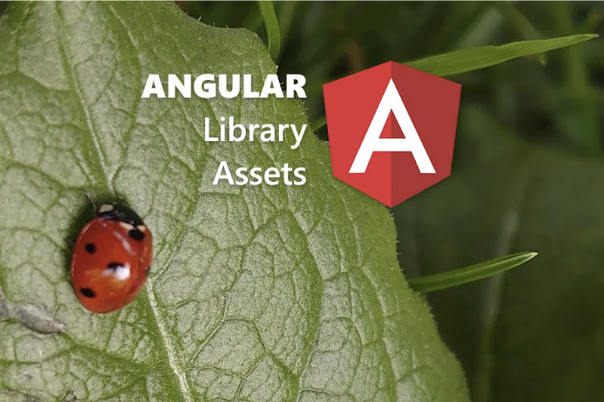
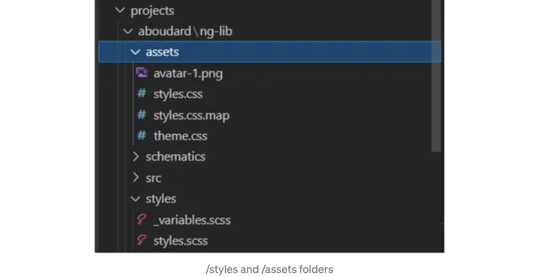
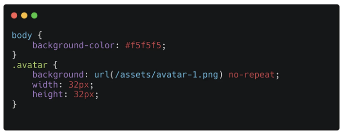
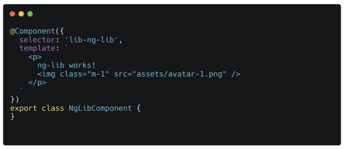
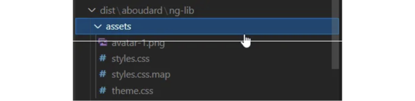
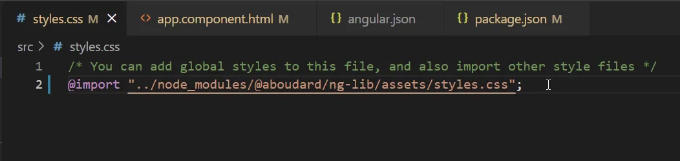
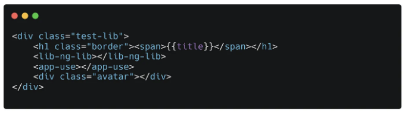
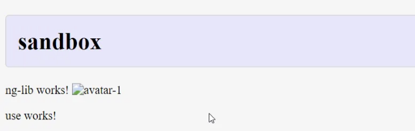
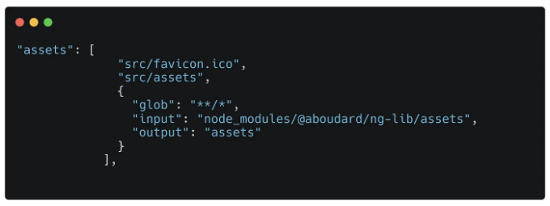
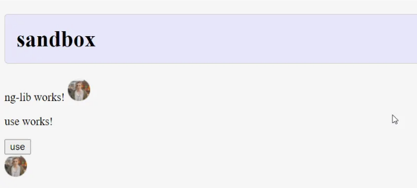

그리고 앱에서 사용하세요.

앞서 살펴본 내용에 새로운 내용을 추가하는 작은 기사:

이제 시작점은 ng-add 스키매틱이 있는 라이브러리입니다. 앞의 기사에서 설명한 대로 라이브러리가 있는 워크스페이스가 필요합니다.

<!-- ui-log 수평형 -->
<ins class="adsbygoogle"
  style="display:block"
  data-ad-client="ca-pub-4877378276818686"
  data-ad-slot="9743150776"
  data-ad-format="auto"
  data-full-width-responsive="true"></ins>
<component is="script">
(adsbygoogle = window.adsbygoogle || []).push({});
</component>

# 목표

우리는 라이브러리에 CSS/SCSS 기능을 추가하고 주요 응용프로그램에서 자산을 노출하려고 합니다. 따라서 우리는 다음을 해야합니다:

- 라이브러리에 SCSS 파일 작성
- 라이브러리에 이미지 만들기
- SCSS 빌드하기
- 라이브러리 빌드 구성하여 자산 내보내기
- 최종 응용프로그램 구성하여 이러한 자산 처리

# 라이브러리

<!-- ui-log 수평형 -->
<ins class="adsbygoogle"
  style="display:block"
  data-ad-client="ca-pub-4877378276818686"
  data-ad-slot="9743150776"
  data-ad-format="auto"
  data-full-width-responsive="true"></ins>
<component is="script">
(adsbygoogle = window.adsbygoogle || []).push({});
</component>

당신의 도서관에서는, /src 폴더 옆이나 안에 /styles 폴더를 만들어 보겠습니다. 여기에는 scss 파일과 같은 소스가 포함될 것입니다. 그런 다음, 컴파일된 css 파일 및 이미지와 같은 다른 파일이 포함될 /assets 폴더를 만들 것입니다. 이 파일들은 템플릿에서 사용되거나 css 내에서 url() 구문을 통해 사용될 것입니다.



scss 파일은 매우 단순합니다. 기존 css를 사용하고 일부 변수를 가져오는 것입니다.

theme.css 파일 또한 매우 간단합니다. 이미지를 참조하고 있습니다.

<!-- ui-log 수평형 -->
<ins class="adsbygoogle"
  style="display:block"
  data-ad-client="ca-pub-4877378276818686"
  data-ad-slot="9743150776"
  data-ad-format="auto"
  data-full-width-responsive="true"></ins>
<component is="script">
(adsbygoogle = window.adsbygoogle || []).push({});
</component>



우리 라이브러리의 구성 요소 중 하나의 템플릿에 이미지를 추가해봅시다. 해당 이미지는 /assets 참조를 통해 표시될 것입니다:



## Angular 라이브러리에서 scss 빌드하기

<!-- ui-log 수평형 -->
<ins class="adsbygoogle"
  style="display:block"
  data-ad-client="ca-pub-4877378276818686"
  data-ad-slot="9743150776"
  data-ad-format="auto"
  data-full-width-responsive="true"></ins>
<component is="script">
(adsbygoogle = window.adsbygoogle || []).push({});
</component>

저희 라이브러리 패키지에 간단한 스크립트를 만들어 보겠습니다. package.json 파일의 아래와 같이 설정해주세요:

```js
"scripts": {
   "build:sass": "sass styles/styles.scss assets/styles.css",
   "build:schematics": "tsc -p tsconfig.schematics.json",
   "postbuild:schematics": "copyfiles schematics/collection.json ../../../dist/aboudard/ng-lib/"
},
```

이 스크립트는 assets 폴더에 있는 css를 빌드합니다. 이렇게 하면 css에서 이미지를 참조하기 쉽고 url()이 올바르게 될 것입니다.

이제 ng-package.json 파일에서 라이브러리 빌더가 assets를 내보내어야 한다고 알려주어야 합니다:

<!-- ui-log 수평형 -->
<ins class="adsbygoogle"
  style="display:block"
  data-ad-client="ca-pub-4877378276818686"
  data-ad-slot="9743150776"
  data-ad-format="auto"
  data-full-width-responsive="true"></ins>
<component is="script">
(adsbygoogle = window.adsbygoogle || []).push({});
</component>

```js
{
   "$schema": "../../../node_modules/ng-packagr/ng-package.schema.json",
   "dest": "../../../dist/aboudard/ng-lib",
   "lib": {
      "entryFile": "src/public-api.ts"
   },
   "assets": ["./styles/*.*","./assets/**/*.*"]
}
```

CSS를 빌드한 후에 라이브러리를 빌드하면 dist 폴더에 다음과 같은 내용이 표시됩니다:



theme.css 파일은 소스에 남길 수 있습니다. 왜냐하면 해당 내용을 직접 사용할 수 있기 때문이며, .map 파일은 scss 소스를 함께 배포하는 경우에만 관련이 있으며 이 경우 ng-package.json의 assets 구성에 /styles 폴더를 추가할 수 있습니다.

<!-- ui-log 수평형 -->
<ins class="adsbygoogle"
  style="display:block"
  data-ad-client="ca-pub-4877378276818686"
  data-ad-slot="9743150776"
  data-ad-format="auto"
  data-full-width-responsive="true"></ins>
<component is="script">
(adsbygoogle = window.adsbygoogle || []).push({});
</component>

# 애플리케이션의 자산 사용하기

새로운 애플리케이션을 생성하고 라이브러리를 설치해봅시다.

```js
ng new myApp
cd /myApp
ng add @aboudard/ng-lib
npm run start
```

그런 다음, 우리의 라이브러리 css를 메인 styles.scss 파일에 간단히 호출하면 됩니다:

<!-- ui-log 수평형 -->
<ins class="adsbygoogle"
  style="display:block"
  data-ad-client="ca-pub-4877378276818686"
  data-ad-slot="9743150776"
  data-ad-format="auto"
  data-full-width-responsive="true"></ins>
<component is="script">
(adsbygoogle = window.adsbygoogle || []).push({});
</component>




만약 그렇게 하면, 그리고 앱.component.html 파일에서 다음과 같이 코드를 사용하려고 한다면:



스타일은 가져오지만 이미지는 표시되지 않을 것입니다:

<!-- ui-log 수평형 -->
<ins class="adsbygoogle"
  style="display:block"
  data-ad-client="ca-pub-4877378276818686"
  data-ad-slot="9743150776"
  data-ad-format="auto"
  data-full-width-responsive="true"></ins>
<component is="script">
(adsbygoogle = window.adsbygoogle || []).push({});
</component>



## 라이브러리 자산을 참조하기

이제 라이브러리에서 내보낸 자산을 알았으니, node_modules를 통해 그 자산들을 참조하기만 하면 Angular 빌더에 의해 컴파일될 것입니다. 그래서 우리의 새 어플리케이션의 angular.json 파일에 자산을 추가해 보겠습니다:

  

<!-- ui-log 수평형 -->
<ins class="adsbygoogle"
  style="display:block"
  data-ad-client="ca-pub-4877378276818686"
  data-ad-slot="9743150776"
  data-ad-format="auto"
  data-full-width-responsive="true"></ins>
<component is="script">
(adsbygoogle = window.adsbygoogle || []).push({});
</component>

지금 이미지가 표시되어야 합니다. 이미지 태그나 CSS url() 설정을 사용하여 확인해보세요.



이것은 매우 간단한 예제입니다. 코드가 많지는 않지만, 라이브러리에서 리소스를 구성하고 Angular 애플리케이션에서 올바르게 사용하는 데 충분합니다. 소스 코드는 GitHub 저장소에서 찾을 수 있습니다.

# 참고

<!-- ui-log 수평형 -->
<ins class="adsbygoogle"
  style="display:block"
  data-ad-client="ca-pub-4877378276818686"
  data-ad-slot="9743150776"
  data-ad-format="auto"
  data-full-width-responsive="true"></ins>
<component is="script">
(adsbygoogle = window.adsbygoogle || []).push({});
</component>

이 문서를 확인해보세요. 여기에는 angular.json 자산 구성이 소개되어 있습니다: