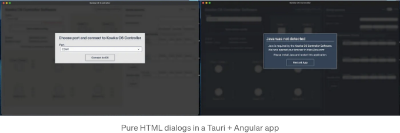
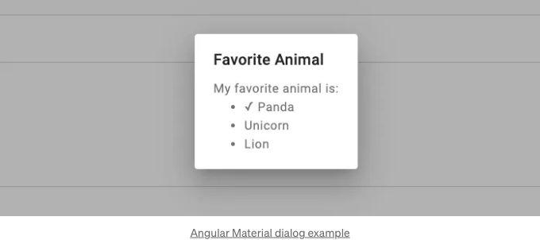
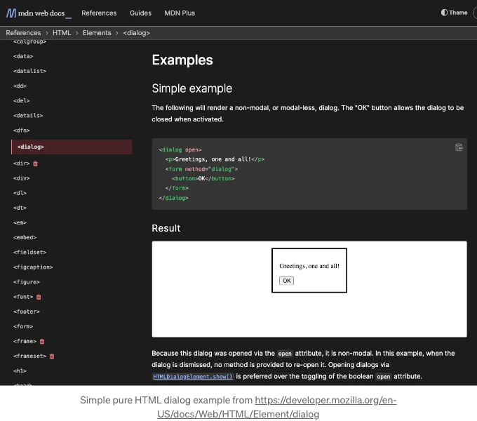
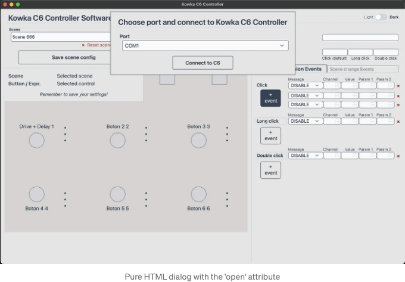
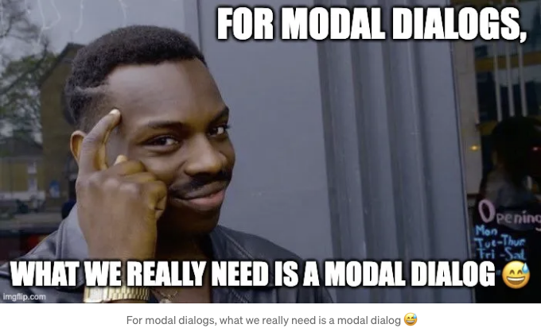
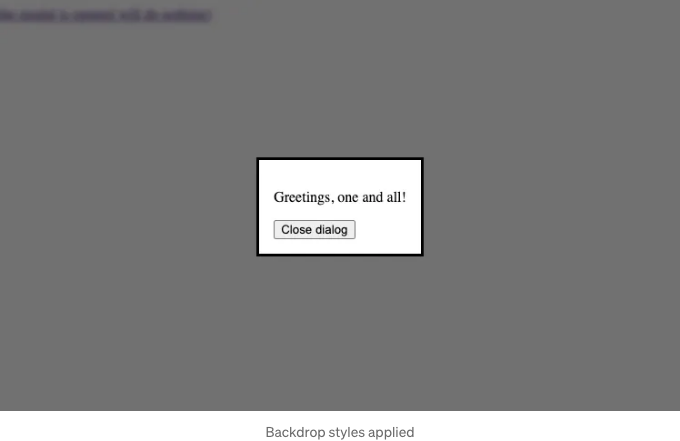

## 라이브러리가 필요 없어요



순수 HTML 대화 상자에 대해 들어 보셨나요? CSS 다크 모드에 대한 내 글로 이어진 Tauri + Angular 앱을 작업하면서, 몇 가지 대화 상자 화면이 필요하다는 요구 사항을 알게 되었습니다. Tailwind 이외의 외부 UI 라이브러리를 사용하지 않고 있기 때문에, 저는 기본 HTML 대화 상자를 활용했어요.

(끝 부분에 Angular 코드로 이동하세요)

<!-- ui-log 수평형 -->
<ins class="adsbygoogle"
  style="display:block"
  data-ad-client="ca-pub-4877378276818686"
  data-ad-slot="9743150776"
  data-ad-format="auto"
  data-full-width-responsive="true"></ins>
<component is="script">
(adsbygoogle = window.adsbygoogle || []).push({});
</component>

# 다이얼로그란 무엇인가요?

https://design.mindsphere.io/patterns/dialog.html 에서 정의를 빌려옵시다:

이렇게 간단해요. 대화식 대화로 생각해보세요. 상대방이 질문을 하거나 정보를 전해주는 것, 그리고 우리(사용자)로부터 답변을 기대하는 것이 그겁니다. 이 답변은 버튼을 클릭하는 것과 같은 작업일 수도 있고, 그럼으로서 다른 작업을 시작하거나, 정보를 인지하고 다이얼로그 창을 닫을 수 있습니다.

## 다이얼로그를 위해 외부 라이브러리가 필요한가요?

<!-- ui-log 수평형 -->
<ins class="adsbygoogle"
  style="display:block"
  data-ad-client="ca-pub-4877378276818686"
  data-ad-slot="9743150776"
  data-ad-format="auto"
  data-full-width-responsive="true"></ins>
<component is="script">
(adsbygoogle = window.adsbygoogle || []).push({});
</component>



항상 그렇습니다. 필요한 대화상자가 얼마나 복잡하며, 응용 프로그램이 얼마나 복잡한지에 따라 다릅니다. 주로 전체 대화상자 화면을 만드는 데 필요한 의지/능력/요구사항에 달려 있습니다. 라이브러리 없이 다음 스타일을 직접 만들어야 합니다:
- 대화상자 창 컨테이너
- 타이틀바
- 닫기 버튼
- 배경 스타일 (대화상자 창 테두리 뒤에 있는 모든 것을 "가리는" 어두운 화면)

그리고 라이브러리가 없으면 모든 대화 상자 이벤트 또는 작업을 처리해야 합니다.

<!-- ui-log 수평형 -->
<ins class="adsbygoogle"
  style="display:block"
  data-ad-client="ca-pub-4877378276818686"
  data-ad-slot="9743150776"
  data-ad-format="auto"
  data-full-width-responsive="true"></ins>
<component is="script">
(adsbygoogle = window.adsbygoogle || []).push({});
</component>

그래서 UI 라이브러리를 사용해야 하는 요구 사항이 있다면, 자체 대화 상자를 구현하는 것이 너무 어려울 수 있습니다. "Favorite Animal" 대화 상자 예제가 너무 복잡하다는 것은 아닙니다. 그리고 UI 라이브러리를 사용하면 번잡함이 따라오지 않는 경우를 본 적이 없습니다(Angular Material을 사용하면 번들 크기가 얼마나 증가하는지 확인해보세요).

# HTML 대화 상자



이미지와 링크된 문서에서 볼 수 있듯이, HTML은 이미 대화 상자 태그를 제공하며 사용하기 매우 간단합니다:

<!-- ui-log 수평형 -->
<ins class="adsbygoogle"
  style="display:block"
  data-ad-client="ca-pub-4877378276818686"
  data-ad-slot="9743150776"
  data-ad-format="auto"
  data-full-width-responsive="true"></ins>
<component is="script">
(adsbygoogle = window.adsbygoogle || []).push({});
</component>

```js
<dialog open>
  <p>안녕하세요, 모두여!</p>
  <form method="dialog">
    <button>확인</button>
  </form>
</dialog>
```

open 속성을 주목해주세요. 이것은 대화 상자가 열린 상태로 시작하도록 합니다. 대화 상자는 열리지 않으면 표시되지 않습니다.
일반적으로 대화 상자가 열려 시작하는 것이 좋습니다.



이 종류의 대화 상자의 문제는 모달 대화 상자가 아니라는 점입니다. 따라서 대화 상자 아래의 요소(예: 대화 상자 아래의 버튼)에 의해 트리거되어야 하는 이벤트가 여전히 트리거됩니다. 강조된 'Click + event' 버튼을 참조하세요. 또한, 기본으로 대화 상자 창에 백드롭이 없습니다.```

<!-- ui-log 수평형 -->
<ins class="adsbygoogle"
  style="display:block"
  data-ad-client="ca-pub-4877378276818686"
  data-ad-slot="9743150776"
  data-ad-format="auto"
  data-full-width-responsive="true"></ins>
<component is="script">
(adsbygoogle = window.adsbygoogle || []).push({});
</component>



# 순수 HTML 모달 대화상자

https://www.bennadel.com/blog/3620-most-of-your-modal-windows-should-be-directly-accessible-by-route-in-angular-7-2-15.htm 에서 많은 생각을 얻어, 우리의 모달 대화상자를 다른 경로에 구현할 것입니다. Angular에서는 새로운 컴포넌트를 정의하고 새로운 경로를 설정하는 것이 매우 간단합니다. 어떤 면에서는 앱의 SoC (관심사 분리)에 도움이 될 수 있습니다. 나중에 Angular 코드를 살펴보겠습니다.

```js
<dialog id="my-dialog">
  <p>여러분, 안녕하세요!</p>
  <form method="dialog">
    <button onclick="closeDialog()">대화 상자 닫기</button>
  </form>
</dialog>
```

<!-- ui-log 수평형 -->
<ins class="adsbygoogle"
  style="display:block"
  data-ad-client="ca-pub-4877378276818686"
  data-ad-slot="9743150776"
  data-ad-format="auto"
  data-full-width-responsive="true"></ins>
<component is="script">
(adsbygoogle = window.adsbygoogle || []).push({});
</component>

dialog 태그에 open 속성이 포함되지 않은 이유는 이 dialog를 JavaScript를 사용하여 열고 닫기 때문입니다 (아직은 Angular이 없어요).

```js
const myDialog = document.querySelector('#my-dialog');
myDialog.showModal();

function closeDialog() {
  myDialog.close();
}
```

코드펜에서:

하지만 dialog가 모달처럼 동작하더라도, 실제로 모달처럼 보이지 않습니다.

<!-- ui-log 수평형 -->
<ins class="adsbygoogle"
  style="display:block"
  data-ad-client="ca-pub-4877378276818686"
  data-ad-slot="9743150776"
  data-ad-format="auto"
  data-full-width-responsive="true"></ins>
<component is="script">
(adsbygoogle = window.adsbygoogle || []).push({});
</component>

## 모달 대화 상자 배경을 어떻게 스타일링할까요?

모달 대화 상자의 배경은 HTML 코드에 명시적으로 포함되지 않는 요소입니다. showModal() 함수가 호출될 때 표시되는 가상 요소입니다.

```js
dialog::backdrop {
  background: rgba(0,0,0,0.6);
  backdrop-filter: blur(3px);
}
```



<!-- ui-log 수평형 -->
<ins class="adsbygoogle"
  style="display:block"
  data-ad-client="ca-pub-4877378276818686"
  data-ad-slot="9743150776"
  data-ad-format="auto"
  data-full-width-responsive="true"></ins>
<component is="script">
(adsbygoogle = window.adsbygoogle || []).push({});
</component>

CSS 코드는 펜에 주석 처리되어 있습니다. 주석 처리를 해제하고 시도해보세요.
그것은 반투명한 검은색 배경(60% 불투명도)을 사용하고, 배경 뒤의 모든 것에 블러 효과를 적용할 것입니다.

순수 HTML 모달 대화 상자의 정말 멋진 점은 배경에 좋은 스타일을 적용하는 것 외에는 대화 상자를 화면 가운데에 표시하기 위해 추가적인 스타일이나 수직 가운데 정렬 요령을 적용할 필요가 없다는 것입니다. "그냥 작동한다"라는 것이죠.

# Angular 순수 HTML 모달 대화 상자

이미 주요 아이디어는 갖고 계시겠죠. 템플릿을 위한 HTML, 일부 CSS, 그리고 showModal() 함수를 호출합니다. 우리의 대화 상자는 별도의 경로에 "거주"하기 때문에 대화 상자를 닫는 이벤트를 처리할 필요가 별로 없습니다(필요하다면, 닫기() 함수를 호출하시면 됩니다).

<!-- ui-log 수평형 -->
<ins class="adsbygoogle"
  style="display:block"
  data-ad-client="ca-pub-4877378276818686"
  data-ad-slot="9743150776"
  data-ad-format="auto"
  data-full-width-responsive="true"></ins>
<component is="script">
(adsbygoogle = window.adsbygoogle || []).push({});
</component>

Tailwind를 사용하여 CSS 스타일을 적용할 것이에요. MHO는 라이브러리를 부풀리는 대신 HTML을 조금 더 많이 사용하는 것이 나은 선택이라고 생각해요.

## 템플릿:

```js
<dialog #appDialog class="border border-primary bg-secondary text-primary w-fit max-w-screen-sm">
  <h1 class="text-2xl font-semibold w-100 border-b border-slate-300 px-2 mb-4">{dialogTitle}</h1>
  <ng-content></ng-content>
</dialog>
```

이 종류의 대화상자에는 제목 표시줄을 디자인하지 않았어요. 그냥 h1 타이틀 태그를 넣었어요. 제목을 건너뛰고 프로젝트된 콘텐츠만 사용할 수 있는데요(ng-content 태그), 오픈 소스의 장점은 코드를 원하는 대로 조정할 수 있다는 거에요.

<!-- ui-log 수평형 -->
<ins class="adsbygoogle"
  style="display:block"
  data-ad-client="ca-pub-4877378276818686"
  data-ad-slot="9743150776"
  data-ad-format="auto"
  data-full-width-responsive="true"></ins>
<component is="script">
(adsbygoogle = window.adsbygoogle || []).push({});
</component>

## SCSS (스타일):

```js
:host {
  dialog::backdrop {
    @apply  bg-neutral-900/80 backdrop-blur-sm;
  }
}
```

코드펜에서 사용한 스타일과 비슷하지만 Tailwind로 스타일링된 것과 비슷합니다.

## 컴포넌트:

<!-- ui-log 수평형 -->
<ins class="adsbygoogle"
  style="display:block"
  data-ad-client="ca-pub-4877378276818686"
  data-ad-slot="9743150776"
  data-ad-format="auto"
  data-full-width-responsive="true"></ins>
<component is="script">
(adsbygoogle = window.adsbygoogle || []).push({});
</component>

```js
import { ChangeDetectionStrategy, ChangeDetectorRef, Component, ElementRef, EventEmitter, Input, OnInit, Output, ViewChild, inject } from '@angular/core';
import { CommonModule } from '@angular/common';

@Component({
  selector: 'app-dialog',
  standalone: true,
  imports: [CommonModule],
  templateUrl: './dialog.component.html',
  styleUrls: ['./dialog.component.scss'],
  changeDetection: ChangeDetectionStrategy.OnPush
})
export class DialogComponent implements OnInit {
  @Input() dialogTitle!: string;
  @ViewChild('appDialog', { static: true }) dialog!: ElementRef<HTMLDialogElement>;
  cdr = inject(ChangeDetectorRef);
  
  ngOnInit(): void {
    this.dialog.nativeElement.showModal();
    this.cdr.detectChanges();
  }
  
  ngOnDestroy(): void {
    this.dialog.nativeElement.close();
    this.cdr.detectChanges();
  }

}
```

코드는 대화 상자를 닫는 작업을 합니다 (다른 사용 사례를 다루기 위해). 

## 사용 예: 

app.routes.ts 파일:

<!-- ui-log 수평형 -->
<ins class="adsbygoogle"
  style="display:block"
  data-ad-client="ca-pub-4877378276818686"
  data-ad-slot="9743150776"
  data-ad-format="auto"
  data-full-width-responsive="true"></ins>
<component is="script">
(adsbygoogle = window.adsbygoogle || []).push({});
</component>

```js
import { Route } from '@angular/router';

export const appRoutes: Route[] = [
  {
    path: 'my-dialog',
    loadComponent: () => import('./pages/my-dialog.component').then(m => m.MyDialogComponent)
  },
  {
    path: '*',
    redirectTo: '/'
  }
];
```

./pages/my-dialog.component.ts 파일:

```js
import { Component, inject } from '@angular/core';
import { CommonModule } from '@angular/common';
import { DialogComponent } from '../components/dialog/dialog.component';
import { FormsModule, ReactiveFormsModule } from '@angular/forms';
import { Router } from '@angular/router';

@Component({
  selector: 'app-my-dialog',
  standalone: true,
  imports: [
    CommonModule,
    DialogComponent
  ],
  templateUrl: './my-dialog.component.html',
})
export class MyDialogComponent {
  router = inject(Router);
  
  closeDialog() {
    // Navigate to / to close the dialog
    // ... you can do many other things here
    this.router.navigate(['/']);
  }
}
```

필요할 때마다 컴포넌트를 가져와서 사용하는 것을 잊지 마세요 (독립형 컴포넌트입니다).

<!-- ui-log 수평형 -->
<ins class="adsbygoogle"
  style="display:block"
  data-ad-client="ca-pub-4877378276818686"
  data-ad-slot="9743150776"
  data-ad-format="auto"
  data-full-width-responsive="true"></ins>
<component is="script">
(adsbygoogle = window.adsbygoogle || []).push({});
</component>

그리고 컴포넌트의 ./my-dialog.component.html 파일은 다음과 같습니다.

```js
<app-dialog dialogTitle="모두에게 인사!">
  <form>
    <button (click)="closeDialog()">다이얼로그 닫기</button>
  </form>
</app-dialog>
```

다이얼로그 라이브러리를 사용하지 않는 것이 진정한 선택인지에 대해 논란이 있을 수 있습니다. 언급한 대로, 이는 경우에 따라 작동할 수도, 작동하지 않을 수도 있습니다. 이 글의 주요 아이디어는 일부 라이브러리가 제공하려는 기능들이 이미 일반 HTML에서 제공되고 있다는 것을 보여주는 것이었습니다.

지금까지 읽어주셔서 감사합니다. 이 글을 즐겁게 읽어주셨기를 바랍니다 👍🏻