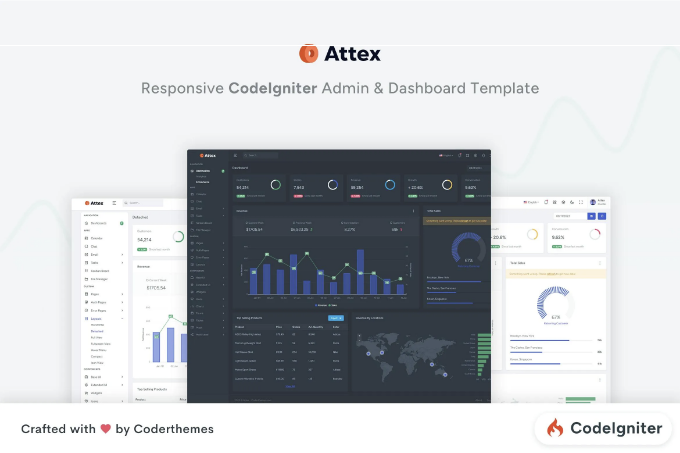
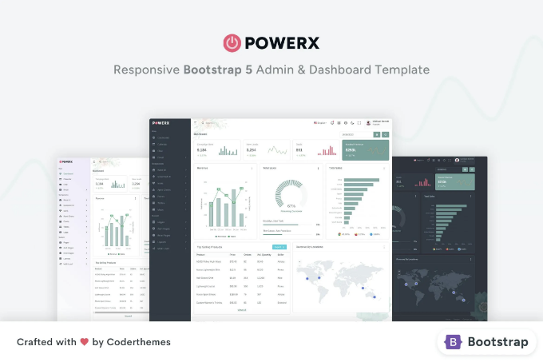
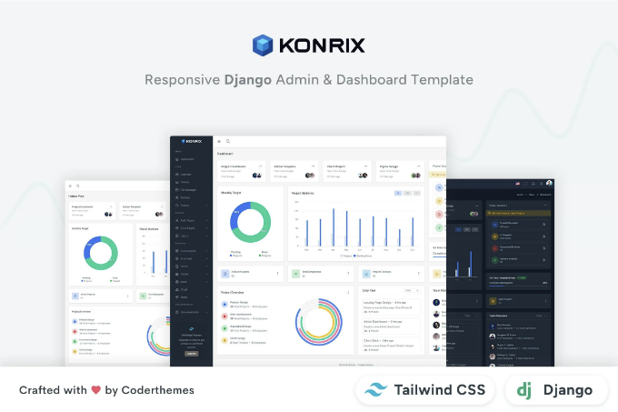
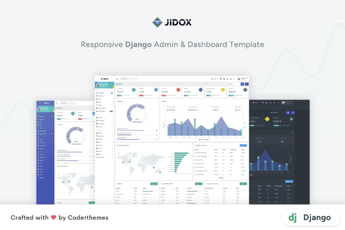
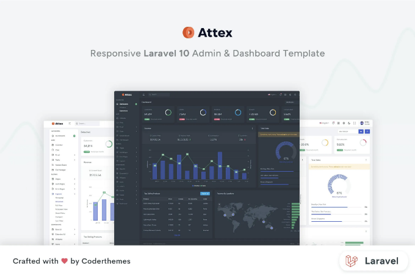
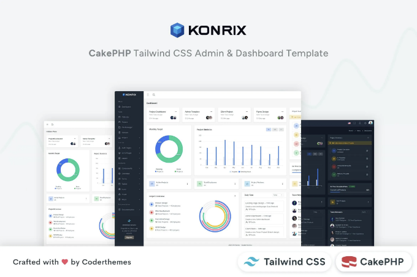
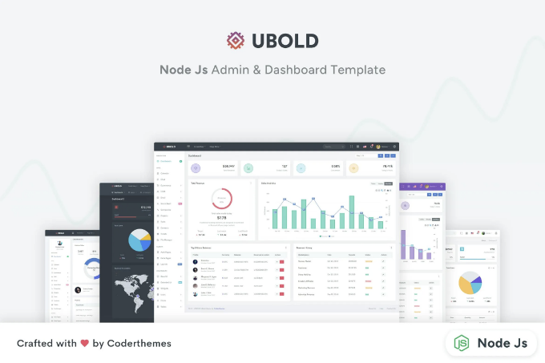
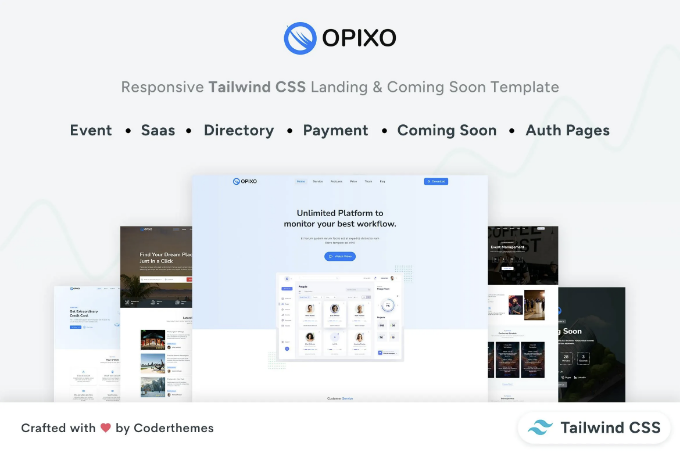
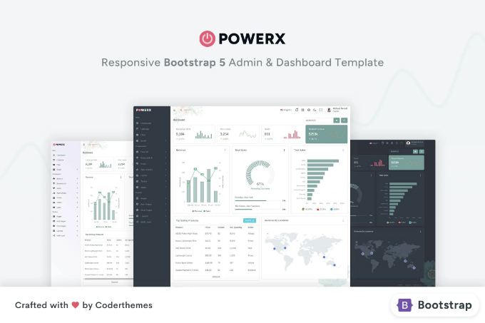

🔍 Attex CodeIgniter Tailwind CSS Admin 대시보드를 지금 확인해보세요! 이 📁 관리자 템플릿 웹 템플릿을 탐험하고 무료 다운로드를 받아보세요. 함께 웹 애플리케이션을 만들어봐요! 🚀

실시간 미리보기

Attex — CodeIgniter Tailwind CSS Admin & Dashboard Template는 강력한 관리자 대시보드 템플릿입니다. Attex는 다양한 UI 요소, 구성 요소, 위젯 및 페이지를 제공하여 웹 애플리케이션을 신속하고 효율적으로 구축하는 데 도움이 되는 대시보드 및 관리자 템플릿을 제공합니다. 다양하고 아름다운 스타일과 전체 화면 레이아웃으로 관리자 대시보드, 캘린더, 채팅, 이메일, 파일 관리자, 작업 관리, 칸반 보드 등에 완벽하게 맞습니다. Attex는 세 가지 사전 구축된 레이아웃 옵션과 현대 웹 애플리케이션의 요구 사항을 충족하는 유연한 레이아웃 시스템을 제공합니다. gulp 기반 도구를 사용한 UI 요소의 빌드 자동화를 통해 Attex는 개발자들이 빠르고 효율적으로 웹 애플리케이션을 만들 수 있도록 돕습니다.

<!-- ui-log 수평형 -->
<ins class="adsbygoogle"
  style="display:block"
  data-ad-client="ca-pub-4877378276818686"
  data-ad-slot="9743150776"
  data-ad-format="auto"
  data-full-width-responsive="true"></ins>
<component is="script">
(adsbygoogle = window.adsbygoogle || []).push({});
</component>

기능:

- CodeIgniter 4로 구축
- TailwindCSS v3.3.2로 구축
- 라이트 및 다크 모드 지원
- RTL 버전 이용 가능
- Gulp js 및 Yarn 패키지로 구축
- SCSS 변수를 널리 사용하여 쉬운 사용자 정의
- 다양한 레이아웃
- Google 폰트
- 모든 현대적/지원 브라우저 및 장치에서 완전히 응답 및 작동
- 완전 문서화됨
- 150개 이상의 페이지
- 500개 이상의 UI 구성 요소
- 50개 이상의 차트(두 개의 차트 라이브러리)
- 확장된 구성 요소 (Swiper Slider, Drag & Drop, Rating, Video Player, Tippy Tooltip)
- 풍부한 양식, 양식 편집기, 입력 마스크 및 양식 레이아웃
- 5개 이상의 내장 앱
- 포함된 오류 페이지
- 세련된 요금 페이지
- SVG 아이콘을 포함한 2400개 이상의 폰트 아이콘
- 무료 평생 업데이트

다양한 데모/레이아웃 옵션:

현대 웹 응용 프로그램 요구 사항을 충족시키기 위해 6가지 미리 제작된 레이아웃 옵션이 있습니다. 유연한 레이아웃 시스템과 빌드 자동화(gulp 기반 빌드 도구) 및 사용 준비가된 UI 요소는 최고의 속도로 현대적인 웹 응용 프로그램을 개발할 수 있도록 지원합니다.

<!-- ui-log 수평형 -->
<ins class="adsbygoogle"
  style="display:block"
  data-ad-client="ca-pub-4877378276818686"
  data-ad-slot="9743150776"
  data-ad-format="auto"
  data-full-width-responsive="true"></ins>
<component is="script">
(adsbygoogle = window.adsbygoogle || []).push({});
</component>

Apps:

- 캘린더
- 채팅
- 이메일 (받은 편지함, 이메일 상세 페이지 등)
- 작업 (목록 페이지, 상세 페이지 등)
- 칸반 보드
- 파일 관리자

레이아웃:

- 다양한 색상 옵션의 사이드바 및 탑바 레이아웃 (라이트, 다크, 브랜드 등 다양한 사이드바 테마 포함)
- 콤팩트한 사이드바 레이아웃
- 작은 사이드바 레이아웃 (아이콘 보기)
- 호버 뷰 및 호버 활성 사이드바 레이아웃
- 숨겨진 사이드바 레이아웃
- 상자형 레이아웃
- 스크롤 가능한 및 고정된 레이아웃

<!-- ui-log 수평형 -->
<ins class="adsbygoogle"
  style="display:block"
  data-ad-client="ca-pub-4877378276818686"
  data-ad-slot="9743150776"
  data-ad-format="auto"
  data-full-width-responsive="true"></ins>
<component is="script">
(adsbygoogle = window.adsbygoogle || []).push({});
</component>

페이지:

- 샘플 대시보드
- 송장 (인쇄 가능)
- 자주 묻는 질문
- 타임라인
- 가격
- 유지보수
- 곧 출시
- 프로필
- 로그인 페이지 (두 가지 변형)
- 등록 페이지 (두 가지 변형)
- 비밀번호 찾기 페이지 (두 가지 변형)
- 메일 확인 페이지 (두 가지 변형)
- 오류 404 페이지 (두 가지 변형)
- 오류 500

## 항목 태그

#어드민 #테일윈드 #CSS #대시보드 #ERP #앱 #CRM #백엔드 #SAAS #파이썬 #플랫 #기술 #소프트웨어 #UI #키트

<!-- ui-log 수평형 -->
<ins class="adsbygoogle"
  style="display:block"
  data-ad-client="ca-pub-4877378276818686"
  data-ad-slot="9743150776"
  data-ad-format="auto"
  data-full-width-responsive="true"></ins>
<component is="script">
(adsbygoogle = window.adsbygoogle || []).push({});
</component>

## 파일 유형

CSS, JS, HTML

## 추가 기능

레티나 지원
반응형
문서 포함

<!-- ui-log 수평형 -->
<ins class="adsbygoogle"
  style="display:block"
  data-ad-client="ca-pub-4877378276818686"
  data-ad-slot="9743150776"
  data-ad-format="auto"
  data-full-width-responsive="true"></ins>
<component is="script">
(adsbygoogle = window.adsbygoogle || []).push({});
</component>

## 상업 라이선스

추가 정보

## 비슷한 웹 템플릿

더 보러 가기

<!-- ui-log 수평형 -->
<ins class="adsbygoogle"
  style="display:block"
  data-ad-client="ca-pub-4877378276818686"
  data-ad-slot="9743150776"
  data-ad-format="auto"
  data-full-width-responsive="true"></ins>
<component is="script">
(adsbygoogle = window.adsbygoogle || []).push({});
</component>






<!-- ui-log 수평형 -->
<ins class="adsbygoogle"
  style="display:block"
  data-ad-client="ca-pub-4877378276818686"
  data-ad-slot="9743150776"
  data-ad-format="auto"
  data-full-width-responsive="true"></ins>
<component is="script">
(adsbygoogle = window.adsbygoogle || []).push({});
</component>



Jidox는 coderthemes가 제작한 Django Admin 대시보드 템플릿입니다.



Attex는 coderthemes가 제작한 Laravel 10 Admin & 대시보드 템플릿입니다.

<!-- ui-log 수평형 -->
<ins class="adsbygoogle"
  style="display:block"
  data-ad-client="ca-pub-4877378276818686"
  data-ad-slot="9743150776"
  data-ad-format="auto"
  data-full-width-responsive="true"></ins>
<component is="script">
(adsbygoogle = window.adsbygoogle || []).push({});
</component>

## coderthemes에서 더 많은 소식을 확인해보세요

자세히 보기



Konrix — CakePHP Tailwind CSS Admin & Dashboard by coderthemes

<!-- ui-log 수평형 -->
<ins class="adsbygoogle"
  style="display:block"
  data-ad-client="ca-pub-4877378276818686"
  data-ad-slot="9743150776"
  data-ad-format="auto"
  data-full-width-responsive="true"></ins>
<component is="script">
(adsbygoogle = window.adsbygoogle || []).push({});
</component>





<!-- ui-log 수평형 -->
<ins class="adsbygoogle"
  style="display:block"
  data-ad-client="ca-pub-4877378276818686"
  data-ad-slot="9743150776"
  data-ad-format="auto"
  data-full-width-responsive="true"></ins>
<component is="script">
(adsbygoogle = window.adsbygoogle || []).push({});
</component>

```md


PowerX — Bootstrap 5 Admin & Dashboard UI Kit by coderthemes
```