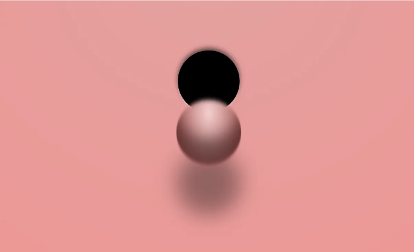
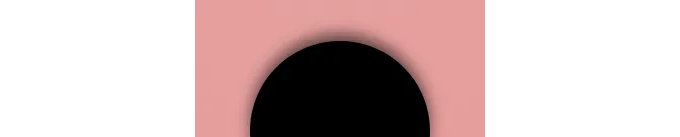
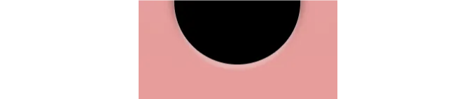
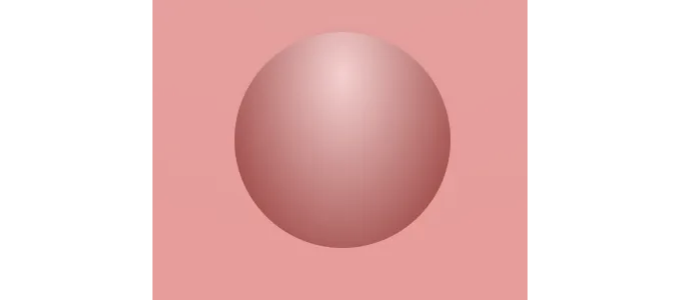
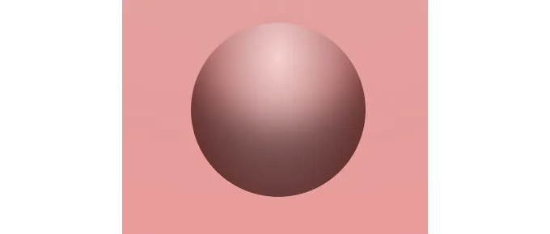
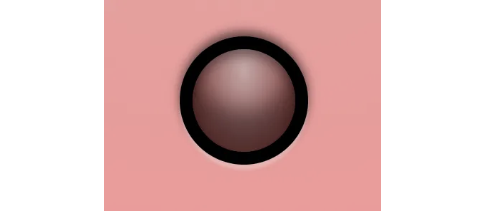
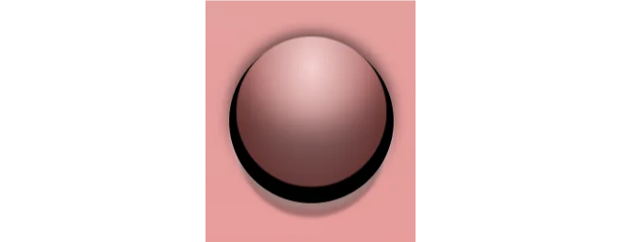
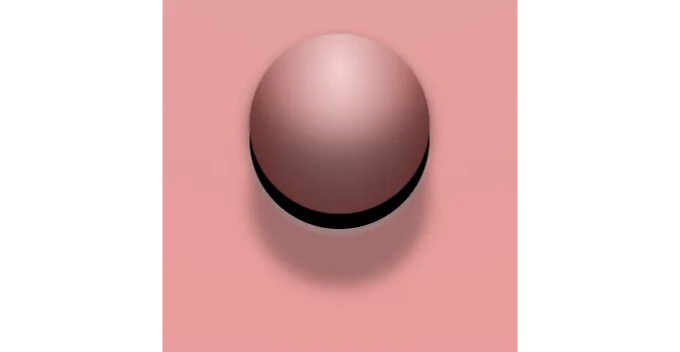
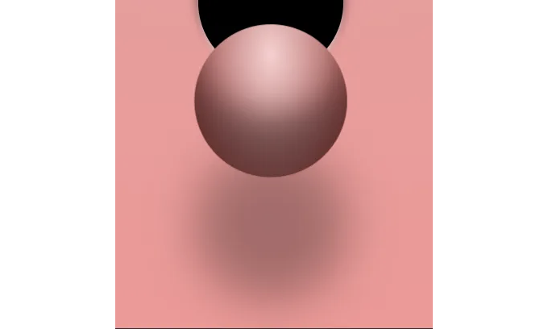
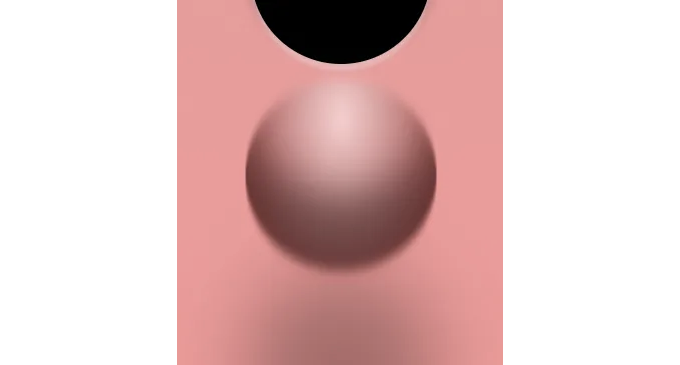

## 심야 CSS 재미



누군가가 CSS 구체를 만드는 방법을 물었습니다. 정말 흥미로운 도전인 것 같았어요!

결국 그들은 스스로 해결하기로 결정했지만 (대단하네요!), 그 아이디어가 정말 멋있어서 저도 시도해보기로 했어요. 나중에 서로 메모를 교환하기로 약속했어요.

<!-- ui-log 수평형 -->
<ins class="adsbygoogle"
  style="display:block"
  data-ad-client="ca-pub-4877378276818686"
  data-ad-slot="9743150776"
  data-ad-format="auto"
  data-full-width-responsive="true"></ins>
<component is="script">
(adsbygoogle = window.adsbygoogle || []).push({});
</component>

더 읽기 전에 당신이 직접 공을 구멍/페이지에서 튀어나오게 만들어보시면 멋질 거에요. 만약 만든다면, 댓글에 링크를 남겨주세요. 다른 사람들은 이를 어떻게 할지 궁금해할 거에요.

만약 급하다면, 아래는 제가 한 방법입니다. 좋은 상자 그림자를 좋아한다면, 이걸로 충분히 만족할 거에요, 약속해요.

# 기하학 (레이아웃)

처음에 떠오른 것은 공이 튀어나오는 구멍이 있기를 원한다는 것이었어요. 저는 `div` 하나만 사용하기로 결정했으므로, `div` 자체를 구멍으로 스타일링하고 ::after 의사 요소를 공으로 스타일링하기로 했어요. 이렇게 하면 공을 배치할 수 있는 참조점이 생기죠.

<!-- ui-log 수평형 -->
<ins class="adsbygoogle"
  style="display:block"
  data-ad-client="ca-pub-4877378276818686"
  data-ad-slot="9743150776"
  data-ad-format="auto"
  data-full-width-responsive="true"></ins>
<component is="script">
(adsbygoogle = window.adsbygoogle || []).push({});
</component>

```js
#sphere {
  /* 실제로는 구멍인 요소 */
  --size: 5em;
  width: var(--size);
  height: var(--size);
  border-radius: 50%;
}

#sphere::after {
  /* 이것은 공입니다 */
  content: '';
  display: block;
  width: 100%;
  height: 100%;

  border-radius: 50%;
}
```

구멍과 공의 크기를 같게 선택했어요. 이렇게 하면 애니메이션에 더 효율적인 scale() 변환을 사용하여 구 면적에 대한 크기를 나타낼 수 있어요.

페이지 안에 구멍/공을 가운데 정렬하기 위해 body에서 flex 레이아웃을 사용했어요:

```js
html, body {
  height: 100%;
}

body {
  display: flex;
  justify-content: center;
  align-items: center;
  overflow: hidden;
}
```

<!-- ui-log 수평형 -->
<ins class="adsbygoogle"
  style="display:block"
  data-ad-client="ca-pub-4877378276818686"
  data-ad-slot="9743150776"
  data-ad-format="auto"
  data-full-width-responsive="true"></ins>
<component is="script">
(adsbygoogle = window.adsbygoogle || []).push({});
</component>

컨테이너의 overflow 속성이 hidden으로 설정되어 있어서, 공이 화면 영역 밖으로 벗어날 때 스크롤 막대가 나타나지 않게 설정했어요.

## 자료

공을 스타일링하기 위해 평범한 검은색 배경을 사용하고 구멍의 가장자리를 정의하기 위해 두 개의 그림자를 사용했어요.

```css
#sphere {
  /* .... */
  background: black;
  box-shadow: 
    0 0.2em 0.1em rgba(255, 255, 255, 0.3),
    0 -0.2em 0.4em rgba(0, 0, 0, 0.6);
}
```

<!-- ui-log 수평형 -->
<ins class="adsbygoogle"
  style="display:block"
  data-ad-client="ca-pub-4877378276818686"
  data-ad-slot="9743150776"
  data-ad-format="auto"
  data-full-width-responsive="true"></ins>
<component is="script">
(adsbygoogle = window.adsbygoogle || []).push({});
</component>

두 번째 그림자는 구멍 맨 위의 그림자입니다. 아마도 빛이 위에서 온다고 가정하면, 삽입물의 윗 가장자리에 그림자가 드리워집니다.



첫 번째 그림자는 사실 구멍 아래 가장자리에 반사된 빛입니다.



<!-- ui-log 수평형 -->
<ins class="adsbygoogle"
  style="display:block"
  data-ad-client="ca-pub-4877378276818686"
  data-ad-slot="9743150776"
  data-ad-format="auto"
  data-full-width-responsive="true"></ins>
<component is="script">
(adsbygoogle = window.adsbygoogle || []).push({});
</component>

하이라이트가 특히 강하지 않아서 배경 재질이 무광/텁텁한 느낌이 나타납니다.

빛의 방향을 강조하기 위해 배경 자체에 그라데이션을 추가했습니다:

```js
body {
  /* ... */
  background: #ff9090;
  background-image: radial-gradient(at center 20%, #f19e9e, #ff9090)
}
```

그라데이션은 상당히 미묘하며 소프트한 빛이 배경 어딘가에서 비치는 환상을 줍니다. 이로 인해 배경이 고무 / 플라스틱 같은 느낌을 줍니다.

<!-- ui-log 수평형 -->
<ins class="adsbygoogle"
  style="display:block"
  data-ad-client="ca-pub-4877378276818686"
  data-ad-slot="9743150776"
  data-ad-format="auto"
  data-full-width-responsive="true"></ins>
<component is="script">
(adsbygoogle = window.adsbygoogle || []).push({});
</component>

접혀진 공의 면은 간단한 그라데이션이 적용되어 있어요.

```js
#sphere::after {
  /* ... */
  background: #a02a2a;
  background-image: radial-gradient(at center 20%, #fdcfcf, #a02a2a);
}
```

특별히 흥미로운 것도 현실적이지도 않지만, 전 괜찮아요.



<!-- ui-log 수평형 -->
<ins class="adsbygoogle"
  style="display:block"
  data-ad-client="ca-pub-4877378276818686"
  data-ad-slot="9743150776"
  data-ad-format="auto"
  data-full-width-responsive="true"></ins>
<component is="script">
(adsbygoogle = window.adsbygoogle || []).push({});
</component>

그 위에 몇 가지 그림자를 추가하여 실제 플라스틱 공처럼 보이도록 했어요.

```js
#shphere::after {
  /* ... */
  box-shadow:
    inset 0 -2em 1em rgba(0, 0, 0, 0.4);
}
```

이제 훨씬 더 나아 보여요.



<!-- ui-log 수평형 -->
<ins class="adsbygoogle"
  style="display:block"
  data-ad-client="ca-pub-4877378276818686"
  data-ad-slot="9743150776"
  data-ad-format="auto"
  data-full-width-responsive="true"></ins>
<component is="script">
(adsbygoogle = window.adsbygoogle || []).push({});
</component>

공이 아직 구멍 안에 있을 때, 구멍 자체가 그림자를 드리우기 때문에 그 환상을 재창조했습니다. 게다가 공의 크기와 투명도를 줄여서 공이 구멍 안에 있는 듯하고 더 어둡게 보이도록 했습니다.

```js
#shphere::after {
  /* ... */
  box-shadow:
    inset 0 -2em 1em rgba(0, 0, 0, 0.4),
    inset 0 0.3em 0.5em rgba(0, 0, 0, 0.4);
  
  opacity: 0.8;
  transform: scale(0.8);
}
```

최종 결과물은 다음과 같이 보입니다:



<!-- ui-log 수평형 -->
<ins class="adsbygoogle"
  style="display:block"
  data-ad-client="ca-pub-4877378276818686"
  data-ad-slot="9743150776"
  data-ad-format="auto"
  data-full-width-responsive="true"></ins>
<component is="script">
(adsbygoogle = window.adsbygoogle || []).push({});
</component>

(I will note that now the ball looks like it’s got a semi-translucent skin on top. This is an effect worth memorizing for some future project where I need that particular look.)

마지막으로, 공 아래의 그림자를 나타내는 추가적인 그림자를 추가합니다. 이 그림자는 초기 단계에서는 보이지 않지만, 애니메이션을 시작하면 그 목적이 무엇인지 알 수 있을 것입니다.

```js
#shphere::after {
  /* ... */
  box-shadow:
    inset 0 -2em 1em rgba(0, 0, 0, 0.4),
    inset 0 0.3em 0.5em rgba(0, 0, 0, 0.4),
    0 0 0 rgba(0, 0, 0, 0.6;
  
  opacity: 0.8;
  transform: scale(0.8);
}
```

# Animation

<!-- ui-log 수평형 -->
<ins class="adsbygoogle"
  style="display:block"
  data-ad-client="ca-pub-4877378276818686"
  data-ad-slot="9743150776"
  data-ad-format="auto"
  data-full-width-responsive="true"></ins>
<component is="script">
(adsbygoogle = window.adsbygoogle || []).push({});
</component>

이제 애니메이션 키프레임을 만들 준비가 되었어요. 먼저 빈 @keyframes 규칙을 추가한 다음 CSS에 넣었어요:

```js
#sphere::after {
  animation: 10s ease-in infinite pop-out;
}

@keyframes pop-out {

}
```

이징은 많은 조정을 거쳐 선택되었기 때문에, "더 나은 것 같아요" 라는 설명밖에는 없어요. 애니메이션이 무엇을 하는지 명확히 볼 수 있도록 10초의 타이밍으로 시작해요.

이제, 먼저 애니메이션 동안 어떻게 동작하기를 원했는지 설명할게요.

<!-- ui-log 수평형 -->
<ins class="adsbygoogle"
  style="display:block"
  data-ad-client="ca-pub-4877378276818686"
  data-ad-slot="9743150776"
  data-ad-format="auto"
  data-full-width-responsive="true"></ins>
<component is="script">
(adsbygoogle = window.adsbygoogle || []).push({});
</component>

먼저, 공이 구멍에서 밀려나옵니다. 빛에 노출되면서 점점 더 밝아집니다. 이는 공에 떨어지는 구멍 그림자도 사라지게 됩니다. 또한, 공이 우리 쪽으로 약간 움직이고, 동시에 커지도록 원합니다.

그 다음, 공이 우리 쪽으로 다가올 때, 그 뒤 벽에 그림자가 떨어집니다. 이 그림자는 공이 벽에 가까울수록 더 날카로워지며, 멀어질수록 점점 흐릿해집니다.

그 후, 공이 창문 밖으로 내려가며, 그림자가 일정한 거리를 유지하며 따라옵니다.

이제 코드를 살펴봅시다:

<!-- ui-log 수평형 -->
<ins class="adsbygoogle"
  style="display:block"
  data-ad-client="ca-pub-4877378276818686"
  data-ad-slot="9743150776"
  data-ad-format="auto"
  data-full-width-responsive="true"></ins>
<component is="script">
(adsbygoogle = window.adsbygoogle || []).push({});
</component>

```js
@keyframes pop-out {
  20% {
    opacity: 1;
    box-shadow: 
      inset 0 -2em 1em rgba(0, 0, 0, 0.4),
      inset 0 0 0 transparent,
      0 1em 0.1em rgba(0, 0, 0, 0.3);
  }
```

20% 지점부터 시작합니다. (왜냐면 요리조리 다듬은 결과물이거든요, 알겠죠?) 초기 0.8에서 1로 투명도를 설정합니다. 투명도가 0.8일 때 전체 공이 구멍의 검은 배경과 조금 혼합되어 더 어두워 보이며 어둡고 어두운 곳에 있다는 느낌을 줍니다. 20%에서는 100% 불투명해지면서 전 영광을 얻게 됩니다.



그림자는 구멍이 만드는 그림자 (가운데 것)가 완전히 비워지도록 조정되며, 세 번째 그림자는 공에 더 가깝게 강한 그림자를 투사하도록 조정되었습니다.```

<!-- ui-log 수평형 -->
<ins class="adsbygoogle"
  style="display:block"
  data-ad-client="ca-pub-4877378276818686"
  data-ad-slot="9743150776"
  data-ad-format="auto"
  data-full-width-responsive="true"></ins>
<component is="script">
(adsbygoogle = window.adsbygoogle || []).push({});
</component>

다음으로 30%의 키프레임으로 이동해 보겠습니다:

```js
  30% {
    transform: translateY(-0.5em) scale(1);
    box-shadow: 
      inset 0 -2em 1em rgba(0, 0, 0, 0.4),
      inset 0 0 0 transparent,
      0 2em 0.4em rgba(0, 0, 0, 0.3);  
  }
```

먼저, 매끄러운 애니메이션을 위해 그림자를 모두 유지해야 한다는 점에 주목해 주세요. CSS는 각 그림자를 개별적으로 전환하기 때문에 모든 그림자가 함께 존재해야 하며 서로 일치해야 합니다(첫 번째 그림자는 항상 첫 번째로 전환되고, 두 번째는 두 번째로 전환되는 식입니다).

앞에서 언급했듯이, 우리는 공을 조금 위로 올리고 있습니다. 이는 공이 가까워지는 것으로 보이는 환상을 더해주며, 크기 변화인 0.8에서 1로 왔기 때문에 이 더 강조됩니다. 세 번째 그림자는 덜 선명해지도록 조정되었습니다. 이것 또한 공이 벽으로부터 멀어진다는 것을 우리 뇌에 알려주는데, 멀리 떨어진 것은 표면으로부터 더 부드러운 그림자를 드리기 때문입니다.

<!-- ui-log 수평형 -->
<ins class="adsbygoogle"
  style="display:block"
  data-ad-client="ca-pub-4877378276818686"
  data-ad-slot="9743150776"
  data-ad-format="auto"
  data-full-width-responsive="true"></ins>
<component is="script">
(adsbygoogle = window.adsbygoogle || []).push({});
</component>



다음 키프레임은 70%에서 나타납니다(이징 함수로 인해):

```js
  70% {
    box-shadow: 
      inset 0 -2em 1em rgba(0, 0, 0, 0.4),
      inset 0 0 0 transparent,
      0 5em 2em rgba(0, 0, 0, 0.3);  
  }
```

이 키프레임은 공의 위치에 아무런 변화를 주지 않지만, 그림자를 더 조정해서 더 낮게 이동하고 더 흐릿하게 만듭니다. 이렇게 함으로써 우리 쪽으로 움직이는 공의 움직임을 더 강조하는 패럴랙스(시차 효과) 효과를 만들어 냅니다.

<!-- ui-log 수평형 -->
<ins class="adsbygoogle"
  style="display:block"
  data-ad-client="ca-pub-4877378276818686"
  data-ad-slot="9743150776"
  data-ad-format="auto"
  data-full-width-responsive="true"></ins>
<component is="script">
(adsbygoogle = window.adsbygoogle || []).push({});
</component>




(화면 캡처에서 공이 세로로 움직인 이유는 다음 키프레임 때문입니다.)

그리고 마지막 단계:

```js
  to {
    opacity: 1;
    transform: translateY(60vh) scale(1.2);
    box-shadow: 
      inset 0 -2em 1em rgba(0, 0, 0, 0.4),
      inset 0 0 0 transparent,
      0 5em 2em rgba(0, 0, 0, 0.3);  
  }
}
```

<!-- ui-log 수평형 -->
<ins class="adsbygoogle"
  style="display:block"
  data-ad-client="ca-pub-4877378276818686"
  data-ad-slot="9743150776"
  data-ad-format="auto"
  data-full-width-responsive="true"></ins>
<component is="script">
(adsbygoogle = window.adsbygoogle || []).push({});
</component>

프론트엔드 개발자가 필요로 할 수 있는 몇 가지 팁:

1. **테이블 태그:** 

Markdown을 사용하여 테이블 데이터를 더 보기 좋게 만들 수 있습니다. 아래는 기존 HTML 테이블 코드를 Markdown 형식으로 변환한 예시입니다:

```md
| Header 1 | Header 2 |
| -------- | -------- |
| Cell 1   | Cell 2   |
| Cell 3   | Cell 4   |
```

위와 같이 Markdown을 사용하면 표가 더욱 깔끔하게 보이고 읽기 쉬워질 수 있습니다. 실험해 보세요!

<!-- ui-log 수평형 -->
<ins class="adsbygoogle"
  style="display:block"
  data-ad-client="ca-pub-4877378276818686"
  data-ad-slot="9743150776"
  data-ad-format="auto"
  data-full-width-responsive="true"></ins>
<component is="script">
(adsbygoogle = window.adsbygoogle || []).push({});
</component>

```js
#sphere:hover::after {
  animation-play-state: paused;
}
```

# 모션 블러

이 애니메이션을 잠시 보고 나서, 모션 블러 효과를 추가하고 싶었어요. 인간의 눈에게 움직이는 물체는 100% 날카롭지 않아요. 항상 약간의 모션 블러가 있어요. 이 효과를 복제하면 애니메이션이 조금 더 현실적으로 보일 거예요.

조금 검색하다가 SVG를 사용한 기술을 보여주는 스택 오버플로 답변을 찾았어요.

<!-- ui-log 수평형 -->
<ins class="adsbygoogle"
  style="display:block"
  data-ad-client="ca-pub-4877378276818686"
  data-ad-slot="9743150776"
  data-ad-format="auto"
  data-full-width-responsive="true"></ins>
<component is="script">
(adsbygoogle = window.adsbygoogle || []).push({});
</component>

저는 스택 오버플로 예제대로 다음 SVG를 HTML에 추가했어요.

```js
<svg width="0" height="0">
    <defs>
        <filter id="blur">
            <feGaussianBlur in="SourceGraphic" stdDeviation="0 4" />
        </filter>
    </defs>
</svg>
```

그런 다음 마지막 두 키프레임을 조정하여 필터를 추가했어요.

```js
  60% {
    filter: url('#blur');
    /* ... */ 
  }
  
  to {
    filter: url('#blur');
    /* ... */
  }
```

<!-- ui-log 수평형 -->
<ins class="adsbygoogle"
  style="display:block"
  data-ad-client="ca-pub-4877378276818686"
  data-ad-slot="9743150776"
  data-ad-format="auto"
  data-full-width-responsive="true"></ins>
<component is="script">
(adsbygoogle = window.adsbygoogle || []).push({});
</component>



정말 멋있죠?

만약 애니메이션을 느리게 재생하면, 흐림이 갑자기 나타나는 걸 명확히 볼 수 있지만, 일반 속도에서는 그걸 알아챌 수 없어요. 사실, 내 모니터에서는 매우 미묘한 변화인데요.

# 결론

<!-- ui-log 수평형 -->
<ins class="adsbygoogle"
  style="display:block"
  data-ad-client="ca-pub-4877378276818686"
  data-ad-slot="9743150776"
  data-ad-format="auto"
  data-full-width-responsive="true"></ins>
<component is="script">
(adsbygoogle = window.adsbygoogle || []).push({});
</component>

그게 다야. 이 작은 에피소드를 즐겁게 즐기셨기를 바랍니다. 처음에 링크를 놓치셨다면 다시 한 번 제공하겠습니다. 이 글의 코드가 담긴 펜이 여기 있습니다.