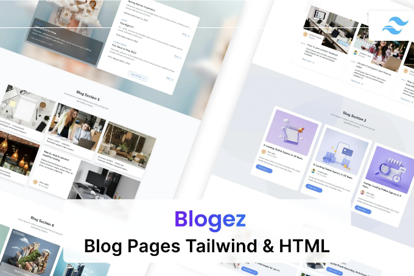
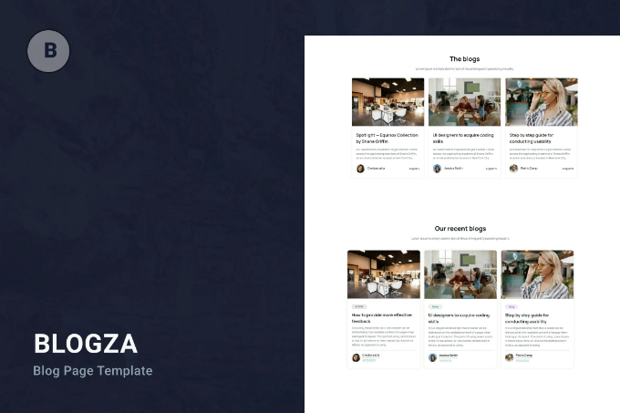
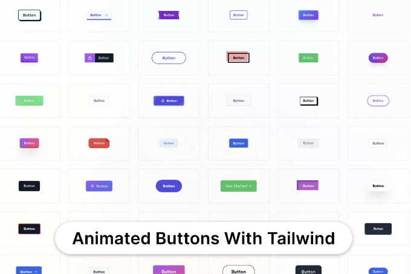
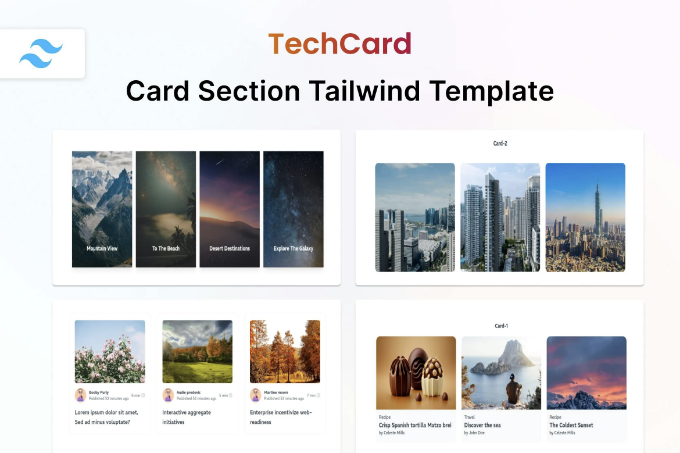
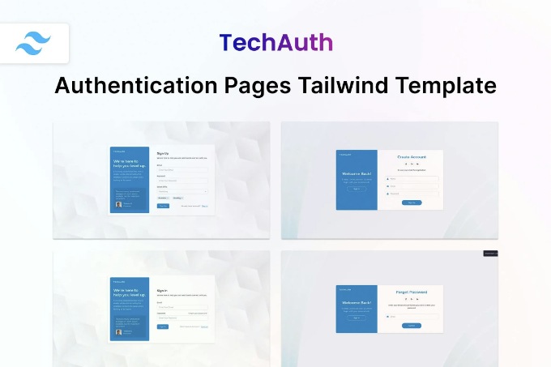
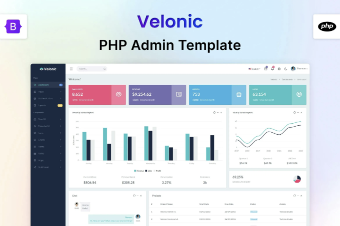
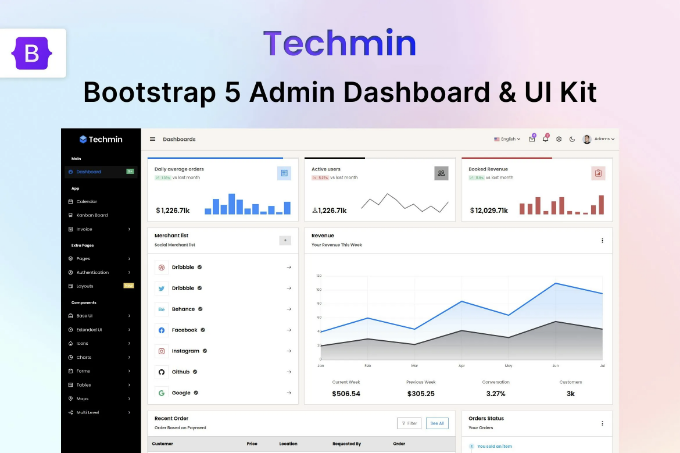
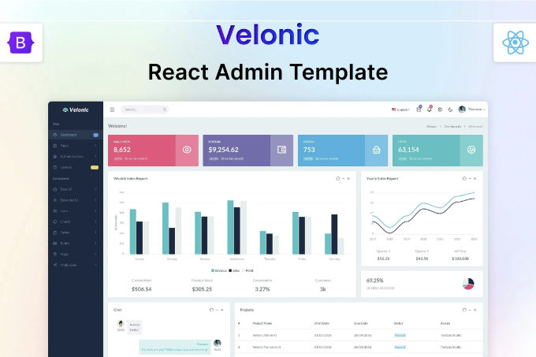
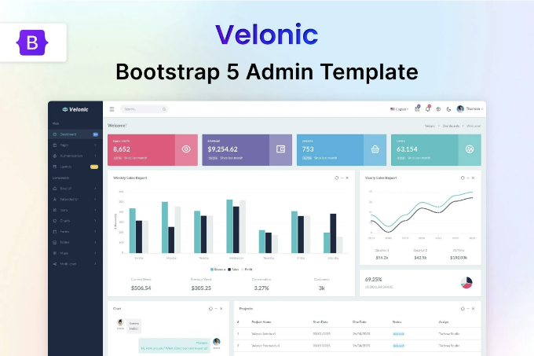

🔍 지금 Blogez Blog Pages Tailwind CSS 3 HTML 템플릿을 확인해보세요! 이 📁 사이트 템플릿 웹 템플릿을 탐험하고 무료 다운로드를 받으세요. 함께 제작을 시작해보세요! 🚀

실시간 미리보기

Blogez — 놀라운 아름다움과 깨끗한 코드와 함께하는 Tailwind CSS 블로그 템플릿! 강력한 HTML 및 CSS 파일을 사용하여 100% W3 유효한 웹 표준을 준수합니다. 또한 비즈니스, 에이전시, 서비스 판매 웹사이트를 위한 100% 반응형, 모바일 우선 블로그 디자인입니다. 암호화폐, 라라벨, 이메일 및 커밍순, 라라벨 템플릿 또는 워드프레스 테마와 함께도 사용할 수 있습니다.

<!-- ui-log 수평형 -->
<ins class="adsbygoogle"
  style="display:block"
  data-ad-client="ca-pub-4877378276818686"
  data-ad-slot="9743150776"
  data-ad-format="auto"
  data-full-width-responsive="true"></ins>
<component is="script">
(adsbygoogle = window.adsbygoogle || []).push({});
</component>

- 아름다운 디자인

Blogez는 현대적이고 시각적으로 매력적인 디자인으로 제작되어 방문자들이 웹사이트에 접속하는 순간부터 주목을 끌 수 있습니다. 신중히 선택된 색상 구성, 폰트, 그리고 레이아웃 덕분에 콘텐츠가 빛날 것입니다.

- 깔끔하고 강력한 코드

우리의 템플릿은 웹 개발의 최고의 실천 방법을 따라 정밀하게 코딩되었습니다. 웹사이트가 빠르게 로드되고 원활하게 작동할 것이므로 사용자 경험을 향상시켜 줄 것입니다.

<!-- ui-log 수평형 -->
<ins class="adsbygoogle"
  style="display:block"
  data-ad-client="ca-pub-4877378276818686"
  data-ad-slot="9743150776"
  data-ad-format="auto"
  data-full-width-responsive="true"></ins>
<component is="script">
(adsbygoogle = window.adsbygoogle || []).push({});
</component>

- 모바일 친화적

현재 세상에서 모바일 사용자들은 여러분의 청중 중 중요한 부분을 차지하고 있습니다. Blogez는 완전히 반응형으로 제작되어, 스마트폰, 태블릿, 데스크톱에서 웹사이트가 완벽하게 보이고 작동됨을 보장합니다.

- 사용자 정의 가능

Tailwind CSS를 사용하면 웹사이트의 모든 측면을 쉽게 사용자 정의할 수 있습니다. 색상, 글꼴, 레이아웃을 변경하고 싶어도 Blogez는 사용자가 자신만의 웹사이트로 만들 수 있는 유연성을 제공합니다.

<!-- ui-log 수평형 -->
<ins class="adsbygoogle"
  style="display:block"
  data-ad-client="ca-pub-4877378276818686"
  data-ad-slot="9743150776"
  data-ad-format="auto"
  data-full-width-responsive="true"></ins>
<component is="script">
(adsbygoogle = window.adsbygoogle || []).push({});
</component>

특징

- 아무것도 설치할 필요가 없습니다. 그냥 클릭하고 실행하세요.
- Admin과 함께 사용할 수 있어요.
- tailwind css 3로 사용하세요.
- 순수한 css, javascript, html을 포함하고 있어요.
- 다음과 같은 서비스와 함께 사용할 수 있어요: 에이전시, 부동산, 교육, 포트폴리오, 블로그, 여행, 이벤트, 패션, 호텔, 사진촬영, CRM, 의류, 물류, 영화.
- 몇 가지 사용 사례: 디지털 마케팅, 뉴스, 의료, 이메일, NFT, 스파, 산업, 폼, 크리에이티브, 스포츠, 그래픽, 앱, 암호화폐, 모바일, 게임, CV, 이력서, 뉴스레터, 웹, 체육관, SEO, 에어비앤비, 비정부 조직, 기술, 쇼핑몰 테마, 쇼핑몰, 쇼핑몰 테마, 게임.
- 다음과 같은 CSS 라이브러리와 작동할 수 있어요: bulma, bootstrap 5, bootstrap 4, tailwindui.
- 다음과 같은 언어와 함께 사용할 수 있어요: asp, php, python, java, node, react, vue, wordpress, angular, remix, svelte, cakephp, express, redwoodjs.
- 다음과 같은 프레임워크와 쉽게 사용할 수 있어요: next, laravel, nuxt, svelte kit, qwik, ruby on rails, meteor, astro, shopify, .net, vue.js, django, spring, flask, codeigniter, symfony, native, reactnative, ionic, framework 7.
- 다음과 같은 번들러도 사용할 수 있어요: vite, parcel, yarn, npm, gulp.

## 항목 태그

#admin #css #tailwind #page #ecommerce #tailwindcss #onepage #ui #agency #portfolio #app #mobile #blog #animation

<!-- ui-log 수평형 -->
<ins class="adsbygoogle"
  style="display:block"
  data-ad-client="ca-pub-4877378276818686"
  data-ad-slot="9743150776"
  data-ad-format="auto"
  data-full-width-responsive="true"></ins>
<component is="script">
(adsbygoogle = window.adsbygoogle || []).push({});
</component>

## 파일 유형

HTML, CSS, JS

## 추가 기능

레티나 지원
반응형
문서 포함

<!-- ui-log 수평형 -->
<ins class="adsbygoogle"
  style="display:block"
  data-ad-client="ca-pub-4877378276818686"
  data-ad-slot="9743150776"
  data-ad-format="auto"
  data-full-width-responsive="true"></ins>
<component is="script">
(adsbygoogle = window.adsbygoogle || []).push({});
</component>

## 상업적 라이선스

자세한 정보

## 비슷한 웹 템플릿

더 보기

<!-- ui-log 수평형 -->
<ins class="adsbygoogle"
  style="display:block"
  data-ad-client="ca-pub-4877378276818686"
  data-ad-slot="9743150776"
  data-ad-format="auto"
  data-full-width-responsive="true"></ins>
<component is="script">
(adsbygoogle = window.adsbygoogle || []).push({});
</component>

블로그 페이지 Tailwind CSS 3 HTML 템플릿 — Zoyo-Themes의 블로그자

TechButton — Tailwind CSS 3 버튼 HTML 템플릿 by Techzaa

<!-- ui-log 수평형 -->
<ins class="adsbygoogle"
  style="display:block"
  data-ad-client="ca-pub-4877378276818686"
  data-ad-slot="9743150776"
  data-ad-format="auto"
  data-full-width-responsive="true"></ins>
<component is="script">
(adsbygoogle = window.adsbygoogle || []).push({});
</component>

TechCard — Tailwind CSS 3 Card HTML Template by Techzaa

TechAuth — Auth Pages Tailwind CSS 3 HTML Template by Techzaa

<!-- ui-log 수평형 -->
<ins class="adsbygoogle"
  style="display:block"
  data-ad-client="ca-pub-4877378276818686"
  data-ad-slot="9743150776"
  data-ad-format="auto"
  data-full-width-responsive="true"></ins>
<component is="script">
(adsbygoogle = window.adsbygoogle || []).push({});
</component>

## 테크자 더 보기

더 많은 정보

Velonic — PHP 관리자 및 대시보드 템플릿 by 테크자

<!-- ui-log 수평형 -->
<ins class="adsbygoogle"
  style="display:block"
  data-ad-client="ca-pub-4877378276818686"
  data-ad-slot="9743150776"
  data-ad-format="auto"
  data-full-width-responsive="true"></ins>
<component is="script">
(adsbygoogle = window.adsbygoogle || []).push({});
</component>

Bootstrap 5 UI Kit & Admin Dashboard — Techmin by Techzaa

Velonic — React Admin & Dashboard Template by Techzaa

<!-- ui-log 수평형 -->
<ins class="adsbygoogle"
  style="display:block"
  data-ad-client="ca-pub-4877378276818686"
  data-ad-slot="9743150776"
  data-ad-format="auto"
  data-full-width-responsive="true"></ins>
<component is="script">
(adsbygoogle = window.adsbygoogle || []).push({});
</component>

 태그를 Markdown 형식으로 변경하십시오.

Bootstrap Admin & Dashboard Template by Techzaa