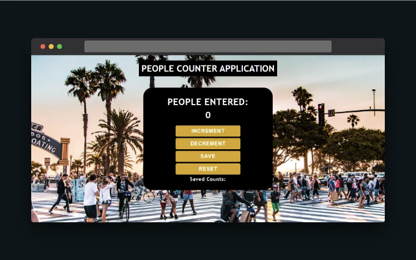

- 소개
- 프로젝트 개요
- 사전 준비 사항
- People Counter 애플리케이션의 기능
- 코드 구조
  - 단계 1. HTML 구조:
  - 단계 2. CSS 스타일링:
  - 단계 3. JavaScript 로직:
- 테스트와 디버깅
- 배운 점
- 배포
- 향후 개선 사항
- 결론

## 소개

People Counter 앱은 HTML, CSS 및 JavaScript를 사용하여 개발된 웹 애플리케이션으로, 특정 영역(예: 상점이나 이벤트 장소)으로 들어오는 사람 수를 세는 데 사용됩니다. 이 People Counter 애플리케이션 프로젝트 안내를 끝까지 따라가면 프론트엔드 개발 기술이 향상될 것입니다.

<!-- ui-log 수평형 -->
<ins class="adsbygoogle"
  style="display:block"
  data-ad-client="ca-pub-4877378276818686"
  data-ad-slot="9743150776"
  data-ad-format="auto"
  data-full-width-responsive="true"></ins>
<component is="script">
(adsbygoogle = window.adsbygoogle || []).push({});
</component>

# 프로젝트 개요

People Counter 앱은 지정된 영역으로 들어오고 나가는 사람 수를 세는 간단하고 효과적인 방법을 제공하도록 설계되었습니다. 이 앱은 수동으로 세는 방법을 디지털 솔루션으로 대체하여 정확하고 신뢰할 수 있으며 사용하기 쉬운 솔루션을 제공합니다.

# 전제 조건

이 People Counter 애플리케이션을 구축하려면 HTML, CSS 및 JavaScript에 대한 기본적인 이해가 필요합니다. 구조화를 위해 HTML, 스타일링을 위해 CSS, 그리고 애플리케이션의 논리를 구현하기 위해 JavaScript에 익숙해야 합니다.

<!-- ui-log 수평형 -->
<ins class="adsbygoogle"
  style="display:block"
  data-ad-client="ca-pub-4877378276818686"
  data-ad-slot="9743150776"
  data-ad-format="auto"
  data-full-width-responsive="true"></ins>
<component is="script">
(adsbygoogle = window.adsbygoogle || []).push({});
</component>

코드를 작성하려면 텍스트 편집기 또는 IDE(예: Visual Studio Code)가 필요하며 테스트를 위해 웹 브라우저가 필요합니다. 선택 사항으로는 애플리케이션을 호스팅하기 위한 GitHub 계정이 필요합니다.

# 사람 수 세는 애플리케이션 기능

이 프로젝트에서는 다음과 같은 기능을 갖춘 사람 수 세는 애플리케이션을 만들게 됩니다:

- 실시간 계산: 앱은 사람들이 들어오고 나가는 대로 현재 수를 실시간으로 업데이트합니다.
- 재설정 기능: 사용자는 언제든지 수를 제로로 재설정할 수 있습니다.
- 간단한 인터페이스: 앱은 깨끗하고 직관적인 인터페이스를 갖추어 사용자가 손쉽게 작동할 수 있도록 합니다.
- 반응형 디자인: 애플리케이션이 반응형이 되고 다양한 기기에서 잘 작동하도록 합니다.

<!-- ui-log 수평형 -->
<ins class="adsbygoogle"
  style="display:block"
  data-ad-client="ca-pub-4877378276818686"
  data-ad-slot="9743150776"
  data-ad-format="auto"
  data-full-width-responsive="true"></ins>
<component is="script">
(adsbygoogle = window.adsbygoogle || []).push({});
</component>

# 코드 구조

프로젝트를 위한 새 폴더를 만들어주시고, 폴더 이름은 원하시는 대로 지어주시고, 그 안에 index.html, style.css, 그리고 script.js 세 개의 파일을 만들어주세요. 이 파일들은 프로젝트의 기반이 될 것입니다. 이제 텍스트 편집기나 IDE(예: 비주얼 스튜디오 코드)에서 폴더를 열고 아래 단계를 따라주세요:

## 단계 1. HTML 구조:

index.html 파일을 열어 'People Counter' 어플리케이션을 위한 다음 HTML 코드를 붙여넣어주세요:

<!-- ui-log 수평형 -->
<ins class="adsbygoogle"
  style="display:block"
  data-ad-client="ca-pub-4877378276818686"
  data-ad-slot="9743150776"
  data-ad-format="auto"
  data-full-width-responsive="true"></ins>
<component is="script">
(adsbygoogle = window.adsbygoogle || []).push({});
</component>

```js
<!DOCTYPE html>
<html lang="en">
<head>
 <meta charset="UTF-8">
 <meta http-equiv="X-UA-Compatible" content="IE=edge">
 <meta name="viewport" content="width=device-width, initial-scale=1.0">
 <link rel="stylesheet" href="./style.css">
 <link rel="preconnect" href="https://fonts.googleapis.com">
 <link rel="preconnect" href="https://fonts.gstatic.com" crossorigin>
 <link href="https://fonts.googleapis.com/css2?family=Acme&family=Carter+One&family=Cookie&family=Island+Moments&family=PT+Serif+Caption&family=Playfair+Display+SC:wght@400;700;900&family=Red+Hat+Display:wght@700;900&display=swap" rel="stylesheet">
 <title>People Counter Application</title>
</head>
<body>
 <h1 class="main-header">People Counter Application</h1>

 <div class="container">
  <h1>People Entered: </h1>

  <h2 id="count-el">0</h2>

  <button id="increment-btn">Increment</button>

  <button id="decrement-btn">Decrement</button>

  <button id="save-btn">Save</button>

  <button id="reset-btn">Reset</button>

  <p>Saved Counts: <span id="save-el"></span></p>

 </div>

 <script src="script.js"></script>
</body>
</html>
```

<!-- ui-log 수평형 -->
<ins class="adsbygoogle"
  style="display:block"
  data-ad-client="ca-pub-4877378276818686"
  data-ad-slot="9743150776"
  data-ad-format="auto"
  data-full-width-responsive="true"></ins>
<component is="script">
(adsbygoogle = window.adsbygoogle || []).push({});
</component>

style.css 파일을 열고 다음 CSS 코드를 붙여넣어 People Counter 애플리케이션을 스타일링하세요:

```js
@import url('https://fonts.googleapis.com/css2?family=Acme&family=Carter+One&family=Cookie&family=Island+Moments&family=PT+Serif+Caption&family=Playfair+Display+SC:wght@400;700;900&family=Red+Hat+Display:wght@700;900&display=swap');

/* 모든 요소에 대한 스타일링 시작 */
* {
 padding: 0;
 margin: 0;
 box-sizing: border-box;
}

/* 바디 스타일링 시작 */
body {
 display: flex;
 align-items: center;
 justify-content: center;
 background-image: url("https://source.unsplash.com/1600x900/?people");
 font-family: 'Trebuchet MS', 'Lucida Sans Unicode', 'Lucida Grande', 'Lucida Sans', Arial, sans-serif;
 font-weight: bold;
 color: white;
 text-align: center;
 position: relative;
 min-height: 100vh;
}

.main-header {
 display: block;
 position: absolute;
 top: 20px;
 font-weight: bold;
 text-transform: uppercase;
 font-size: 2.2em;
 background-color: black;
 padding: 10px;
}

/* 컨테이너 스타일링 시작 */
.container {
 background-color: black;
 width: 100%;
 max-width: 500px;
 padding: 2em 4em;
 color: white;
 border-radius: 35px;
 margin: 6em 2em;
}

.container h1 {
 margin-top: 2px;
 margin-bottom: 10px;
 text-transform: uppercase;
 font-weight: bold;
 letter-spacing: 1px;
 font-size: 2.2em;
}

container h2 {
 font-size: 2.2em;
 margin-top: 0;
 margin-bottom: 20px;
}

.container button {
 border: none;
 padding-top: 10px;
 padding-bottom: 10px;
 background-color: goldenrod;
 color: white;
 text-transform: uppercase;
 width: 250px;
 margin: auto;
 display: flex;
 justify-content: center;
 margin-bottom: 6px;
 margin-top: 6px;
 border-radius: 5px;
 font-weight: bold;
 letter-spacing: 1px;
 font-size: 20px;
}

/* 호버 버튼 스타일링 시작 */
.container button:hover {
 background-color: rgb(126, 91, 5);
 color: white;
 transition: 0.3s ease-in-out;
}

/* 문단 스타일링 시작 */
.container p {
 color: white;
 font-size: 1.2em;
 letter-spacing: 1px;
}

/* 미디어 쿼리 스타일링 시작 */
@media screen and (max-width: 660px) {
 .main-header {
  font-size: 2em;
 }
}

@media screen and (max-width: 580px) {
 .main-header {
  font-size: 22px;
  padding: 10px;
 }

 .container h1 {
  letter-spacing: 2px;
  font-size: 30px;
 }

 .container h2 {
  font-size: 30px;
 }

 .container button {
  padding-top: 10px;
  padding-bottom: 10px;
  background-color: goldenrod;
  width: 200px;
  font-size: 20px;
 }

 .container p {
  font-size: 20px;
 }
}

@media screen and (max-width: 360px) {
 .main-header {
  font-size: 1.5em;
  padding: 10px;
 }

 .container h1 {
  letter-spacing: 1px;
  font-size: 22px;
 }

 .container h2 {
  font-size: 20px;
 }

 .container button {
  width: 120px;
  font-size: 13px;
 }

 .container p {
  font-size: 10px;
 }
}
```

위 CSS 코드는 People Counter 애플리케이션을 스타일링합니다. 바디, 메인 헤더, 컨테이너, 헤딩, 버튼, 문단 및 미디어 쿼리를 사용한 반응형 디자인까지 포함됩니다.

이 코드는 페이지의 요소의 배경, 글꼴 스타일, 색상, 레이아웃 및 반응성을 설정하여 People Counter 애플리케이션에 시각적으로 매력적이고 기능적인 사용자 인터페이스를 만드는 데 도움을 줍니다.

<!-- ui-log 수평형 -->
<ins class="adsbygoogle"
  style="display:block"
  data-ad-client="ca-pub-4877378276818686"
  data-ad-slot="9743150776"
  data-ad-format="auto"
  data-full-width-responsive="true"></ins>
<component is="script">
(adsbygoogle = window.adsbygoogle || []).push({});
</component>

## 단계 3. JavaScript 로직:

script.js 파일을 열고 다음 JavaScript 코드를 사용하여 People Counter 애플리케이션에 기능을 추가하세요:

```js
let countEl = document.querySelector('#count-el');

let incrementEl = document.querySelector('#increment-btn');

let decrementEl = document.querySelector('#decrement-btn');

let saveBtn = document.getElementById("save-btn");

let resetEl = document.querySelector('#reset-btn');

let saveEl = document.getElementById("save-el");

let count = localStorage.getItem('count') ? parseInt(localStorage.getItem('count')) : 0;

countEl.innerText = count;

incrementEl.addEventListener('click', () => {
    count += 1;
    countEl.innerText = count;
});

decrementEl.addEventListener('click', () => {
    count -= 1;
    if (count < 0) count = 0;
    countEl.innerText = count;
});

resetEl.addEventListener('click', () => {
    count = 0;
    countEl.innerText = count;
});

saveBtn.addEventListener('click', () => {
    let countStr = `${count} - `;
    saveEl.textContent += countStr;
    localStorage.setItem('count', count);
    countEl.textContent = 0;
    count = 0;
});
```

위의 JavaScript 코드는 People Counter 애플리케이션의 기능을 정의합니다. HTML 문서에서 다양한 요소를 선택하고, count 변수를 초기화하며, 증가, 감소, 재설정 및 저장 버튼을 위한 이벤트 리스너를 설정합니다.

<!-- ui-log 수평형 -->
<ins class="adsbygoogle"
  style="display:block"
  data-ad-client="ca-pub-4877378276818686"
  data-ad-slot="9743150776"
  data-ad-format="auto"
  data-full-width-responsive="true"></ins>
<component is="script">
(adsbygoogle = window.adsbygoogle || []).push({});
</component>

위 코드는 버튼 클릭에 따라 카운트를 증가시키거나 감소시키고, 카운트를 로컬 저장소에 저장하며, 필요할 때 카운트를 재설정하고 디스플레이를 업데이트합니다. 이 애플리케이션을 통해 사용자는 카운터와 상호 작용하고 카운트를 저장하며 카운트를 다시 0으로 재설정할 수 있습니다.

# 테스트 및 디버깅

웹 브라우저에서 애플리케이션을 테스트하려면 아래 단계를 따르세요:

- HTML 파일 열기: HTML, CSS 및 JavaScript 파일을 이전에 명시된 폴더에 모두 저장했는지 확인한 후 HTML 파일을 더블 클릭하여 웹 브라우저에서 엽니다. 이렇게 하면 파일이 기본 웹 브라우저에서 열립니다.
- 요소 검사: 브라우저에 앱이 로드된 후 페이지를 마우스 오른쪽 버튼으로 클릭하고 "요소 검사"를 선택하거나 "Ctrl+Shift+I"를 눌러 개발자 도구를 엽니다. 이를 통해 콘솔의 오류를 확인하고 페이지의 요소를 검사할 수 있습니다.
- 기능 테스트: 앱과 상호 작용하여 기능을 테스트합니다. 이를 통해 코드에서 발생하는 버그나 문제를 식별할 수 있습니다.
- 디버깅: 오류나 문제가 발생하면 개발자 도구의 콘솔을 사용하여 JavaScript 코드를 디버깅합니다. 오류 메시지와 라인 번호를 찾아 문제가 발생하는 위치를 확인합니다.
- 변경 사항 적용: 코드를 변경해야 하는 경우 코드 편집기로 돌아가 필요한 조정을 수행한 후 파일을 저장하고 브라우저를 새로 고침하여 앱에 반영된 변경 사항을 확인하세요.

<!-- ui-log 수평형 -->
<ins class="adsbygoogle"
  style="display:block"
  data-ad-client="ca-pub-4877378276818686"
  data-ad-slot="9743150776"
  data-ad-format="auto"
  data-full-width-responsive="true"></ins>
<component is="script">
(adsbygoogle = window.adsbygoogle || []).push({});
</component>

# 배운 점

이 프로젝트를 통해 코딩하기 전에 애플리케이션 논리를 계획하고 설계하는 중요성을 깨달았습니다. 또한 상호작용 웹 애플리케이션을 만드는 데 중요한 CSS 스타일링, JavaScript 이벤트 및 DOM 조작에 대한 이해력을 향상시켰습니다.

# 배포

People Counter 애플리케이션 프로젝트는 GitHub Pages에서 사용할 수 있으며 아래 링크를 클릭하면 온라인으로 액세스할 수 있습니다:

<!-- ui-log 수평형 -->
<ins class="adsbygoogle"
  style="display:block"
  data-ad-client="ca-pub-4877378276818686"
  data-ad-slot="9743150776"
  data-ad-format="auto"
  data-full-width-responsive="true"></ins>
<component is="script">
(adsbygoogle = window.adsbygoogle || []).push({});
</component>

애플리케이션을 테스트해보세요: https://wasiu-akindoyin.github.io/People-Counter-Web-Application/

GitHub 저장소에 방문하여 소스 코드를 확인하거나 기여할 수 있습니다.

# 향후 개선 사항

앞으로 추가할 기능들을 계획 중이에요:

<!-- ui-log 수평형 -->
<ins class="adsbygoogle"
  style="display:block"
  data-ad-client="ca-pub-4877378276818686"
  data-ad-slot="9743150776"
  data-ad-format="auto"
  data-full-width-responsive="true"></ins>
<component is="script">
(adsbygoogle = window.adsbygoogle || []).push({});
</component>

- 향상된 사용자 인터페이스: 애플리케이션 디자인을 개선하여 시각적으로 더 매력적이고 사용자 친화적으로 만듭니다.
- 다중 카운터: 여러 카운터를 지원하여 사용자가 동시에 다른 영역이나 목적에 대한 카운트를 추적할 수 있도록 합니다.
- 모바일 반응성: 앱이 완전히 반응하고 모바일 기기에서 잘 작동하도록 합니다.

# 결론

사람 카운터 애플리케이션은 특정 영역에 들어오는 사람 수를 추적하는 간단하면서도 효과적인 도구입니다. 사용자 친화적 인터페이스와 쉬운 사용자 정의 옵션을 통해 다양한 사용 사례에 맞게 적응할 수 있습니다. 사람 카운터 애플리케이션은 이벤트 관리에서 게임 체인저가 될 수 있으며, 주최자에게 운영을 최적화하고 참가자 경험을 최적화하며 성공을 이루도록 도와주는 강력한 도구를 제공합니다.

이 프로젝트 안내서가 도움이 되었다면 박수를 치고 공유하고 저를 팔로우하여 프런트엔드 개발, 블록체인 네트워크, 그리고 더 많은 정보를 얻어보세요. 끝까지 함께해 주셔서 감사합니다. 다음에 또 만나요.