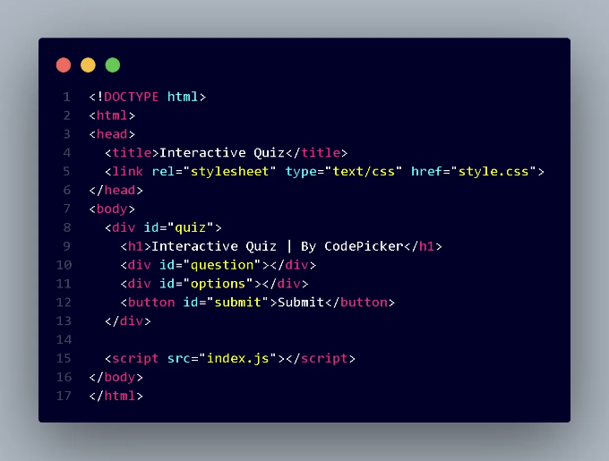
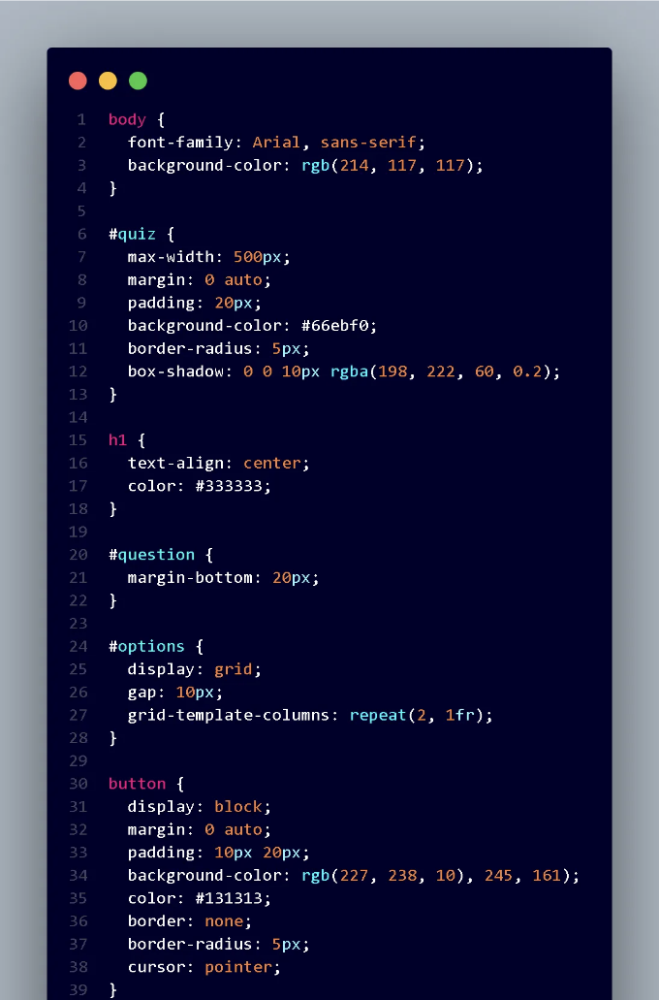
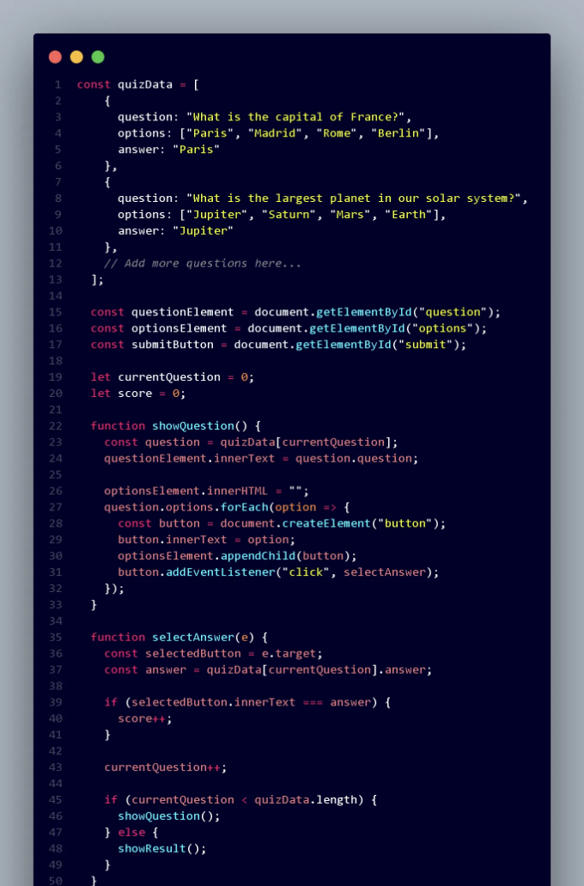
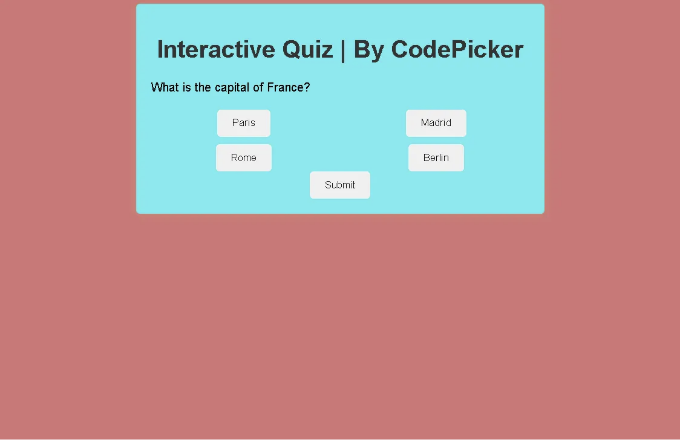

이 블로그 포스트에서는 HTML, CSS 및 JavaScript를 사용하여 대화형 퀴즈를 만드는 방법을 살펴보겠습니다. 퀴즈는 사용자들을 참여시키고 다양한 주제에 대한 지식을 테스트하는 훌륭한 방법입니다. 퀴즈의 구조화 과정, 사용자 인터페이스 디자인, 그리고 점수 부여 및 피드백을 위한 JavaScript 로직 구현에 대해 다룰 것입니다. 함께 흥미로운 퀴즈 경험을 만들어 보세요!

단계 1: HTML 구조 설정하기
질문, 선택지 및 제출 버튼을 포함한 기본 HTML 구조를 만듭니다.



단계 2: CSS로 퀴즈 스타일링하기
(예: 스타일.css) CSS 파일을 생성하여 퀴즈 요소를 원하는대로 스타일링합니다.

<!-- ui-log 수평형 -->
<ins class="adsbygoogle"
  style="display:block"
  data-ad-client="ca-pub-4877378276818686"
  data-ad-slot="9743150776"
  data-ad-format="auto"
  data-full-width-responsive="true"></ins>
<component is="script">
(adsbygoogle = window.adsbygoogle || []).push({});
</component>



단계 3: JavaScript를 사용하여 퀴즈 로직 추가하기
퀴즈 로직을 처리할 JavaScript 파일 (index.js)을 생성합니다.



단계 4: 퀴즈를 사용자 정의하기
자신의 질문, 옵션 및 정답으로 퀴즈 데이터 배열을 JavaScript 파일에서 업데이트하세요.

<!-- ui-log 수평형 -->
<ins class="adsbygoogle"
  style="display:block"
  data-ad-client="ca-pub-4877378276818686"
  data-ad-slot="9743150776"
  data-ad-format="auto"
  data-full-width-responsive="true"></ins>
<component is="script">
(adsbygoogle = window.adsbygoogle || []).push({});
</component>

style.css 파일에서 CSS 스타일을 수정하여 원하는 디자인에 맞게 변경할 수도 있어요.

여기까지입니다! HTML, CSS 및 JavaScript를 사용하여 대화형 퀴즈를 만들었어요. 타이머, 객관식 선택 또는 진행 막대와 같은 기능을 추가하여 퀴즈를 더 향상시킬 수도 있어요.

# OUTPUT



<!-- ui-log 수평형 -->
<ins class="adsbygoogle"
  style="display:block"
  data-ad-client="ca-pub-4877378276818686"
  data-ad-slot="9743150776"
  data-ad-format="auto"
  data-full-width-responsive="true"></ins>
<component is="script">
(adsbygoogle = window.adsbygoogle || []).push({});
</component>

```js
<!DOCTYPE html>
<html>
<head>
  <title>인터랙티브 퀴즈</title>
  <link rel="stylesheet" type="text/css" href="style.css">
</head>
<body>
  <div id="quiz">
    <h1>인터랙티브 퀴즈 | 코드피커 제작</h1>
    <div id="question"></div>
    <div id="options"></div>
    <button id="submit">제출</button>
  </div>

  <script src="index.js"></script>
</body>
</html>
```

```js
body {
  font-family: Arial, sans-serif;
  background-color: rgb(214, 117, 117);
}

#quiz {
  max-width: 500px;
  margin: 0 auto;
  padding: 20px;
  background-color: #66ebf0;
  border-radius: 5px;
  box-shadow: 0 0 10px rgba(198, 222, 60, 0.2);
}

h1 {
  text-align: center;
  color: #333333;
}

#question {
  margin-bottom: 20px;
}

#options {
  display: grid;
  gap: 10px;
  grid-template-columns: repeat(2, 1fr);
}

button {
  display: block;
  margin: 0 auto;
  padding: 10px 20px;
  background-color: rgb(227, 238, 10);
  color: #131313;
  border: none;
  border-radius: 5px;
  cursor: pointer;
}

button:hover {
  background-color: #8f8d8d;
}
```

```js
const quizData = [
    {
      question: "프랑스의 수도는 무엇입니까?",
      options: ["파리", "마드리드", "로마", "베를린"],
      answer: "파리"
    },
    {
      question: "태양계에서 가장 큰 행성은 무엇인가요?",
      options: ["목성", "토성", "화성", "지구"],
      answer: "목성"
    },
    // 더 많은 질문 추가...
  ];
  
  const questionElement = document.getElementById("question");
  const optionsElement = document.getElementById("options");
  const submitButton = document.getElementById("submit");
  
  let currentQuestion = 0;
  let score = 0;
  
  function showQuestion() {
    const question = quizData[currentQuestion];
    questionElement.innerText = question.question;
  
    optionsElement.innerHTML = "";
    question.options.forEach(option => {
      const button = document.createElement("button");
      button.innerText = option;
      optionsElement.appendChild(button);
      button.addEventListener("click", selectAnswer);
    });
  }
  
  function selectAnswer(e) {
    const selectedButton = e.target;
    const answer = quizData[currentQuestion].answer;
  
    if (selectedButton.innerText === answer) {
      score++;
    }
  
    currentQuestion++;
  
    if (currentQuestion < quizData.length) {
      showQuestion();
    } else {
      showResult();
    }
  }
  
  function showResult() {
    quiz.innerHTML = `
      <h1>퀴즈 완료!</h1>
      <p>당신의 점수: ${score}/${quizData.length}</p>
    `;
  }
  
  showQuestion();
```

HTML, CSS, JavaScript를 이용하여 인터랙티브 퀴즈를 만드는 방법에 대한 가이드를 읽어주셔서 감사합니다! 여러분이 자신만의 매력적인 퀴즈를 만드는 데 도움이 되었으면 좋겠어요. 추가 질문이 있으시면 자유롭게 [댓글]로 물어보세요.```

<!-- ui-log 수평형 -->
<ins class="adsbygoogle"
  style="display:block"
  data-ad-client="ca-pub-4877378276818686"
  data-ad-slot="9743150776"
  data-ad-format="auto"
  data-full-width-responsive="true"></ins>
<component is="script">
(adsbygoogle = window.adsbygoogle || []).push({});
</component>

행복한 코딩하세요!