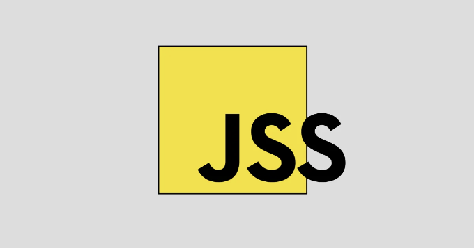

본 문서에서는 emotion이라는 (css-in-js) 라이브러리를 살펴보고 왜 이것이 프로젝트에 도움이 되는지 알아보겠습니다.

# 소개

사용자 경험과 브랜드 아이덴티티를 개선하는 데 스타일링은 리액트 앱에서 중요합니다. CSS-in-JS 라이브러리는 자바스크립트의 강력함과 CSS의 우아함을 결합한 현대적인 해결책으로 등장했습니다. 이들은 클래스 충돌과 전역 스타일과 같은 도전 과제를 해결합니다. 본 문서는 주요 CSS-in-JS 라이브러리를 비교하여 리액트 프로젝트에서 효과적이고 유지보수 가능한 스타일링을 위한 지식 있는 선택을 도와줍니다.

<!-- ui-log 수평형 -->
<ins class="adsbygoogle"
  style="display:block"
  data-ad-client="ca-pub-4877378276818686"
  data-ad-slot="9743150776"
  data-ad-format="auto"
  data-full-width-responsive="true"></ins>
<component is="script">
(adsbygoogle = window.adsbygoogle || []).push({});
</component>

# 콘텐츠 테이블

- CSS-in-JS 이해하기:
  
  - 정의 및 개념
  - 전통적인 스타일링에 비한 장점

- React 컴포넌트 스타일링에서의 일반적인 도전과제:

<!-- ui-log 수평형 -->
<ins class="adsbygoogle"
  style="display:block"
  data-ad-client="ca-pub-4877378276818686"
  data-ad-slot="9743150776"
  data-ad-format="auto"
  data-full-width-responsive="true"></ins>
<component is="script">
(adsbygoogle = window.adsbygoogle || []).push({});
</component>

- 전통적인 CSS의 문제점
- 리액트에서 Scoped 스타일링이 필요한 이유

3. CSS-in-JS 라이브러리 소개:

- 인기 상승
- 주요 라이브러리 간단 소개

4. 주요 CSS-in-JS 라이브러리 심층 분석:

<!-- ui-log 수평형 -->
<ins class="adsbygoogle"
  style="display:block"
  data-ad-client="ca-pub-4877378276818686"
  data-ad-slot="9743150776"
  data-ad-format="auto"
  data-full-width-responsive="true"></ins>
<component is="script">
(adsbygoogle = window.adsbygoogle || []).push({});
</component>

styled-components:

- 핵심 개념
- 예제와 사용 사례
- 장단점

Emotion:

- 핵심 개념
- 예제와 사용 사례
- 장단점

<!-- ui-log 수평형 -->
<ins class="adsbygoogle"
  style="display:block"
  data-ad-client="ca-pub-4877378276818686"
  data-ad-slot="9743150776"
  data-ad-format="auto"
  data-full-width-responsive="true"></ins>
<component is="script">
(adsbygoogle = window.adsbygoogle || []).push({});
</component>

JSS (CSS in JS):

- 핵심 개념
- 예제 및 사용 사례
- 장단점

5. 비교 기준:

- 성능
- 구문 및 API
- 테마 및 변형
- 제3자 호환성
- 개발자 경험

<!-- ui-log 수평형 -->
<ins class="adsbygoogle"
  style="display:block"
  data-ad-client="ca-pub-4877378276818686"
  data-ad-slot="9743150776"
  data-ad-format="auto"
  data-full-width-responsive="true"></ins>
<component is="script">
(adsbygoogle = window.adsbygoogle || []).push({});
</component>

6. 성능 벤치마킹:

- 결과 및 지표
- 시각화된 데이터

7. 구문 및 API 비교:

- styled-components vs. Emotion vs. JSS

<!-- ui-log 수평형 -->
<ins class="adsbygoogle"
  style="display:block"
  data-ad-client="ca-pub-4877378276818686"
  data-ad-slot="9743150776"
  data-ad-format="auto"
  data-full-width-responsive="true"></ins>
<component is="script">
(adsbygoogle = window.adsbygoogle || []).push({});
</component>

8. 사용 사례 및 모범 사례:

- 다양한 프로젝트에 대한 라이브러리 적합성

9. 결론:

- 주요 발견 요약

<!-- ui-log 수평형 -->
<ins class="adsbygoogle"
  style="display:block"
  data-ad-client="ca-pub-4877378276818686"
  data-ad-slot="9743150776"
  data-ad-format="auto"
  data-full-width-responsive="true"></ins>
<component is="script">
(adsbygoogle = window.adsbygoogle || []).push({});
</component>

10. 참고 자료

## 1. CSS-in-JS 이해하기:

CSS-in-JS는 JavaScript와 CSS를 결합하여 React 애플리케이션의 스타일을 관리하는 혁신적인 접근 방식입니다. 전통적인 CSS와는 달리 스타일을 별도의 파일에 정의하거나 HTML 태그 내에 정의하는 것이 아니라 JavaScript를 사용하여 개발자가 컴포넌트 내에서 스타일을 캡슐화할 수 있도록 합니다. 이 패러다임 변화는 React 애플리케이션에서 스타일링의 유지 보수성, 모듈화 및 성능을 향상시키는 여러 가지 이점을 가져옵니다.

### 전통적인 CSS와의 차이점:

<!-- ui-log 수평형 -->
<ins class="adsbygoogle"
  style="display:block"
  data-ad-client="ca-pub-4877378276818686"
  data-ad-slot="9743150776"
  data-ad-format="auto"
  data-full-width-responsive="true"></ins>
<component is="script">
(adsbygoogle = window.adsbygoogle || []).push({});
</component>

전통적인 CSS에서는 스타일을 일반적으로 별도의 파일이나 스타일 태그로 정의합니다. 이는 전역 범위 문제, 클래스 이름 충돌 및 스타일 추적의 어려움을 초래할 수 있습니다. CSS-in-JS 라이브러리는 스타일을 특정 컴포넌트에 한정할 수 있도록 해서 이러한 문제를 해결합니다. 이는 한 컴포넌트에서 정의된 스타일이 다른 곳의 스타일과 충돌하지 않도록 합니다.

## CSS-in-JS 사용의 장점:

- 한정된 스타일: CSS-in-JS를 사용하면 스타일이 해당 컴포넌트에 자연스럽게 한정되어 충돌을 줄이고 스타일에 대한 이해를 쉽게 할 수 있습니다.
- 동적 스타일링: JavaScript를 사용하여 props 또는 상태에 따라 동적 스타일을 만들 수 있습니다. 이를 통해 적응형 및 인터랙티브한 UI 컴포넌트를 만들 수 있습니다.
- 컴포넌트 기반 접근: 스타일이 컴포넌트와 밀접하게 결합되어 더 모듈화되고 컴포넌트 중심적인 개발 접근을 장려합니다.
- 클래스 이름 충돌 제거: 클래스 이름이 동적으로 생성되므로 클래스 이름 충돌 위험이 최소화됩니다.

## 예시 코드 스니펫:

<!-- ui-log 수평형 -->
<ins class="adsbygoogle"
  style="display:block"
  data-ad-client="ca-pub-4877378276818686"
  data-ad-slot="9743150776"
  data-ad-format="auto"
  data-full-width-responsive="true"></ins>
<component is="script">
(adsbygoogle = window.adsbygoogle || []).push({});
</component>

전통적인 CSS:

```js
/* styles.css */
.button {
  background-color: blue;
  color: white;
  padding: 10px 20px;
}
```

전통적인 CSS를 사용한 리액트 컴포넌트:

```js
import React from 'react';
import './styles.css';

const Button = () => {
  return <button className="button">Click me</button>;
};

export default Button;
```

<!-- ui-log 수평형 -->
<ins class="adsbygoogle"
  style="display:block"
  data-ad-client="ca-pub-4877378276818686"
  data-ad-slot="9743150776"
  data-ad-format="auto"
  data-full-width-responsive="true"></ins>
<component is="script">
(adsbygoogle = window.adsbygoogle || []).push({});
</component>

CSS-in-JS:

```js
import React from 'react';
import { css } from '@emotion/react';

const Button = () => {
  const buttonStyle = css`
    background-color: blue;
    color: white;
    padding: 10px 20px;
  `;

  return <button css={buttonStyle}>Click me</button>;
};

export default Button;
```

위 예시에서 Emotion 라이브러리를 사용한 CSS-in-JS 접근 방식을 보여줍니다. 이를 통해 JavaScript의 템플릿 리터럴을 사용하여 스타일을 직접 구성할 수 있습니다. 이는 캡슐화를 보장하며 잠재적인 클래스 이름 충돌을 방지합니다.

# 2. React 컴포넌트 스타일링 시 일반적으로 마주치는 도전과제

<!-- ui-log 수평형 -->
<ins class="adsbygoogle"
  style="display:block"
  data-ad-client="ca-pub-4877378276818686"
  data-ad-slot="9743150776"
  data-ad-format="auto"
  data-full-width-responsive="true"></ins>
<component is="script">
(adsbygoogle = window.adsbygoogle || []).push({});
</component>

리액트 컴포넌트에 전통적인 CSS 및 CSS 전처리기를 사용하여 스타일을 지정하는 것은 유지 관리성, 협업 및 전반적인 사용자 경험에 영향을 미칠 수 있는 다양한 도전 과제를 도입할 수 있습니다. 이러한 도전 과제는 응용 프로그램이 복잡해질수록 더욱 두드러집니다.

전통적인 CSS 및 CSS 전처리기와 관련된 도전 과제:

- 전역 범위 문제: 전통적인 CSS는 종종 전역 선택기에 의존하여, 응용 프로그램의 다른 부분에서 스타일을 실수로 재정의하기 쉽게 만들어 예기치 않은 동작을 유발할 수 있습니다.
- 클래스 이름 충돌: 프로젝트가 확장됨에 따라 클래스 이름 충돌 가능성이 증가하여, 추적하기 어려운 버그와 충돌하는 스타일이 발생할 수 있습니다.
- 제한된 모듈성: 전통적인 CSS는 내장 모듈성이 부족하여, 컴포넌트 간에 스타일을 격리하고 재사용하기 어렵게 만듭니다.
- 명시성 전쟁: CSS 명시도를 관리하는 것이 머리아플 수 있으며, 특정 요소를 대상으로하고 다른 요소에 영향을 미치지 않는 것이 특히 어려울 수 있습니다.
- 유지 보수성: 크고 중앙 집중형 CSS 파일은 여러 팀원이 동일한 코드베이스에서 작업할 때 특히 유지 관리하기 어려워질 수 있습니다.

스코프 및 컴포넌트 기반 스타일링의 필요성:

<!-- ui-log 수평형 -->
<ins class="adsbygoogle"
  style="display:block"
  data-ad-client="ca-pub-4877378276818686"
  data-ad-slot="9743150776"
  data-ad-format="auto"
  data-full-width-responsive="true"></ins>
<component is="script">
(adsbygoogle = window.adsbygoogle || []).push({});
</component>

React 애플리케이션은 모듈성과 컴포넌트 기반 아키텍처를 중심으로 발전합니다. 이 개념과 일치하도록 스타일링을 적용해야 합니다. 이것이 CSS-in-JS 라이브러리가 제공하는 범위 및 컴포넌트 기반 스타일링이 빛을 발하는 곳입니다:

- 범위 제한 스타일링: CSS-in-JS는 구성 요소 내에서 스타일을 캡슐화함으로써 전역 범위 문제를 완화하고 의도하지 않은 스타일 충돌을 방지합니다. 각 구성 요소의 스타일은 다른 것과 격리됩니다.
- 구성 요소 중심 접근: 구성 요소 기반 스타일링을 통해 개발자는 스타일을 구성 요소의 로직과 함께 정의하여 독립적이고 재사용 가능한 구성 요소를 촉진할 수 있습니다.
- 동적 스타일: 범위 제한 스타일링을 통해 구성 요소 프롭 및 상태에 기반한 동적 스타일을 쉽게 적용하여 복합 클래스 조작 없이 풍부한 상호 작용 경험을 가능하게 합니다.
- 간편한 협업: 범위가 제한된 스타일은 여러 개발자가 동시에 응용 프로그램의 서로 다른 부분에 작업할 때 충돌 가능성을 줄입니다.
- 효율성: 글로벌 CSS 파일을 검색하거나 복잡한 선택기로 노력하는 필요성 제거는 개발을 간소화하고 디버깅을 가속화합니다.

본질적으로 전통적인 CSS에서 발생하는 문제는 CSS-in-JS 라이브러리의 범위 및 구성 요소 기반이 효과적으로 처리됩니다. React의 핵심 원칙과 이 조화는 현대 애플리케이션에 대한 유지 가능하고 모듈화되며 관리하기 쉬운 스타일링 솔루션을 제공합니다.

<!-- ui-log 수평형 -->
<ins class="adsbygoogle"
  style="display:block"
  data-ad-client="ca-pub-4877378276818686"
  data-ad-slot="9743150776"
  data-ad-format="auto"
  data-full-width-responsive="true"></ins>
<component is="script">
(adsbygoogle = window.adsbygoogle || []).push({});
</component>

CSS-in-JS 라이브러리들은 React 생태계 내에서 혁신적인 스타일링 방법을 제공하여 상당한 인기를 얻고 있습니다. 이러한 라이브러리들은 JavaScript의 동적 기능을 활용하여 CSS의 정확성을 결합하여 컴포넌트를 스타일링하는 현대적이고 효율적인 방법을 제공합니다.

## 인기 상승:

최근 몇 년간 CSS-in-JS 라이브러리들은 React 개발자들 사이에서 채택이 급증하고 있습니다. 이러한 인기는 오랜 기간 해결되지 못한 스타일링 과제를 해결하고 협업을 강화하며 개발자들이 정교한 사용자 인터페이스를 만들 수 있도록 함으로써 이루어졌습니다.

## 주요 라이브러리 간단 소개:

<!-- ui-log 수평형 -->
<ins class="adsbygoogle"
  style="display:block"
  data-ad-client="ca-pub-4877378276818686"
  data-ad-slot="9743150776"
  data-ad-format="auto"
  data-full-width-responsive="true"></ins>
<component is="script">
(adsbygoogle = window.adsbygoogle || []).push({});
</component>

일부 주목할 만한 CSS-in-JS 라이브러리는 다음과 같습니다:

- styled-components: 이 라이브러리는 태그된 템플릿 리터럴을 사용하여 스타일을 구성합니다. 컴포넌트와 함께 스타일을 정의하도록 유도하며, 프롭에 따라 동적 스타일링을 지원합니다.
- Emotion: Emotion은 styled-components와 유사한 방식을 제공하지만 테마 지원 및 서버 측 렌더링 기능과 같은 고급 기능도 제공합니다.
- JSS (CSS in JS): JSS는 JavaScript를 우선적으로 채택하며, JavaScript 객체를 사용하여 스타일을 정의할 수 있게 해줍니다. 많은 맞춤 설정이 가능하며, 다른 라이브러리와도 잘 통합됩니다.

이 라이브러리들은 개발자들에게 다양한 선택지를 제공하며, 각각의 강점과 기능을 가지고 있습니다. CSS-in-JS 라이브러리의 급부상은 현대 React 애플리케이션에서 스타일링에 접근하는 방식에 근본적인 변화를 뜻합니다.

# 4. 주요 CSS-in-JS 라이브러리 심층 탐구

<!-- ui-log 수평형 -->
<ins class="adsbygoogle"
  style="display:block"
  data-ad-client="ca-pub-4877378276818686"
  data-ad-slot="9743150776"
  data-ad-format="auto"
  data-full-width-responsive="true"></ins>
<component is="script">
(adsbygoogle = window.adsbygoogle || []).push({});
</component>

## Styled-components:

핵심 개념: styled-components는 태그형 템플릿 리터럴을 사용하여 CSS-in-JS를 작성하는 아이디어를 중심으로 돌아갑니다. 이는 스타일을 구성 요소 자체로 취급하며 해당 구성 요소 내에 스타일을 캡슐화합니다.

예시 및 사용 사례:

```js
import styled from 'styled-components';

const Button = styled.button`
  background-color: blue;
  color: white;
  padding: 10px 20px;
`;

// 사용법
<Button>Click me</Button>
```

<!-- ui-log 수평형 -->
<ins class="adsbygoogle"
  style="display:block"
  data-ad-client="ca-pub-4877378276818686"
  data-ad-slot="9743150776"
  data-ad-format="auto"
  data-full-width-responsive="true"></ins>
<component is="script">
(adsbygoogle = window.adsbygoogle || []).push({});
</component>

스타일드 컴포넌트는 버튼, 카드, 폼 요소와 같은 재사용 가능하고 동적인 컴포넌트를 만드는 데 능숙합니다.

장점:
- 스코프된 스타일 및 전역 스코프 문제 없음
- 프롭스 및 테마에 기반한 동적 스타일링
- 반응형 디자인을 위한 CSS 프롭스

단점:

<!-- ui-log 수평형 -->
<ins class="adsbygoogle"
  style="display:block"
  data-ad-client="ca-pub-4877378276818686"
  data-ad-slot="9743150776"
  data-ad-format="auto"
  data-full-width-responsive="true"></ins>
<component is="script">
(adsbygoogle = window.adsbygoogle || []).push({});
</component>

- CSS-in-JS에 새로운 개발자들을 위한 학습 곡선
- 스타일 생성을 위한 런타임 비용 추가

## Emotion:

핵심 개념: Emotion은 styled-components와 유사하게 작동하며, 태그된 템플릿 리터럴을 사용하여 구성 요소 수준의 스타일을 강조합니다. 고급 테마 기능을 제공하며 서버 측 렌더링을 지원합니다.

예시 및 사용 사례:

<!-- ui-log 수평형 -->
<ins class="adsbygoogle"
  style="display:block"
  data-ad-client="ca-pub-4877378276818686"
  data-ad-slot="9743150776"
  data-ad-format="auto"
  data-full-width-responsive="true"></ins>
<component is="script">
(adsbygoogle = window.adsbygoogle || []).push({});
</component>

```js
import { css } from '@emotion/react';

const buttonStyle = css`
  background-color: blue;
  color: white;
  padding: 10px 20px;
`;

// Usage
<button css={buttonStyle}>Click me</button>
```

Emotion은 복잡한 테마와 서버 측 렌더링이 필요한 애플리케이션에 좋습니다.

장점:

- 테마 및 전역 스타일을 쉽게 관리할 수 있음
- 강력한 서버 측 렌더링 지원
- 대규모 및 테마 다양한 프로젝트에 적합함

<!-- ui-log 수평형 -->
<ins class="adsbygoogle"
  style="display:block"
  data-ad-client="ca-pub-4877378276818686"
  data-ad-slot="9743150776"
  data-ad-format="auto"
  data-full-width-responsive="true"></ins>
<component is="script">
(adsbygoogle = window.adsbygoogle || []).push({});
</component>

단점:

- 작은 프로젝트에는 압도적일 수 있습니다.
- CSS 속성 사용이 직관적이지 않을 수 있습니다.

## JSS (CSS in JS):

중요 개념: JSS는 JavaScript 중심적인 접근 방식을 따르며, JavaScript 객체를 사용하여 스타일을 정의할 수 있습니다. 실행 시에 스타일을 생성하여 매우 사용자 정의할 수 있습니다.

<!-- ui-log 수평형 -->
<ins class="adsbygoogle"
  style="display:block"
  data-ad-client="ca-pub-4877378276818686"
  data-ad-slot="9743150776"
  data-ad-format="auto"
  data-full-width-responsive="true"></ins>
<component is="script">
(adsbygoogle = window.adsbygoogle || []).push({});
</component>

예와 사용 사례:

```js
import { createUseStyles } from 'react-jss';

const useStyles = createUseStyles({
  button: {
    backgroundColor: 'blue',
    color: 'white',
    padding: '10px 20px',
  },
});

// 사용 방법
const classes = useStyles();
<button className={classes.button}>Click me</button>
```

JSS는 프로그래밍적이고 동적 스타일링이 필요한 프로젝트에 적합합니다.

장점:

<!-- ui-log 수평형 -->
<ins class="adsbygoogle"
  style="display:block"
  data-ad-client="ca-pub-4877378276818686"
  data-ad-slot="9743150776"
  data-ad-format="auto"
  data-full-width-responsive="true"></ins>
<component is="script">
(adsbygoogle = window.adsbygoogle || []).push({});
</component>

- JavaScript-first 접근 방식은 동적 및 조건부 스타일링을 가능하게 합니다.
- 매우 사용자 정의 및 재사용 가능한 스타일
- 애니메이션과 같은 고급 스타일링 요구를 지원합니다.

단점:

- 서버 측 렌더링을 위한 구성이 필요할 수 있습니다.
- 초기 설정 및 학습 곡선

# 5. 비교 기준

<!-- ui-log 수평형 -->
<ins class="adsbygoogle"
  style="display:block"
  data-ad-client="ca-pub-4877378276818686"
  data-ad-slot="9743150776"
  data-ad-format="auto"
  data-full-width-responsive="true"></ins>
<component is="script">
(adsbygoogle = window.adsbygoogle || []).push({});
</component>

성능: CSS-in-JS 라이브러리는 애플리케이션 성능에 다양한 영향을 줄 수 있습니다. 일부 라이브러리는 런타임 오버헤드를 최소화하는 최적화 기능을 제공합니다.

예시:

```js
// styled-components
const Button = styled.button`
  background-color: ${props => props.primary ? 'blue' : 'white'};
  color: ${props => props.primary ? 'white' : 'black'};
  padding: 10px 20px;
`;

// Emotion
const buttonStyle = css`
  background-color: ${props => props.primary ? 'blue' : 'white'};
  color: ${props => props.primary ? 'white' : 'black'};
  padding: 10px 20px;
`;
```

구문과 API: 서로 다른 라이브러리는 스타일을 정의하는 데 다양한 구문과 API를 가지고 있습니다. 일부 라이브러리는 간단한 템플릿 리터럴을 제공하고, 다른 라이브러리는 JavaScript 객체를 제공합니다.

<!-- ui-log 수평형 -->
<ins class="adsbygoogle"
  style="display:block"
  data-ad-client="ca-pub-4877378276818686"
  data-ad-slot="9743150776"
  data-ad-format="auto"
  data-full-width-responsive="true"></ins>
<component is="script">
(adsbygoogle = window.adsbygoogle || []).push({});
</component>

예시:

```js
// styled-components
const Button = styled.button`
  background-color: blue;
  color: white;
  padding: 10px 20px;
`;

// JSS
const useStyles = createUseStyles({
  button: {
    backgroundColor: 'blue',
    color: 'white',
    padding: '10px 20px',
  },
});
```

테마 및 변형: 컴포넌트 간 일관된 디자인을 위해 테마 및 변형 지원이 중요합니다. 라이브러리는 테마 및 변형을 관리하는 다양한 메커니즘을 제공합니다.

예시:

<!-- ui-log 수평형 -->
<ins class="adsbygoogle"
  style="display:block"
  data-ad-client="ca-pub-4877378276818686"
  data-ad-slot="9743150776"
  data-ad-format="auto"
  data-full-width-responsive="true"></ins>
<component is="script">
(adsbygoogle = window.adsbygoogle || []).push({});
</component>

```js
// styled-components
const Button = styled.button`
  background-color: ${props => props.theme.primaryColor};
  color: ${props => props.theme.textColor};
  padding: 10px 20px;
`;

// Emotion
const buttonStyle = props => css`
  background-color: ${props.theme.primaryColor};
  color: ${props.theme.textColor};
  padding: 10px 20px;
`;
```

외부 호환성: 외부 도구 및 컴포넌트와의 통합은 다를 수 있습니다. 일부 라이브러리는 특정 외부 라이브러리와 더 원활하게 호환성을 제공할 수 있습니다.

예시:

```js
// Material-UI와 함께 styled-components
import { Button as MUIButton } from '@mui/material';
const StyledButton = styled(MUIButton)`
  background-color: blue;
  color: white;
  padding: 10px 20px;
`;
```

<!-- ui-log 수평형 -->
<ins class="adsbygoogle"
  style="display:block"
  data-ad-client="ca-pub-4877378276818686"
  data-ad-slot="9743150776"
  data-ad-format="auto"
  data-full-width-responsive="true"></ins>
<component is="script">
(adsbygoogle = window.adsbygoogle || []).push({});
</component>

개발자 경험: 라이브러리 간 문서, 커뮤니티 지원 및 도구 사용법을 포함한 총 개발 경험이 다릅니다.

예시:

```js
// styled-components 문서
const StyledButton = styled.button`
  background-color: blue;
  color: white;
  padding: 10px 20px;
`;

// Emotion 문서
const buttonStyle = css`
  background-color: blue;
  color: white;
  padding: 10px 20px;
`;
```

요약하면, 이러한 기준에 따라 CSS-in-JS 라이브러리를 비교하여 개발자가 프로젝트 요구사항과 개발 선호도에 가장 잘 부합하는 라이브러리를 선택할 수 있습니다.

<!-- ui-log 수평형 -->
<ins class="adsbygoogle"
  style="display:block"
  data-ad-client="ca-pub-4877378276818686"
  data-ad-slot="9743150776"
  data-ad-format="auto"
  data-full-width-responsive="true"></ins>
<component is="script">
(adsbygoogle = window.adsbygoogle || []).push({});
</component>

# 6. 성능 벤치마킹

결과 및 측정 지표: CSS-in-JS 라이브러리 선택 시 성능은 중요한 고려 사항입니다. 벤치마킹은 로드 시간, 렌더링 속도 및 메모리 사용량과 같은 요소를 측정할 수 있습니다.

예시:

```js
// 로드 시간 측정
const startLoad = performance.now();
// CSS-in-JS 라이브러리를 사용하여 컴포넌트 로드
const endLoad = performance.now();
const loadTime = endLoad - startLoad;

// 렌더링 속도 측정
const startRender = performance.now();
// 컴포넌트 렌더링
const endRender = performance.now();
const renderTime = endRender - startRender;

// 메모리 사용량 측정
// 컴포넌트 렌더링 중에 메모리 사용량 모니터링
const memoryUsage = performance.memory.usedJSHeapSize;
```

<!-- ui-log 수평형 -->
<ins class="adsbygoogle"
  style="display:block"
  data-ad-client="ca-pub-4877378276818686"
  data-ad-slot="9743150776"
  data-ad-format="auto"
  data-full-width-responsive="true"></ins>
<component is="script">
(adsbygoogle = window.adsbygoogle || []).push({});
</component>

시각화된 데이터: 벤치마크 결과는 차트나 그래프를 사용하여 시각화할 수 있으며, 라이브러리 간의 명확한 비교에 도움이 됩니다.

예시:

```js
// 시각화를 위한 샘플 데이터
const libraryNames = ['styled-components', 'Emotion', 'JSS'];
const loadTimes = [120, 150, 100]; // 밀리초 단위
const renderTimes = [10, 12, 8]; // 밀리초 단위

// 차트 라이브러리 (예: Chart.js) 사용
// 로드 시간을 비교하는 막대 차트 렌더링
// 렌더 시간을 비교하는 선 차트 렌더링
```

성능 벤치마킹을 통합하면 CSS-in-JS 라이브러리가 React 애플리케이션의 전체 성능에 영향을 미치는 방식을 평가하여, 개발자가 정보에 기반하여 결정을 내리는 데 도움이 됩니다.

<!-- ui-log 수평형 -->
<ins class="adsbygoogle"
  style="display:block"
  data-ad-client="ca-pub-4877378276818686"
  data-ad-slot="9743150776"
  data-ad-format="auto"
  data-full-width-responsive="true"></ins>
<component is="script">
(adsbygoogle = window.adsbygoogle || []).push({});
</component>

# 7. 구문 및 API 비교

styled-components: styled-components는 태그 템플릿 리터럴을 사용하여 스타일을 구성요소와 함께 정의합니다. JavaScript 내에서 CSS와 유사한 구문을 권장하여 props를 사용하여 동적인 스타일을 활성화할 수 있습니다.

예시:

```js
const Button = styled.button`
  background-color: ${props => props.primary ? 'blue' : 'white'};
  color: ${props => props.primary ? 'white' : 'black'};
  padding: 10px 20px;
`;
```  

<!-- ui-log 수평형 -->
<ins class="adsbygoogle"
  style="display:block"
  data-ad-client="ca-pub-4877378276818686"
  data-ad-slot="9743150776"
  data-ad-format="auto"
  data-full-width-responsive="true"></ins>
<component is="script">
(adsbygoogle = window.adsbygoogle || []).push({});
</component>

감정: Emotion은 styled-components와 비슷한 방식을 사용하여 스타일을 지정하기 위해 태그드 템플릿 리터럴을 활용합니다. 고급 테마 설정 및 맞춤 기능을 제공합니다.

예시:

```js
const buttonStyle = css`
  background-color: ${props => props.primary ? 'blue' : 'white'};
  color: ${props => props.primary ? 'white' : 'black'};
  padding: 10px 20px;
`;
```

JSS: JSS는 자바스크립트 주도적인 접근 방식을 취해 스타일을 JavaScript 객체를 이용하여 정의할 수 있습니다. 스타일링에 대한 세밀한 제어를 제공하여 복잡한 애플리케이션에 적합합니다.

<!-- ui-log 수평형 -->
<ins class="adsbygoogle"
  style="display:block"
  data-ad-client="ca-pub-4877378276818686"
  data-ad-slot="9743150776"
  data-ad-format="auto"
  data-full-width-responsive="true"></ins>
<component is="script">
(adsbygoogle = window.adsbygoogle || []).push({});
</component>

예시:

```js
const useStyles = createUseStyles({
  button: {
    backgroundColor: 'blue',
    color: 'white',
    padding: '10px 20px',
  },
});
```

요약하면, styled-components, Emotion 및 JSS는 React 컴포넌트 내에서 스타일을 정의하기 위한 고유한 구문과 API를 제공합니다. 개발자들은 JavaScript에 대한 익숙함, 동적 스타일링을 선호하는지 여부, 그리고 필요한 맞춤화 수준에 따라 선택할 수 있습니다.

# 8. 사용 사례 및 모범 사례:

<!-- ui-log 수평형 -->
<ins class="adsbygoogle"
  style="display:block"
  data-ad-client="ca-pub-4877378276818686"
  data-ad-slot="9743150776"
  data-ad-format="auto"
  data-full-width-responsive="true"></ins>
<component is="script">
(adsbygoogle = window.adsbygoogle || []).push({});
</component>

다양한 프로젝트에 대한 라이브러리 적합성: 올바른 CSS-in-JS 라이브러리를 선택하는 것은 프로젝트의 구체적인 요구 사항에 달려 있습니다. 다양한 유형의 프로젝트에 대한 라이브러리 적합성에 대한 간략한 개요는 다음과 같습니다:

styled-components:

- 코드 가독성과 유지보수에 중점을 둔 프로젝트에 적합합니다.
- 이미 CSS-in-JS 또는 styled-components에 익숙한 팀에 이상적입니다.
- 테마 적용 및 동적 스타일링이 중간 정도인 프로젝트에 권장됩니다.

Emotion:

<!-- ui-log 수평형 -->
<ins class="adsbygoogle"
  style="display:block"
  data-ad-client="ca-pub-4877378276818686"
  data-ad-slot="9743150776"
  data-ad-format="auto"
  data-full-width-responsive="true"></ins>
<component is="script">
(adsbygoogle = window.adsbygoogle || []).push({});
</component>

- 고급 테마 및 서버 측 렌더링이 필요한 애플리케이션에 적합합니다.
- 스타일링 및 테마에 대한 세밀한 제어가 필요한 프로젝트에 적합합니다.
- 동적 스타일이 필수이고 복잡한 컴포넌트 변형이 필요한 경우 추천합니다.

JSS:

- JavaScript 기반 스타일링을 선호하는 프로젝트에 적합합니다.
- 매우 맞춤화되고 프로그래밍방식의 스타일링이 필요한 애플리케이션에 이상적입니다.
- 정교한 애니메이션을 구현하거나 생성된 클래스 이름을 엄격하게 제어해야 할 때 추천됩니다.

실제로 선택은 팀이 라이브러리에 익숙한 정도, 애플리케이션의 복잡성 및 원하는 테마 및 동적 스타일 수준과 같은 요소에 달려 있습니다. 각 라이브러리의 문서를 탐색하고 결정하기 전에 작은 예제 프로젝트를 실험하는 것이 가치가 있습니다.

<!-- ui-log 수평형 -->
<ins class="adsbygoogle"
  style="display:block"
  data-ad-client="ca-pub-4877378276818686"
  data-ad-slot="9743150776"
  data-ad-format="auto"
  data-full-width-responsive="true"></ins>
<component is="script">
(adsbygoogle = window.adsbygoogle || []).push({});
</component>

이 권장 사항들은 시작점을 제공하지만, 프로젝트의 특정 요구 사항과 팀의 선호도는 가장 적합한 CSS-in-JS 라이브러리를 결정하는 데 중요한 역할을 합니다.

# 9. 결론

12. 결론:

요약하자면, CSS-in-JS 라이브러리의 세계는 React 컴포넌트에 스타일을 적용하는 혁신적인 접근 방식을 제시합니다. 우리는 이러한 라이브러리가 전통적인 CSS의 문제를 해결하는 방법을 살펴보았고, scoped 및 컴포넌트 기반 스타일링을 소개했습니다. styled-components, Emotion, JSS와 같은 주요 라이브러리를 자세히 살펴보면, 각각의 독특한 구문, 사용 사례 및 장점을 확인할 수 있습니다.

<!-- ui-log 수평형 -->
<ins class="adsbygoogle"
  style="display:block"
  data-ad-client="ca-pub-4877378276818686"
  data-ad-slot="9743150776"
  data-ad-format="auto"
  data-full-width-responsive="true"></ins>
<component is="script">
(adsbygoogle = window.adsbygoogle || []).push({});
</component>

이러한 라이브러리를 성능, 구문, 테마, 호환성 및 개발자 경험을 기반으로 비교해보면, 각 라이브러리마다 강점과 고려해야 할 사항이 있다는 것을 알 수 있었습니다. Styled-components는 캡슐화에서 뛰어나며, Emotion은 테마에서 빛을 발하고, JSS는 JavaScript 중심의 사용자 정의를 제공합니다.

최종적으로, 적합한 CSS-in-JS 라이브러리를 선택하는 것은 프로젝트의 요구 사항에 달려 있습니다. 각 라이브러리의 기능과 응용 분야를 더 잘 파악함으로써, 개발 철학과 프로젝트 요구 사항과 일치하는 판단력을 갖추어 더 나은 결정을 내릴 수 있습니다.

사용자 인터페이스를 만들거나 팀 간 협업을 향상하거나 전체 응용 프로그램 성능을 향상시키는 등, CSS-in-JS 라이브러리는 React 스타일링을 업그레이드할 현대적인 솔루션을 제공합니다.

# 10. 참고문헌

<!-- ui-log 수평형 -->
<ins class="adsbygoogle"
  style="display:block"
  data-ad-client="ca-pub-4877378276818686"
  data-ad-slot="9743150776"
  data-ad-format="auto"
  data-full-width-responsive="true"></ins>
<component is="script">
(adsbygoogle = window.adsbygoogle || []).push({});
</component>

- Styled-Components 문서.
- Emotion 문서.
- JSS 문서.
- React 커뮤니티 포럼. (2022). 스레드: CSS-in-JS 라이브러리 선택하는 방법.
- 웹 개발 주간 팟캐스트. (2021). 에피소드 42: React용 CSS-in-JS 라이브러리 탐색.

이 글이 도움이 되셨나요? 좋아요나 댓글을 남겨주세요.
고맙습니다 🙏