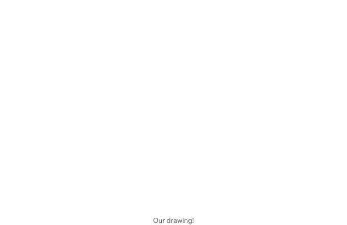

이 기사에서는 HTML과 CSS를 사용하여 산타 클로스의 반응형 만화를 만드는 방법을 살펴보겠습니다. 아래와 같이요:

우리는 한 단계씩 진행하면서 각 모양과 각 결정에 대해 설명할 것입니다 (또는 대부분의 모양에 대해). 결국, 이미지는 다른 모양의 요소들의 조합에 불과합니다. (CSS에서 모양에 대해 더 알아보기)

시작해 볼까요…

## 캔버스 설정

<!-- ui-log 수평형 -->
<ins class="adsbygoogle"
  style="display:block"
  data-ad-client="ca-pub-4877378276818686"
  data-ad-slot="9743150776"
  data-ad-format="auto"
  data-full-width-responsive="true"></ins>
<component is="script">
(adsbygoogle = window.adsbygoogle || []).push({});
</component>

캔버스라고 하면 `canvas` 요소가 아닌, 그림을 그릴 캔버스를 의미합니다. 이는 설정된 후 요소들의 참조로 사용할 수 있어서 유용합니다.

캔버스와 콘텐츠에 상대적인 단위를 사용하면 실제로 CSS로 응답 형식 이미지를 만들 수 있습니다. 이 그림에서 사용하는 대부분의 단위가 % 또는 vmin인 이유입니다.

그림 도우미로 배치되는 요소에 유용한 배경 그리드를 만들기 위해 반복 선형 그라데이션을 추가할 수 있습니다:

```js
<div class="canvas">
</div>
```

<!-- ui-log 수평형 -->
<ins class="adsbygoogle"
  style="display:block"
  data-ad-client="ca-pub-4877378276818686"
  data-ad-slot="9743150776"
  data-ad-format="auto"
  data-full-width-responsive="true"></ins>
<component is="script">
(adsbygoogle = window.adsbygoogle || []).push({});
</component>

```js
.canvas {
  width: 80vmin;
  height: 80vmin;
  position: absolute;
  top: 50%;
  left: 50%;
  transform: translate(-50%, -50%);
  border: 1px solid #ddd;
  background-image: 
    repeating-linear-gradient(transparent 0 9.85%, #ddd 0 10%),
    repeating-linear-gradient(to right, transparent 0 9.85%, #ddd 0 10%);
}
```


색상을 위해 CSS 변수를 사용할 것입니다. 일관된 색상을 유지하고 변경을 용이하게 할 것입니다.

# 머리 그리기

<!-- ui-log 수평형 -->
<ins class="adsbygoogle"
  style="display:block"
  data-ad-client="ca-pub-4877378276818686"
  data-ad-slot="9743150776"
  data-ad-format="auto"
  data-full-width-responsive="true"></ins>
<component is="script">
(adsbygoogle = window.adsbygoogle || []).push({});
</component>

머리에는 여러 개의 원과 타원이 있을 거에요: 얼굴을 나타내는 큰 원, 눈을 나타내는 작은 원, 볼을 나타내는 타원이요.

물체를 둥글게 만들거나 타원 모양으로 만들려면, border-radius를 사용할 때 값으로 50% 이상을 주면돼요.

이 기사의 초안에서는 눈과 볼을 얼굴 바깥에 놓았다가 그 크기와 위치를 캔버스에 상대적으로 조정했었는데, 이는 얼굴 요소의 위치나 크기를 바꾸고 싶을 때 약간 까다로웠어요. 이번 버전에서는 눈과 볼을 얼굴 안쪽에 놓을 거예요, 그러면 조작이 더 간단하겠죠.

얼굴에는 원을 만들고, 한 눈에는 다른 원을 만들고, 한 볼에는 타원을 만드세요. 그리고 초안에서는 box-shadow를 사용하여 두 번째 눈과 볼을 복제했는데, 그런데 box-shadow는 % 외에 다른 단위가 필요해서 그림이 일부만 반응하는 문제가 있었어요. 눈과 볼을 복제하면 더 견고하고 유지보수가 쉬울거에요 (그림에 대해 이렇게 이야기하는 게 조금 웃기죠?).

<!-- ui-log 수평형 -->
<ins class="adsbygoogle"
  style="display:block"
  data-ad-client="ca-pub-4877378276818686"
  data-ad-slot="9743150776"
  data-ad-format="auto"
  data-full-width-responsive="true"></ins>
<component is="script">
(adsbygoogle = window.adsbygoogle || []).push({});
</component>

```js
<div class="canvas">
  <div class="head">
    <div class="cheek"></div>
    <div class="cheek"></div>
    <div class="eye"></div>
    <div class="eye"></div>
  </div>
</div>
```

```js
.canvas {
  --skin: #fca;
  --eyes: #630a;
  --cheeks: #f001;
  /* ... */
}

/* ... */

.head {
  --positionX: 28%;
  --positionY: 63%;
  position: absolute;
  top: 10%;
  left: 50%;
  border-radius: 50%;
  width: 25%;
  height: 25%;
  transform: translate(-50%, 0);
  background: var(--skin);
}

.eye {
  position: absolute;
  top: var(--positionY);
  left: var(--positionX);
  width: 12%;
  height: 12%;
  background: var(--eyes);
  border-radius: 50%;
}

.eye + .eye {
  left: auto;
  right: var(--positionX);
}

.cheek {
  position: absolute;
  top: calc(var(--positionY) + 7%);
  left: calc(var(--positionX) - 12%);
  width: 20%;
  height: 12%;
  background: var(--cheeks);
  border-radius: 50%;
}

.cheek + .cheek {
  left: auto;
  right: calc(var(--positionX) - 12%);
}
```


# 수염과 콧수염

<!-- ui-log 수평형 -->
<ins class="adsbygoogle"
  style="display:block"
  data-ad-client="ca-pub-4877378276818686"
  data-ad-slot="9743150776"
  data-ad-format="auto"
  data-full-width-responsive="true"></ins>
<component is="script">
(adsbygoogle = window.adsbygoogle || []).push({});
</component>

이 섹션에서는 얼굴 근처에는 수염 모양을 그리는 데 굉장히 유용한 두 가지 기본 CSS 모양을 사용할 것입니다: 수염의 원형과 콧수염의 눈 모양입니다.

수염은 머리 뒤에 위치할 것입니다. 원형 모양을 얻기 위해 `border-radius`를 활용하는데, 가로 축과 세로 축을 구분하는 두 개의 값이 필요합니다.

콧수염은 머리 위에 위치할 것입니다. 서로 다른 회전만 있는 두 개의 요소가 옆에 나란히 있습니다. 이때 인접 형제 결합자(+)가 이에 완벽히 적합합니다.

```js
<div class="canvas">
  <div class="beard"></div>
  <div class="head">
    <div class="cheek"></div>
    <div class="cheek"></div>
    <div class="eye"></div>
    <div class="eye"></div>
    <div class="mustache"></div>
    <div class="mustache"></div>
  </div>
</div>
```

<!-- ui-log 수평형 -->
<ins class="adsbygoogle"
  style="display:block"
  data-ad-client="ca-pub-4877378276818686"
  data-ad-slot="9743150776"
  data-ad-format="auto"
  data-full-width-responsive="true"></ins>
<component is="script">
(adsbygoogle = window.adsbygoogle || []).push({});
</component>

```js
.canvas {
  --beard: #eee;
  --mustache: #fff;
  /* ... */
}

/* ... */

.beard {
  position: absolute;
  top: 10%;
  left: 50%;
  width: 30%;
  height: 40%;
  background: var(--beard);
  transform: translate(-50%, 0);
  border-radius: 100% / 120% 120% 80% 80%;
}

.mustache {
  position: absolute;
  top: 88%;
  left: 52%;
  width: 40%;
  height: 40%;
  background: var(--mustache);
  border-radius: 100% 10% 100% 0;
  transform-origin: top right;
  transform: translate(-100%, 0) rotate(25deg);
}

.mustache + .mustache {
  left: 48%;
  border-radius: 10% 100% 0 100%;
  transform-origin: top left;
  transform: rotate(-25deg);
}
```


# 모자 그리기

모자는 하나의 요소로 만들어지지만, 두 가지 가상 요소인 ::before와 ::after를 포함할 것입니다.

<!-- ui-log 수평형 -->
<ins class="adsbygoogle"
  style="display:block"
  data-ad-client="ca-pub-4877378276818686"
  data-ad-slot="9743150776"
  data-ad-format="auto"
  data-full-width-responsive="true"></ins>
<component is="script">
(adsbygoogle = window.adsbygoogle || []).push({});
</component>

이 방법은 모자의 크기와 위치가 상대적이어서 한 요소만 변경해도 한꺼번에 세 요소가 모두 업데이트된다는 점이 편리합니다. 우리는 모자, 베이스, 그리고 포폼이 3개의 요소를 가질 수 있지만, 이 방법으로 가상 요소를 연습합니다.

모자는 한 모퉁이(좌상단)의 border-radius가 100%인 기본적인 사각형으로, 아름다운 곡선을 만듭니다. 포폼은 단순히 원입니다. 그래서 가장 어려운 부분은 모자의 아래 부분입니다.

아래 부분에는 '파이프'라고 부르는 모양을 사용할 것입니다. 우리는 사각형을 그림으로 만들고 border-radius에 두 가지 값을 추가하여 만듭니다: 100% / 50%. 이렇게 하면 사각형의 상단과 하단이 둥글어지고 측면은 평평해집니다.

그 모양을 만들었다면, 배경으로 원형 그라데이션을 추가합니다. 그럼 둥근 하단이 생기게 될 것입니다. 조금 회전시켜서 머리에 맞게 조절할 필요가 있을 수도 있습니다:

<!-- ui-log 수평형 -->
<ins class="adsbygoogle"
  style="display:block"
  data-ad-client="ca-pub-4877378276818686"
  data-ad-slot="9743150776"
  data-ad-format="auto"
  data-full-width-responsive="true"></ins>
<component is="script">
(adsbygoogle = window.adsbygoogle || []).push({});
</component>

```js
<div class="canvas">
  <div class="beard"></div>
  <div class="head">
    <div class="cheek"></div>
    <div class="cheek"></div>
    <div class="eye"></div>
    <div class="eye"></div>
    <div class="mustache"></div>
    <div class="mustache"></div>
    <div class="hat"></div>
  </div>
</div>
```

```js
html {
  background: #bcd;
}

.canvas {
  --suit: #d00;
  /* ... */
}

/* ... */

.hat {
  position: absolute;
  width: 98%;
  height: 80%;
  background: var(--suit);
  border-radius: 100% 20% 0 0;
  top: -40%;
  left: 50%;
  transform: translate(-50%, 0) rotate(1deg);
}

.hat::before {
  content: "";
  display: block;
  position: absolute;
  bottom: -17%;
  left: -5%;
  width: 110%;
  height: 40%;
  border-radius: 100% / 50%;
  transform: rotate(-2deg);
  background: 
    radial-gradient(200% 100% at 50% 100%, #0000 30%, var(--mustache) 31%);
}

.hat::after {
  content: "";
  display: block;
  position: absolute;
  right: -25%;
  top: -15%;
  width: 40%;
  aspect-ratio: 1;
  border-radius: 50%;
  background: var(--beard);
}
```


# The body

<!-- ui-log 수평형 -->
<ins class="adsbygoogle"
  style="display:block"
  data-ad-client="ca-pub-4877378276818686"
  data-ad-slot="9743150776"
  data-ad-format="auto"
  data-full-width-responsive="true"></ins>
<component is="script">
(adsbygoogle = window.adsbygoogle || []).push({});
</component>

체형은 종류가 있는데요, 말랑말랑한 벨 모양으로, 기본적으로는 CSS에서 작은 하단 코너 반지름이 있는 타원입니다. CSS에서 모양에 대해 더 읽으시려면 여기에 게시한 이 기사를 읽어보세요.

하지만 몸의 흥미로운 부분은 이겁니다. 우리는 CSS 그라데이션인 radial-gradient() 및 linear-gradient()을 사용하여 벨트와 버튼 섹션을 그릴 겁니다.

버튼 섹션은 간단한 좌측에서 우측으로 선형 그라데이션을 사용하여 구성되어 있고, 세 개의 색상을 사용합니다: 투명, 그런 다음 흰색, 그리고 다시 투명합니다. 색상 간에 작은 %를 남겨 "흐릿한" 효과를 추가합니다.

벨트는 조금 깔끔할 겁니다. 원형(방사형) 그라데이션이며, 정확한 위치에 배치하려면 값들을 변형해야 할 겁니다. 버튼 섹션과 유사하게 투명색-색상-투명색 패턴을 따릅니다:

<!-- ui-log 수평형 -->
<ins class="adsbygoogle"
  style="display:block"
  data-ad-client="ca-pub-4877378276818686"
  data-ad-slot="9743150776"
  data-ad-format="auto"
  data-full-width-responsive="true"></ins>
<component is="script">
(adsbygoogle = window.adsbygoogle || []).push({});
</component>

```js
<div class="canvas">
  <div class="body"></div>
  <div class="beard"></div>
  <div class="head">
    <div class="cheek"></div>
    <div class="cheek"></div>
    <div class="eye"></div>
    <div class="eye"></div>
    <div class="mustache"></div>
    <div class="mustache"></div>
    <div class="hat"></div>
  </div>
</div>
```

```js
.canvas {
  --belt: #222;
  /* ... */
}

/* ... */

.body {
  position: absolute;
  top: 35%;
  left: 50%;
  width: 50%;
  height: 50%;
  background: var(--suit);
  border-radius: 100% / 150% 150% 25% 25%;
  transform: translate(-50%, 0);
  background-image:
    radial-gradient(circle at 50% -50%, transparent 75%, var(--belt) 75.1% 83%, transparent 83.1%),
    linear-gradient(to right, transparent 42%, white 42.2% 57%, transparent 57.2%);
}
```


몸체의 그라데이션이 이전 그라데이션의 정확한 끝 부분에서 시작하지 않는 것을 확인할 수 있습니다. 그 대신 약간의 소수점이 추가되어 있습니다. 이는 CSS 그라데이션에서 (SVG는 아님) 브라우저가 컷을 너무 가파르게 만들기 때문에 발생하는 현상이며, 이 소수점은 모서리를 부드럽게 만들어주는 데 도움이 됩니다.```

<!-- ui-log 수평형 -->
<ins class="adsbygoogle"
  style="display:block"
  data-ad-client="ca-pub-4877378276818686"
  data-ad-slot="9743150776"
  data-ad-format="auto"
  data-full-width-responsive="true"></ins>
<component is="script">
(adsbygoogle = window.adsbygoogle || []).push({});
</component>

그러면 몸이 완성됩니다. 그러나 조금 지루합니다. 이제 개선할 시간입니다.

# 본문에 세부 정보 추가

첫 번째 세부 정보는 버튼입니다. 다양한 그림자가 있는 단일 둥근 요소로 될 것입니다. 눈에 사용한 기술과 유사하지만 그림자가 수직적으로 향할 것입니다.

벨트 버클은 사각형일 뿐입니다! 황금색 테두리를 추가하고 약간의 테두리 반경을 줄 것입니다(타원은 원하지 않습니다). 배경도 금색이지만 내부 상자 그림자를 사용하여 송과 버클을 강조할 것입니다.

<!-- ui-log 수평형 -->
<ins class="adsbygoogle"
  style="display:block"
  data-ad-client="ca-pub-4877378276818686"
  data-ad-slot="9743150776"
  data-ad-format="auto"
  data-full-width-responsive="true"></ins>
<component is="script">
(adsbygoogle = window.adsbygoogle || []).push({});
</component>

산타 그림을 확인 중이에요. 많은 그림에서 산타의 재킷 아래부분이 흰색으로 그려졌어요. 그래서 우리는 몸에서 radial-gradient를 확장해서 투명 대신 흰색으로 끝나도록 했어요:

```js
<div class="canvas">
  <div class="body">
    <div class="belt"></div>
  </div>
  <div class="beard"></div>
  <div class="head">
    <div class="cheek"></div>
    <div class="cheek"></div>
    <div class="eye"></div>
    <div class="eye"></div>
    <div class="mustache"></div>
    <div class="mustache"></div>
    <div class="hat"></div>
  </div>
</div>
```

```js
.canvas {
  --belt-buckle: gold;
  /* ... */
}

/* ... */

.body {
  position: absolute;
  top: 35%;
  left: 50%;
  width: 50%;
  height: 50%;
  background: var(--suit);
  border-radius: 100% / 150% 150% 25% 25%;
  transform: translate(-50%, 0);
  background-image:
    /* buttons */
    radial-gradient(circle at 50% 36%, var(--belt) 2.75%, #0000 3%),
    radial-gradient(circle at 50% 48%, var(--belt) 3%, #0000 3.25%),
    radial-gradient(circle at 50% 60%, var(--belt) 2.75%, #0000 3%),
    radial-gradient(circle at 50% 90%, var(--belt) 2.25%, #0000 2.5%),
    /* belt */
    radial-gradient(circle at 50% -50%, transparent 75%, var(--belt) 75.1% 83%, transparent 83.1%),
    /* flap */
    linear-gradient(to right, transparent 42%, white 42.2% 57%, transparent 57.2%);
  clip-path: polygon(0% 0%, 100% 0%, 100% 100%, 51% 100%, 50% 96%, 49% 100%, 0% 100%);
}

.belt {
  position: absolute;
  top: 75%;
  left: 50%;
  transform: translate(-50%, -50%);
  width: 23%;
  height: 15%;
  background: 
    linear-gradient(var(--belt-buckle) 0 0) 75% 50% / 25% 12% no-repeat,
    linear-gradient(var(--belt) 0 0) 50% 50% / 85% 80% no-repeat,
    var(--belt-buckle);
}
```


<!-- ui-log 수평형 -->
<ins class="adsbygoogle"
  style="display:block"
  data-ad-client="ca-pub-4877378276818686"
  data-ad-slot="9743150776"
  data-ad-format="auto"
  data-full-width-responsive="true"></ins>
<component is="script">
(adsbygoogle = window.adsbygoogle || []).push({});
</component>

버튼 크기가 다른 것을 확인할 수 있는데, 시각 상으로는 같은 크기로 보입니다. 이것은 버튼의 가장 먼 모서리부터 크기가 계산되기 때문에, 모든 것에 동일한 비율을 설정하면 각각 다른 크기를 갖게 됩니다.

마지막 단계로, 버튼 섹션의 아래쪽을 자르기 위해 clip-path를 추가하여 자켓이 겹쳐 보이도록 했습니다.

# 팔과 손

팔은 몸체와 동일한 모양인 종이컵 모양의 단일 요소가 될 것입니다. 그러나 이 종이컵은 더 짧고 넓게 될 것입니다. 이렇게 하면 몸체 뒤에 놓을 때 측면으로 "넘치게" 되는 효과가 납니다.

<!-- ui-log 수평형 -->
<ins class="adsbygoogle"
  style="display:block"
  data-ad-client="ca-pub-4877378276818686"
  data-ad-slot="9743150776"
  data-ad-format="auto"
  data-full-width-responsive="true"></ins>
<component is="script">
(adsbygoogle = window.adsbygoogle || []).push({});
</component>

몸체에서 팔까지 작은 수직 그라데이션을 투명에서 반투명 검정색으로 변경하여 몸체와 팔이 색깔적 거리를 두게 했어요. 이 그라데이션은 그림자처럼 보여주고 뒷자리에 집중되도록 해줘요.

손은 다시 간단한 원 형태로 그려졌어요. 눈이나 단추처럼 똑같은 루틴이에요. 좀 더 복잡한 모양(심지어 타원도 가능했겠지만)으로 그릴 수도 있었지만, 솔직히 말해서 손을 그리는데 미숙해서... 그래서 원 모양으로 그렸어요:

```js
<div class="canvas">
  <div class="hand"></div>
  <div class="hand"></div>
  <div class="arms"></div>
  <div class="body">
    <div class="belt"></div>
  </div>
  <div class="beard"></div>
  <div class="head">
    <div class="cheek"></div>
    <div class="cheek"></div>
    <div class="eye"></div>
    <div class="eye"></div>
    <div class="mustache"></div>
    <div class="mustache"></div>
    <div class="hat"></div>
  </div>
</div>
```

```js
.arms {
  position: absolute;
  top: 37%;
  left: 50%;
  transform: translate(-50%, 0);
  width: 65%;
  height: 40%;
  background: #a00;
  border-radius: 100% / 170% 170% 25% 25%;
  background-image: linear-gradient(transparent 20%, #0003);
}

.hand {
  --positionX: 18%;
  position: absolute;
  top: 70%;
  left: var(--positionX);
  width: 13%;
  height: 13%;
  background: var(--belt);
  border-radius: 50%;
}

.hand + .hand {
  left: auto;
  right: var(--positionX);
}
```

<!-- ui-log 수평형 -->
<ins class="adsbygoogle"
  style="display:block"
  data-ad-client="ca-pub-4877378276818686"
  data-ad-slot="9743150776"
  data-ad-format="auto"
  data-full-width-responsive="true"></ins>
<component is="script">
(adsbygoogle = window.adsbygoogle || []).push({});
</component>


이제 우리 산타의 윗부분이 완성되었어요. 이건 웹사이트의 귀여운 요소가 될 수도 있겠네요 (예를들어, 페이지 아래부분에서부터 위로 움직이는 애니메이션으로요.)

# 다리 그리기

다리는 두 부분으로 구성될 거에요: 다리 그 자체와 부츠 끝 부분 (부츠는 다리 자체에 선형 그라데이션으로 그려질 것이기 때문에 부분만 그립니다).

<!-- ui-log 수평형 -->
<ins class="adsbygoogle"
  style="display:block"
  data-ad-client="ca-pub-4877378276818686"
  data-ad-slot="9743150776"
  data-ad-format="auto"
  data-full-width-responsive="true"></ins>
<component is="script">
(adsbygoogle = window.adsbygoogle || []).push({});
</component>

다리에 사각형을 그리고 조금 거리를 두어주어요 (수염에 사용한 인접 형제 결합자를 사용해야 합니다). 팬츠와 부츠를 나누기 위해 빨간 검은 그라데이션을 추가하고... skew()를 사용하여 약간 기울여 simmetrical하지 않게 만들어요.

마지막으로, 부츠 끝에는 ::after 가상 요소를 사용해 상단 모서리를 둥글게 만들어요.

```js
<div class="canvas">
  <div class="hand"></div>
  <div class="hand"></div>
  <div class="arms"></div>
  <div class="leg"></div>
  <div class="leg"></div>
  <div class="body">
    <div class="belt"></div>
  </div>
  <div class="beard"></div>
  <div class="head">
    <div class="cheek"></div>
    <div class="cheek"></div>
    <div class="eye"></div>
    <div class="eye"></div>
    <div class="mustache"></div>
    <div class="mustache"></div>
    <div class="hat"></div>
  </div>
</div>
```

```js
.leg {
  position: absolute;
  top: 75%;
  left: 29%;
  width: 19%;
  height: 25%;
  background: var(--suit);
  transform: skew(2deg);
  background-image: linear-gradient(#0002, transparent 70%, var(--belt) 0);
}

.leg + .leg {
  left: 52%;
}

.leg::after {
  content: "";
  display: block;
  position: absolute;
  bottom: 0;
  left: -6%;
  width: 110%;
  height: 20%;
  background: black;
  border-radius: 50% / 100% 100% 0 0;
}

.leg + .leg::after {
  left: -4%;
}
```

<!-- ui-log 수평형 -->
<ins class="adsbygoogle"
  style="display:block"
  data-ad-client="ca-pub-4877378276818686"
  data-ad-slot="9743150776"
  data-ad-format="auto"
  data-full-width-responsive="true"></ins>
<component is="script">
(adsbygoogle = window.adsbygoogle || []).push({});
</component>


요로케, 우리 산타가 완성되었어요... 그레이 공백에서 떠다니는 모습이 조금 슬픕니다. 좀 더 생동감 있는 환경을 추가해봐요.

# 지면과 눈 추가하기

쉽게 시작하기 위해 지면으로 시작해봅시다. 새로운 요소가 필요하지 않아요! 캔버스의 가상 요소인 ::before를 사용할 수 있어요.

<!-- ui-log 수평형 -->
<ins class="adsbygoogle"
  style="display:block"
  data-ad-client="ca-pub-4877378276818686"
  data-ad-slot="9743150776"
  data-ad-format="auto"
  data-full-width-responsive="true"></ins>
<component is="script">
(adsbygoogle = window.adsbygoogle || []).push({});
</component>

우리는 정말 크게 만들 거에요. 뷰포트를 넘어가는 정도로 크게 만들 거고, 귀찮은 스크롤 막대를 피하기 위해 문서의 `body`에 `overflow: hidden`을 추가해야 할 거에요.

그런 다음 캔버스 아래에 놓고 약간 곡률을 줄 거에요 (이를 통해 역볼 모양으로 만들 것이에요!) 그리고 그저 그렇게 하면, 우리가 서 있는 산위에 산타가 있다는 거죠.

눈도 꽤 간단한 단계에요. 우리는 각각이 다른 크기의 배경 이미지인 레디얼 그라데이션을 `body`에 추가해 눈을 만들 거에요 (그래서 더 불규칙해 보일 거에요).

결과는 이렇게 생겼습니다:

<!-- ui-log 수평형 -->
<ins class="adsbygoogle"
  style="display:block"
  data-ad-client="ca-pub-4877378276818686"
  data-ad-slot="9743150776"
  data-ad-format="auto"
  data-full-width-responsive="true"></ins>
<component is="script">
(adsbygoogle = window.adsbygoogle || []).push({});
</component>

```js
html {
  background: #abc;
  overflow: hidden;
  background-image:
    radial-gradient(circle at 50% 50%, white 2.5%, transparent 0),
    radial-gradient(circle at 30% 90%, white 1.5%, transparent 0),
    radial-gradient(circle at 70% 10%, white 1%, transparent 0),
    radial-gradient(circle at 10% 40%, white 1%, transparent 0);
  background-size: 45vmin 35vmin, 50vmin 70vmin, 60vmin 50vmin, 65vmin 60vmin;
  background-position: 0 0;
}

.canvas::before {
  content: "";
  display: block;
  position: absolute;
  top: 90%;
  left: 50%;
  width: 200vmax;
  height: 200vmax;
  background: white;
  transform: translate(-50%, 0) rotate(1deg);
  border-radius: 100% / 20%;
}

/* ... */
```


이렇게 해서 우리의 그림은 완성됐어요. 조금 정리를 해야 하는데, 가이드 역할을 한 격자를 제거해야 해요.

# 장면을 애니메이션화하기

<!-- ui-log 수평형 -->
<ins class="adsbygoogle"
  style="display:block"
  data-ad-client="ca-pub-4877378276818686"
  data-ad-slot="9743150776"
  data-ad-format="auto"
  data-full-width-responsive="true"></ins>
<component is="script">
(adsbygoogle = window.adsbygoogle || []).push({});
</component>

정적 그림을 완성했다구요... 그러나 일부 애니메이션을 추가하여 눈에 띄게 만들어볼까요:

- 산타는 일반 사람처럼 눈을 깜박일 수 있을 거예요
- 수염을 움직이고 추위를 떨게 만들면 좋을 거예요
- 눈이 실제로 내리면 훨씬 멋질 거예요

눈 깜박임은 단순한 애니메이션으로, 눈 크기를 0으로 만든 후 다시 돌려놓으면 됩니다. 더 나은 경험을 위해 수직 이동을 추가해야 할 수도 있어요.

수염을 움직이는 것도 단순한 애니메이션인데, 두 개의 수염을 동기화해야 해서 "어지럽다"고 느껴질 수 있어요! 시간과 각도를 조절하면 훌륭한 결과를 얻을 수 있을 거예요.

<!-- ui-log 수평형 -->
<ins class="adsbygoogle"
  style="display:block"
  data-ad-client="ca-pub-4877378276818686"
  data-ad-slot="9743150776"
  data-ad-format="auto"
  data-full-width-responsive="true"></ins>
<component is="script">
(adsbygoogle = window.adsbygoogle || []).push({});
</component>

눈에 관해서, 배경 위치를 애니메이트해서 눈이 내리는 것처럼 보이도록 만들 수 있어요. 수직 방향으로 하는 것은 쉽지만, 너무 현실적으로 보이지 않아요. 눈은 떨어질 때 지그재그로 떨어져서 그 지그재그를 애니메이션에 추가할 거에요.

위에 나열된 모든 애니메이션을 사용하면 우리의 애니메이션 카툰이 더 멋있게 보여요:

```js
@keyframes snow {
  0% { background-position: 0 0, 0 0, 0 0, 0 0; }
  40% { background-position: 10px 14vmin, -20px 28vmin, 20px 20vmin, 10px 24vmin; }
  60% { background-position: -10px 21vmin, -30px 42vmin, 30px 30vmin, 15px 36vmin; }
  100% { background-position: 0 35vmin, 0 70vmin, 0 50vmin, 0 60vmin; }
}

@keyframes blink {
  0%, 6%, 100% { height: 12%; }
  3% { height: 0%; }
}

@keyframes moveMustache {
  0%, 40%, 44%, 100% { transform: translate(-100%, 0) rotate(25deg); }
  42% { transform: translate(-100%, 0) rotate(30deg); }
}

@keyframes moveMustache2 {
  0%, 40%, 44%, 100% { transform: rotate(-25deg); }
  42% { transform: rotate(-30deg); }
}

html {
  animation: snow infinite 7s linear;
  /* ... */
}

.eye {
  animation: blink 5s infinite linear;
  /* ... */
}

.mustache {
  animation: moveMustache 7s infinite linear;
  /* ... */
}

.mustache + .mustache {
  animation: moveMustache2 7s infinite linear;
  /* ... */
}

/* ... */
```

사용자의 의사를 고려하고 사용자가 선택한 경우 애니메이션을 비활성화하는 것이 중요해요 (특히 접근성을 고려하는 경우). prefers-reduced-motion 미디어 피처로 그렇게 할 수 있어요.

<!-- ui-log 수평형 -->
<ins class="adsbygoogle"
  style="display:block"
  data-ad-client="ca-pub-4877378276818686"
  data-ad-slot="9743150776"
  data-ad-format="auto"
  data-full-width-responsive="true"></ins>
<component is="script">
(adsbygoogle = window.adsbygoogle || []).push({});
</component>

```js
@media (prefers-reduced-motion) {
  * {
    animation: none !important;
  }
}
```

이 선택자는 너무 일반적입니다. 웹사이트에 이 산타 클로스 그림을 통합하려면 다른 애니메이션에 영향을 미치지 않도록 조정하는 것이 좋을 수 있습니다.

# 대체 텍스트 추가

CSS 아트는 그림이지만 대체 텍스트가 필요없는 것이 아닙니다... 아닐까요? 사실 대체 텍스트가 필요합니다! 보조 기술이 산타 그림을 그림이자 설명이 들어있는 이미지로 식별할 수 있도록 원한다면 추가하는 것이 좋습니다.```

<!-- ui-log 수평형 -->
<ins class="adsbygoogle"
  style="display:block"
  data-ad-client="ca-pub-4877378276818686"
  data-ad-slot="9743150776"
  data-ad-format="auto"
  data-full-width-responsive="true"></ins>
<component is="script">
(adsbygoogle = window.adsbygoogle || []).push({});
</component>

CSS 아트를 보다 쉽게 접근할 수 있도록 하는 방법에 대한 글을 썼어요. 이 경우에는 그림의 뿌리에 img 역할과 또한 뿌리에 aria-label을 추가해야 합니다.

```js
<div class="canvas" 
     role="img" 
     aria-label="눈 덮인 언덕 위에 있는 산타 클로스의 만화">
  <!-- ... -->
</div>
```

이렇게하면 끝났어요! 



<!-- ui-log 수평형 -->
<ins class="adsbygoogle"
  style="display:block"
  data-ad-client="ca-pub-4877378276818686"
  data-ad-slot="9743150776"
  data-ad-format="auto"
  data-full-width-responsive="true"></ins>
<component is="script">
(adsbygoogle = window.adsbygoogle || []).push({});
</component>

자유롭게 더 많은 세부 정보를 추가해 보세요: 적당한 눈썹, 모자 아래에서 나오는 몇 가닥 머리카락, 산타 근처에 선물들, 아니면 말이 어딘가에서 나타나는 것도 좋겠죠!

# 반응형에 대한 마지막 팁

현재 그림은 너비와 높이가 80vmin인 .canvas 루트 요소 안에 있습니다. vmin은 반응형 단위이기 때문에 화면 크기에 따라 그림이 자동으로 조절되지만, 원하는 대로 되지 않을 수도 있습니다.

페이지의 특정 공간에 그림을 추가하고 싶은 경우 vmin 단위가 문제가 될 수 있습니다. 걱정하지 마세요. 이를 해결할 작은 변경 사항을 만들어보죠:

<!-- ui-log 수평형 -->
<ins class="adsbygoogle"
  style="display:block"
  data-ad-client="ca-pub-4877378276818686"
  data-ad-slot="9743150776"
  data-ad-format="auto"
  data-full-width-responsive="true"></ins>
<component is="script">
(adsbygoogle = window.adsbygoogle || []).push({});
</component>

```js
.canvas {
  width: 80vmin;
  aspect-ratio: 1;
  /* height를 제거하고, aspect-ratio를 1로 지정함으로써 캔버스가 항상 정사각형 모양이 됩니다. 모든 사이즈와 배경에 퍼센트를 사용했기 때문에 원하는 너비로 변경할 수 있고, 그림이 멋지게 확대/축소됩니다. 예를 들어, 너비를 200 픽셀로 설정한 후 이미지는 다음과 같이 표시됩니다:


이게 다입니다! 산타 클로스가 있는 애니메이션 씬을 만들었고, 이 과정에서 많은 CSS를 연습했습니다:
```

<!-- ui-log 수평형 -->
<ins class="adsbygoogle"
  style="display:block"
  data-ad-client="ca-pub-4877378276818686"
  data-ad-slot="9743150776"
  data-ad-format="auto"
  data-full-width-responsive="true"></ins>
<component is="script">
(adsbygoogle = window.adsbygoogle || []).push({});
</component>

- 애니메이션
- 배경
- 테두리 반지름
- 박스 그림자
- 결합자
- 그라디언트
- 오버플로우
- 위치 지정
- 가상 요소
- 변형
- 단위 및 색상
- 변수
- 가로 세로 비율

위의 CodePen에서 최종 데모의 코드를 확인할 수 있습니다: