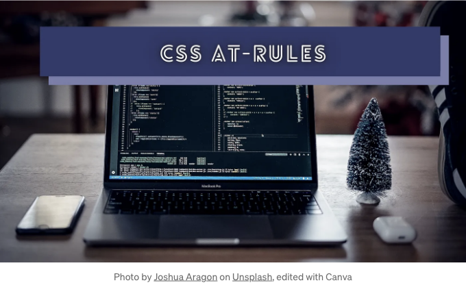
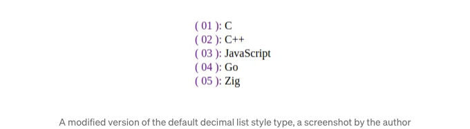
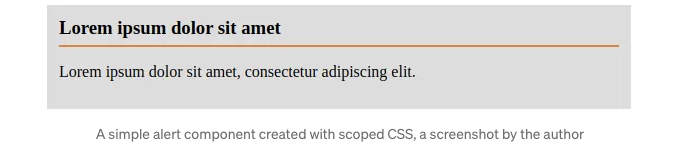
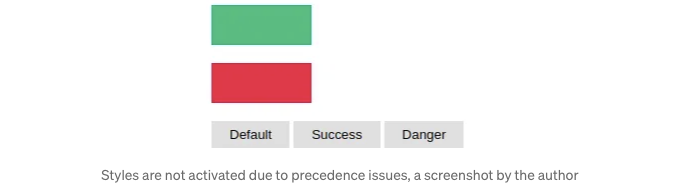
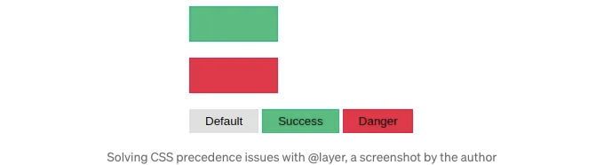

웹 개발자는 일반적으로 시맨틱 HTML 태그에 스타일을 추가하기 위해 별도의 스타일 시트 또는 스타일 태그에 CSS 정의를 작성합니다. 여러 키-값 스타일 지시문이 있는 CSS 블록은 DOM 요소에 스타일을 추가합니다. 이러한 CSS 블록은 스타일링 규칙이 적용되는 DOM 요소를 결정하기 위한 래핑 선택기 쿼리를 갖습니다. 이 개념은 웹 페이지를 잘 디자인하는 데 충분하지만, 때로는 CSS 블록의 동작을 제어해야 할 때가 있습니다. 또한 때로는 브라우저가 제공하는 내장 CSS 속성 값들을 확장해야 할 때도 있습니다.

CSS at-rules 기능은 CSS 블록의 동작을 제어하고 브라우저의 CSS 엔진에 사용자 정의 스타일 로직을 추가하는 방법을 제공합니다. 이러한 at-rules은 일반적으로 일반적인 CSS 선택기나 컨텍스트별 정의를 래핑하며, 예를 들어 순수 CSS 애니메이션을 위한 키프레임을 정의합니다.

이 이야기에서는 현대적이고 사용자 친화적이며 고품질의 웹 페이지를 개발하는 데 도움이 되는 여러 at-rules을 설명하겠습니다. 이 at-rules을 숙달하여 CSS 관련 개발 요구 사항에 대한 해결책을 제공할 수 있는 CSS 전문가가 되어보세요!

<!-- ui-log 수평형 -->
<ins class="adsbygoogle"
  style="display:block"
  data-ad-client="ca-pub-4877378276818686"
  data-ad-slot="9743150776"
  data-ad-format="auto"
  data-full-width-responsive="true"></ins>
<component is="script">
(adsbygoogle = window.adsbygoogle || []).push({});
</component>

# @keyframes를 사용하여 애니메이션 키프레임 정의하기

현대 CSS 표준은 DOM 요소에 대해 부드러운 애니메이션을 만드는 데 두 가지 솔루션을 제공합니다:

- transition 속성을 사용하여 사용자 상호작용에 기반하여 CSS 속성 값을 부드럽게 전환합니다.
- animation 속성을 사용하여 키프레임 기반의 고급 애니메이션을 구현합니다.

두 번째 접근 방식은 @keyframes at-rule을 사용하여 키프레임을 정의해야 합니다. 다음 예제를 살펴보세요:

<!-- ui-log 수평형 -->
<ins class="adsbygoogle"
  style="display:block"
  data-ad-client="ca-pub-4877378276818686"
  data-ad-slot="9743150776"
  data-ad-format="auto"
  data-full-width-responsive="true"></ins>
<component is="script">
(adsbygoogle = window.adsbygoogle || []).push({});
</component>

```css
.board {
  padding: 12px 50px;
  font-size: 24px;
  font-weight: bold;
  background-color: #ff9d00;
  color: #222;
  display: inline-block;
  animation: board-anim 3s infinite linear;
}

@keyframes board-anim {
  0%, 85%, 100% {
    filter: blur(0px);
  }
  90% {
    filter: blur(5px) contrast(200%);
  }
}
```

위의 코드는 다음 미리보기에 나와 있는 것처럼 간단한 번쩍이는 효과를 렌더링합니다:


<!-- ui-log 수평형 -->
<ins class="adsbygoogle"
  style="display:block"
  data-ad-client="ca-pub-4877378276818686"
  data-ad-slot="9743150776"
  data-ad-format="auto"
  data-full-width-responsive="true"></ins>
<component is="script">
(adsbygoogle = window.adsbygoogle || []).push({});
</component>

# @page를 사용하여 인쇄된 페이지 레이아웃 수정하기

가끔 사용자들은 오프라인 사용을 위해 웹 페이지를 실제 용지에 인쇄해야 할 때가 있습니다. 또한 일부 사용자는 나중에 사용할 목적으로 웹 페이지를 PDF 문서로 인쇄합니다. 일부 웹 앱은 서버 기반 기능을 제공하여 용지 친화적인 PDF 문서를 생성할 수 있지만, 브라우저의 기본 인쇄 기능을 사용하여 모든 웹 페이지를 인쇄할 수도 있습니다.

@page CSS at-rule을 사용하면 인쇄된 페이지의 크기, 방향 및 여백을 커스터마이즈할 수 있습니다. 예를 들어, 다음 CSS 코드 조각은 인쇄된 페이지에 1인치 여백 및 A4 레이아웃을 설정합니다:

```js
@page {
  size: A4 landscape;
  margin: 1in;
}
```

<!-- ui-log 수평형 -->
<ins class="adsbygoogle"
  style="display:block"
  data-ad-client="ca-pub-4877378276818686"
  data-ad-slot="9743150776"
  data-ad-format="auto"
  data-full-width-responsive="true"></ins>
<component is="script">
(adsbygoogle = window.adsbygoogle || []).push({});
</component>

위에 나와 있는 CSS 정의를 샘플 HTML 문서에 사용한 후 Ctrl + P를 누르면 다음과 같은 인쇄 미리보기가 나타납니다:


이 at-rule에는 인쇄된 문서의 특정 페이지를 선택하기 위한 :first, :blank, :left 및 :right 가상 클래스가 포함되어 있습니다. 자세한 내용은 공식 MDN 문서를 참조하여 @page에 대한 자세한 내용을 확인하세요.

# @media를 사용한 CSS 미디어 쿼리

<!-- ui-log 수평형 -->
<ins class="adsbygoogle"
  style="display:block"
  data-ad-client="ca-pub-4877378276818686"
  data-ad-slot="9743150776"
  data-ad-format="auto"
  data-full-width-responsive="true"></ins>
<component is="script">
(adsbygoogle = window.adsbygoogle || []).push({});
</component>

CSS 미디어 쿼리 기능은 미디어 유형 및 속성에 기반한 동적 스타일 블록 활성화를 도와 웹 개발자가 구현할 수 있게 해줍니다. 이 CSS 기능은 반응형 페이지 디자인 및 인쇄 페이지 사용자 정의에 자주 사용됩니다. 예를 들어, 다음과 같은 미디어 쿼리를 사용하여 작은 화면에서 입력 요소를 뷰포트 폭에 맞게 늘릴 수 있습니다:

```js
@media screen and (max-width: 550px) {
  input {
    width: 100%;
    box-sizing: border-box;
  }
}
```

위의 미디어 쿼리는 화면이 작아지면 활성화됩니다.

<!-- ui-log 수평형 -->
<ins class="adsbygoogle"
  style="display:block"
  data-ad-client="ca-pub-4877378276818686"
  data-ad-slot="9743150776"
  data-ad-format="auto"
  data-full-width-responsive="true"></ins>
<component is="script">
(adsbygoogle = window.adsbygoogle || []).push({});
</component>

위 구현은 미디어 쿼리의 화면 모드를 사용했습니다. 미디어 쿼리는 인쇄 유형도 지원하기 때문에 인쇄된 웹 페이지 버전을 위한 다른 스타일을 활성화하는 데 사용할 수 있습니다.

다음 CSS 코드 스니펫을 살펴보세요:

```js
@media print {
  header {
    display: none;
  }
}
```

위 미디어 쿼리는 인쇄 모드에서 주 헤더 요소를 숨깁니다. 아래 미리보기에서 확인할 수 있습니다:

<!-- ui-log 수평형 -->
<ins class="adsbygoogle"
  style="display:block"
  data-ad-client="ca-pub-4877378276818686"
  data-ad-slot="9743150776"
  data-ad-format="auto"
  data-full-width-responsive="true"></ins>
<component is="script">
(adsbygoogle = window.adsbygoogle || []).push({});
</component>


화면과 인쇄용 역동적인 스타일 블록을 추가할 수 있는 media type을 사용할 수 있습니다. 또한 다음과 같이 각 media type에 대한 별도의 스타일시트를 링크하는 것이 가능합니다:

```js
<link href="print.css" rel="stylesheet" media="print" />
<link
  href="mobile.css"
  rel="stylesheet"
  media="screen and (max-width: 600px)" />
```

# @counter-style을 사용하여 사용자 정의 목록 스타일 정의하기

<!-- ui-log 수평형 -->
<ins class="adsbygoogle"
  style="display:block"
  data-ad-client="ca-pub-4877378276818686"
  data-ad-slot="9743150776"
  data-ad-format="auto"
  data-full-width-responsive="true"></ins>
<component is="script">
(adsbygoogle = window.adsbygoogle || []).push({});
</component>

HTML 문서에서는 자주 순서 있는 목록과 순서 없는 목록을 사용합니다. 이러한 목록을 사용자 정의하기 위해 표준 브라우저는 list-style-type CSS 속성을 통해 다양한 내장 목록 표시기 유형을 제공합니다. @counter-style at-rule을 사용하여 이러한 목록 스타일을 확장하거나 처음부터 사용자 정의 스타일을 구현할 수 있습니다.

다음 CSS 코드 스니펫을 살펴보세요:

```css
@counter-style emojis {
  system: cyclic;
  symbols: 🔴 🟠 🟢;
  suffix: ' ';
}

ul li {
  list-style-type: emojis;
}
```

여기서 우리는 세 개의 이모티콘을 가진 사용자 정의 순환 목록 스타일을 만들었습니다. 위 CSS 정의를 순서 없는 목록에 사용하면 다음과 같은 결과를 볼 수 있습니다:

<!-- ui-log 수평형 -->
<ins class="adsbygoogle"
  style="display:block"
  data-ad-client="ca-pub-4877378276818686"
  data-ad-slot="9743150776"
  data-ad-format="auto"
  data-full-width-responsive="true"></ins>
<component is="script">
(adsbygoogle = window.adsbygoogle || []).push({});
</component>

```html
! [CSSAt-RulesThatEveryWebDeveloperShouldKnow_5.png] (./img/CSSAt-RulesThatEveryWebDeveloperShouldKnow_5.png)
```

뿐만 아니라 이 at-rule을 사용하여 기존 내장 목록 스타일을 사용자 정의할 수도 있습니다:

```js
 @counter-style decimal-mod {
  system: extends decimal;
  prefix: '( ';
  suffix: ' ): ';
  pad: 2 '0';
}


ol li {
  list-style-type: decimal-mod;
  margin-bottom: 2px;
}

ol li::marker {
  color: #780794;
}
```

위의 CSS 정의는 기본 10진수 목록 스타일을 확장하여 prefix, suffix 및 0으로 패딩을 추가합니다. 다음 미리보기를 확인해보세요:
```

<!-- ui-log 수평형 -->
<ins class="adsbygoogle"
  style="display:block"
  data-ad-client="ca-pub-4877378276818686"
  data-ad-slot="9743150776"
  data-ad-format="auto"
  data-full-width-responsive="true"></ins>
<component is="script">
(adsbygoogle = window.adsbygoogle || []).push({});
</component>



@counter-style 규칙은 고급 패턴, 사용자 정의 번호 매기기 시스템 등을 구현하는 데 충분한 알고리즘을 제공합니다.

다음 이야기에서 더 많은 반드시 알아야 할 최신 CSS 기능을 배워보세요:

# @starting-style을 사용하여 초기 DOM 렌더링 전환 추가

<!-- ui-log 수평형 -->
<ins class="adsbygoogle"
  style="display:block"
  data-ad-client="ca-pub-4877378276818686"
  data-ad-slot="9743150776"
  data-ad-format="auto"
  data-full-width-responsive="true"></ins>
<component is="script">
(adsbygoogle = window.adsbygoogle || []).push({});
</component>

DOM 요소가 HTML 문서나 JavaScript 코드 스니펫에서 렌더링될 때 초기 전환 애니메이션없이 렌더링됩니다. 과거에는 일반적으로 이러한 초기 애니메이션을 JavaScript를 통해 동적으로 전환된 CSS 클래스로 구현했습니다. 요즘에는 CSS 애니메이션을 사용할 수 있지만 초기 애니메이션 개념은 확실히 CSS 전환 기능에 속합니다.

@starting-style at-rule을 사용하면 CSS 선택기에 대한 초기 스타일을 설정하여 초기 렌더링 단계에 대한 전환 애니메이션을 작성할 수 있습니다:

```js
button {
  padding: 12px;
  border: none;
  border-radius: 4px;
  font-size: 16px;
  background-color: #bbb;
  opacity: 1;
  transform: scale(1);
  transition: all 1s linear;
  
  @starting-style {
    opacity: 0;
    transform: scale(0.5);
  }
}
```

위의 코드 스니펫은 버튼 요소가 뷰포트에 렌더링될 때 전환 애니메이션을 재생합니다. 이 전환은 JavaScript로 새 요소를 동적으로 만들더라도 작동합니다.

<!-- ui-log 수평형 -->
<ins class="adsbygoogle"
  style="display:block"
  data-ad-client="ca-pub-4877378276818686"
  data-ad-slot="9743150776"
  data-ad-format="auto"
  data-full-width-responsive="true"></ins>
<component is="script">
(adsbygoogle = window.adsbygoogle || []).push({});
</component>

아래 미리보기를 확인해보세요:


이 기능은 네이티브 HTML 팝오버에 애니메이션을 추가하는 데 매우 유용합니다. 이 at-rule의 브라우저 지원이 아직 미흡하기 때문에 프로덕션에서 사용하기 전에 시간이 좀 더 필요할 것 같아요.

# @scope를 사용한 스코프된 CSS 정의

<!-- ui-log 수평형 -->
<ins class="adsbygoogle"
  style="display:block"
  data-ad-client="ca-pub-4877378276818686"
  data-ad-slot="9743150776"
  data-ad-format="auto"
  data-full-width-responsive="true"></ins>
<component is="script">
(adsbygoogle = window.adsbygoogle || []).push({});
</component>

기본적으로 전통적인 CSS 구현은 전역 스코프 개념으로 웹 페이지를 스타일링합니다. 또한 과거에는 스타일 태그로도 스코프 기능이 없었습니다. 스타일 태그는 DOM 트리에서의 위치와 관계없이 모든 HTML 노드에 대해 적용 가능했습니다. HTML 표준이 'scoped' 속성을 사용하여 스코핑을 지원하려고 했지만 웹 표준이 되기 전에 사용 중단되었습니다. 현재 현대적인 CSS 명세에서는 스코프 CSS를 정의하기 위한 @scope at-rule을 도입했습니다.

예를 들어, 다음과 같이 HTML 세그먼트에 대한 스타일을 지정하는 스코프 스타일 태그를 만들 수 있습니다:

```js
<div>
  <style>
  @scope {
    :scope {
      background-color: #ddd;
      padding: 12px;
    }
    h3 {
      padding: 0 0 6px 0;
      margin: 0;
      border-bottom: solid 2px #eb7e3b;
    }
  }
  </style>
  <h3>Lorem ipsum dolor sit amet</h3>
  <p>Lorem ipsum dolor sit amet, consectetur adipiscing elit.</p>
</div>
```

위의 스타일 태그는 @scope를 사용하여 부모 div 요소에 대한 스코프 CSS 내용을 정의합니다. 여기서는 :scope 의사 클래스를 사용하여 스코프 요소를 대상으로 했습니다. 위 HTML 스니펫은 다음과 같이 간단한 독립된 알림 컴포넌트를 렌더링합니다:

<!-- ui-log 수평형 -->
<ins class="adsbygoogle"
  style="display:block"
  data-ad-client="ca-pub-4877378276818686"
  data-ad-slot="9743150776"
  data-ad-format="auto"
  data-full-width-responsive="true"></ins>
<component is="script">
(adsbygoogle = window.adsbygoogle || []).push({});
</component>



# @container을 활용한 현대적인 컴포넌트 중심 반응형 디자인

2012년에 미디어 쿼리가 W3C 표준이 된 이후, 웹 개발자들은 반응형 디자인 시스템을 구현하는 데 널리 사용했습니다. 미디어 쿼리 기반의 반응형 디자인 기술은 장치 화면 너비에 따라 CSS 블록을 활성화/비활성화합니다. 미디어 쿼리는 장치 크기에만 기반하므로 HTML 요소 크기 조정 시 스타일을 조정하는 기능을 사용할 수 없습니다.

현대 CSS 명세는 이 요구 사항을 위해 @container at-rule을 통해 컨테이너 쿼리를 제공합니다.

<!-- ui-log 수평형 -->
<ins class="adsbygoogle"
  style="display:block"
  data-ad-client="ca-pub-4877378276818686"
  data-ad-slot="9743150776"
  data-ad-format="auto"
  data-full-width-responsive="true"></ins>
<component is="script">
(adsbygoogle = window.adsbygoogle || []).push({});
</component>

다음 예시를 확인해 주세요:

```js
<div class="alert">
  <h3>로렘 입숨 돌로르 싿 아메트</h3>
  <button>로렘 입숨</button>
  <button>로렘 입숨</button>
</div>
```

```js
.alert {
  background-color: #ddd;
  padding: 12px;
  resize: horizontal;
  overflow: hidden;
  container-type: inline-size;
}

.alert h3 {
  padding: 0 0 6px 0;
  margin: 0 0 12px 0;
  border-bottom: solid 2px #eb7e3b;
}

.alert button {
  padding: 12px;
  border: none;
  margin-right: 6px;
}

@container (width < 400px) {
  .alert button {
    width: 100%;
    box-sizing: border-box;
  }
  
  .alert button:not(:last-child) {
    margin-bottom: 10px;
  }
}
```

여기서 container-type CSS 속성을 사용하여 모든 alert 요소에 대한 컨테이너 쿼리를 활성화했습니다. 위의 CSS 정의를 사용하여 경고 상자(alert boxes)와 함께 사용하면 다음 결과가 표시됩니다:

<!-- ui-log 수평형 -->
<ins class="adsbygoogle"
  style="display:block"
  data-ad-client="ca-pub-4877378276818686"
  data-ad-slot="9743150776"
  data-ad-format="auto"
  data-full-width-responsive="true"></ins>
<component is="script">
(adsbygoogle = window.adsbygoogle || []).push({});
</component>


CSS 컨테이너 쿼리는 계산된 스타일을 감지할 수 있으며 중첩된 컨테이너 쿼리를 지원하며 전통적인 미디어 쿼리와 동일한 조합된 쿼리를 지원합니다. 이 at-rule은 아직 성숙한 미디어 쿼리와 비교해서 성숙하지 않으므로 제품 사용에 주의하십시오. MDN 문서에서 컨테이너 쿼리에 대해 더 알아보세요.

# @layer를 사용한 CSS 우선순위 처리

웹 디자인 시나리오에서 개발자는 일반적으로 여러 CSS 선택기를 사용하고 종종 스타일을 재정의해야 합니다. 여러 선택기로 CSS 스타일을 직접 재정의하지 않더라도 작성한 모든 CSS 블록은 자동으로 사용자 에이전트 스타일시트의 스타일을 재정의합니다. CSS의 스타일 재정의 프로세스는 브라우저의 특이성 알고리즘을 기반으로 발생하여 우선순위를 처리하기 위해 CSS 선택기의 가중치를 계산합니다. 과거에는 따로 !important를 혼동스럽게 사용하지 않고는 CSS 우선순위를 처리하는 방법이 없었기 때문에 모든 개발자가 특이성 알고리즘에 기반한 CSS 재정의 관련 코드를 조정했습니다.

<!-- ui-log 수평형 -->
<ins class="adsbygoogle"
  style="display:block"
  data-ad-client="ca-pub-4877378276818686"
  data-ad-slot="9743150776"
  data-ad-format="auto"
  data-full-width-responsive="true"></ins>
<component is="script">
(adsbygoogle = window.adsbygoogle || []).push({});
</component>

다음 코드 스니펫을 살펴보세요:

```js
<div class="bg-success" style="width: 100px; height: 40px"></div>
<br/>
<div class="bg-danger" style="width: 100px; height: 40px"></div>
<br/>
<button class="btn">Default</button>
<button class="btn bg-success">Success</button>
<button class="btn bg-danger">Danger</button>
```

```js
button.btn {
  padding: 6px 18px;
  border: none;
  background-color: #e0e0e0;
}

.bg-success {
  background-color: #00bf7c;
}

.bg-danger {
  background-color: #f51d41;
}
```

여기서 bg-success와 bg-danger 클래스는 버튼의 기본 배경색을 변경하지 못할 것입니다. 왜냐하면 button.btn의 특이성이 더 높기 때문이거든.

<!-- ui-log 수평형 -->
<ins class="adsbygoogle"
  style="display:block"
  data-ad-client="ca-pub-4877378276818686"
  data-ad-slot="9743150776"
  data-ad-format="auto"
  data-full-width-responsive="true"></ins>
<component is="script">
(adsbygoogle = window.adsbygoogle || []).push({});
</component>



@layer at-rule은 스타일 레이어를 정의하고 CSS 우선순위를 제어하여 명확성 효과를 제어할 수 있게 합니다. 그래서 우리는 다음과 같이 기본 버튼 선택기의 명확성을 바꾸지 않고도 이 스타일링 문제를 해결하기 위해 두 가지 레이어를 만들 수 있습니다:

```js
@layer base, mods;

@layer base {
  button.btn {
    padding: 6px 18px;
    border: none;
    background-color: #e0e0e0;
  }
}

@layer mods {
  .bg-danger {
    background-color: #f51d41;
  }

  .bg-success {
    background-color: #00bf7c;
  }
}
```

여기서 mods 레이어는 base 레이어와 비교했을 때 가장 높은 우선순위를 가지므로 기존의 명확성 효과와는 상관없이 버튼은 적절한 배경색을 받을 것입니다. 아래 프리뷰에서 확인할 수 있습니다:

<!-- ui-log 수평형 -->
<ins class="adsbygoogle"
  style="display:block"
  data-ad-client="ca-pub-4877378276818686"
  data-ad-slot="9743150776"
  data-ad-format="auto"
  data-full-width-responsive="true"></ins>
<component is="script">
(adsbygoogle = window.adsbygoogle || []).push({});
</component>



앞으로 미래적이고 사용자 친화적인 웹 프론트엔드를 만들기 위해 가상 요소와 클래스를 배우세요:

읽어주셔서 감사합니다.