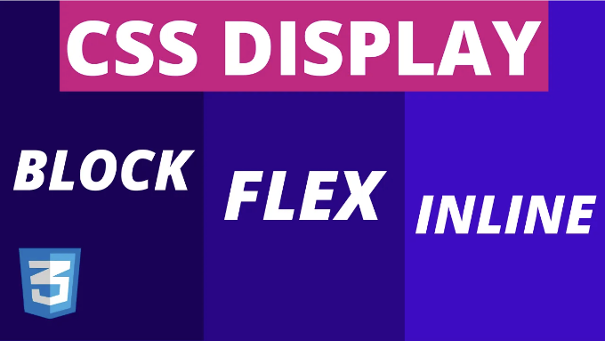
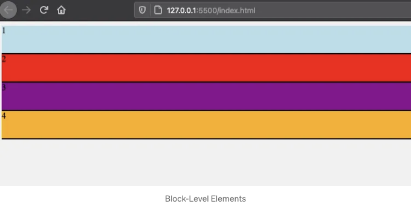
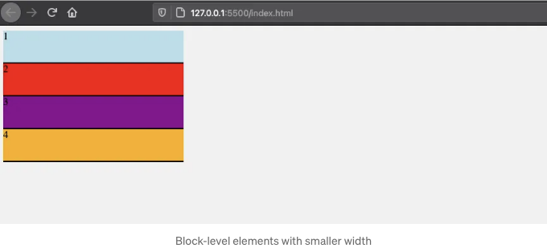
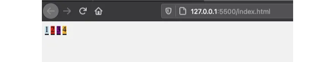
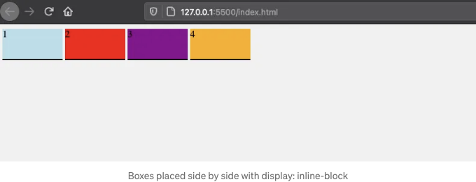
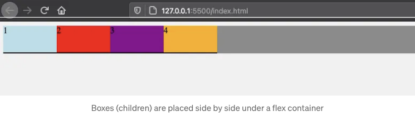
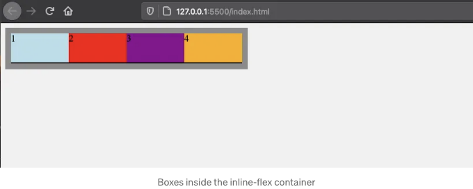
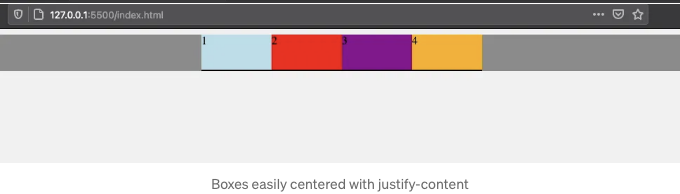

디스플레이 속성은 HTML 요소를 표시, 숨기거나 배치하는 데 사용됩니다. 모든 HTML 요소에는 기본 디스플레이 동작이 있으며 이해하지 않으면 CSS 작업 중에 어려움을 겪을 수 있습니다.

또한 Flexbox 레이아웃을 구축하는 데 사용되는 디스플레이 속성의 새로운 옵션이 있습니다. Flex는 요소를 쉽게 배치하는 데 더 간단한 방법을 제공합니다. 그래서 이 게시물에서는 다음을 배울 수 있습니다:

- 블록 및 인라인 수준 요소란 무엇인가
- 왜 inline-block을 사용하는 것이 좋은가
- 대안으로서의 flex 속성
- Flex vs Inline-Flex
- Flex를 사용하여 쉽게 가운데 정렬하는 방법

<!-- ui-log 수평형 -->
<ins class="adsbygoogle"
  style="display:block"
  data-ad-client="ca-pub-4877378276818686"
  data-ad-slot="9743150776"
  data-ad-format="auto"
  data-full-width-responsive="true"></ins>
<component is="script">
(adsbygoogle = window.adsbygoogle || []).push({});
</component>

# 블록 수준 요소

모든 HTML 요소에는 기본적으로 설정된 디스플레이 동작이 있습니다. 일부 HTML 요소(예: `div`, `p`, `ul` 등)는 블록 수준이라고 알려진 기본 디스플레이 동작을 가지고 있습니다.

블록 수준은 템플릿에 배치된 후, 완전한 행의 전체 너비를 차지한다는 것을 의미합니다.

```js
<div class="box blue"> 1 </div>
<div class="box red"> 2 </div>
<div class="box purple"> 3 </div>
<div class="box orange"> 4 </div>
// 스타일링
.box {
  border-bottom: 2px solid black;
  height: 50px;
}
```

<!-- ui-log 수평형 -->
<ins class="adsbygoogle"
  style="display:block"
  data-ad-client="ca-pub-4877378276818686"
  data-ad-slot="9743150776"
  data-ad-format="auto"
  data-full-width-responsive="true"></ins>
<component is="script">
(adsbygoogle = window.adsbygoogle || []).push({});
</component>

예제에서 위에 있는 이 4개의 div 요소(박스)들은 너비 속성을 할당하지 않았음에도 불구하고 각각의 행의 100% 공간을 차지하고 있습니다.



## 이들을 옆으로 나란히 놓는 방법은?

이제 아마 생각하실 수 있겠죠, 만약 그들이 100%의 너비를 차지한다면, 만약 작은 너비를 할당한다면 어떻게 될까요, 예를 들어 20%라고 하면:

<!-- ui-log 수평형 -->
<ins class="adsbygoogle"
  style="display:block"
  data-ad-client="ca-pub-4877378276818686"
  data-ad-slot="9743150776"
  data-ad-format="auto"
  data-full-width-responsive="true"></ins>
<component is="script">
(adsbygoogle = window.adsbygoogle || []).push({});
</component>

```css
.box {
  width: 20%;
}
```

그러면 그들은 옆으로 배치되어야 할거야. 음, 사실은 그렇지 않아...



이것은 많은 사람들이 하는 일반적인 실수야. 작은 너비를 지정하더라도 지정된 (작은) 너비 여부와 관계없이 여전히 블록 수준의 표시 동작을 유지해.```

<!-- ui-log 수평형 -->
<ins class="adsbygoogle"
  style="display:block"
  data-ad-client="ca-pub-4877378276818686"
  data-ad-slot="9743150776"
  data-ad-format="auto"
  data-full-width-responsive="true"></ins>
<component is="script">
(adsbygoogle = window.adsbygoogle || []).push({});
</component>

그러니까 두 가지를 옆으로 배치하고 싶다면, 그들의 표시 방식(display behavior)을 변경해야 해. inline으로 바꿔보자:

```js
display: inline;
```

# 인라인 요소

그럼, 인라인(inline)이란 뭘까?

<!-- ui-log 수평형 -->
<ins class="adsbygoogle"
  style="display:block"
  data-ad-client="ca-pub-4877378276818686"
  data-ad-slot="9743150776"
  data-ad-format="auto"
  data-full-width-responsive="true"></ins>
<component is="script">
(adsbygoogle = window.adsbygoogle || []).push({});
</component>

위에서 블록 수준 요소의 예시를 보았어요. 반면에 기본적으로 일반 수준 요소들도 있어요 (`span`이나 `a` 태그 같은). 이들은 직접적으로 옆에 놓을 수 있어요:



`div` 대신에 `span`을 사용하거나 `box` 클래스에 인라인 값을 할당할 수 있어요:

```js
.box {
  border-bottom: 2px solid black;
  width: 100px;
  height: 50px;
  display: inline;
}
```

<!-- ui-log 수평형 -->
<ins class="adsbygoogle"
  style="display:block"
  data-ad-client="ca-pub-4877378276818686"
  data-ad-slot="9743150776"
  data-ad-format="auto"
  data-full-width-responsive="true"></ins>
<component is="script">
(adsbygoogle = window.adsbygoogle || []).push({});
</component>

하지만 인라인 요소의 단점은 너비나 높이 속성을 적용할 수 없다는 것입니다. 이러한 속성은 인라인 요소와 함께 작동하지 않습니다. 이 정보를 알지 못하면 CSS 작업이 정말 짜즯할 수 있어요.

# 좋은 해결책: 인라인-블록

세 번째 옵션도 있습니다: 인라인-블록. 이 속성은 블록 및 인라인 수준 요소의 이점을 모두 취할 수 있어요.

그래서 `display: inline-block`을 사용한다면:

<!-- ui-log 수평형 -->
<ins class="adsbygoogle"
  style="display:block"
  data-ad-client="ca-pub-4877378276818686"
  data-ad-slot="9743150776"
  data-ad-format="auto"
  data-full-width-responsive="true"></ins>
<component is="script">
(adsbygoogle = window.adsbygoogle || []).push({});
</component>

- 인라인 요소로는 할 수 없는 너비 및 높이 속성을 적용할 수 있습니다.
- 블록 레벨 요소로는 할 수 없는 요소를 옆으로 배치할 수 있습니다.

```css
.box {
  display: inline-block;
}
```



이 접근법은 요소의 위치 지정이나 표시 동작 변경을 위해 CSS에서 오랫동안 사용되어왔습니다.

<!-- ui-log 수평형 -->
<ins class="adsbygoogle"
  style="display:block"
  data-ad-client="ca-pub-4877378276818686"
  data-ad-slot="9743150776"
  data-ad-format="auto"
  data-full-width-responsive="true"></ins>
<component is="script">
(adsbygoogle = window.adsbygoogle || []).push({});
</component>

# 플렉스 디스플레이는 무엇인가요?

웹페이지의 레이아웃을 설계하거나 정렬하는 데 사용할 수 있는 최신 방법인 플렉스 속성이 있습니다:

```js
display: flex;
```

가장 중요한 것은 "플렉스(flex)"가 "블록(block)"이나 "인라인(inline)"과 같은 단순한 속성이 아니라 다양한 하위 속성을 가진 더 큰 CSS 모듈임을 알아야 합니다.

<!-- ui-log 수평형 -->
<ins class="adsbygoogle"
  style="display:block"
  data-ad-client="ca-pub-4877378276818686"
  data-ad-slot="9743150776"
  data-ad-format="auto"
  data-full-width-responsive="true"></ins>
<component is="script">
(adsbygoogle = window.adsbygoogle || []).push({});
</component>

저희는 앞으로 더 자세한 내용으로 이야기할 예정이에요. (지금 당장은, 이 글의 튜토리얼 비디오를 여기서 확인해보실 수도 있어요.)

## 컨테이너에는 Flex만 사용하세요

flex 속성을 사용하려면 부모(또는 컨테이너) 요소가 필요해요.

flex의 이점은 해당 컨테이너 내의 요소에만 적용될 수 있고, 컨테이너 외부에서는 작동하지 않아요.

<!-- ui-log 수평형 -->
<ins class="adsbygoogle"
  style="display:block"
  data-ad-client="ca-pub-4877378276818686"
  data-ad-slot="9743150776"
  data-ad-format="auto"
  data-full-width-responsive="true"></ins>
<component is="script">
(adsbygoogle = window.adsbygoogle || []).push({});
</component>

```js
<div class="container">
  <div> 1 </div>
  <div> 2 </div>
  <div> 3 </div>
  <div> 4 </div>
</div>
```

이제 'container' div에 display flex 속성을 할당해 봅시다:

```js
.container {
  display: flex;
  background: gray;
}
```

이렇게 하면 이 상자들이 모두 옆으로 자동으로 배치되어 표시되며, 표시 동작을 변경하지 않아도 됩니다:```

<!-- ui-log 수평형 -->
<ins class="adsbygoogle"
  style="display:block"
  data-ad-client="ca-pub-4877378276818686"
  data-ad-slot="9743150776"
  data-ad-format="auto"
  data-full-width-responsive="true"></ins>
<component is="script">
(adsbygoogle = window.adsbygoogle || []).push({});
</component>



게다가, 컨테이너(div)는 여전히 행의 전체 너비를 차지하고 블록 수준의 요소처럼 동작하지만 실제로는 이제 플렉스 컨테이너입니다.

## Flex vs Inline-Flex

반면에 플렉스 컨테이너를 인라인 수준의 플렉스 요소로 만들고 싶다면, 코드를 인라인-플렉스로 변경하면 됩니다:

<!-- ui-log 수평형 -->
<ins class="adsbygoogle"
  style="display:block"
  data-ad-client="ca-pub-4877378276818686"
  data-ad-slot="9743150776"
  data-ad-format="auto"
  data-full-width-responsive="true"></ins>
<component is="script">
(adsbygoogle = window.adsbygoogle || []).push({});
</component>

```js
display: inline-flex;
```

따라서 컨테이너는 자식 요소만큼 필요한 공간을 차지합니다. 보다 시각적으로 만들기 위해 패딩도 추가해보겠습니다:

```js
.container {
  display: inline-flex;
  padding: 10px;
  background-color: gray;
}
```


```  

<!-- ui-log 수평형 -->
<ins class="adsbygoogle"
  style="display:block"
  data-ad-client="ca-pub-4877378276818686"
  data-ad-slot="9743150776"
  data-ad-format="auto"
  data-full-width-responsive="true"></ins>
<component is="script">
(adsbygoogle = window.adsbygoogle || []).push({});
</component>

# Flex를 사용하여 요소 가운데 정렬하기

Flex를 사용하면 정말 많은 일을 할 수 있어요. 예를 들어, justify-content라는 단 한 가지 속성으로 상자를 쉽게 가운데 정렬할 수 있어요:

```js
.container {
  display: flex;
  justify-content: center;
  background-color: gray;
}
```



<!-- ui-log 수평형 -->
<ins class="adsbygoogle"
  style="display:block"
  data-ad-client="ca-pub-4877378276818686"
  data-ad-slot="9743150776"
  data-ad-format="auto"
  data-full-width-responsive="true"></ins>
<component is="script">
(adsbygoogle = window.adsbygoogle || []).push({});
</component>

이제 모든 자식 요소가 매우 쉽게 중앙에 배치되었습니다. justify-content 속성은 플렉스 요소에 대해서만 작동합니다. 나는 다음 게시물에서 더 많은 플렉스 기능에 대해 설명할 예정이에요.

글이 마음에 드셨나요? Medium은 광고를 보여주지 않으면서 수천 개의 훌륭한 기사를 호스팅하는 좋은 플랫폼이에요. Medium이 광고 없이 운영되기 때문에 이 플랫폼을 좋아하는 독자들은 회원이 되어 지원할 수 있어요.

여기에서 Medium 회원이 되어 Medium의 모든 이야기에 무제한 액세스할 수 있어요. 위의 링크를 사용하면 나를 지원해줄 뿐만 아니라 작은 수수료도 얻을 수 있기 때문에 작가로서 그 정도의 지원은 정말 감사합니다. 고마워요!