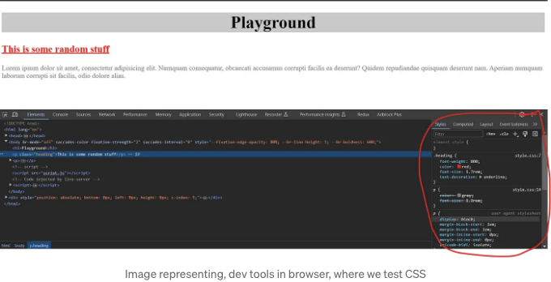
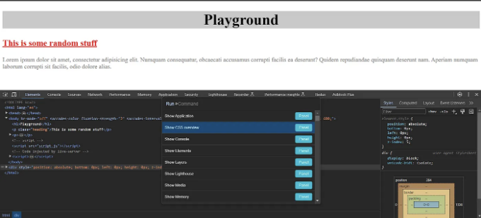
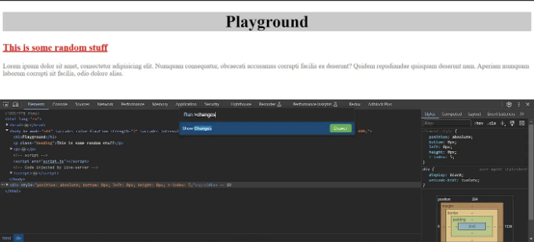
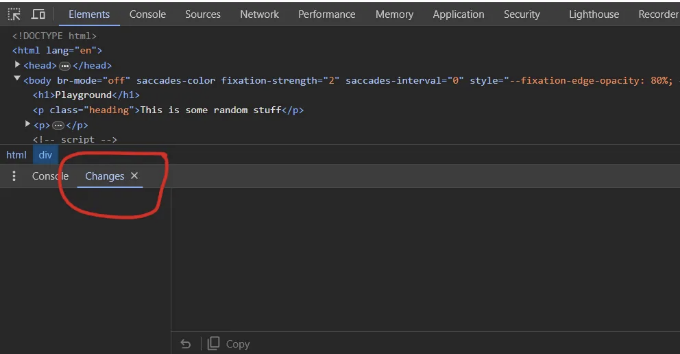
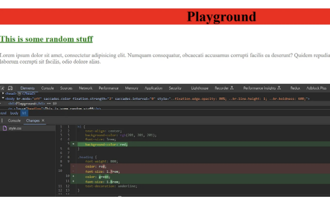

일부 CSS 문제를 수정할 때는 먼저 브라우저에서 변경 사항을 테스트한 후 (개발 도구에서), 만족스러운 결과를 얻으면 CSS 파일에 코드를 작성합니다.

그리고 많은 변경 사항을 만들 때 우리는 변경 사항을 잊어버릴 수도 있어요. 만약 개발 도구에서 했던 변경 사항의 히스토리를 볼 수 있다면 더 좋지 않을까요?

만약 우리가 CSS에 대해 한 모든 변경 사항의 히스토리를 볼 수 있는 방법이 있다고 말한다면 어떨까요? 이 히스토리는 Github에서 diff를 볼 때와 비슷하게 보입니다.

<!-- ui-log 수평형 -->
<ins class="adsbygoogle"
  style="display:block"
  data-ad-client="ca-pub-4877378276818686"
  data-ad-slot="9743150776"
  data-ad-format="auto"
  data-full-width-responsive="true"></ins>
<component is="script">
(adsbygoogle = window.adsbygoogle || []).push({});
</component>

위의 작업을 수행하려면 브라우저의 개발 도구를 열어주세요

- Ctrl + Shift + P를 클릭하면 (이렇게하면 명령 팝업이 열립니다)

2. 이제 팝업에 "changes"를 입력하고 Enter 키를 눌러주세요

<!-- ui-log 수평형 -->
<ins class="adsbygoogle"
  style="display:block"
  data-ad-client="ca-pub-4877378276818686"
  data-ad-slot="9743150776"
  data-ad-format="auto"
  data-full-width-responsive="true"></ins>
<component is="script">
(adsbygoogle = window.adsbygoogle || []).push({});
</component>

아래에 작은 콘솔이 나타납니다. "Changes"라는 탭이 있어요

그러면 여기까지에요. 이제 개발 도구에서 CSS를 변경한 후 이 새로운 "Changes" 탭에 반영될거에요.

<!-- ui-log 수평형 -->
<ins class="adsbygoogle"
  style="display:block"
  data-ad-client="ca-pub-4877378276818686"
  data-ad-slot="9743150776"
  data-ad-format="auto"
  data-full-width-responsive="true"></ins>
<component is="script">
(adsbygoogle = window.adsbygoogle || []).push({});
</component>

감사합니다! 🎉🎊

# Stackademic 🎓

<!-- ui-log 수평형 -->
<ins class="adsbygoogle"
  style="display:block"
  data-ad-client="ca-pub-4877378276818686"
  data-ad-slot="9743150776"
  data-ad-format="auto"
  data-full-width-responsive="true"></ins>
<component is="script">
(adsbygoogle = window.adsbygoogle || []).push({});
</component>

감사합니다. 마지막까지 읽어 주셔서 감사합니다. 떠나시기 전에:

- 작가를 클로딩하고 팔로우 해주시면 감사하겠습니다! 👏
- 우리를 팔로우해 주세요: X | LinkedIn | YouTube | Discord
- 다른 플랫폼도 방문해 보세요: In Plain English | CoFeed | Venture | Cubed
- 더 많은 콘텐츠는 Stackademic.com 에서 확인하세요.