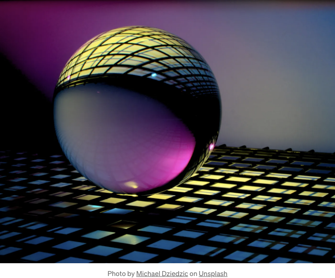

# 소개

이미지의 배경을 웹사이트에서 매끄럽게 지우고 싶은 적이 있나요? 그럼 이 쉬운 가이드를 확인해보세요! 이 초보자 친화적인 가이드에서는 CSS의 마법을 드러내어 단 하나의 코드 라인으로 이미지 배경을 손쉽게 제거할 수 있는 방법을 알려드립니다. 복잡한 소프트웨어나 도구는 필요하지 않습니다!

# CSS 속성 해석

<!-- ui-log 수평형 -->
<ins class="adsbygoogle"
  style="display:block"
  data-ad-client="ca-pub-4877378276818686"
  data-ad-slot="9743150776"
  data-ad-format="auto"
  data-full-width-responsive="true"></ins>
<component is="script">
(adsbygoogle = window.adsbygoogle || []).push({});
</component>

매혹적인 효과의 핵심은 mix-blend-mode CSS 속성에 있습니다. 이 속성을 활용하여 mix-blend-mode: multiply;로 설정하면 이미지 배경을 간편하게 투명하게 만들 수 있습니다.

# HTML 문서 구성

실용적인 구현에 대해 알아봅시다. HTML 문서에 성가신 흰색 배경을 가진 이미지가 있는 상황을 상상해보세요. 원하는 배경색과는 대조적인 상황일 것입니다. 걱정하지 마세요! 이 장애물을 함께 극복해보겠습니다.

```js
<!DOCTYPE html>
<html lang="en">
<head>
    <meta charset="UTF-8">
    <meta name="viewport" content="width=device-width, initial-scale=1.0">
    <title>Document</title>
    <style>
        html {
            background: #fbd290;
        }
        img {
            width: 100px;
        }
    </style>
</head>
<body>
    
</body>
</html>
```

<!-- ui-log 수평형 -->
<ins class="adsbygoogle"
  style="display:block"
  data-ad-client="ca-pub-4877378276818686"
  data-ad-slot="9743150776"
  data-ad-format="auto"
  data-full-width-responsive="true"></ins>
<component is="script">
(adsbygoogle = window.adsbygoogle || []).push({});
</component>

## CSS 마법 구현하기

이제 이미지를 변환해줄 단 한 줄의 CSS 코드의 힘을 보세요:

```js
<!DOCTYPE html>
<html lang="en">
<head>
    <meta charset="UTF-8">
    <meta name="viewport" content="width=device-width, initial-scale=1.0">
    <title>문서</title>
    <style>
        html {
            background: #fbd290;
        }
        img {
            width: 100px;
            mix-blend-mode: multiply;
        }
    </style>
</head>
<body>
    
</body>
</html>
```

마법이 펼쳐집니다!

<!-- ui-log 수평형 -->
<ins class="adsbygoogle"
  style="display:block"
  data-ad-client="ca-pub-4877378276818686"
  data-ad-slot="9743150776"
  data-ad-format="auto"
  data-full-width-responsive="true"></ins>
<component is="script">
(adsbygoogle = window.adsbygoogle || []).push({});
</component>

CSS 한 줄만으로 이미지 배경이 부드럽게 투명하게 변하는 놀라운 변신을 경험해보세요. 이는 웹페이지 배경과 완벽하게 통합되어 화려한 효과를 연출합니다. 정말 멋진 광경이죠!

결론

CSS 이미지 배경 제거 기술을 마스터했습니다! 이 새로운 지식을 얻어 여러분의 웹페이지를 멋진 시각적 요소로 아름답게 꾸며보세요. 동료 열정가들에게 이 가이드를 공유하고 CSS의 매력을 전파해보세요!

본 튜토리얼이 도움이 되었다면 동료들과 공유해보세요. JavaScript, React, Next.js 및 웹 개발 관련 유용한 컨텐츠를 더욱 기대해주세요.