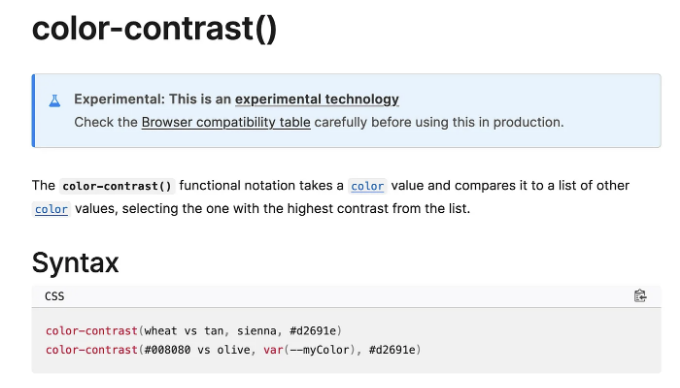
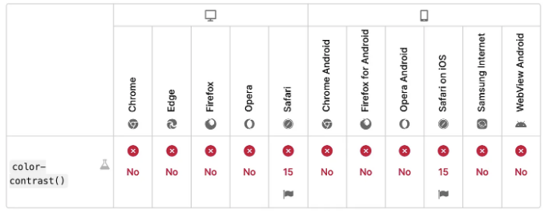

당신의 웹사이트에 적합한 색상을 찾는 것은 물론 중요한 문제입니다. 한편으로는 전반적인 스타일과 독특한 개성을 결정하고, 다른 한편으로는 모든 사람에게 웹사이트에 접근할 수 있도록 보장합니다.

오늘은 아직 실험적이지만 이 분야에서 정말 도움이 될 만한 멋진 CSS 기능인 color-contrast()에 대해 이야기해보고 싶어요.

⚠️ 중요: 현재 이 기능은 실험적이며 Safari에서만 사용 가능합니다 (아래 참조)!

# 이것은 무엇인가요?

<!-- ui-log 수평형 -->
<ins class="adsbygoogle"
  style="display:block"
  data-ad-client="ca-pub-4877378276818686"
  data-ad-slot="9743150776"
  data-ad-format="auto"
  data-full-width-responsive="true"></ins>
<component is="script">
(adsbygoogle = window.adsbygoogle || []).push({});
</component>

MDN 웹 문서에서 기능에 대한 개요를 확인해보세요:

요약하면, 이 명령어를 사용하면 목록 중에서 다른 참조와 비교하여 가장 읽기 쉬운 색상을 선택할 수 있습니다.

# 사용 방법은?

<!-- ui-log 수평형 -->
<ins class="adsbygoogle"
  style="display:block"
  data-ad-client="ca-pub-4877378276818686"
  data-ad-slot="9743150776"
  data-ad-format="auto"
  data-full-width-responsive="true"></ins>
<component is="script">
(adsbygoogle = window.adsbygoogle || []).push({});
</component>

이 기사를 작성하는 시점인 2024년 4월에는 이 기능이 Safari에서만 사용 가능합니다:

정말 멋져 보이더라도 현재로서는 생산 환경에서 사용하기가 여전히 꽤 어렵고 위험할 수 있습니다... :)

하지만 만약 시도해보고 싶고 손에 Safari 브라우저가 있다면, Safari를 열고 개발 | 실험 기능 메뉴로 이동하여 활성화할 수 있습니다:

<!-- ui-log 수평형 -->
<ins class="adsbygoogle"
  style="display:block"
  data-ad-client="ca-pub-4877378276818686"
  data-ad-slot="9743150776"
  data-ad-format="auto"
  data-full-width-responsive="true"></ins>
<component is="script">
(adsbygoogle = window.adsbygoogle || []).push({});
</component>

# 빠른 예시

만약 우리가 이 두 가지 블록을 가지고 있다고 상상해보세요 — 하나는 검은색이고 다른 하나는 흰색이며, 그 위에 텍스트를 작성하고 싶다고 가정해봅시다:

현재 상태로는 각 경우에 대해 한 가지 색만 선택하기가 힘듭니다. 두 가지 텍스트에 대해 두 가지 스타일이 필요하며, 그렇지 않으면 충분한 대조를 얻기가 까다로울 것입니다:

그러나 color-contrast()를 사용하면 CSS 변수와 두 텍스트를 위한 공통 텍스트 클래스를 사용하여, 코드를 이렇게 리팩터링할 수 있습니다:

<!-- ui-log 수평형 -->
<ins class="adsbygoogle"
  style="display:block"
  data-ad-client="ca-pub-4877378276818686"
  data-ad-slot="9743150776"
  data-ad-format="auto"
  data-full-width-responsive="true"></ins>
<component is="script">
(adsbygoogle = window.adsbygoogle || []).push({});
</component>

물론 덜 "지나친" 색상들과도 잘 작동해요:

그리고 원하는 만큼 긴 목록을 전달할 수 있어요 — 어떤 경우에도 각 색상이 목록의 첫 번째 색상부터 순차적으로 테스트되는 걸 봐요:

배경색상을 기준으로 가장 잘 보이는 색조를 CSS가 자동으로 추측하고, 우리 코드는 --bg-color 변수만 조정해서 즉시 적절한 대비를 얻을 수 있어서 꽤 요인화되어 있어요 :)

# 사용해야 하는 이유

<!-- ui-log 수평형 -->
<ins class="adsbygoogle"
  style="display:block"
  data-ad-client="ca-pub-4877378276818686"
  data-ad-slot="9743150776"
  data-ad-format="auto"
  data-full-width-responsive="true"></ins>
<component is="script">
(adsbygoogle = window.adsbygoogle || []).push({});
</component>

웹 사이트에서 접근성은 매우 중요합니다. 간단히 말해서, 장애나 장애에 관계 없이 누구나 사용할 수 있도록 웹 사이트나 앱을 제공하는 것이죠.

윤리적인 측면에서 중요하지만, 사이트의 영향력을 극대화하고 잠재적 인 고객을 확대하는 데도 키포인트입니다.

시각 장애를 가진 사용자를 돕는 스크린 리더 관련 도구를 추가하거나, 운동 장애가 있는 사람들을 위한 대체 입력 방법을 제공하는 등의 방식으로, 접근 가능한 디자인을 통해 모든 사람이 정보에 동등하게 접근할 수 있도록 보장합니다.

<!-- ui-log 수평형 -->
<ins class="adsbygoogle"
  style="display:block"
  data-ad-client="ca-pub-4877378276818686"
  data-ad-slot="9743150776"
  data-ad-format="auto"
  data-full-width-responsive="true"></ins>
<component is="script">
(adsbygoogle = window.adsbygoogle || []).push({});
</component>

먼저 이것이 기이해 보일 수 있지만, 사실 올바른 색상을 고르는 것도 아주 중요합니다! 적절한 대비를 가지지 않으면 텍스트가 일부 사용자에게 가독성이 떨어질 수 있기 때문에, 그러한 사용자들이 당신이 만드는 경험을 즐길 수 없게 될 수도 있습니다.

color-contrast()와 같은 유틸리티를 사용하여 보다 보편적으로 접근 가능한 웹사이트를 만들 수 있습니다!

🚀 읽어 주셔서 감사합니다. 이 작은 CSS 팁을 즐겁게 보셨으면 기뻐할 것입니다!

만약 그렇다면, 기사에 박수를 치시고 더 많은 글을 읽기 위해 제 팔로우를 눌러주시고, 또한 여러분만의 멋진 웹 팁과 노하우를 댓글로 공유해 주시는 것도 망설이지 마세요 :)