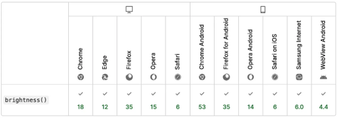

웹 개발자나 웹 디자이너로서, 당신의 일 중 큰 부분은 사이트나 앱 인터페이스를 멋지고 직관적으로 만드는 것입니다. 그 일을 하기 위한 다양한 기술들이 있지만, 그 중 가장 중요한 것은 물론 색상 선택입니다.

색상을 올바르게 조합하는 것은 강력한 브랜드 아이덴티티와 시각적으로 매력적인 사용자 경험을 만드는 데 중요합니다. 왜냐하면 색상은 감정과 연결되어 있으며, 사용자의 세계에서의 여정에 대한 전반적인 분위기를 설정하기 때문이죠!

그러므로 오늘은 빠르게 일치하는 색상을 만들기 쉽게 해주는 훌륭한 CSS 도구인 `brightness()` 필터 함수에 대해 이야기해보려고 합니다.

# 이것은 무엇인가요?

<!-- ui-log 수평형 -->
<ins class="adsbygoogle"
  style="display:block"
  data-ad-client="ca-pub-4877378276818686"
  data-ad-slot="9743150776"
  data-ad-format="auto"
  data-full-width-responsive="true"></ins>
<component is="script">
(adsbygoogle = window.adsbygoogle || []).push({});
</component>

아래는 MDN 웹 문서에서 직접 제공하는 기능 개요입니다:

이 기능의 아이디어는 원래 색에 빛깔을 어둡게하거나 밝게하기 위해 일정 비율의 명도를 적용하는 것입니다.

이 양은 백분율 (예: 40%)로 작성하거나 0-1 비율 (예: 0.4)로 작성할 수 있습니다. 100% 미만의 값은 색을 어둡게하고, 100% 초과의 값은 더 밝게합니다.

<!-- ui-log 수평형 -->
<ins class="adsbygoogle"
  style="display:block"
  data-ad-client="ca-pub-4877378276818686"
  data-ad-slot="9743150776"
  data-ad-format="auto"
  data-full-width-responsive="true"></ins>
<component is="script">
(adsbygoogle = window.adsbygoogle || []).push({});
</component>

# 브라우저 호환성

현재, brightness() 함수는 모든 주요/일반 브라우저에서 행복하게 사용할 수 있습니다:

# 간단한 예제

<!-- ui-log 수평형 -->
<ins class="adsbygoogle"
  style="display:block"
  data-ad-client="ca-pub-4877378276818686"
  data-ad-slot="9743150776"
  data-ad-format="auto"
  data-full-width-responsive="true"></ins>
<component is="script">
(adsbygoogle = window.adsbygoogle || []).push({});
</component>

만약 기본 색상을 가진 카드가 있고 비슷한 파란색 조토인 변형을 만들고 싶다면:

우리가 할 수 있는 것은 다른 요소들이 나의 주요 파란색을 기반으로 자동으로 새로운 색조를 계산하는 필터 속성과 brightness() 함수를 사용하는 것이다:

그러면 여기 있어요! 이제 우리는 초기 색상에서 파생된 여러 파란색 조토를 모두 가지고 있어요, 그래서 완벽하게 매치돼요 :)

물론 정말 멋진 건, 우리의 .block 클래스에서 주요 색상을 변경함으로써, 모든 다른 요소들이 논리적인 방식으로 즉시 업데이트된다는 것이죠:

<!-- ui-log 수평형 -->
<ins class="adsbygoogle"
  style="display:block"
  data-ad-client="ca-pub-4877378276818686"
  data-ad-slot="9743150776"
  data-ad-format="auto"
  data-full-width-responsive="true"></ins>
<component is="script">
(adsbygoogle = window.adsbygoogle || []).push({});
</component>

# 왜 사용해야 하는가

웹사이트나 앱에 적절한 색상을 선택하는 것은 항상 쉬운 일이 아니에요. 여러 색을 나란히 보여주는 것은 더 어려울 수도 있어요!

색상 시스템과 팔레트는 웹 디자인에서 매우 중요해요. 물론 미적인 측면뿐만 아니라 사용자 경험과 브랜드 정체성까지 영향을 줘요. 일관된 색상 구성을 설정함으로써 디자이너는 특정한 감정을 불러일으키거나 서비스 유형을 제안하거나 사람들을 예상치 못한 방법으로 놀라게 할 수 있어요. 게다가 색상은 가독성을 개선하고 사용자들을 명확하고 일관되게 인터페이스를 통해 안내하는 데 도움이 되기도 해요(일반적으로 Material Design에서처럼 주/보조 색상 조합 개념을 사용하여 모든 클릭 가능한 요소가 사이트 전체적으로 특정한 톤을 갖게 하는 방법).

그런데, 웹 접근성에 대한 또 다른 빠른 CSS 트릭을 배우고 싶다면, 저가 color-contrast() 명령어에 대해 다룬 다른 기사도 읽어보세요 :)

<!-- ui-log 수평형 -->
<ins class="adsbygoogle"
  style="display:block"
  data-ad-client="ca-pub-4877378276818686"
  data-ad-slot="9743150776"
  data-ad-format="auto"
  data-full-width-responsive="true"></ins>
<component is="script">
(adsbygoogle = window.adsbygoogle || []).push({});
</component>

색 팔레트를 효율적으로 활용하면 디자인 프로세스를 간소화할 수 있어요. 어디에 어떤 색을 사용할지 즉시 알 수 있고, 프로젝트 간 일관성도 높아집니다!

🚀 읽어 주셔서 정말 감사해요. 이 작은 CSS 팁을 즐기셨으면 좋겠어요!

만약에 즐겁게 보셨다면 기사에 박수를 치고 더 많은 글을 위해 저를 팔로우해 주세요... 물론 여러분만의 멋진 웹 팁과 트릭을 남겨 주시는 건 망설이지 마세요 :)