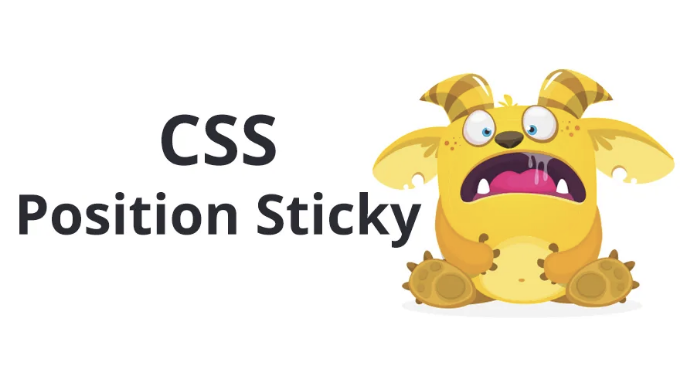
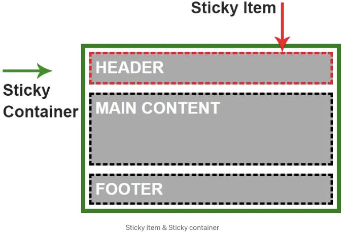
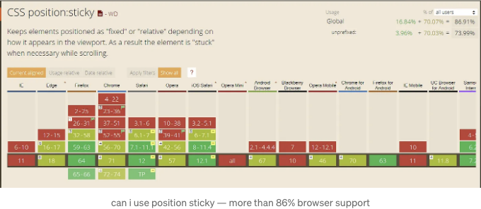
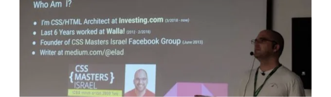

CSS position sticky은 브라우저 지원이 매우 좋지만, 대부분의 개발자들이 사용하지 않고 있어요. 

그 이유는 두 가지입니다: 첫째, 좋은 브라우저 지원을 기다린 기간이 너무 길었기 때문이에요. 브라우저 지원이 오래 걸리다가 지원이 되었을 때는 이미 해당 기능을 잊어버렸기 때문이죠.

두 번째 이유는 대부분의 개발자들이 이 작동 방식에 대한 논리를 완전히 이해하지 못하기 때문이에요. 그 때 저가 도와드릴게요.



<!-- ui-log 수평형 -->
<ins class="adsbygoogle"
  style="display:block"
  data-ad-client="ca-pub-4877378276818686"
  data-ad-slot="9743150776"
  data-ad-format="auto"
  data-full-width-responsive="true"></ins>
<component is="script">
(adsbygoogle = window.adsbygoogle || []).push({});
</component>

저는 여러분이 CSS Position에 대해 알고 있을 거라고 가정합니다만, 간단히 복습해보겠습니다:

3년 전까지는 static, relative, absolute 및 fixed의 네 가지 CSS Position이 있었습니다.

static 또는 relative와 absolute 또는 fixed 사이의 주요 차이점은 DOM의 흐름에서 차지하는 공간입니다. static 및 relative 위치는 문서의 흐름에서 자연스러운 공간을 유지하는 반면, absolute 및 fixed 위치는 그렇지 않습니다. 그들의 공간이 제거되고 부유 행동을 합니다.

새로운 Position Sticky는 모든 유형과 유사점을 가지고 있으며, 곧 설명하겠습니다.

<!-- ui-log 수평형 -->
<ins class="adsbygoogle"
  style="display:block"
  data-ad-client="ca-pub-4877378276818686"
  data-ad-slot="9743150776"
  data-ad-format="auto"
  data-full-width-responsive="true"></ins>
<component is="script">
(adsbygoogle = window.adsbygoogle || []).push({});
</component>

## position: sticky를 활용한 첫 번째 시도

대부분의 분들이 position: sticky를 활용해보셨을 것으로 가정합니다. 제가 그랬던 것처럼 말이죠. 그런데 얼마 지나지 않아 전 그것을 완전히 이해하지 못했다는 것을 깨달았습니다.

position: sticky를 활용한 첫 번째 시도에서 모든 사람들은 빠르게 이해합니다. 화면에 지정한 위치에 도달했을 때 요소가 고정되는 것을 확인할 수 있죠.

예시:

<!-- ui-log 수평형 -->
<ins class="adsbygoogle"
  style="display:block"
  data-ad-client="ca-pub-4877378276818686"
  data-ad-slot="9743150776"
  data-ad-format="auto"
  data-full-width-responsive="true"></ins>
<component is="script">
(adsbygoogle = window.adsbygoogle || []).push({});
</component>

```css
.some-component{
    position: sticky;
    top: 0;
} 
```

가끔은 작동하고 다른 경우에는 작동하지 않는 문제가 있습니다. 작동할 때는 요소가 고정되지만 스크롤의 다른 부분에서 고정되지 않습니다. 매일 CSS를 다루면서 이 문제를 근본적으로 이해하지 못하는 것은 참을 수 없는 일이었기 때문에 'position: sticky'를 철저히 탐구하기로 결심했습니다.

# Sticky 탐구

이를 실험해보면, 'position: sticky' 스타일이 적용된 요소가 감싸져 있고 해당 요소가 래퍼 요소 내에서 유일한 요소인 경우 이 요소가 'position: sticky'로 정의되었음에도 고정되지 않음을 빠르게 알 수 있습니다.

<!-- ui-log 수평형 -->
<ins class="adsbygoogle"
  style="display:block"
  data-ad-client="ca-pub-4877378276818686"
  data-ad-slot="9743150776"
  data-ad-format="auto"
  data-full-width-responsive="true"></ins>
<component is="script">
(adsbygoogle = window.adsbygoogle || []).push({});
</component>

```js
<!-- 동작하지 않아요!!! -->
<style>
    .sticky{
        position: sticky;
        top: 0;
    }
</style>
<div class="wrapper">
   <div class="sticky">
        몇 가지 내용
   </div>
</div>
```

wrapper 요소 내에 요소를 추가하니까 동작하기 시작했어요.

이유는 무엇인가요?
그 이유는 요소에 position: sticky 스타일을 부여하면 sticky 아이템이 붙을 수 있는 유일한 영역은 sticky 항목의 컨테이너입니다. 아이템은 형제 요소만을 대상으로 붕뜨리기 때문에, 형제 요소가 없으므로 다른 요소 위에 떠 있을 수 있는 요소가 없습니다.

## CSS Position Sticky가 실제로 작동하는 방법!

<!-- ui-log 수평형 -->
<ins class="adsbygoogle"
  style="display:block"
  data-ad-client="ca-pub-4877378276818686"
  data-ad-slot="9743150776"
  data-ad-format="auto"
  data-full-width-responsive="true"></ins>
<component is="script">
(adsbygoogle = window.adsbygoogle || []).push({});
</component>

CSS position: sticky에는 sticky item 및 sticky container 두 가지 주요 부분이 있습니다.

Sticky item은 position: sticky 스타일로 정의한 요소입니다. 뷰포트 위치가 정의한 위치와 일치할 때 해당 요소가 떠다닙니다. 예를 들어 top: 0px와 같이 설정할 수 있습니다.

예시

```js
.some-component {
    position: sticky;
    top: 0px;
}
```

<!-- ui-log 수평형 -->
<ins class="adsbygoogle"
  style="display:block"
  data-ad-client="ca-pub-4877378276818686"
  data-ad-slot="9743150776"
  data-ad-format="auto"
  data-full-width-responsive="true"></ins>
<component is="script">
(adsbygoogle = window.adsbygoogle || []).push({});
</component>

Sticky Container - 스티키 항목을 감싸는 HTML 요소입니다. 이는 스티키 항목이 부유할 수 있는 최대 영역입니다.

position: sticky로 요소를 정의하면 자동으로 부모 요소가 스티키 컨테이너로 정의됩니다!
이것을 기억하는 것이 매우 중요합니다! 컨테이너는 스티키 항목의 범위이며, 항목은 스티키 컨테이너 바깥으로 나갈 수 없습니다.

이것이 이전 예제에서 스티키 항목이 처음부터 고정되지 않았던 이유입니다: 스티키 항목은 스티키 컨테이너의 유일한 자식 요소였기 때문입니다.

CSS Position Sticky의 시각적 예시:

<!-- ui-log 수평형 -->
<ins class="adsbygoogle"
  style="display:block"
  data-ad-client="ca-pub-4877378276818686"
  data-ad-slot="9743150776"
  data-ad-format="auto"
  data-full-width-responsive="true"></ins>
<component is="script">
(adsbygoogle = window.adsbygoogle || []).push({});
</component>




CodePen Example:

## CSS Sticky 동작 이해하기

이전에 말했듯이 CSS Position Sticky는 다른 모든 CSS Position들과는 다르게 동작하지만, 또한 유사한 점이 있습니다. 제게 설명을 해 드릴게요:

<!-- ui-log 수평형 -->
<ins class="adsbygoogle"
  style="display:block"
  data-ad-client="ca-pub-4877378276818686"
  data-ad-slot="9743150776"
  data-ad-format="auto"
  data-full-width-responsive="true"></ins>
<component is="script">
(adsbygoogle = window.adsbygoogle || []).push({});
</component>

상대적(또는 정적) - 스티키로 고정된 요소는 상대적 및 정적 위치와 유사하며 DOM에서 자연적인 갭을 유지합니다(플로우 안에 있음).

고정 - 아이템이 고정되면 위치: 고정과 정확히 같은 모습으로 동작하여 뷰포트의 동일한 위치에 떠다니며 플로우에서 제거됩니다.

절대적 - 고정된 영역의 끝에서 요소가 멈추고 다른 요소 위에 쌓이는데, 마치 상대적 위치가 지정된 컨테이너 내부에서 동작하는 절대적으로 위치가 지정된 요소처럼 작용합니다.

# 아래로 붙어야 해요?!

대부분의 경우 position: sticky를 사용하여 요소를 위쪽에 고정하는 방법은 아래와 같습니다:

```js
.component{
    position: sticky;
    top: 0;
}
```

<!-- ui-log 수평형 -->
<ins class="adsbygoogle"
  style="display:block"
  data-ad-client="ca-pub-4877378276818686"
  data-ad-slot="9743150776"
  data-ad-format="auto"
  data-full-width-responsive="true"></ins>
<component is="script">
(adsbygoogle = window.adsbygoogle || []).push({});
</component>

이것은 정확히 이 목적으로 만들어졌습니다. 이전에는 JavaScript를 사용해야만 했던 일을 지금 할 수 있습니다.

그리고 이를 사용하여 요소를 하단에 고정할 수도 있습니다. 즉, 푸터를 고정 위치로 정의할 수 있고, 스크롤 다운하는 경우 항상 하단에 고정되어 보입니다. 고정된 컨테이너의 끝에 도달하면 요소는 자연스러운 위치에 멈춥니다. 이를 사용하는 것은 요소의 자연 위치가 고정된 컨테이너의 하단인 경우에 더 좋습니다.

전체 예시:

HTML

<!-- ui-log 수평형 -->
<ins class="adsbygoogle"
  style="display:block"
  data-ad-client="ca-pub-4877378276818686"
  data-ad-slot="9743150776"
  data-ad-format="auto"
  data-full-width-responsive="true"></ins>
<component is="script">
(adsbygoogle = window.adsbygoogle || []).push({});
</component>


```js
<main class="main-container">
  <header class="main-header">HEADER</header>
  <div class="main-content">MAIN CONTENT</div>
  <footer class="main-footer">FOOTER</footer>
</main>
```

CSS

```js
.main-footer{     
     position: sticky; 
     bottom: 0;
}
```

Live CodePen Example:

<!-- ui-log 수평형 -->
<ins class="adsbygoogle"
  style="display:block"
  data-ad-client="ca-pub-4877378276818686"
  data-ad-slot="9743150776"
  data-ad-format="auto"
  data-full-width-responsive="true"></ins>
<component is="script">
(adsbygoogle = window.adsbygoogle || []).push({});
</component>

저는 실제로 고정 요약 테이블에 사용하고 있고, 이 방법을 사용하면 매우 잘 작동할 수 있는 고정 푸터 내비게이션을 생각할 수 있어요.

# 브라우저 지원

- Position Sticky는 구현된 모든 주요 최신 브라우저에서 지원되며, 오래된 IE를 제외합니다.
- Safari 브라우저의 경우 -webkit 접두사를 추가해야 합니다.

```css
position: -webkit-sticky; /* Safari */  
position: sticky;
```

<!-- ui-log 수평형 -->
<ins class="adsbygoogle"
  style="display:block"
  data-ad-client="ca-pub-4877378276818686"
  data-ad-slot="9743150776"
  data-ad-format="auto"
  data-full-width-responsive="true"></ins>
<component is="script">
(adsbygoogle = window.adsbygoogle || []).push({});
</component>



# 마지막으로

여기까지입니다.
이 기사를 즐겁게 보고 제 경험에서 배웠으면 좋겠어요.
이 게시물이 마음에 드신다면 박수와 공유를 부탁드립니다 :-)

더 많은 CSS 기사:
왜 CSS HSL 색상이 더 나은가!
새로운 CSS 논리 속성!
CSS 그리드 닌자로 거듭나기!
새로운 반응형 디자인 진화

<!-- ui-log 수평형 -->
<ins class="adsbygoogle"
  style="display:block"
  data-ad-client="ca-pub-4877378276818686"
  data-ad-slot="9743150776"
  data-ad-format="auto"
  data-full-width-responsive="true"></ins>
<component is="script">
(adsbygoogle = window.adsbygoogle || []).push({});
</component>

저는 누구일까요?
저는 CSS 및 HTML 디자인과 아키텍처에 특화된 웹 개발자인 Elad Shechter입니다. Investing.com에서 일하고 있어요.

트위터를 통해 제 활동을 팔로우할 수 있으며, 더 많은 내용은 제 웹사이트에서 찾아볼 수 있어요.



제 페이스북 그룹에서 저를 만날 수도 있어요:
CSS Masters
CSS Masters Israel