CSS 카드 게임의 다이내믹한 세계로 들어오세요! 특정성을 활용하여 동료들과 프레임워크와 싸워서 그들의 CSS를 무시하세요! 클래스, ID 등을 결합하여 다른 모든 CSS 속성에 우승하세요!


# 카드 읽는 방법

모든 카드는 이름과 특정성을 가지고 있습니다.

<!-- ui-log 수평형 -->
<ins class="adsbygoogle"
  style="display:block"
  data-ad-client="ca-pub-4877378276818686"
  data-ad-slot="9743150776"
  data-ad-format="auto"
  data-full-width-responsive="true"></ins>
<component is="script">
(adsbygoogle = window.adsbygoogle || []).push({});
</component>

구체성은 A, B, C 형식을 따릅니다. 예를 들어, 0, 1, 0은 A=0, B=1, C=0을 의미합니다.

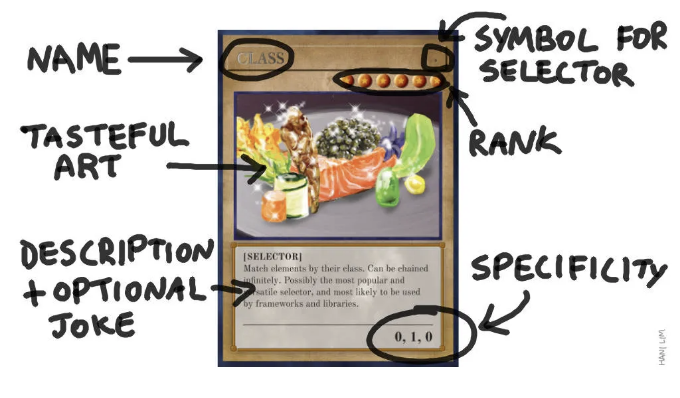

## 규칙

하나 이상의 카드를 결합하여 유효한 선택기를 작성하세요. 각 열의 구체성을 추가하여 선택기의 총 구체성을 얻으세요. 선택기의 구체성이 높으면 승리합니다.

<!-- ui-log 수평형 -->
<ins class="adsbygoogle"
  style="display:block"
  data-ad-client="ca-pub-4877378276818686"
  data-ad-slot="9743150776"
  data-ad-format="auto"
  data-full-width-responsive="true"></ins>
<component is="script">
(adsbygoogle = window.adsbygoogle || []).push({});
</component>

## 특이성 계산

선택자 div.nav.fancy는 2개의 클래스와 1개의 타입을 포함하며, 특이성은 다음과 같이 계산됩니다:

```js
div           0, 0, 1 (타입 선택자)
.nav          0, 1, 0 (클래스 선택자)
.fancy        0, 1, 0 (클래스 선택자)
______________________
TOTAL         0, 2, 1 (총 특이성)
```

다시 말하면:

<!-- ui-log 수평형 -->
<ins class="adsbygoogle"
  style="display:block"
  data-ad-client="ca-pub-4877378276818686"
  data-ad-slot="9743150776"
  data-ad-format="auto"
  data-full-width-responsive="true"></ins>
<component is="script">
(adsbygoogle = window.adsbygoogle || []).push({});
</component>

이미지 태그를 Markdown 형식으로 변경하십시오.

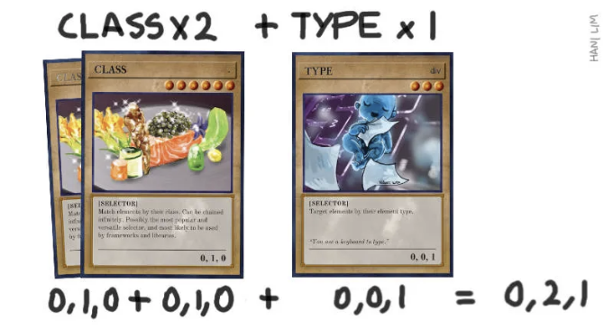

specificity를 계산할 때 이것들이 독립된 column이라는 것을 염두에 두세요! specificity를 계산할 때 이것들이 독립된 column이라는 것을 염두에 두세요! C가 10이라고 해서 selector를 B=1로 "승격"하지 않습니다.

## 더 높은 specificity를 결정하는 방법

column A부터 시작하여 specificity를 비교합니다. 한 selector가 다른 것보다 더 높은 specificity를 가지면 이깁니다. 값이 같으면 다음 column으로 이동합니다. specificity를 비교할 때 A ` B ` C.

<!-- ui-log 수평형 -->
<ins class="adsbygoogle"
  style="display:block"
  data-ad-client="ca-pub-4877378276818686"
  data-ad-slot="9743150776"
  data-ad-format="auto"
  data-full-width-responsive="true"></ins>
<component is="script">
(adsbygoogle = window.adsbygoogle || []).push({});
</component>

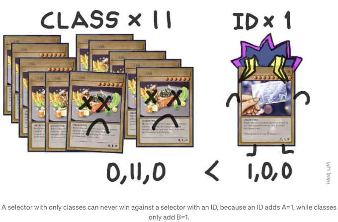

## 동점일 때 어떻게 해야 할까요

만약 두 선택자의 특이성이 동일한 경우, **나중에 선언된** 선택자가 이깁니다.

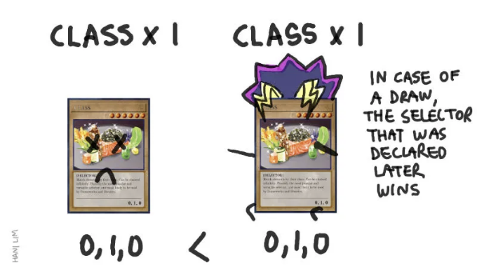

<!-- ui-log 수평형 -->
<ins class="adsbygoogle"
  style="display:block"
  data-ad-client="ca-pub-4877378276818686"
  data-ad-slot="9743150776"
  data-ad-format="auto"
  data-full-width-responsive="true"></ins>
<component is="script">
(adsbygoogle = window.adsbygoogle || []).push({});
</component>

```js
/*
 * 만약 이 파일이 style.css라고 한다면
 */
.class1 { color: blue; }
.class2 { color: red; }
/*
 * class2가 승리합니다. 파일 아래쪽에 있기 때문에
 * 따라서 class1보다 나중에 선언되었습니다
 */
```

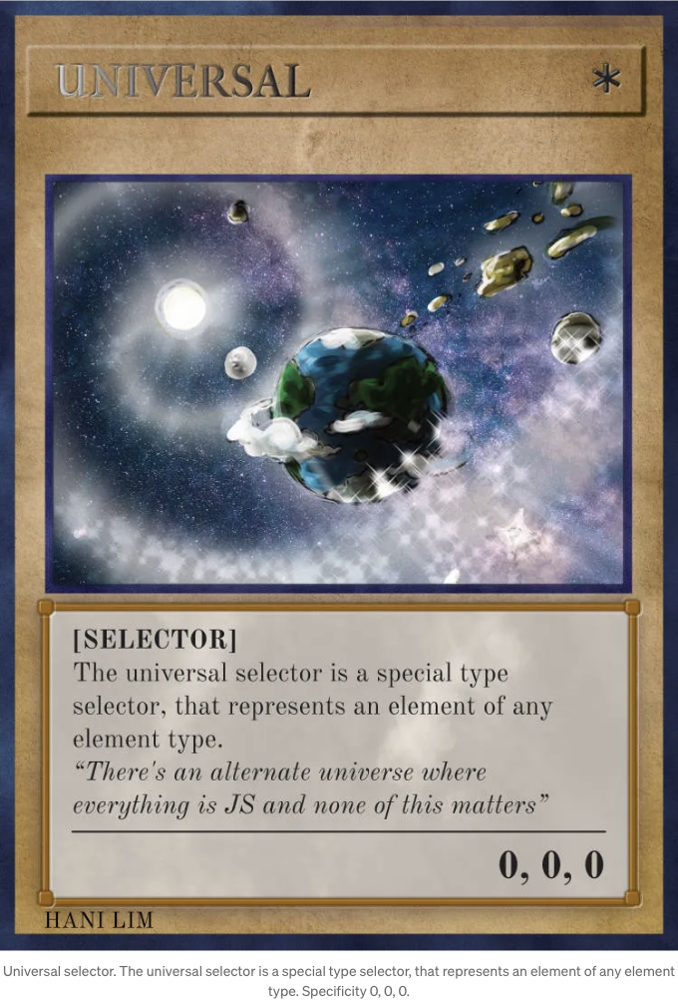

## Universal Selector

페이지의 모든 요소를 대상으로합니다.

<!-- ui-log 수평형 -->
<ins class="adsbygoogle"
  style="display:block"
  data-ad-client="ca-pub-4877378276818686"
  data-ad-slot="9743150776"
  data-ad-format="auto"
  data-full-width-responsive="true"></ins>
<component is="script">
(adsbygoogle = window.adsbygoogle || []).push({});
</component>

특정성 싸움에서 어느 정도 이길 수 있을지에 대한 유용한 정보는 제공하지 않아요.

```js
/* 0, 0, 0 */
* { }
```

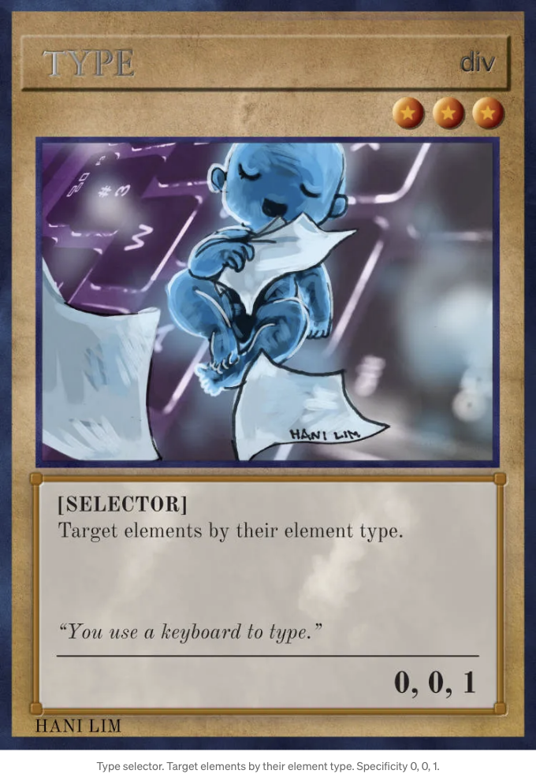

## 타입

<!-- ui-log 수평형 -->
<ins class="adsbygoogle"
  style="display:block"
  data-ad-client="ca-pub-4877378276818686"
  data-ad-slot="9743150776"
  data-ad-format="auto"
  data-full-width-responsive="true"></ins>
<component is="script">
(adsbygoogle = window.adsbygoogle || []).push({});
</component>

해당 요소 유형의 모든 요소를 대상으로합니다. 예를 들어, 모든 p, div, a 등을 대상으로합니다.

시작하는 데 좋습니다.

```js
/* 0, 0, 1 */
div { }
/* 0, 0, 1 */
p { }
```

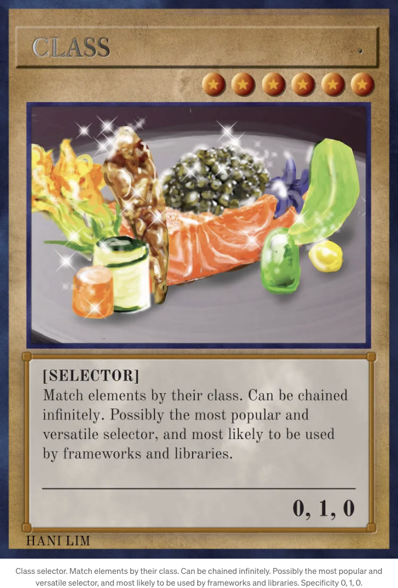

<!-- ui-log 수평형 -->
<ins class="adsbygoogle"
  style="display:block"
  data-ad-client="ca-pub-4877378276818686"
  data-ad-slot="9743150776"
  data-ad-format="auto"
  data-full-width-responsive="true"></ins>
<component is="script">
(adsbygoogle = window.adsbygoogle || []).push({});
</component>

## Class Selector

특정 클래스를 가진 모든 요소를 대상으로합니다. 유형 선택기에 우세합니다.

아마도 가장 다재다능하고 인기 있는 선택기입니다. 명확성을 높이기 위해 무한히 연결할 수 있습니다!

*할 수 있는 것이라고 해서 항상 해야 하는 것은 아니라는 걸 명심하세요*

<!-- ui-log 수평형 -->
<ins class="adsbygoogle"
  style="display:block"
  data-ad-client="ca-pub-4877378276818686"
  data-ad-slot="9743150776"
  data-ad-format="auto"
  data-full-width-responsive="true"></ins>
<component is="script">
(adsbygoogle = window.adsbygoogle || []).push({});
</component>

```js
/* 0, 1, 0 */
.a { }                   
/* 0, 2, 0 */
.a.b { }          
/* 0, 6, 0 */
.a.a.a.a.a.a { }
```

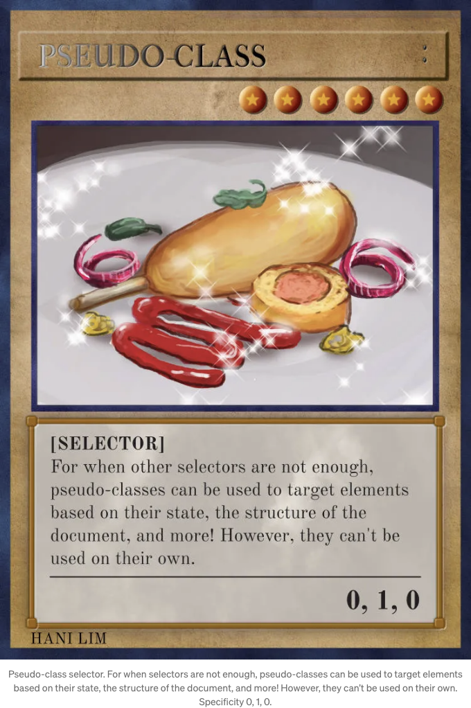

## 가상 클래스

기존 선택자만으로 부족한 경우를 위해. 연쇄적으로 사용하면 각 추가된 가상 클래스가 특이성을 증가시킵니다.

<!-- ui-log 수평형 -->
<ins class="adsbygoogle"
  style="display:block"
  data-ad-client="ca-pub-4877378276818686"
  data-ad-slot="9743150776"
  data-ad-format="auto"
  data-full-width-responsive="true"></ins>
<component is="script">
(adsbygoogle = window.adsbygoogle || []).push({});
</component>

```js
/* 0, 1, 1 */
a:hover { }
      
/* 0, 1, 1 */
a:last-child { }        
/* 0, 1, 1 */
input:invalid { }
/* 0, 2, 1 */
a:last-child:hover { }
```

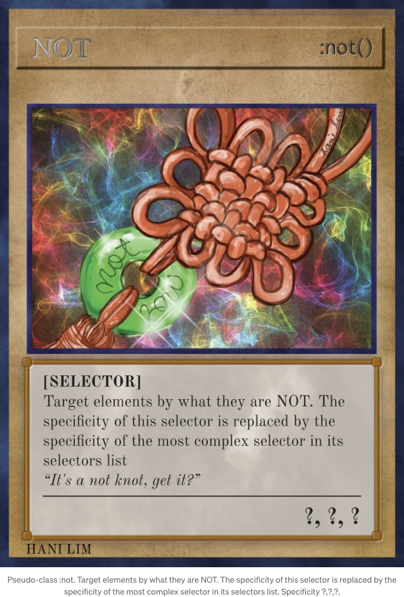

## 가상 클래스: not()

요소가 아닌 것에 기반하여 요소를 대상화하세요!

<!-- ui-log 수평형 -->
<ins class="adsbygoogle"
  style="display:block"
  data-ad-client="ca-pub-4877378276818686"
  data-ad-slot="9743150776"
  data-ad-format="auto"
  data-full-width-responsive="true"></ins>
<component is="script">
(adsbygoogle = window.adsbygoogle || []).push({});
</component>

특정성에 대한 이 카드의 특수 규칙

선택자의 특정성은 해당 선택자 목록 중 가장 복잡한 선택자의 특정성으로 대체됩니다. 즉, () 내부에 있는 내용의 특정성을 계산하세요.

```js
/* 0, 0, 1 */
*:not(div) { }
/* 1, 0, 0 */
*:not(#myid) { }
/* 0, 1, 1 */
a:not(:visited) { }
/* 0, 1, 1 */
div:not(.myclass) { }
```

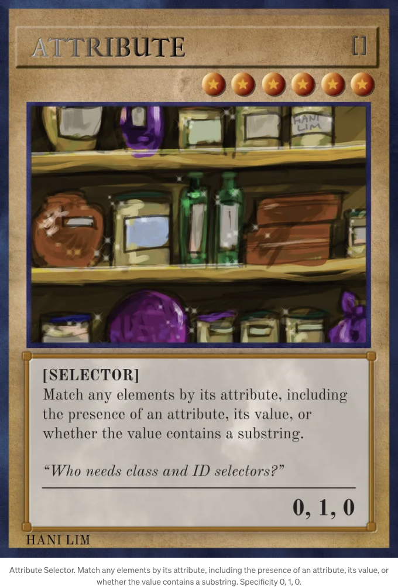

<!-- ui-log 수평형 -->
<ins class="adsbygoogle"
  style="display:block"
  data-ad-client="ca-pub-4877378276818686"
  data-ad-slot="9743150776"
  data-ad-format="auto"
  data-full-width-responsive="true"></ins>
<component is="script">
(adsbygoogle = window.adsbygoogle || []).push({});
</component>

## 속성

속성에 따라 요소를 대상으로합니다. 클래스 선택기와 같은 정도의 특이성을 가지고 있습니다.

의사 클래스처럼 특이성을 높이기 위해 연결할 수 있습니다.

```js
/* 0, 1, 0 */
[alt]                  
/* 0, 2, 0 */
[alt=hello][title=foo]
/* 0, 1, 1 */
a[title=foo]
```

<!-- ui-log 수평형 -->
<ins class="adsbygoogle"
  style="display:block"
  data-ad-client="ca-pub-4877378276818686"
  data-ad-slot="9743150776"
  data-ad-format="auto"
  data-full-width-responsive="true"></ins>
<component is="script">
(adsbygoogle = window.adsbygoogle || []).push({});
</component>

```
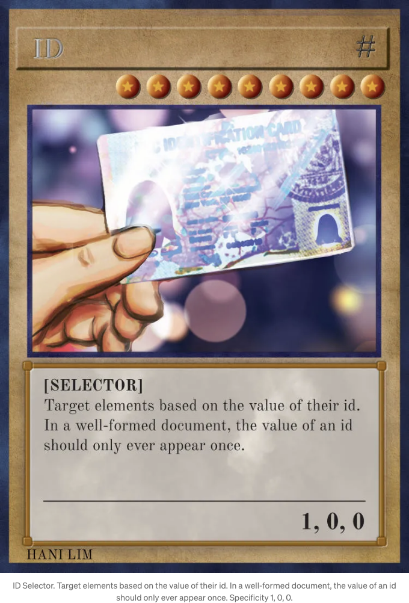

## 아이디

아이디로 요소를 대상으로 지정합니다.

이 선택자는 어떤 클래스, 속성, 가상 클래스 선택자보다 우선순위가 높습니다.
```

<!-- ui-log 수평형 -->
<ins class="adsbygoogle"
  style="display:block"
  data-ad-client="ca-pub-4877378276818686"
  data-ad-slot="9743150776"
  data-ad-format="auto"
  data-full-width-responsive="true"></ins>
<component is="script">
(adsbygoogle = window.adsbygoogle || []).push({});
</component>

이 선택자는 연결할 수 없어요. 어떻게 그리고 왜 요소에 두 개의 아이디가 있을까요?

```js
/* 1, 0, 0 */
#id { }
```

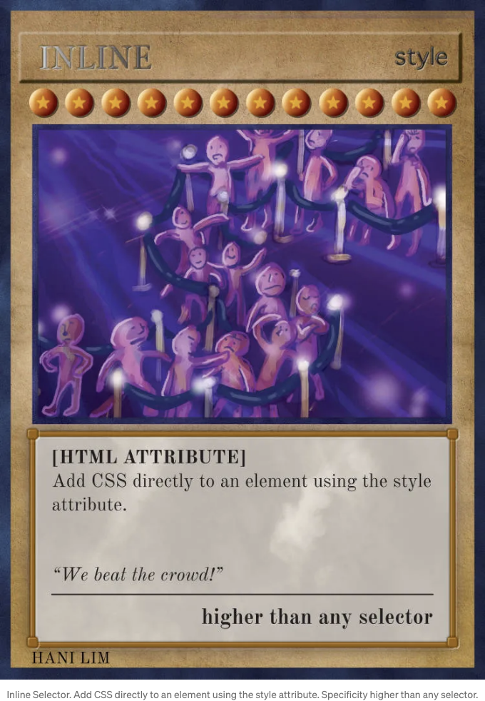

## Inline

<!-- ui-log 수평형 -->
<ins class="adsbygoogle"
  style="display:block"
  data-ad-client="ca-pub-4877378276818686"
  data-ad-slot="9743150776"
  data-ad-format="auto"
  data-full-width-responsive="true"></ins>
<component is="script">
(adsbygoogle = window.adsbygoogle || []).push({});
</component>

제목바로 다음에 ````로 테이블 태그를 Markdown 형식으로 바꾸세요.

<!-- ui-log 수평형 -->
<ins class="adsbygoogle"
  style="display:block"
  data-ad-client="ca-pub-4877378276818686"
  data-ad-slot="9743150776"
  data-ad-format="auto"
  data-full-width-responsive="true"></ins>
<component is="script">
(adsbygoogle = window.adsbygoogle || []).push({});
</component>

# !중요: 가장 강력한 카드

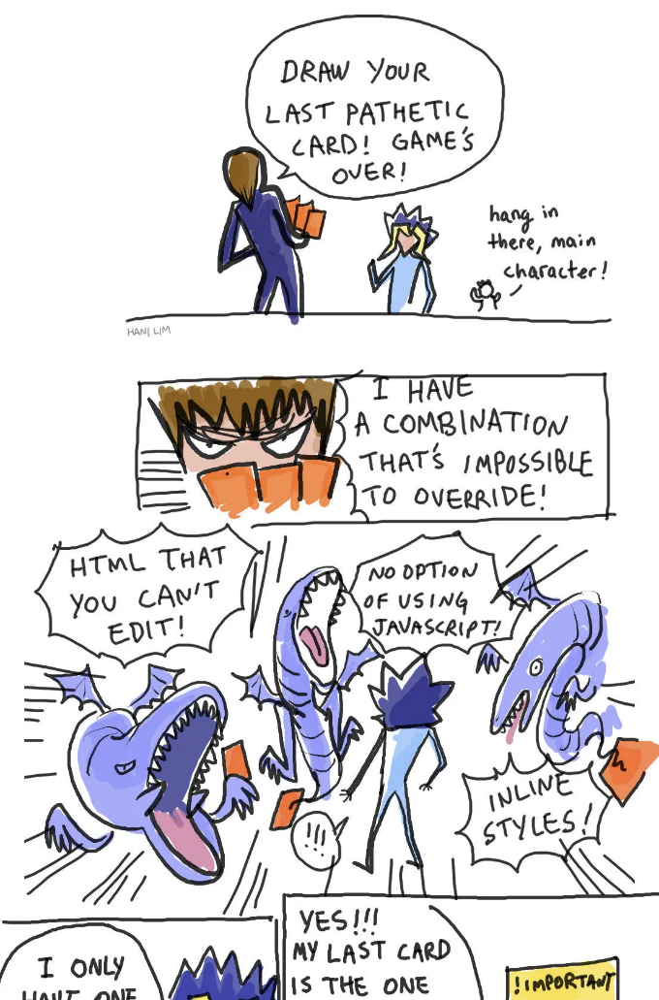

이 카드 세트를 사용하여 모든 다른 CSS를 제거하세요. 다섯 장의 카드를 모두 모으면 CSS에서 가장 강력한 움직임인 !중요를 선언할 수 있습니다.

```js
* {
  color: red !important; /* 다른 것들을 이길 수 있음 */
}
```

<!-- ui-log 수평형 -->
<ins class="adsbygoogle"
  style="display:block"
  data-ad-client="ca-pub-4877378276818686"
  data-ad-slot="9743150776"
  data-ad-format="auto"
  data-full-width-responsive="true"></ins>
<component is="script">
(adsbygoogle = window.adsbygoogle || []).push({});
</component>

!important 선언을 사용하면 CSS 속성은 다른 선택자나 인라인 스타일로도 쉽게 재정의할 수 없게 됩니다.

* 다섯 장의 카드는 특히 시스템을 구축할 때 사용하기 전에 깊이 생각해야 한다는 것을 나타냅니다.

# 지금 카드를 받아보세요!

카드 이미지는 무료로 다운로드하고 인쇄할 수 있습니다. 표준 2.5" x 3.5" 트레이딩 카드 크기로 인쇄할 수 있습니다.

<!-- ui-log 수평형 -->
<ins class="adsbygoogle"
  style="display:block"
  data-ad-client="ca-pub-4877378276818686"
  data-ad-slot="9743150776"
  data-ad-format="auto"
  data-full-width-responsive="true"></ins>
<component is="script">
(adsbygoogle = window.adsbygoogle || []).push({});
</component>

GitHub 저장소: https://github.com/hanilim/css-the-card-game

# CSS 특이성에 대한 더 많은 자료

셀렉터 및 특이성에 대한 공식 규칙서!

유용한 특이성 계산기