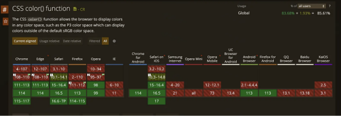

# 배경

6월에 구글에서 새로운 블로그를 게시했어요. 모든 주요 엔진에서 color()를 지원합니다. 아래는 해당 기사 링크입니다: New CSS color spaces and functions in all major engines

다음 예제에서는 지원되는 색상 공간을 볼 수 있습니다.

<!-- ui-log 수평형 -->
<ins class="adsbygoogle"
  style="display:block"
  data-ad-client="ca-pub-4877378276818686"
  data-ad-slot="9743150776"
  data-ad-format="auto"
  data-full-width-responsive="true"></ins>
<component is="script">
(adsbygoogle = window.adsbygoogle || []).push({});
</component>

```js
.valid-css-color-function-colors {
  --srgb: color(srgb 1 1 1);
  --srgb-linear: color(srgb-linear 100% 100% 100% / 50%);
  --display-p3: color(display-p3 1 1 1);
  --rec2020: color(rec2020 0 0 0);
  --a98-rgb: color(a98-rgb 1 1 1 / 25%);
  --prophoto: color(prophoto-rgb 0% 0% 0%);
  --xyz: color(xyz 1 1 1);
}
```

# color() 소개

[color() MDN 링크](링크 주소)

color()는 CSS에서 비교적 새로운 컬러 함수로, 모든 RGB 색 공간에서 색상 값을 지정하는 일관적인 방법을 제공합니다. rgb() 및 hsl() 같은 기존 함수에 비해 함수의 장점은 다음과 같습니다:

<!-- ui-log 수평형 -->
<ins class="adsbygoogle"
  style="display:block"
  data-ad-client="ca-pub-4877378276818686"
  data-ad-slot="9743150776"
  data-ad-format="auto"
  data-full-width-responsive="true"></ins>
<component is="script">
(adsbygoogle = window.adsbygoogle || []).push({});
</component>

- 통합 구문은 다양한 색 공간에 액세스하여 더 간결합니다 ✨.
- 미래에 새로운 표준 색 감도가 있으면 새로운 값을 함수에 추가하면 되어 새로운 함수를 추가할 필요가 없습니다 🔄.
- 색상 관리에 유용하며, 브라우저는 장치 색상 감도에 따라 색상 변환을 수행합니다 🖥️🎨.

# color() 문법

color() 함수의 구문은 다음과 같습니다:

```js
color(display-p3 1 0.5 0);
color(display-p3 1 0.5 0 / .5);
```

<!-- ui-log 수평형 -->
<ins class="adsbygoogle"
  style="display:block"
  data-ad-client="ca-pub-4877378276818686"
  data-ad-slot="9743150776"
  data-ad-format="auto"
  data-full-width-responsive="true"></ins>
<component is="script">
(adsbygoogle = window.adsbygoogle || []).push({});
</component>

컬러스페이스 값은 다음과 같습니다

- 컬러스페이스 네임스페이스 🎨
- 예시: srgb, srgb-linear, display-p3, a98-rgb, prophoto-rgb, rec2020, xyz, xyz-d50, 그리고 xyz-d65. 🌐
- p1, p2, p3 🎚️
- 컬러 스페이스에 사용할 숫자 또는 백분율 매개변수 값 ⚙️
선택적인 알파 값을 가질 수 있습니다 🔍

다음과 같은 컬러 스페이스가 있을 수 있습니다:

- srgb: 표준 RGB 컬러 감마 🌈
- display-p3: 영화와 TV용으로 사용되는 와이드 컬러 감마 📺
- a98-rgb: Adobe RGB 컬러 감마 🖌️
- prophoto-rgb: ProPhoto RGB 컬러 감마 📸
- rec2020: UHDTV 및 다른 와이드 컬러 감마 포맷들
- color(srgb 0 0 1) // sRGB 컬러 값 0, 0, 1 🔵
- color(display-p3 0 0 1) // 와이드 컬러 감마의 디스플레이 P3 파랑 🔷

<!-- ui-log 수평형 -->
<ins class="adsbygoogle"
  style="display:block"
  data-ad-client="ca-pub-4877378276818686"
  data-ad-slot="9743150776"
  data-ad-format="auto"
  data-full-width-responsive="true"></ins>
<component is="script">
(adsbygoogle = window.adsbygoogle || []).push({});
</component>

# color() 사용 예시

color() 함수는 색상 값을 예상하는 CSS의 어디에서나 사용할 수 있습니다. 다음은 몇 가지 예시입니다: 텍스트 색상:

```js
.text {
  color: color(display-p3 0 0 1);
}
```

배경 색상:

<!-- ui-log 수평형 -->
<ins class="adsbygoogle"
  style="display:block"
  data-ad-client="ca-pub-4877378276818686"
  data-ad-slot="9743150776"
  data-ad-format="auto"
  data-full-width-responsive="true"></ins>
<component is="script">
(adsbygoogle = window.adsbygoogle || []).push({});
</component>

```js
.bg {
  background-color: color(prophoto-rgb 0 1 0);
}
```

그라데이션 색상:

```js
.gradient {
  background: linear-gradient(
    to right,
    color(display-p3 0 0 1),
    color(rec2020 0 1 0)
  );
}
```

SVG 그래픽 채우기:

<!-- ui-log 수평형 -->
<ins class="adsbygoogle"
  style="display:block"
  data-ad-client="ca-pub-4877378276818686"
  data-ad-slot="9743150776"
  data-ad-format="auto"
  data-full-width-responsive="true"></ins>
<component is="script">
(adsbygoogle = window.adsbygoogle || []).push({});
</component>

```js
.icon {
  fill: color(a98-rgb 1 0 0);
}
```

# 어떤 웹 사이트나 애플리케이션이 color()를 사용해야 할까요?

color() 함수는 주로 다음과 같은 유형의 웹 사이트와 애플리케이션에 적합합니다:

- 광대한 색상 범위 및 고화질 색상이 필요한 웹 사이트: 🎥 비디오 웹사이트, 🖼️ 제품 전시 웹사이트, 🌟 고화질 디스플레이 웹사이트 등.
- 색상 관리가 필요한 사이트: 🎨 색상 관리 사이트 및 기기 간 색상 일관성이 필요한 사이트.
- 창의적이고 예술적인 웹사이트: ✨ 디자이너들은 다른 CSS 기술과 결합하여 아름다운 시각 효과를 만들 수 있습니다. 🎨
- 미래의 HDR 디스플레이 웹사이트: 🌈 color()는 더 넓은 색상 범위와 HDR이 있는 웹사이트에 대비하는 데 도움이 됩니다. 그러므로, 총적으로 보면 color()는 색상에 민감하고 미래를 내다보는 웹사이트에 많은 이점을 제공하며, CSS에서 강력한 색상 기능입니다 💪.

<!-- ui-log 수평형 -->
<ins class="adsbygoogle"
  style="display:block"
  data-ad-client="ca-pub-4877378276818686"
  data-ad-slot="9743150776"
  data-ad-format="auto"
  data-full-width-responsive="true"></ins>
<component is="script">
(adsbygoogle = window.adsbygoogle || []).push({});
</component>

# 친절한 영어로 🚀

In Plain English 커뮤니티에 참여해 주셔서 감사합니다! 떠나시기 전에:

- 작가를 클랩하고 팔로우해주세요 ️👏️️
- 팔로우하기: X | LinkedIn | YouTube | Discord | 뉴스레터
- 다른 플랫폼 방문하기: Stackademic | CoFeed | Venture | Cubed
- PlainEnglish.io에서 더 많은 콘텐츠를 만나보세요