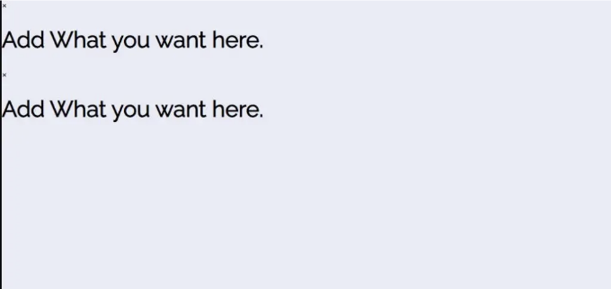

안녕하세요, 코더님, Codewithrandom 블로그에 오신 것을 환영합니다. 이 글에서는 HTML과 CSS를 사용하여 챗봇 템플릿을 만드는 방법을 알아볼 거에요. 이 템플릿은 무료이며, 디자인에는 메시지 UI와 수신 메시지 템플릿이 포함되어 있습니다.

먼저 HTML 코드를 공유하고, 그 다음에는 챗봇 템플릿 디자인에 대한 CSS 코드를 공유할 거에요.

챗봇 템플릿 프로젝트에서는 조금의 자바스크립트를 사용합니다. 챗을 클릭하면 챗봇 UI 템플릿이 채팅을 위해 팝업됩니다. 그래서 우리는 JS를 사용해요.

학습자 여러분들은 웹사이트를 로딩한 후 왼쪽 하단에 작은 메시지 아이콘을 볼 수 있었을 겁니다. 클릭하면 웹사이트 핸들러나 봇(AI)과 채팅을 할 수 있는 팝업 미리보기가 나타납니다.

<!-- ui-log 수평형 -->
<ins class="adsbygoogle"
  style="display:block"
  data-ad-client="ca-pub-4877378276818686"
  data-ad-slot="9743150776"
  data-ad-format="auto"
  data-full-width-responsive="true"></ins>
<component is="script">
(adsbygoogle = window.adsbygoogle || []).push({});
</component>

알지 못하는 것이 있다면 이 블로그에 참여해 보세요. 스크롤을 내리는 손가락만이 자유로운지 확인해주세요.


안녕, 학습자 여러분..!

이 블로그에서는 작동 방식을 알려주는 대신 채팅 상자 레이아웃이나 팝업 레이아웃을 어떻게 디자인할 수 있는지를 밀접히 살펴볼 것입니다.

<!-- ui-log 수평형 -->
<ins class="adsbygoogle"
  style="display:block"
  data-ad-client="ca-pub-4877378276818686"
  data-ad-slot="9743150776"
  data-ad-format="auto"
  data-full-width-responsive="true"></ins>
<component is="script">
(adsbygoogle = window.adsbygoogle || []).push({});
</component>

저 외에도 사용자와의 상호작용이 더욱 높아요. 페이지의 동적 움직임이 보여줘요. 프로젝트에 대한 아이디어를 얻었기를 바래요.

저희 프로젝트를 살펴볼까요?


메시지 보내기를 클릭하면 챗박스 UI가 팝업 될 거에요.

<!-- ui-log 수평형 -->
<ins class="adsbygoogle"
  style="display:block"
  data-ad-client="ca-pub-4877378276818686"
  data-ad-slot="9743150776"
  data-ad-format="auto"
  data-full-width-responsive="true"></ins>
<component is="script">
(adsbygoogle = window.adsbygoogle || []).push({});
</component>


# Html 챗봇 템플릿 코드:-

여기서는 HTML 파일의 구조를 처음부터 추가하지 않겠습니다. 본문 부분만 붙여넣을 것인데, 이는 본문이 브라우저 디자인의 주요 부분이기 때문입니다.

HTML 섹션에는 다음 부분이 있습니다. 먼저, `chat-box-header` 클래스를 갖는 div가 있습니다. 이 안에는 아이콘과 함께 'Message us'라고 쓰인 버튼이 있습니다. 별도의 Div 아래에는 UI 디자인 요소가 있습니다.

<!-- ui-log 수평형 -->
<ins class="adsbygoogle"
  style="display:block"
  data-ad-client="ca-pub-4877378276818686"
  data-ad-slot="9743150776"
  data-ad-format="auto"
  data-full-width-responsive="true"></ins>
<component is="script">
(adsbygoogle = window.adsbygoogle || []).push({});
</component>

아래 코드를 참고해서 IDE나 CSS 스타일링 없이 HTML만으로 디자인하는 환경에서 실행해보세요.

```js
<div class="chat-box">
    <div class="chat-box-header">
        <h3>Message Us</h3>
        <p><i class="fa fa-times"></i></p>
    </div>
    <div class="chat-box-body">
        <div class="chat-box-body-send">
            <p>This is my message.</p>
            <span>12:00</span>
        </div>
        <div class="chat-box-body-receive">
            <p>This is my message.</p>
            <span>12:00</span>
        </div>
        <div class="chat-box-body-receive">
            <p>This is my message.</p>
            <span>12:00</span>
        </div>
        <div class="chat-box-body-send">
            <p>This is my message.</p>
            <span>12:00</span>
        </div>
        <div class="chat-box-body-send">
            <p>This is my message.</p>
            <span>12:00</span>
        </div>
        <div class="chat-box-body-receive">
            <p>This is my message.</p>
            <span>12:00</span>
        </div>
        <div class="chat-box-body-receive">
            <p>This is my message.</p>
            <span>12:00</span>
        </div>
        <div class="chat-box-body-send">
            <p>This is my message.</p>
            <span>12:00</span>
        </div>
    </div>
    <div class="chat-box-footer">
        <button id="addExtra"><i class="fa fa-plus"></i></button>
        <input placeholder="Enter Your Message" type="text" />
        <i class="send far fa-paper-plane"></i>
    </div>
</div>
<div class="chat-button"><span></span></div>
<div class="modal">
    <div class="modal-content">
        <span class="modal-close-button">&times;</span>
        <h1>Add What you want here.</h1>
    </div>
</div>
```

# Html + CSS 챗봇 템플릿:-

CSS를 사용하여 입력 태그 버튼을 디자인하고 반응형으로 만들어보겠습니다.

<!-- ui-log 수평형 -->
<ins class="adsbygoogle"
  style="display:block"
  data-ad-client="ca-pub-4877378276818686"
  data-ad-slot="9743150776"
  data-ad-format="auto"
  data-full-width-responsive="true"></ins>
<component is="script">
(adsbygoogle = window.adsbygoogle || []).push({});
</component>

아래 코드를 추가하면 더 많은 분석이 가능합니다. 저속된 HTML 파일을 추가하고 마법을 경험해 보세요.

```js
@import url("https://fonts.googleapis.com/css?family=Raleway|Ubuntu&display=swap");
body {
    background: #E8EBF5;
    padding: 0;
    margin: 0;
    font-family: Raleway;
}
.chat-box {
    height: 90%;
    width: 400px;
    position: absolute;
    margin: 0 auto;
    overflow: hidden;
    display: -webkit-box;
    display: -ms-flexbox;
    display: flex;
    -webkit-box-orient: vertical;
    -webkit-box-direction: normal;
    -ms-flex-direction: column;
    flex-direction: column;
    z-index: 15;
    box-shadow: 0 0 10px rgba(0, 0, 0, 0.005);
    right: 0;
    bottom: 0;
    margin: 15px;
    background: #fff;
    border-radius: 15px;
    visibility: hidden;
    &-header {
        height: 8%;
        border-top-left-radius: 15px;
        border-top-right-radius: 15px;
        display: flex;
        font-size: 14px;
        padding: 0.5em 0;
        box-shadow: 0 0 3px rgba(0, 0, 0, 0.2);
        box-shadow: 0 0 3px rgba(0, 0, 0, 0.2),
            0 -1px 10px rgba(172, 54, 195, 0.3);
        box-shadow: 0 1px 10px rgba(0, 0, 0, 0.025);
        & h3 {
            font-family: ubuntu;
            font-weight: 400;
            float: left;
            position: absolute;
            left: 25px;
        }
        & p {
            float: right;
            position: absolute;
            right: 16px;
            cursor: pointer;
            height: 50px;
            width: 50px;
            text-align: center;
            line-height: 3.25;
            margin: 0;
        }
    }
    &-body {
        height: 75%;
        background: #f8f8f8;
        overflow-y: scroll;
        padding: 12px;
        &-send {
            width: 250px;
            float: right;
            background: white;
            padding: 10px 20px;
            border-radius: 5px;
            box-shadow: 0 0 10px rgba(0, 0, 0, 0.015);
            margin-bottom: 14px;
            & p {
                margin: 0;
                color: #444;
                font-size: 14px;
                margin-bottom: 0.25rem;
            }
            & span {
                float: right;
                color: #777;
                font-size: 10px;
            }
        }
        &-receive {
            width: 250px;
            float: left;
            background: white;
            padding: 10px 20px;
            border-radius: 5px;
            box-shadow: 0 0 10px rgba(0, 0, 0, 0.015);
            margin-bottom: 14px;
            & p {
                margin: 0;
                color: #444;
                font-size: 14px;
                margin-bottom: 0.25rem;
            }
            & span {
                float: right;
                color: #777;
                font-size: 10px;
            }
        }
        &::-webkit-scrollbar {
            width: 5px;
            opacity: 0;
        }
    }
    &-footer {
        position: relative;
        display: flex;
        & button {
            border: none;
            padding: 16px;
            font-size: 14px;
            background: white;
            cursor: pointer;
            &:focus {
                outline: none;
            }
        }
        & input {
            padding: 10px;
            border: none;
            -webkit-appearance: none;
            border-radius: 50px;
            background: whitesmoke;
            margin: 10px;
            font-family: ubuntu;
            font-weight: 600;
            color: #444;
            width: 280px;
            &:focus {
                outline: none;
            }
        }
        & .send {
            vertical-align: middle;
            align-items: center;
            justify-content: center;
            transform: translate(0px, 20px);
            cursor: pointer;
        }
    }
}
.chat-button {
    padding: 25px 16px;
    background: #2C50EF;
    width: 120px;
    position: absolute;
    bottom: 0;
    right: 0;
    margin: 15px;
    border-top-left-radius: 25px;
    border-top-right-radius: 25px;
    border-bottom-left-radius: 25px;
    box-shadow: 0 2px 15px rgba(#2C50EF, 0.21);
    cursor: pointer;
    & span {
        &::before {
            content: "";
            height: 15px;
            width: 15px;
            background: #47cf73;
            position: absolute;
            transform: translate(0, -7px);
            border-radius: 15px;
        }
        &::after {
            content: "Message Us";
            font-size: 14px;
            color: white;
            position: absolute;
            left: 50px;
            top: 18px;
        }
    }
}
.modal {
    position: fixed;
    left: 0;
    top: 0;
    width: 100%;
    height: 100%;
    background-color: rgba(0, 0, 0, 0.5);
    opacity: 0;
    visibility: hidden;
    transform: scale(1.1);
    transition: visibility 0s linear 0.25s, opacity 0.25s 0s, transform 0.25s;
}
.modal-content {
    position: absolute;
    top: 50%;
    left: 50%;
    transform: translate(-50%, -50%);
    background-color: white;
    padding: 1rem 1.5rem;
    width: 24rem;
    border-radius: 0.5rem;
}
.modal-close-button {
    float: right;
    width: 1.5rem;
    line-height: 1.5rem;
    text-align: center;
    cursor: pointer;
    border-radius: 0.25rem;
    background-color: lightgray;
}
.close-button:hover {
    background-color: darkgray;
}
.show-modal {
    opacity: 1;
    visibility: visible;
    transform: scale(1);
    transition: visibility 0s linear 0s, opacity 0.25s 0s, transform 0.25s;
    z-index: 30;
}
@media screen only and(max-width: 450px) {
    .chat-box {
        min-width: 100% !important;
    }
}
```

Step1: 먼저 구글 "Raleway" 글꼴을 가져와서 챗봇 사용자 인터페이스에서 사용할 수 있도록 합니다.

웹페이지에 기본 스타일을 적용하겠습니다. background 속성을 사용하여 배경을 "연한 파랑"으로 설정하고, font-family 속성을 사용하여 글꼴을 "Raleway"로 변경하고, padding 및 margin을 "제로"로 설정하겠습니다.

<!-- ui-log 수평형 -->
<ins class="adsbygoogle"
  style="display:block"
  data-ad-client="ca-pub-4877378276818686"
  data-ad-slot="9743150776"
  data-ad-format="auto"
  data-full-width-responsive="true"></ins>
<component is="script">
(adsbygoogle = window.adsbygoogle || []).push({});
</component>

```css
@import url('https://fonts.googleapis.com/css?family=Raleway|Ubuntu&display=swap');
body {
    background: #E8EBF5;
    padding: 0;
    margin: 0;
    font-family: Raleway;
}
```

Step2: 높이와 너비를 클래스 선택자 (.chat-box)를 사용하여 각각 "90%"와 "400px"로 조정하고, position 속성을 "absolute"로 설정합니다. 오버플로우는 overflow 속성을 사용하여 "hidden"으로 구성했습니다.

```css
.chat-box {
    height: 90%;
    width: 400px;
    position: absolute;
    margin: 0 auto;
    overflow: hidden;
    display: -webkit-box;
    display: -ms-flexbox;
    display: flex;
    -webkit-box-orient: vertical;
    -webkit-box-direction: normal;
    -ms-flex-direction: column;
    flex-direction: column;
    z-index: 15;
    box-shadow: 0 0 10px rgba(0, 0, 0, 0.005);
    right: 0;
    bottom: 0;
    margin: 15px;
    background: #fff;
    border-radius: 15px;
    visibility: hidden;
}
.chat-box-header {
    height: 8%;
    border-top-left-radius: 15px;
    border-top-right-radius: 15px;
    display: flex;
    font-size: 14px;
    padding: .5em 0;
    box-shadow: 0 0 3px rgba(0, 0, 0, .2);
    box-shadow: 0 0 3px rgba(0, 0, 0, .2), 0 -1px 10px rgba(172, 54, 195, 0.3);
    box-shadow: 0 1px 10px rgba(0, 0, 0, 0.025);
}
.chat-box-header h3 {
    font-family: ubuntu;
    font-weight: 400;
    float: left;
    position: absolute;
    left: 25px;
}
.chat-box-header p {
    float: right;
    position: absolute;
    right: 16px;
    cursor: pointer;
    height: 50px;
    width: 50px;
    text-align: center;
    line-height: 3.25;
    margin: 0;
}
.chat-box-body {
    height: 75%;
    background: #f8f8f8;
    overflow-y: scroll;
    padding: 12px;
}
...
```


```

<!-- ui-log 수평형 -->
<ins class="adsbygoogle"
  style="display:block"
  data-ad-client="ca-pub-4877378276818686"
  data-ad-slot="9743150776"
  data-ad-format="auto"
  data-full-width-responsive="true"></ins>
<component is="script">
(adsbygoogle = window.adsbygoogle || []).push({});
</component>

**단계3:** 이제 우리는 클래스 선택자(.chart-button)를 사용하여 버튼에 스타일을 추가할 것입니다. 우리는 패딩을 25px로 지정하고 배경색을 "dark-blue"로 설정하며 버튼의 너비는 "120px"로 지정하고 위치는 "절대"로 설정할 것입니다. Bottom 및 right 속성을 사용하여 아래 및 오른쪽으로부터 0의 공간을 남기겠습니다.

미디어 쿼리를 사용하여 챗봇 UI에 반응형 요소를 추가할 것입니다. 화면 크기가 정의된 너비 이하 또는 같을 경우 챗봇의 너비를 100%로 변경할 것입니다.

```js
.chat-button {
    padding: 25px 16px;
    background: #2C50EF;
    width: 120px;
    position: absolute;
    bottom: 0;
    right: 0;
    margin: 15px;
    border-top-left-radius: 25px;
    border-top-right-radius: 25px;
    border-bottom-left-radius: 25px;
    box-shadow: 0 2px 15px rgba(#2C50EF, .21);
    cursor: pointer;
    & span {
        &::before {
            content: '';
            height: 15px;
            width: 15px;
            background: #47cf73;
            position: absolute;
            transform: translate(0, -7px);
            border-radius: 15px;
        }
        &::after {
            content: "Message Us";
            font-size: 14px;
            color: white;
            position: absolute;
            left: 50px;
            top: 18px;
        }
    }
}
```

```js
.modal {
    position: fixed;
    left: 0;
    top: 0;
    width: 100%;
    height: 100%;
    background-color: rgba(0, 0, 0, 0.5);
    opacity: 0;
    visibility: hidden;
    transform: scale(1.1);
    transition: visibility 0s linear 0.25s, opacity 0.25s 0s, transform 0.25s;
}
.modal-content {
    position: absolute;
    top: 50%;
    left: 50%;
    transform: translate(-50%, -50%);
    background-color: white;
    padding: 1rem 1.5rem;
    width: 24rem;
    border-radius: 0.5rem;
}
.modal-close-button {
    float: right;
    width: 1.5rem;
    line-height: 1.5rem;
    text-align: center;
    cursor: pointer;
    border-radius: 0.25rem;
    background-color: lightgray;
}
.close-button:hover {
    background-color: darkgray;
}
.show-modal {
    opacity: 1;
    visibility: visible;
    transform: scale(1.0);
    transition: visibility 0s linear 0s, opacity 0.25s 0s, transform 0.25s;
    z-index: 30;
}
@media screen only and(max-width: 450px) {
    .chat-box {
        min-width: 100% !important;
    }
}
```

<!-- ui-log 수평형 -->
<ins class="adsbygoogle"
  style="display:block"
  data-ad-client="ca-pub-4877378276818686"
  data-ad-slot="9743150776"
  data-ad-format="auto"
  data-full-width-responsive="true"></ins>
<component is="script">
(adsbygoogle = window.adsbygoogle || []).push({});
</component>


# 챗봇 템플릿을 위한 JavaScript 코드:-

자바스크립트 부분에서는 많은 로직을 사용하지 않았습니다. 단지 login 버튼에 onclick 함수를 사용했습니다.

로그인 폼을 클릭하면 챗박스 UI 폼 페이지가 표시됩니다.

<!-- ui-log 수평형 -->
<ins class="adsbygoogle"
  style="display:block"
  data-ad-client="ca-pub-4877378276818686"
  data-ad-slot="9743150776"
  data-ad-format="auto"
  data-full-width-responsive="true"></ins>
<component is="script">
(adsbygoogle = window.adsbygoogle || []).push({});
</component>

비슷하게, '취소' 버튼을 클릭하면 숨겨집니다.

```js
$('.chat-button').on('click', function() {
    $('.chat-button').css({
        "display": "none"
    });
    $('.chat-box').css({
        "visibility": "visible"
    });
});
$('.chat-box .chat-box-header p').on('click', function() {
    $('.chat-button').css({
        "display": "block"
    });
    $('.chat-box').css({
        "visibility": "hidden"
    });
}) $("#addExtra").on("click", function() {
    $(".modal").toggleClass("show-modal");
}) $(".modal-close-button").on("click", function() {
    $(".modal").toggleClass("show-modal");
})
```

코드의 시작 부분에서 채팅 버튼은 클릭 이벤트가 지정되어 있습니다.

이제 채팅 상자가 숨겨진 상태에서 채팅 버튼이 보이게 됩니다.

<!-- ui-log 수평형 -->
<ins class="adsbygoogle"
  style="display:block"
  data-ad-client="ca-pub-4877378276818686"
  data-ad-slot="9743150776"
  data-ad-format="auto"
  data-full-width-responsive="true"></ins>
<component is="script">
(adsbygoogle = window.adsbygoogle || []).push({});
</component>

다음 코드 줄에는 .chat-box 헤더 p 요소에 대한 onclick 이벤트가 추가되어 있습니다. 그 이벤트가 트리거될 때, display 속성이 block에서 none으로 변경됩니다.

#addExtra를 클릭하면 마지막 코드 줄이 visibility 속성을 hidden에서 visible로 변경합니다.

사용자가 채팅 버튼을 누르면 코드에 의해 채팅 상자가 숨겨지고, 닫기 버튼을 클릭하면 다시 나타납니다.

이 블로그를 통해... Chatbot 템플릿을 설계하는 방법을 배웠습니다.

<!-- ui-log 수평형 -->
<ins class="adsbygoogle"
  style="display:block"
  data-ad-client="ca-pub-4877378276818686"
  data-ad-slot="9743150776"
  data-ad-format="auto"
  data-full-width-responsive="true"></ins>
<component is="script">
(adsbygoogle = window.adsbygoogle || []).push({});
</component>

이제 여러분의 리뷰를 기다리고 있어요. 그래서, 블로그는 어땠나요, Learners?

만약 이와 같이 좀 더 깔끔한 블로그를 원하시면, CodewithRandom 블로그 사이트를 확인해주세요. 매일매일 학습할 수 있도록 우리와 함께해주세요.

이 주제를 이해하게 도와드릴 수 있었기를 바라며, 이 블로그에서 새로운 것을 배웠다면 좋겠어요. 어려움이 있으시다면 문제를 자유롭게 댓글로 남겨주세요. 그리고 만약 마음에 드셨다면, 댓글 섹션에서 사랑을 보여주시기 바랍니다. 이것이 블로거의 마음을 채워 기쁨을 주어 더 많고 새로운 블로그를 작성할 수 있게 해줍니다.

Instagram에서 저를 팔로우할 수 있습니다.

<!-- ui-log 수평형 -->
<ins class="adsbygoogle"
  style="display:block"
  data-ad-client="ca-pub-4877378276818686"
  data-ad-slot="9743150776"
  data-ad-format="auto"
  data-full-width-responsive="true"></ins>
<component is="script">
(adsbygoogle = window.adsbygoogle || []).push({});
</component>

**@Ankit kumar**님의 글

**@Abhishek dana**님의 코드

# 이 챗봇 템플릿을 위해 어떤 코드 편집기를 사용하시나요?

제가 개인적으로 추천하는 것은 VS Code Studio입니다. 사용하기 간편하고 직관적이에요.

<!-- ui-log 수평형 -->
<ins class="adsbygoogle"
  style="display:block"
  data-ad-client="ca-pub-4877378276818686"
  data-ad-slot="9743150776"
  data-ad-format="auto"
  data-full-width-responsive="true"></ins>
<component is="script">
(adsbygoogle = window.adsbygoogle || []).push({});
</component>

# 이 프로젝트는 반응형인가요?

네, 이 챗봇 템플릿 프로젝트는 반응형입니다.

# 이 프로젝트를 만드는 데 외부 링크를 사용했나요?

네, 챗봇에서 아이콘을 표시하기 위해 Font-awesome 아이콘 CDN 링크를 사용했습니다.