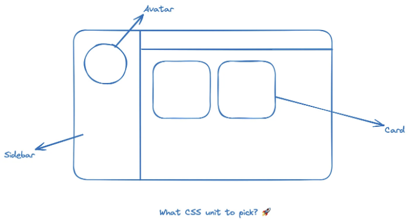

어떤 CSS 단위를 사용해야 할지 궁금했던 적이 있나요? 우리는 종종 상황에 따라 혼란스러워지며, 픽셀, em, rem 등을 선택할지 결정하기 어려울 때가 있습니다.



단위를 이해하려면 '절대 단위'와 '상대 단위'의 개념에 몰입해야 합니다.

# 절대 단위

<!-- ui-log 수평형 -->
<ins class="adsbygoogle"
  style="display:block"
  data-ad-client="ca-pub-4877378276818686"
  data-ad-slot="9743150776"
  data-ad-format="auto"
  data-full-width-responsive="true"></ins>
<component is="script">
(adsbygoogle = window.adsbygoogle || []).push({});
</component>

절대 단위는 부모 요소나 창 크기와 관계없이 동일한 크기를 가집니다. 이는 요소의 크기를 조절하는 절대 단위를 사용하는 모든 속성이 다른 장치에서 볼 때 동일하게 유지됨을 의미합니다. 이러한 단위들은 반응성이 중요하지 않을 때 유용합니다. 예를 들어, 화소 (px)는 화면용으로 가장 인기 있는 절대 단위이며, 센티미터, 밀리미터, 인치는 인쇄용으로 더 일반적입니다.

# 상대 단위

상대 단위는 부모 요소나 창 크기에 따라 크기가 상대적으로 조절되므로 반응형 웹 애플리케이션을 스타일링하는 데 유용합니다. 예를 들어, 퍼센트 (%), em, 또는 rem이 있습니다.

여기에 특정 단위가 일반적으로 사용되는 몇 가지 사용 사례가 있습니다.

<!-- ui-log 수평형 -->
<ins class="adsbygoogle"
  style="display:block"
  data-ad-client="ca-pub-4877378276818686"
  data-ad-slot="9743150776"
  data-ad-format="auto"
  data-full-width-responsive="true"></ins>
<component is="script">
(adsbygoogle = window.adsbygoogle || []).push({});
</component>

1) 픽셀 (px):

- 테두리, 여백, 안쪽 여백 및 글꼴 크기와 같은 요소에 대한 고정된 크기를 설정합니다.

```js
p {
  border: 2px solid red;
  margin: 10px;
  padding: 10px;
}
```

2) 퍼센트 (%):

<!-- ui-log 수평형 -->
<ins class="adsbygoogle"
  style="display:block"
  data-ad-client="ca-pub-4877378276818686"
  data-ad-slot="9743150776"
  data-ad-format="auto"
  data-full-width-responsive="true"></ins>
<component is="script">
(adsbygoogle = window.adsbygoogle || []).push({});
</component>

- 해당 속성에 대한 부모 요소 값과 관련이 있습니다

```js
.child {

margin: 10%;

}
```

부모 요소의 너비에 대한 10% 여백을 가진 자식 요소를 원하는 경우, 자식 요소가 항상 부모 요소 전체를 채우지 않습니다. 부모 요소의 크기가 변경되면 여백도 그에 맞게 업데이트됩니다.

3) rem:

<!-- ui-log 수평형 -->
<ins class="adsbygoogle"
  style="display:block"
  data-ad-client="ca-pub-4877378276818686"
  data-ad-slot="9743150776"
  data-ad-format="auto"
  data-full-width-responsive="true"></ins>
<component is="script">
(adsbygoogle = window.adsbygoogle || []).push({});
</component>

- 이것은 루트 (예: `html` 요소)의 글꼴 크기와 관련이 있습니다.

```js
.header {

font-size: 2rem;

}
```

글꼴 크기는 루트 요소의 글꼴 크기의 두 배여야 합니다. 부모 컨테이너에 관계없이 모든 제목의 크기가 동일해야 하기 때문에 이런 식으로 제목의 크기를 조절할 수 있습니다.

4) em:

<!-- ui-log 수평형 -->
<ins class="adsbygoogle"
  style="display:block"
  data-ad-client="ca-pub-4877378276818686"
  data-ad-slot="9743150776"
  data-ad-format="auto"
  data-full-width-responsive="true"></ins>
<component is="script">
(adsbygoogle = window.adsbygoogle || []).push({});
</component>

- 현재 요소의 글ꔷ 자 크기와 관계가 있어요

```js
.child {

  font-size: 2em;

}
```

부모 요소의 글ꔷ 자 크기의 반만큼 자녀 요소의 글ꔷ 자 크기가 될 거예요. 섹션 제목 아래 단락 같은 자식 요소의 글ꔷ 자 크기가 이러져요.

# 원 클랩 🎉 나에게 동기 부여 한 번 더 해 주세요 </3

<!-- ui-log 수평형 -->
<ins class="adsbygoogle"
  style="display:block"
  data-ad-client="ca-pub-4877378276818686"
  data-ad-slot="9743150776"
  data-ad-format="auto"
  data-full-width-responsive="true"></ins>
<component is="script">
(adsbygoogle = window.adsbygoogle || []).push({});
</component>

만약 이 글을 즐겨 읽으셨다면, 박수 버튼을 눌러주세요. 제게 더 열심히 일하게 하는 원동력이 됩니다! 😊

# 저와 소통하기

질문이 있으시다면 망설이지 말고 LinkedIn에서 연락해주세요.

