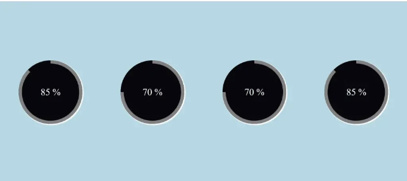

안녕하세요 코더님, Codewithrandom 블로그에 오신 것을 환영합니다. 오늘은 HTML과 CSS를 사용하여 원형 진행 막대를 만드는 방법에 대해 알아볼 것입니다. 어플리케이션에서의 프로세스 진행 상황은 진행 막대를 통해 표시됩니다. 완료된 작업의 양과 아직 미완료인 양이 진행 막대로 표시됩니다. HTML을 사용하여 진행 막대의 다양한 부분을 설계하고 CSS 속성을 사용하여 맞춤 설정할 수 있습니다.



이 자습서는 HTML과 CSS를 사용하여 원형 진행 막대를 만들고 싶은 경우 도움이 될 것입니다. 여기서는 간단한 CSS 원형 진행 막대를 만드는 방법을 보여드리겠습니다.

이 애니메이션은 페이지를 로드할 때 0부터 주어진 의미로 변경될 것입니다. 텍스트의 일부는 애니메이션되지만 이 텍스트는 그렇지 않습니다. 꽤 간단히 구성되어 있습니다.

<!-- ui-log 수평형 -->
<ins class="adsbygoogle"
  style="display:block"
  data-ad-client="ca-pub-4877378276818686"
  data-ad-slot="9743150776"
  data-ad-format="auto"
  data-full-width-responsive="true"></ins>
<component is="script">
(adsbygoogle = window.adsbygoogle || []).push({});
</component>

이 튜토리얼은 원형 진행 막대를 만드는 데 사용한 각 단계를 안내할 것입니다. 그것을 만들기 위해 기본 HTML 및 CSS 개념에 익숙해야합니다.

# 단계 1: 스타일링이 있는 기본 구조 추가

시작하기 위해 원형 진행 막대를 위한 컨테이너를 포함해야합니다. 이를 위해 가장 기본적인 HTML 아이디어를 사용할 것입니다. 원형 진행 막대의 컨테이너는 div 태그를 사용하여 만들어집니다.

```js
<div class="container">
        
</div>
```

<!-- ui-log 수평형 -->
<ins class="adsbygoogle"
  style="display:block"
  data-ad-client="ca-pub-4877378276818686"
  data-ad-slot="9743150776"
  data-ad-format="auto"
  data-full-width-responsive="true"></ins>
<component is="script">
(adsbygoogle = window.adsbygoogle || []).push({});
</component>

우리의 원형 진행 막대에 이제 컨테이너가 생겼습니다. 이제 CSS 개념을 사용하여 컨테이너에 스타일을 추가할 것입니다.

우리는 전체 선택자를 사용하여 웹사이트에 일부 스타일링을 추가할 것입니다. box-sizing 속성을 사용하여 "border-box"를 포함시킬 것입니다. Padding과 margin은 둘 다 "0"의 값을 가지게 됩니다.

```js
* {
  box-sizing: border-box;
  padding: 0;
  margin: 0;
}
```

```js
.container {
  display: flex;
  justify-content: space-around;
  flex-wrap: wrap;
  background-color:lightblue;
  height: 100vh;
  align-items: center;
}
```

<!-- ui-log 수평형 -->
<ins class="adsbygoogle"
  style="display:block"
  data-ad-client="ca-pub-4877378276818686"
  data-ad-slot="9743150776"
  data-ad-format="auto"
  data-full-width-responsive="true"></ins>
<component is="script">
(adsbygoogle = window.adsbygoogle || []).push({});
</component>

.container 클래스 선택기를 사용합니다. display 속성을 "flex"로 설정하고 justify-content 속성을 사용하여 각 프로그레스 바 주변 공간을 설정했습니다. 배경색 속성을 사용하여 프로젝트에 연한 파란색 배경색을 지정할 것입니다.


# 단계 2: 원 추가하기.

원형 진행 막대를 만들기 위해 HTML과 CSS를 사용했습니다. 새 div를 만드는데 이 div는 container 내에 progress 클래스를 가지게 됩니다. CSS에서 클래스 선택기를 사용하여 프로젝트에 원이 표시됩니다.

<!-- ui-log 수평형 -->
<ins class="adsbygoogle"
  style="display:block"
  data-ad-client="ca-pub-4877378276818686"
  data-ad-slot="9743150776"
  data-ad-format="auto"
  data-full-width-responsive="true"></ins>
<component is="script">
(adsbygoogle = window.adsbygoogle || []).push({});
</component>

```js
<div class="container">
    <div class="progress">
```

```js
    </div>
</div>
```

```js
.progress {
  width: 200px;
  height: 200px;
  font-size: 30px;
  color: #fff;
  border-radius: 50%;
  overflow: hidden;
  position: relative;
  background: #07070c;
  text-align: center;
  line-height: 200px;
  margin: 20px;
  box-shadow: 2px 2px 2px 2px white;
}
```

```js
.progress::after {
  content: "";
}
```

<!-- ui-log 수평형 -->
<ins class="adsbygoogle"
  style="display:block"
  data-ad-client="ca-pub-4877378276818686"
  data-ad-slot="9743150776"
  data-ad-format="auto"
  data-full-width-responsive="true"></ins>
<component is="script">
(adsbygoogle = window.adsbygoogle || []).push({});
</component>

클래스 선택기가 사용되었습니다 (.progress). 폭과 높이는 둘 다 200px로 지정됩니다. 글꼴 크기 속성은 글꼴 크기를 30px로 설정하는 데 사용될 것입니다. 테두리 반경 기능을 활용하여 원 모양을 만들 것입니다. 원의 외형을 만들기 위해 테두리 반경을 50%로 설정할 것입니다. 현재 사용 중인 원은 검은 배경을 가지고 있습니다. 원에 3D 외형을 제공하기 위해 박스 그림자도 포함되어 있습니다.


# 단계2: 원에 입력 추가하기.

이제 span 태그를 사용하여 원에 숫자 입력을 추가하고 값의 범위를 0에서 85로 조절할 것입니다. 원형 진행 막대에 진행 상황을 추가하기 위해 진행 상황 div 내에서 3개의 div를 만들 것입니다. 먼저 클래스가 지정된 div를 만들 것입니다 (overlay).

<!-- ui-log 수평형 -->
<ins class="adsbygoogle"
  style="display:block"
  data-ad-client="ca-pub-4877378276818686"
  data-ad-slot="9743150776"
  data-ad-format="auto"
  data-full-width-responsive="true"></ins>
<component is="script">
(adsbygoogle = window.adsbygoogle || []).push({});
</component>

```js
<div class="container">
        <div class="progress">
            <span class="title timer" data-from="0" data-to="85" data-speed="1800">85</span>
            <div class="overlay"></div>
            <div class="left"></div>
            <div class="right"></div>
        </div>
    </div>
```

이제 overlay를 사용하여 너비 50% 및 높이 100%를 추가할 것입니다. 위치는 "absolute" 설정을 가집니다. 원형 진행 막대의 반은 overlay에만 스타일을 적용받습니다. background-color 속성을 사용하여 우리의 overlay에 검은 색 배경을 추가했습니다.

```js
.progress .overlay {
  width: 50%;
  height: 100%;
  position: absolute;
  top: 0;
  left: 0;
  z-index: 1;
  background-color: #07070c;
}
```

# 단계 2: Circle에 애니메이션 진행 막대 추가하기.

<!-- ui-log 수평형 -->
<ins class="adsbygoogle"
  style="display:block"
  data-ad-client="ca-pub-4877378276818686"
  data-ad-slot="9743150776"
  data-ad-format="auto"
  data-full-width-responsive="true"></ins>
<component is="script">
(adsbygoogle = window.adsbygoogle || []).push({});
</component>

저희가 컨테이너 태그에 지정한 div는 진행 상황을 추가하는 데 사용됩니다. "left"와 "right" 클래스가 지정된 두 개의 div가 만들어졌습니다. 이 두 div를 사용하여 원에 진행 표시줄을 추가할 예정입니다.

```js
<div class="container">
        <div class="progress">
            <span class="title timer" data-from="0" data-to="85" data-speed="1800">85</span>
            <div class="overlay"></div>
            <div class="left"></div>
            <div class="right"></div>
        </div>
    </div>
```

이제 (.left & .right) 두 가지 서로 다른 클래스를 활용한 진행 표시줄이 추가될 것입니다. 높이는 100%로, 너비는 50%로 설정되어 있습니다. border 속성을 사용하여 실선의 10px 두께 테두리를 추가할 것입니다. 테두리 반경을 사용하여 요소의 상단 및 오른쪽 모서리에 100px의 테두리 반경을 추가할 것입니다.

이제 프로젝트에 애니메이션을 추가하려면 CSS를 사용한 간단한 개념을 활용했습니다. 애니메이션을 통해 요소는 점진적으로 다른 스타일로 전환될 수 있습니다. 필요할 때마다 마음대로 CSS 변경을 가할 수 있습니다. CSS 애니메이션을 사용하려면 먼저 애니메이션의 키프레임을 정의해야 합니다. 특정 시점에서 요소가 가질 스타일은 키프레임에 저장됩니다.

<!-- ui-log 수평형 -->
<ins class="adsbygoogle"
  style="display:block"
  data-ad-client="ca-pub-4877378276818686"
  data-ad-slot="9743150776"
  data-ad-format="auto"
  data-full-width-responsive="true"></ins>
<component is="script">
(adsbygoogle = window.adsbygoogle || []).push({});
</component>

여기서 우리는 0.5초 동안 로드로 애니메이션을 사용했고, 그런 다음 선형 전진을 사용하여 다른 애니메이션을 추가할 것입니다.

이제 우리는 키프레임을 사용할 것이며 키프레임만을 이용하여 서로 다른 시간 간격에 서로 다른 스타일을 적용할 것입니다.


값에 따라 프로그레스 바가 조정될 것이며, 서로 다른 세 개의 원형 프로그레스 바를 추가하여 각각 다른 값으로 설정할 것입니다. 한 프로그레스 바에 맞춰 단일 프로그레스 바를 만들 수 있다면 더 많은 원형 막대를 추가해 보세요. 결과적으로 더 잘 이해할 수 있을 것입니다.

<!-- ui-log 수평형 -->
<ins class="adsbygoogle"
  style="display:block"
  data-ad-client="ca-pub-4877378276818686"
  data-ad-slot="9743150776"
  data-ad-format="auto"
  data-full-width-responsive="true"></ins>
<component is="script">
(adsbygoogle = window.adsbygoogle || []).push({});
</component>

이제 저희 프로젝트의 비디오 미리보기를 살펴보겠습니다.

# HTML 코드:

```js
<html>
```

```js
<head>
    <link rel="stylesheet" href="style.css">
    <title>Circular Progress Bar</title>
</head>
<body>
    <div class="container">
        <div class="progress">
            <span class="title timer" data-from="0" data-to="85" data-speed="1800">85</span>
            <div class="overlay"></div>
            <div class="left"></div>
            <div class="right"></div>
        </div>
        <div class="progress">
            <span class="title timer" data-from="0" data-to="70" data-speed="1500">70</span>
            <div class="overlay"></div>
            <div class="left"></div>
            <div class="right"></div>
        </div>
        <div class="progress">
            <span class="title timer" data-from="0" data-to="70" data-speed="1500">70</span>
            <div class="overlay"></div>
            <div class="left"></div>
            <div class="right"></div>
        </div>
        <div class="progress">
            <span class="title timer" data-from="0" data-to="85" data-speed="1800">85</span>
            <div class="overlay"></div>
            <div class="left"></div>
            <div class="right"></div>
        </div>
    </div>
</body>
</html>
```

<!-- ui-log 수평형 -->
<ins class="adsbygoogle"
  style="display:block"
  data-ad-client="ca-pub-4877378276818686"
  data-ad-slot="9743150776"
  data-ad-format="auto"
  data-full-width-responsive="true"></ins>
<component is="script">
(adsbygoogle = window.adsbygoogle || []).push({});
</component>

# CSS 코드:

```js
* {
  box-sizing: border-box;
  padding: 0;
  margin: 0;
}
```

```js
.container {
  display: flex;
  justify-content: space-around;
  flex-wrap: wrap;
  background-color: lightblue;
  height: 100vh;
  align-items: center;
}
.progress {
  width: 200px;
  height: 200px;
  font-size: 30px;
  color: #fff;
  border-radius: 50%;
  overflow: hidden;
  position: relative;
  background: #07070c;
  text-align: center;
  line-height: 200px;
  margin: 20px;
  box-shadow: 2px 2px 2px 2px white;
}
.progress::after {
  content: "%";
}
.progress .title {
  position: relative;
  z-index: 100;
}
.progress .overlay {
  width: 50%;
  height: 100%;
  position: absolute;
  top: 0;
  left: 0;
  z-index: 1;
  background-color: #07070c;
}
.progress .left,
.progress .right {
  width: 50%;
  height: 100%;
  position: absolute;
  top: 0;
  left: 0;
  border: 10px solid gray;
  border-radius: 100px 0px 0px 100px;
  border-right: 0;
  transform-origin: right;
}
.progress .left {
  animation: load1 1s linear forwards;
}
.progress:nth-of-type(2) .right,
.progress:nth-of-type(3) .right {
  animation: load2 0.5s linear forwards 1s;
}
.progress:last-of-type .right,
.progress:first-of-type .right {
  animation: load3 0.8s linear forwards 1s;
}
@keyframes load1 {
  0% {
    transform: rotate(0deg);
  }
  100% {
    transform: rotate(180deg);
  }
}
@keyframes load2 {
  0% {
    z-index: 100;
    transform: rotate(180deg);
  }
  100% {
    z-index: 100;
    transform: rotate(270deg);
  }
}
@keyframes load3 {
  0% {
    z-index: 100;
    transform: rotate(180deg);
  }
  100% {
    z-index: 100;
    transform: rotate(315deg);
  }
}
```

이제 HTML 및 CSS를 사용하여 원형 진행 막대를 성공적으로 만들었습니다. 이 프로젝트를 IDE에 직접 복사하여 사용할 수 있습니다. 이 프로젝트를 이해하셨으면, 궁금한 점이 있으면 언제든지 댓글을 남겨주세요!

<!-- ui-log 수평형 -->
<ins class="adsbygoogle"
  style="display:block"
  data-ad-client="ca-pub-4877378276818686"
  data-ad-slot="9743150776"
  data-ad-format="auto"
  data-full-width-responsive="true"></ins>
<component is="script">
(adsbygoogle = window.adsbygoogle || []).push({});
</component>

만약 이 블로그가 도움이 되었다면, 프론트 엔드 프로젝트의 소스 코드를 얻기 위해 구글에서 'code with random'으로 검색해보세요. 그리고 'Code with Random'의 인스타그램 페이지를 팔로우하는 걸 잊지 마세요.

팔로우: codewithrandom

작성자: arun

코드 작성자: Arun

<!-- ui-log 수평형 -->
<ins class="adsbygoogle"
  style="display:block"
  data-ad-client="ca-pub-4877378276818686"
  data-ad-slot="9743150776"
  data-ad-format="auto"
  data-full-width-responsive="true"></ins>
<component is="script">
(adsbygoogle = window.adsbygoogle || []).push({});
</component>

# 이 원형 진행률 표시줄에 사용하는 코드 편집기는 무엇인가요?

저는 사용하기 간편하고 쉬운 VS Code 스튜디오를 추천합니다.

# 이 프로젝트가 반응형인가요?

네! 이 원형 진행률 표시줄은 반응형입니다.

<!-- ui-log 수평형 -->
<ins class="adsbygoogle"
  style="display:block"
  data-ad-client="ca-pub-4877378276818686"
  data-ad-slot="9743150776"
  data-ad-format="auto"
  data-full-width-responsive="true"></ins>
<component is="script">
(adsbygoogle = window.adsbygoogle || []).push({});
</component>

# 이 프로젝트를 만들 때 외부 링크를 사용하고 있나요?

아니요, 순수한 HTML과 CSS를 사용하여 Circular Progress Bar를 만들었어요.