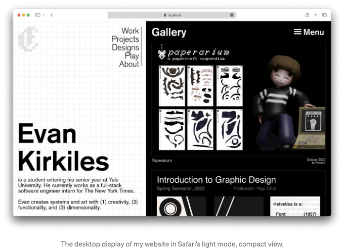
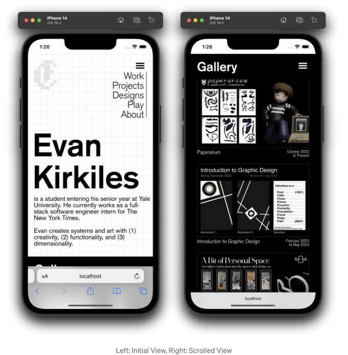
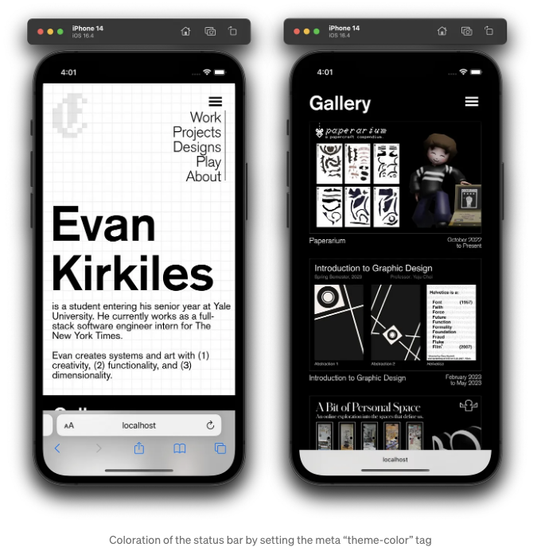
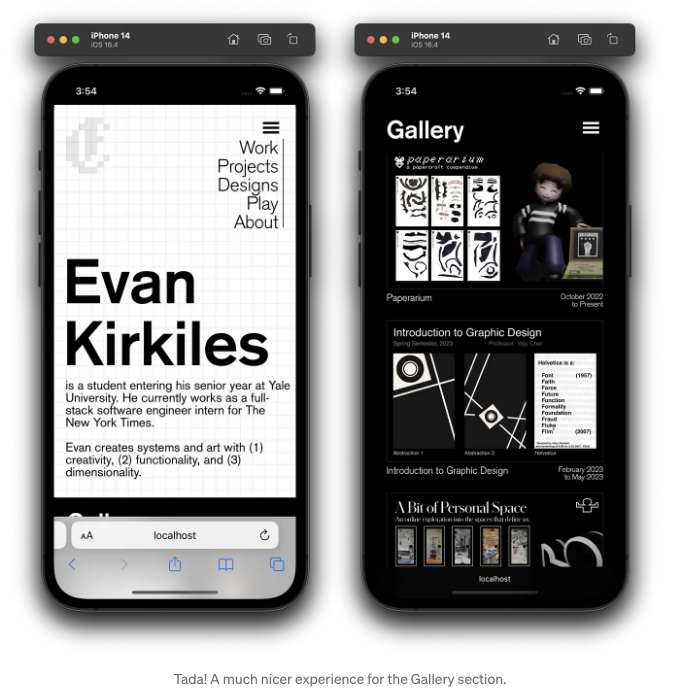
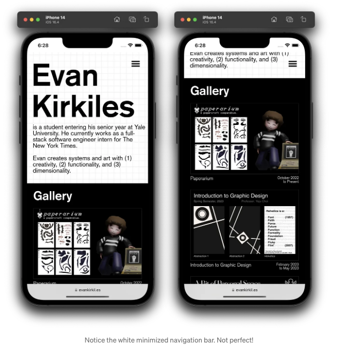
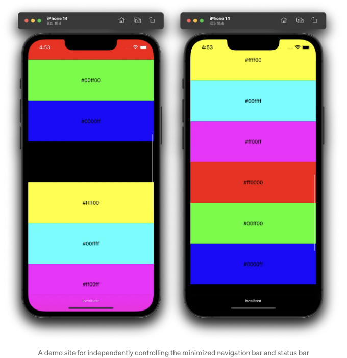
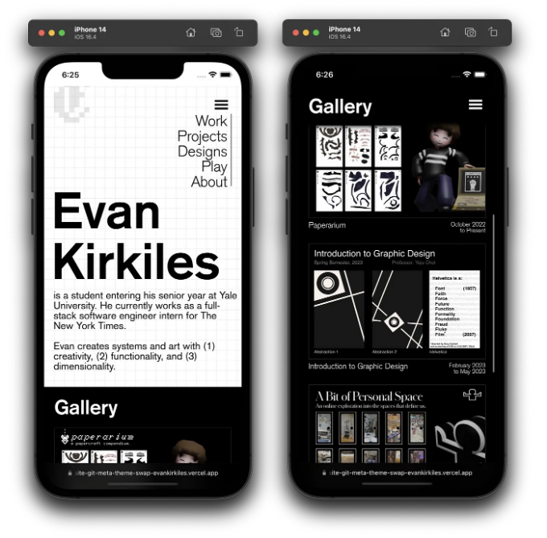
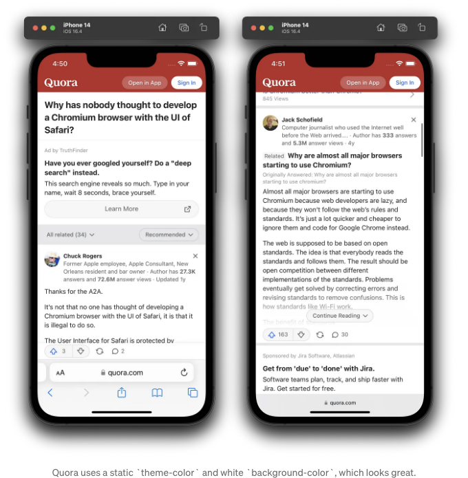
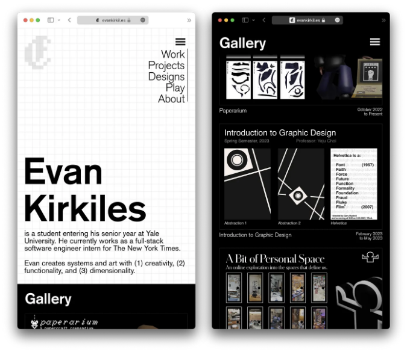

## 몇 가지 팁을 드려요! 웹킷을 사용하는 모바일(그리고 일부 데스크톱) 사용자를 위해 웹 사이트 모양을 크게 개선할 수 있는 몇 가지 방법입니다.

최근 개인 웹 사이트를 재설계하는 노력을 하면서 저는 고대비의 두 열 레이아웃을 선택했어요. 첫 번째 열의 배경은 흰색으로, 두 번째 열의 배경은 검은색으로 선택했으며, 두 열은 작은 기기에서 수직으로 축소됩니다. 문서의 본문의 배경 색상은 평범한 흰색입니다. 이것은 나중에 중요하게 작용할 거예요. 간단한 디자인이에요!



그러나 모바일 iPhone 기기에서 웹 사이트를 확인하기 위해 XCode의 모바일 기기 시뮬레이터를 사용하는 즉시, 내 비전과 맞지 않는 것을 즉시 알아챘어요. 랜딩 페이지의 "갤러리" 섹션으로 스크롤 다운하여 이동하면, 나는 검은 배경에 흰색 텍스트를 선택했듯이 보기 상단과 하단에 시각적으로 눈에 띄는 두 개의 흰색 막대를 남겼습니다.

<!-- ui-log 수평형 -->
<ins class="adsbygoogle"
  style="display:block"
  data-ad-client="ca-pub-4877378276818686"
  data-ad-slot="9743150776"
  data-ad-format="auto"
  data-full-width-responsive="true"></ins>
<component is="script">
(adsbygoogle = window.adsbygoogle || []).push({});
</component>



분명히, 나는 페이지의 두 번째 열의 검은 배경색에 맞게 상태 바와 탐색 바를 원한다. 그런데 동시에, 첫 번째 열이 여전히 보이는 동안에는 흰 색상이어야 합니다. 그렇다면 어떻게 해야 할까요?

이 기사의 나머지 부분에서는 WebKit의 이러한 네이티브 요소 색상에 대한 특이점을 살펴보고, 아마도 여러분의 웹사이트의 외관을 동적으로 높일 수 있도록 도와드리겠습니다. 이렇게 하면 WebKit 기기에서 더 네이티브한 느낌을 받을 수 있습니다.

# 네이티브한 느낌과 외관

<!-- ui-log 수평형 -->
<ins class="adsbygoogle"
  style="display:block"
  data-ad-client="ca-pub-4877378276818686"
  data-ad-slot="9743150776"
  data-ad-format="auto"
  data-full-width-responsive="true"></ins>
<component is="script">
(adsbygoogle = window.adsbygoogle || []).push({});
</component>

모바일 브라우저에서 실제 사이트는 화면의 약 85-90%만 차지합니다. 언제든지 화면의 나머지 10-15%는 네이티브 네비게이션 바(웹 사이트의 URL이 표시되는 곳)와 상태 바(노치와 배터리가 있는 곳)로 채워집니다. Safari / WebKit에서 이러한 바의 색상은 Chromium과는 달리 직접 설정할 수 있습니다. 그러나 스타일을 상속받는 방법은 약간 모호하며 처음에는 혼란스러울 수 있습니다.

## 상태 바 ("theme-color" 메타 태그)

상단 상태 바의 색상은 우선순위 순으로 다음과 같은 계층 구조를 따릅니다:

- HTML head에 있는 theme-color 메타 태그, 예: `meta name="theme-color" content="#f0f0f0"` . 이는 수동 설정 시 JavaScript 업데이트에도 반응합니다.
- PWAs를 명시적으로 대상으로 하는 manifest.json 파일에 지정된 theme-color. 이 파일은 브라우저에 한 번만 로드되기 때문에 동적이 아니므로 가장 유연성이 낮은 옵션입니다. 이에 대해 종종 포기하고 manifest.json에서 설정을 제거합니다.
- 마지막으로 CSS에서 문서 body의 배경색. 배경색을 사용하면 CSS 전환을 활성화할 수 있습니다. 그러나 배경색 사용 시 네비게이션 바의 스타일 계층 구조를 살펴볼 때 주의할 점이 있습니다.

<!-- ui-log 수평형 -->
<ins class="adsbygoogle"
  style="display:block"
  data-ad-client="ca-pub-4877378276818686"
  data-ad-slot="9743150776"
  data-ad-format="auto"
  data-full-width-responsive="true"></ins>
<component is="script">
(adsbygoogle = window.adsbygoogle || []).push({});
</component>

예를 들어, theme-color 메타 태그의 값을 #000000으로 설정하면 다음과 같은 결과를 얻을 수 있어요:



이렇게 상단 상태 표시줄이 훨씬 멋져 보이죠—물론, 페이지를 스크롤할 때 JavaScript를 조금 추가하여 theme-color 메타 태그를 검정색으로 업데이트할 수 있어요…

```js
// 스크롤 기반 theme-color 변경기의 단순화된 버전
window.addEventListener('scroll', () => {
  const metaTag = document.querySelector('meta[name="theme-color"]');
  if (window.scrollY / window.innerHeight > 0.8) {
    metaTag.setAttribute("content", "#000000");
  } else {
    metaTag.setAttribute("content", "#ffffff");
  }
}, false);
```

<!-- ui-log 수평형 -->
<ins class="adsbygoogle"
  style="display:block"
  data-ad-client="ca-pub-4877378276818686"
  data-ad-slot="9743150776"
  data-ad-format="auto"
  data-full-width-responsive="true"></ins>
<component is="script">
(adsbygoogle = window.adsbygoogle || []).push({});
</component>

…이를 허용하여 맨 위에서는 흰색으로 시작하고 "갤러리" 고정 바에 도달하면 검정색으로 변경됩니다. 그러나 아래로 스크롤하면 최소화된 내비게이션 바는 전혀 색상이 변경되지 않습니다. 그 이유에 대해 이해하려면, 그 바의 스타일 상속 계층 구조를 살펴보겠습니다.

## 내비게이션 바 ("background-color" CSS 속성)

내비게이션 바는 실제로 색상을 단일 장소에서 상속받습니다: 문서 본문의 background-color에서. 이제 상태 바도 body background-color에서 색상을 상속받을 수 있습니다. 이를 의미하는 것은 이 두 가지를 쉽게 동기화시킬 수 있다는 것입니다. (a) 테마 색상 메타 태그와 (b) manifest.json의 테마 색상 설정을 제거하고 대신 body의 background-color를 #000000으로 설정하면 됩니다:



<!-- ui-log 수평형 -->
<ins class="adsbygoogle"
  style="display:block"
  data-ad-client="ca-pub-4877378276818686"
  data-ad-slot="9743150776"
  data-ad-format="auto"
  data-full-width-responsive="true"></ins>
<component is="script">
(adsbygoogle = window.adsbygoogle || []).push({});
</component>

자, 이제 스크롤 기반 JavaScript 코드를 가져와서 이제는 삭제된 메타 테마 색상 태그 대신 문서의 배경색을 업데이트하도록 변경해 보겠습니다—

```js
// 스크롤 기반 배경 색상 변경기능을 간소화한 코드
window.addEventListener('scroll', () => {
  if (window.scrollY / window.innerHeight > 0.8) {
    document.body.style.backgroundColor = "#000000";
  } else {
    document.body.style.backgroundColor = "#ffffff";
  }
}, false);
```

—원하는 효과를 얻어 처음에는 흰색 배경이 나타나고 갤러리에서는 검은색이 나타납니다. 이 방법은 부드러운 CSS 전환도 지원합니다! 현재로서는 이미 멋져 보입니다…


<!-- ui-log 수평형 -->
<ins class="adsbygoogle"
  style="display:block"
  data-ad-client="ca-pub-4877378276818686"
  data-ad-slot="9743150776"
  data-ad-format="auto"
  data-full-width-responsive="true"></ins>
<component is="script">
(adsbygoogle = window.adsbygoogle || []).push({});
</component>

...하지만 더 나은 방법이 있을 거에요.

# 헤어짐

저희의 작업 솔루션은 제공된 스크린샷에서 좋아 보이지만, 화면의 상단 부분이 한 가지 색상으로, 하단 부분이 다른 색상으로 표시될 때, 바들은 여전히 원하는 바가 있습니다:



<!-- ui-log 수평형 -->
<ins class="adsbygoogle"
  style="display:block"
  data-ad-client="ca-pub-4877378276818686"
  data-ad-slot="9743150776"
  data-ad-format="auto"
  data-full-width-responsive="true"></ins>
<component is="script">
(adsbygoogle = window.adsbygoogle || []).push({});
</component>

화면 하단의 검은색 배경에 흰색 네비게이션 바가 보입니다. 두 바가 서로 다른 계층에서 스타일을 상속받기 때문에, 우리는 가설적으로 그들의 색상을 분리할 수 있습니다. 이는 하단 네비게이션 바가 항상 화면 하단 요소의 지정된 색상과 일치하도록 하고, 상단 상태 표시줄이 항상 화면 상단 요소의 색상과 일치하도록 하는 것입니다.

## 독립적인 바 색상 구현

그러면 생각해 봅시다. 하단 네비게이션 바는 배경색 CSS 속성을 사용해야 합니다. 따라서 상태 표시줄의 색상을 제어하기 위해 테마 색상 메타 태그를 사용하면, 두 요소의 색상을 효과적으로 분리하고 동적으로 제어할 수 있습니다. 그러나 여기서 문제가 발생하는 두 가지 이유가 있습니다.

- 어떠한 이유로 인해, 최소화된 네비게이션 바의 색상은 실제로 사용자가 스크롤하여 최대화된 네비게이션 바에서 최소화된 네비게이션 바로 전환되는 경우 또는 상태 표시줄의 색상이 변경될 때에만 배경색 CSS 속성에서 업데이트되고 읽습니다. 이는 테마 색상 태그를 사용하여 상태 표시줄의 색상을 네비게이션 바의 색상과 분리한다면, 배경색 CSS 속성의 색상을 변경해도 네비게이션 바를 다시 그려야하는 것으로 충분하지 않습니다—상태 표시줄도 다시 그리도록 만들어야 합니다. 그리고 색상이 비교되어 상태 표시줄이 다시 그려져야 하는 시기를 결정하므로, 이는 테마 색상을 다른 색상으로 변경해야 합니다.
- 더불어, 이제 HTML 테마 색상 메타 태그로 상태 표시줄의 색상을 제어하고 있기 때문에, 그 색상에 대해 부드러운 CSS 전환에 접근할 수 없습니다—JavaScript를 사용하여 두 색상 사이를 수동으로 전환해야 합니다. 그리고 네비게이션 바의 색상은 상태 표시줄이 다시 그려질 때에만 업데이트되기 때문에, 이는 네비게이션 바의 CSS 색상 전환을 사용할 수 없게되며, 상태 표시줄과 동기화되지 않는 한. body의 배경색에 전환을 설정하면, 상태 표시줄의 색상을 변경할 때 배경색이 보간된 값을 현 시점에서 일부만 샘플링하는 것을 알 수 있습니다.

<!-- ui-log 수평형 -->
<ins class="adsbygoogle"
  style="display:block"
  data-ad-client="ca-pub-4877378276818686"
  data-ad-slot="9743150776"
  data-ad-format="auto"
  data-full-width-responsive="true"></ins>
<component is="script">
(adsbygoogle = window.adsbygoogle || []).push({});
</component>

모든 것을 고려해 봤을 때, 여전히 두 개의 네이티브 브라우저 바를 분리할 수 있습니다. 각 바가 업데이트가 필요한 시점을 감지하기 위해 두 개의 IntersectionObserver를 사용하기로 결정했습니다—화면 상단 및 화면 하단 각각에 대해 하나씩:

```js
// 주석: 이 코드는 모두 UseEffects에 래핑된 React 코드입니다.

// 현재 색상과 메타 태그에 대한 참조를 가져오기
metaTag.current = document.querySelector('meta[name="theme-color"]');
currThemeColor.current = metaTag.current?.getAttribute('content') ?? null;

// ...

// 화면 상단 교차 관찰자는 테마 색상만 설정합니다
const observerTop = new IntersectionObserver(
  (entries) => {
    if (!metaTag.current) return;
    const selectedEntry = entries.filter((entry) => entry.isIntersecting);
    const target = selectedEntry[0]?.target;
    if (!target) return;
    const color = target.getAttribute('data-metathemeswap-color');
    if (!color) return;
    currThemeColor.current = color;
    metaTag.current.setAttribute('content', currThemeColor.current);
  },
  {
    // 화면 상단에서 교차 감지
    rootMargin: '-0.05% 0px -99.9% 0px',
  },
);

// 화면 하단 교차 관찰자는 배경 색상을 설정하고 메타 테마 색상을 업데이트합니다.
const observerBottom = new IntersectionObserver(
  (entries) => {
    if (!metaTag.current) return;
    const selectedEntry = entries.filter((entry) => entry.isIntersecting);
    const target = selectedEntry[0]?.target;
    if (!target) return;
    const color = target.getAttribute('data-metathemeswap-color');
    if (!color) return;
    document.body.style.backgroundColor = color;
    metaTag.current.setAttribute('content', currThemeColor.current + 'fe');
    const meta = metaTag.current;
    requestAnimationFrame(() => {
      meta.setAttribute('content', currThemeColor.current || '');
    });
  },
  {
    // 화면 하단에서 교차 감지
    rootMargin: '-99.9% 0px -0.05% 0px',
  },
);
```

이제 클라이언트 사이드 후크와 ref를 사용하여 색상 변경을 트리거하는 원하는 DOM 요소를 관찰할 수 있습니다:

```js
export default function useMetaTheme(ref: RefObject<Element>, color: string) {
  const { observerTop, observerBottom } = useContext(MetaThemeContext);
  useEffect(() => {
    const node = ref.current;
    if (!node) return;
    node.setAttribute('data-metathemeswap-color', color);
  }, [color, ref]);

  useEffect(() => {
    const node = ref.current;
    if (!node || !observerTop) return;
    observerTop?.observe(node);
    return () => observerTop?.unobserve(node);
  }, [observerTop, ref]);

  useEffect(() => {
    const node = ref.current;
    if (!node || !observerBottom) return;
    observerBottom?.observe(node);
    return () => observerBottom?.unobserve(node);
  }, [observerBottom, ref]);
}
```

<!-- ui-log 수평형 -->
<ins class="adsbygoogle"
  style="display:block"
  data-ad-client="ca-pub-4877378276818686"
  data-ad-slot="9743150776"
  data-ad-format="auto"
  data-full-width-responsive="true"></ins>
<component is="script">
(adsbygoogle = window.adsbygoogle || []).push({});
</component>

위 구현을 사용하는 방법을 설명하는 작은 데모 구성 요소가 여기 있습니다:

```js
function ColoredSection({ color }: { color: string }) {
  const ref = useRef<HTMLDivElement>(null);
  useMetaTheme(ref, color);
  return (
    <div id={color} className="ColorSection" style={ backgroundColor: color } ref={ref}>
      {color}
    </div>
  )
}
```

작업 중인 NPM 패키지 meta-theme-swap을 확인하고 React 프로젝트에서 이 작업을 쉽게 처리할 수 있도록 발행했습니다. (일반적인 구현은 곧 출시됩니다):

내비게이션 바의 업데이트 코드에 주의깊게 살펴보세요. 상태 표시줄을 다시 그리도록 설정하는 대신 해당 Hex 코드 끝에 "fe"를 추가하여 상태 표시줄을 다시 그리고, 다음 애니메이션 프레임에서 "fe"를 제거합니다 (시각적 모습을 완전히 보존하기 위해 이렇게 하면 알파 값이 조금 더 투명해져 "새로운 색상"이 됩니다). 이렇게 함으로써 상태 표시줄과 내비게이션 바를 독립적으로 제어할 수 있습니다.

<!-- ui-log 수평형 -->
<ins class="adsbygoogle"
  style="display:block"
  data-ad-client="ca-pub-4877378276818686"
  data-ad-slot="9743150776"
  data-ad-format="auto"
  data-full-width-responsive="true"></ins>
<component is="script">
(adsbygoogle = window.adsbygoogle || []).push({});
</component>

해당 이미지를 사용하여 웹사이트에 적용했습니다:





그게 전부에요! 완벽히 통일된, 컬러 최적화된 디자인이 완성되었습니다.

<!-- ui-log 수평형 -->
<ins class="adsbygoogle"
  style="display:block"
  data-ad-client="ca-pub-4877378276818686"
  data-ad-slot="9743150776"
  data-ad-format="auto"
  data-full-width-responsive="true"></ins>
<component is="script">
(adsbygoogle = window.adsbygoogle || []).push({});
</component>

# 결론

복잡한 구현이 필요한 경우는 대부분의 웹사이트에서는 발생하지 않을 것으로 보입니다. 예를 들어, 화면 상단에 고정된 네비게이션 바가 있는 전통적인 웹 인터페이스는 Quora가 하는 것처럼 테마 색상을 정적으로 설정하는 것만으로도 일반적으로 멋집니다:



또한 데스크톱 Safari 브라우저에서도 테마 색상의 네이티브 효과를 볼 수 있지만, 밝은 모드 및 콤팩트 탭 뷰에서만 가능합니다.

<!-- ui-log 수평형 -->
<ins class="adsbygoogle"
  style="display:block"
  data-ad-client="ca-pub-4877378276818686"
  data-ad-slot="9743150776"
  data-ad-format="auto"
  data-full-width-responsive="true"></ins>
<component is="script">
(adsbygoogle = window.adsbygoogle || []).push({});
</component>



여기까지 왔더니, 분할 화면을 사용하는 대신 body의 배경색과 함께 상태 표시줄 및 탐색 표시줄을 부드러운 CSS 전환으로 스타일링하는 것을 선택했습니다. 테마 색상에 대한 CSS 전환을 시도하기 위해 나중에 tweening 메커니즘을 구현할 예정이지만, 현재로서는 좋습니다.

도움이 되었기를 바랍니다! 특히 theme-color 메타 태그에 대해 더 포괄적으로 설명된 아래 멋진 기사를 확인해보세요.