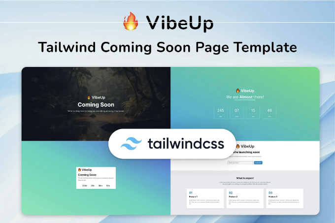
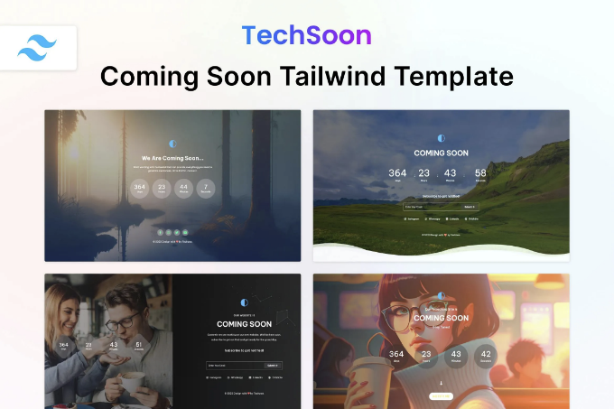
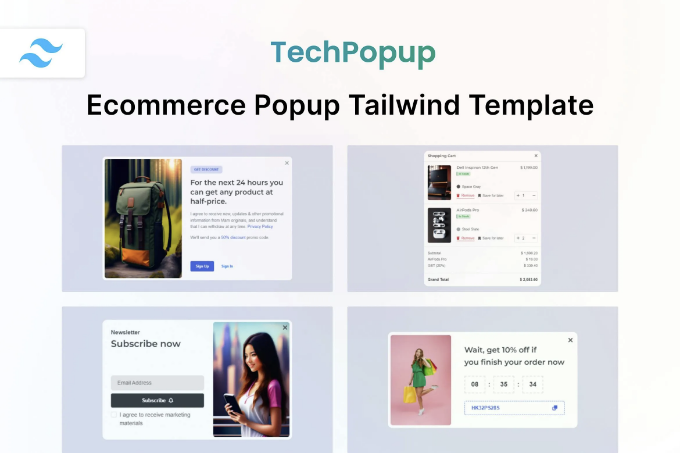
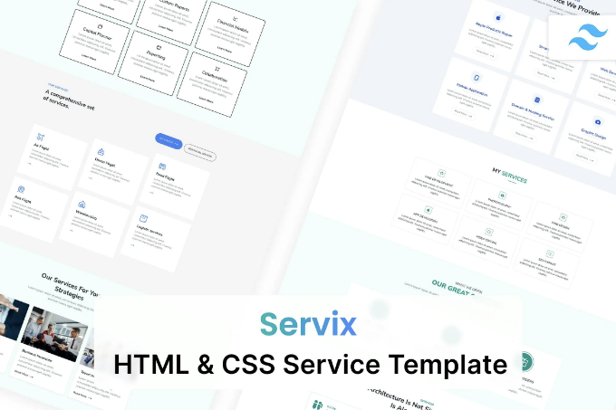
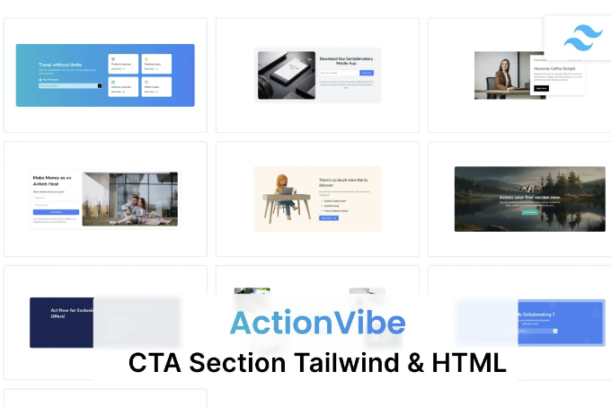
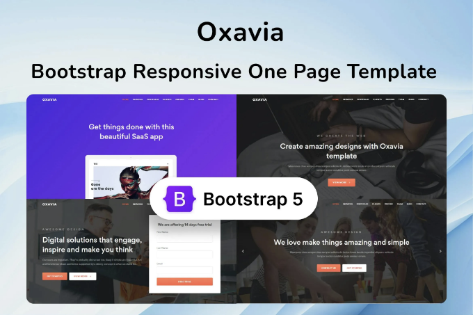
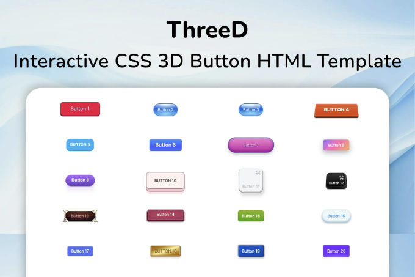
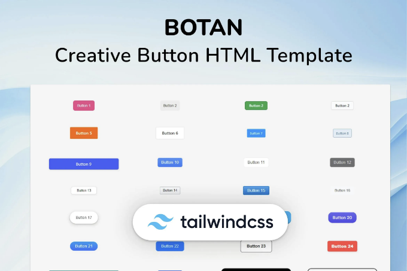
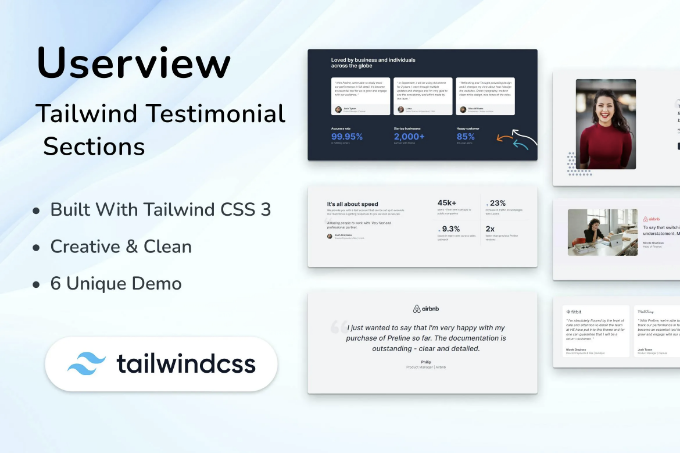

🔍 지금 Coming Soon HTML Tailwind Template VibeUp을 확인해보세요! 이 📁 사이트 템플릿 웹 템플릿을 탐색하고 무료 다운로드를 받아보세요. 함께 크래프팅을 시작해봐요! 🚀

실시간 미리보기

VibeUp — Tailwind CSS Coming Soon HTML Template — 곧 공개됩니다. Tailwind CSS 3 HTML Template은 카운트다운 웹 페이지, 곧 출시 예정인 웹 페이지, 출시 웹 사이트 및 제품 출시 웹 사이트에 적합한 세련되고 미니멀한 디자인을 제공하며, 기관이나 비즈니스 스타트업에 이상적입니다. 최신 Tailwind CSS v3 프레임워크에서 제작된 이 혁신적인 템플릿은 최신 Tailwind CSS와 완벽하게 통합되어 동적이고 현대적인 사용자 경험을 제공합니다.

<!-- ui-log 수평형 -->
<ins class="adsbygoogle"
  style="display:block"
  data-ad-client="ca-pub-4877378276818686"
  data-ad-slot="9743150776"
  data-ad-format="auto"
  data-full-width-responsive="true"></ins>
<component is="script">
(adsbygoogle = window.adsbygoogle || []).push({});
</component>

VibeUp — Coming Soon Tailwind CSS 3 HTML Template은 어떤 Count Down Web Page, Coming Soon Page, Launching Website, Launching Product Website, 올해 또는 비즈니스 Startup을 위해 만들어진 최소한의 Coming Soon 템플릿입니다. VibeUp은 Coming Soon Tailwind CSS Template입니다. 귀하의 비즈니스, 에이전시, 기업 및 스타트업을 위한 새롭고 현대적이며 독특한 템플릿을 사전 런칭하세요. 최신 Tailwind CSS v3 프레임워크를 기반으로 합니다. VibeUp — Coming Soon Tailwind CSS 3 HTML Template은 Tailwind CSS와 매끄럽게 통합되는 동적 Coming Soon HTML Template입니다. 반응형 CSS 애니메이션, JavaScript 카운트다운, 그라데이션 배경색, 그리고 매력적인 배경 파동 효과 애니메이션을 특징으로 합니다. 다양한 브라우저 및 디바이스를 지원하여 사용자 경험을 일관되게 제공합니다. 이 깔끔하고 빠른 템플릿은 다양한 용도에 맞게 유연하게 사용자 정의할 수 있어 Coming Soon 페이지, Single 페이지, 랜딩 페이지 또는 원페이지 웹사이트에 적합합니다. 주요 기능:

주요 특징:

- 다양한 레이아웃 옵션: 다양한 용도에 맞게 설계된 10가지 다양한 디자인 레이아웃을 탐색해 보세요.
- Tailwind CSS v3.3.2 기반 제작: 최신 Tailwind CSS 버전의 강력한 기능을 활용하여 원활한 스타일링과 향상된 성능을 경험하세요.
- 훌륭한 코드 품질: 쉬운 유지 및 사용자 정의를 위한 깔끔하고 잘 구성된 HTML5 및 CSS3 마크업을 체험하세요.
- 반응형 및 W3C 준수: 완벽한 사용자 경험을 위해 다양한 디바이스에 대한 반응형 디자인을 구현하여 W3C 표준을 준수합니다.
- 현대적이고 최소한의 디자인: 모든 레이아웃에서 깨끗하고 현대적이며 최소한의 스타일을 고수하여 창의성을 유도합니다.
- 사용자 정의 가능한 카운트다운 표시: JavaScript를 사용하여 사용자 정의 가능한 카운트다운 표시로 관객의 기대를 맞춤 설정하세요.
- Google Fonts 통합: Google Fonts를 활용하여 타이포그래피를 업그레이드하여 프로젝트의 시각적 매력을 향상시킵니다.
- 포괄적인 문서화: 적절한 설정, 사용자 정의 및 사용 경험을 위한 잘 문서화된 지침을 활용하세요.
- 레티나 대응: 호환되는 기기에서 명료한 디스플레이를 위한 고해상도 및 레티나 대응 디자인 요소를 즐기세요.
- 다중 브라우저 지원: 다양한 브라우저에서의 호환성을 확보하여 일관된 사용자 경험을 제공합니다.
- 다양한 사용 사례: 에이전시, 부동산, 교육, 포트폴리오, 블로그, 여행, 이벤트, 패션, 호텔 및 사진 산업을 포함한 다양한 산업에 맞게 제작되었습니다.
- 다양한 서비스에 적합: 디지털 마케팅, 뉴스, 의료, 이메일, NFT, 스파, 산업, 폼, 크리에이티브, 스포츠, 그래픽, 앱, 암호화폐, 모바일, 게임, 이력서, 뉴스레터, 웹, 헬스장, SEO, 에어비앤비, 비정부기구 및 기술 서비스를 위한 적합합니다.
- 라이브러리 및 언어 호환성: Bulma, Bootstrap 5, Bootstrap 4, Tailwind UI와 호환되는 CSS 라이브러리와 함께 사용 가능하며 ASP, PHP, Python, Java, Node, React, Vue, WordPress, Angular, Remix, Svelte, CakePHP, Express, RedwoodJS와 같은 프레임워크와 함께 사용하기에 적합합니다.
- 와이드 프레임워크 및 번들러 지원: Next, Laravel, Nuxt, Svelte Kit, Qwik, Ruby on Rails, Meteor, Astro, Shopify, .NET, Vue.js, Django, Spring, Flask, CodeIgniter, Symfony, Native, React Native, Ionic, Framework 7과 같은 프레임워크 및 Vite, Parcel, Yarn, NPM, Gulp과 같은 번들러와 손쉽게 통합할 수 있습니다.
- 즉시 사용 가능: 별도의 설치가 필요하지 않으며 클릭 한 번으로 쉽게 실행됩니다. 관리자 패널과 함께 사용할 수 있습니다.
- 다양한 응용: 블로거, 전자 상거래, 개인, 최소한의, 블로그, 잡지, 신문, 스포츠, 기술, 부트스트랩, Tailwind CSS, Bootstrap 5, 앱 UI, 뱅킹, 모바일, UI 킷, Tailwind UI, 에이전시, 관리 대시보드 및 포트폴리오 테마에 적합합니다.
- 개발자 친화적: HTML 및 CSS에 대한 우리 팀의 전문 지식을 활용하여 개발을 간소화하세요.
- 글로벌 사용: 전 세계적으로 다양한 목적에 적용되며 귀하의 웹 개발 요구 사항을 위한 다목적이고 효율적인 솔루션으로 사용할 수 있습니다.

<!-- ui-log 수평형 -->
<ins class="adsbygoogle"
  style="display:block"
  data-ad-client="ca-pub-4877378276818686"
  data-ad-slot="9743150776"
  data-ad-format="auto"
  data-full-width-responsive="true"></ins>
<component is="script">
(adsbygoogle = window.adsbygoogle || []).push({});
</component>

#html #css #tailwind #coming #soon #comingsoon #page #page #ecommerce #tailwindcss #onepage #ui #tailwindui #comingsoonpage #soonpage

## 파일 유형

HTML, CSS, SASS, JS

## 추가하기

<!-- ui-log 수평형 -->
<ins class="adsbygoogle"
  style="display:block"
  data-ad-client="ca-pub-4877378276818686"
  data-ad-slot="9743150776"
  data-ad-format="auto"
  data-full-width-responsive="true"></ins>
<component is="script">
(adsbygoogle = window.adsbygoogle || []).push({});
</component>

Retina ready
반응형
문서 포함

## 상업용 라이선스

추가 정보

## 비슷한 웹 템플릿

<!-- ui-log 수평형 -->
<ins class="adsbygoogle"
  style="display:block"
  data-ad-client="ca-pub-4877378276818686"
  data-ad-slot="9743150776"
  data-ad-format="auto"
  data-full-width-responsive="true"></ins>
<component is="script">
(adsbygoogle = window.adsbygoogle || []).push({});
</component>

더 보기

Coming Soon HTML Tailwind Template — Techsoon by Techzaa

<!-- ui-log 수평형 -->
<ins class="adsbygoogle"
  style="display:block"
  data-ad-client="ca-pub-4877378276818686"
  data-ad-slot="9743150776"
  data-ad-format="auto"
  data-full-width-responsive="true"></ins>
<component is="script">
(adsbygoogle = window.adsbygoogle || []).push({});
</component>

TechPopup — Techzaa가 제작한 전자 상거래 팝업 HTML 템플릿

Servix — Techzaa가 제작한 HTML 및 CSS 서비스 템플릿

<!-- ui-log 수평형 -->
<ins class="adsbygoogle"
  style="display:block"
  data-ad-client="ca-pub-4877378276818686"
  data-ad-slot="9743150776"
  data-ad-format="auto"
  data-full-width-responsive="true"></ins>
<component is="script">
(adsbygoogle = window.adsbygoogle || []).push({});
</component>

ActionVibe - Tailwind Call to Action HTML 템플릿 by Techzaa

## MyraStudio에서 더 보기

더 보기

<!-- ui-log 수평형 -->
<ins class="adsbygoogle"
  style="display:block"
  data-ad-client="ca-pub-4877378276818686"
  data-ad-slot="9743150776"
  data-ad-format="auto"
  data-full-width-responsive="true"></ins>
<component is="script">
(adsbygoogle = window.adsbygoogle || []).push({});
</component>

부트스트랩 반응형 원페이지 템플릿 — MyraStudio의 Oxavia

인터랙티브 CSS 3D 버튼 HTML 템플릿 — MyraStudio의 ThreeD

<!-- ui-log 수평형 -->
<ins class="adsbygoogle"
  style="display:block"
  data-ad-client="ca-pub-4877378276818686"
  data-ad-slot="9743150776"
  data-ad-format="auto"
  data-full-width-responsive="true"></ins>
<component is="script">
(adsbygoogle = window.adsbygoogle || []).push({});
</component>

# MyraStudio에서 만든 창의적인 CSS 버튼 HTML 템플릿 - Botan

MyraStudio의 Tailwind 템플릿 및 Testimonial UI Kit - Userview