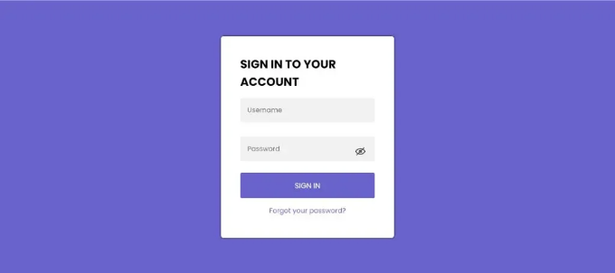
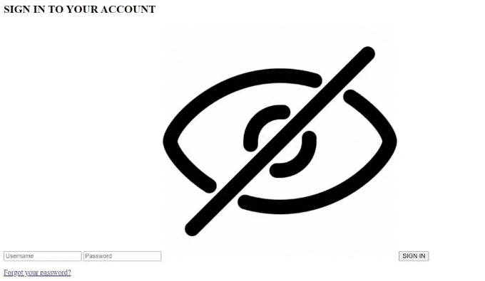
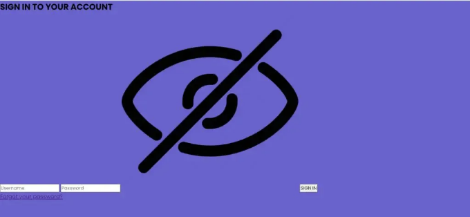
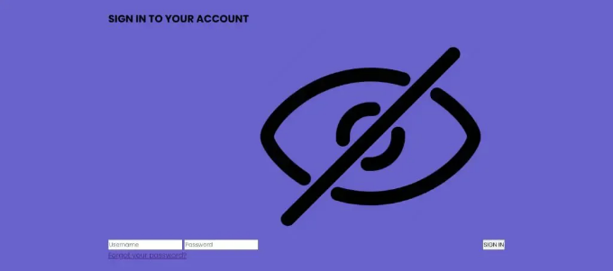
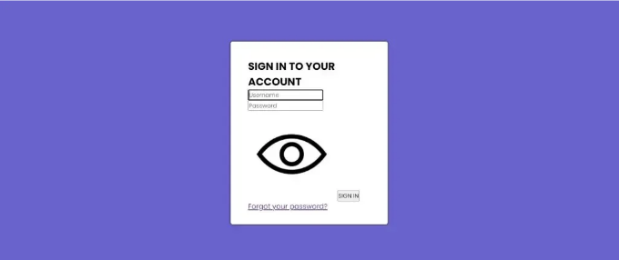
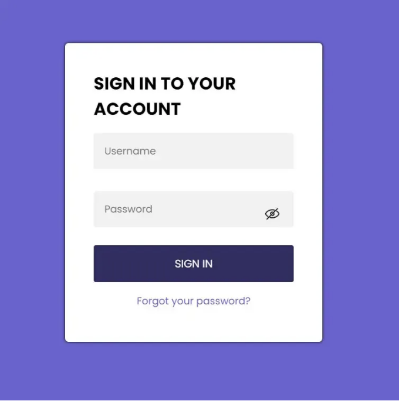

안녕, 코더! codewithrandom 블로그에 오신 것을 환영합니다. 이 글에서는 JavaScript를 사용하여 로그인 폼 유효성 검사를 하는 방법을 보여드리겠습니다. 이 블로그를 통해 HTML, CSS, 그리고 JavaScript를 사용하여 간단한 로그인 폼과 유효성 검사를 개발하는 방법에 대한 아이디어를 얻을 수 있을 거예요.



로그인 폼 유효성 검사를 이해하고 나서 디자인을 시작해보세요.

<!-- ui-log 수평형 -->
<ins class="adsbygoogle"
  style="display:block"
  data-ad-client="ca-pub-4877378276818686"
  data-ad-slot="9743150776"
  data-ad-format="auto"
  data-full-width-responsive="true"></ins>
<component is="script">
(adsbygoogle = window.adsbygoogle || []).push({});
</component>

# 자바스크립트를 사용하여 로그인 폼 유효성 검사하는 방법

HTML 폼의 유효성 검사는 사용자의 이메일 주소, 사용자 이름 및 비밀번호가 올바른지 확인하는 과정을 포함합니다. 사용자가 예약된 페이지에 액세스하기 전에 유효한 사용자 이름과 비밀번호를 입력해야 합니다.

사용자는 로그인 폼을 사용하여 자신을 식별하고 인증함으로써 특정 시스템에 액세스할 수 있습니다. 이 로그인 폼을 만드는 과정을 단계별로 살펴보겠습니다.

# 단계1: 로그인 폼 구조

<!-- ui-log 수평형 -->
<ins class="adsbygoogle"
  style="display:block"
  data-ad-client="ca-pub-4877378276818686"
  data-ad-slot="9743150776"
  data-ad-format="auto"
  data-full-width-responsive="true"></ins>
<component is="script">
(adsbygoogle = window.adsbygoogle || []).push({});
</component>

```js
<html>
```

```js
<head>
    <link rel="stylesheet" href="style.css">
    <title>로그인 양식</title>
</head>
<body>
    <div class="login-page">
        <div class="form">
            <form class="login-form" action="https://www.instagram.com/codewith_random/" target="_blank">
                <h2>계정에 로그인</h2>
                <input type="text" required placeholder="사용자 이름" id="user" autocomplete="off" />
                <input oninput="return formvalid()" type="password" required placeholder="비밀번호" id="pass"
                    autocomplete="off" />
                
                <span id="vaild-pass"></span>
                <button type="submit">로그인</button>
                <p class="message"><a href="#">비밀번호를 잊으셨나요?</a></p>
            </form>
        </div>
    </div>
    <script src="index.js"></script>
</body>
</html>
```

좋은 코드 관리를 위해 HTML, CSS 및 Javascript용 세 개의 별도 파일을 코드 편집기에 생성할 거에요. 저희 로그인 양식은 HTML, CSS 및 Javascript로 구성될 거에요. 이제 웹 사이트에 CSS와 JavaScript 기능을 추가해보죠. JavaScript 및 CSS 링크를 HTML에 포함해야 해요.

```js
<link rel="stylesheet" href="style.css">
<script src="index.js"></script>
```

<!-- ui-log 수평형 -->
<ins class="adsbygoogle"
  style="display:block"
  data-ad-client="ca-pub-4877378276818686"
  data-ad-slot="9743150776"
  data-ad-format="auto"
  data-full-width-responsive="true"></ins>
<component is="script">
(adsbygoogle = window.adsbygoogle || []).push({});
</component>

이제 양식의 구조를 추가할 차례입니다. 우리는 클래스가 있는 div를 생성해야 합니다(login-page), 이것이 우리의 로그인을 위한 주요 컨테이너가 될 것입니다. 이제 양식을 만들기 위해 `form` 태그를 사용해야 합니다. 이제 로그인 양식에 대한 제목을 추가할 것인데, 이때 `h2` 태그를 사용할 겁니다. 로그인 양식은 주로 세 개의 `input` 요소로 이루어져 있습니다: 사용자 이름을 위한 텍스트 필드, 비밀번호를 위한 비밀번호 필드, 그리고 로그인 버튼을 생성하는 'submit' 타입의 버튼입니다.

비밀번호에 숨기기/보이기 기능을 추가하려면 눈 이미지를 사용할 겁니다. 모든 사람이 비밀번호를 기억하는 것의 가치를 이해하지만 다른 사람이 로그인 비밀번호를 잊어버린다면 어떻게 될까요? 그래서 `a` 태그를 사용하여 비밀번호를 잊을 때의 링크를 추가할 겁니다.

Output:



<!-- ui-log 수평형 -->
<ins class="adsbygoogle"
  style="display:block"
  data-ad-client="ca-pub-4877378276818686"
  data-ad-slot="9743150776"
  data-ad-format="auto"
  data-full-width-responsive="true"></ins>
<component is="script">
(adsbygoogle = window.adsbygoogle || []).push({});
</component>

# 단계2: 로그인 폼 스타일링하기

우리 웹사이트는 CSS를 활용하여 더 다채롭게 만들 수 있어요. 스타일 시트는 세 가지 다른 방법으로 삽입할 수 있어요. CSS 속성과 스타일 속성을 적절한 요소에 포함시켜 인라인 CSS를 사용할 수도 있어요. 그렇지 않으면, 스타일 요소와 헤드 섹션에 사용되는 내부 CSS를 활용할 수 있어요. 또 다른 옵션은 .css 확장자가 붙은 외부 CSS 파일을 만들고 이를 HTML 파일의 헤드 섹션에 링크하는 것이에요. 웹 페이지를 만들 때 외부 CSS 파일을 사용하는 것이 좋은 실천 방법이에요.

```js
@import url("https://fonts.googleapis.com/css2?family=Poppins:ital,wght@0,200;0,400;0,500;0,600;0,700;1,100;1,200;1,300&display=swap");
* {
  margin: 0;
  padding: 0;
  box-sizing: border-box;
  font-family: "Poppins", sans-serif;
}
body {
  background: #6a62d2;
}
```

```js
.login-page {
  height: 100vh;
  width: 100%;
  align-items: center;
  display: flex;
  justify-content: center;
}
.form {
  position: relative;
  filter: drop-shadow(0 0 2px #000000);
  border-radius: 5px;
  width: 360px;
  height: 420px;
  background-color: #ffffff;
  padding: 40px;
}
.form img {
  position: absolute;
  height: 20px;
  top: 230px;
  right: 60px;
  cursor: pointer;
}
.form input {
  outline: 0;
  background: #f2f2f2;
  border-radius: 4px;
  width: 100%;
  border: 0;
  margin: 15px 0;
  padding: 15px;
  font-size: 14px;
}
.form input:focus {
  box-shadow: 0 0 5px 0 rgba(106, 98, 210);
}
span {
  color: red;
  margin: 10px 0;
  font-size: 14px;
}
.form button {
  outline: 0;
  background: #6a62d2;
  width: 100%;
  border: 0;
  margin-top: 10px;
  border-radius: 3px;
  padding: 15px;
  color: #ffffff;
  font-size: 15px;
  -webkit-transition: all 0.3 ease;
  transition: all 0.4s ease-in-out;
  cursor: pointer;
}
.form button:hover,
.form button:active,
.form button:focus {
  background: black;
  color: #fff;
}
.message {
  margin: 15px 0;
  text-align: center;
}
.form .message a {
  font-size: 14px;
  color: #6a62d2;
  text-decoration: none;
}
```

<!-- ui-log 수평형 -->
<ins class="adsbygoogle"
  style="display:block"
  data-ad-client="ca-pub-4877378276818686"
  data-ad-slot="9743150776"
  data-ad-format="auto"
  data-full-width-responsive="true"></ins>
<component is="script">
(adsbygoogle = window.adsbygoogle || []).push({});
</component>

웹페이지에 기본 스타일링을 추가해봅시다:

먼저, CSS에 Poppins 글꼴을 추가하기 위해 import 링크를 사용할 거에요. 저희 로그인 폼에서 이 글꼴을 사용하죠. 일반 선택자를 사용하여 패딩과 마진을 "0"으로 설정했고, 상자 크기를 "border-box"로 변경했어요. 폰트 패밀리 속성을 사용하여 전체 웹페이지에 "Poppins" 글꼴을 설정할 거에요.

웹페이지의 본문에 배경을 추가할 수 있습니다. 웹페이지의 배경 색상은 직접 명칭을 사용하거나, 16진 코드 등을 사용하여 다양하게 설정할 수 있어요.

```js
@import url("https://fonts.googleapis.com/css2?family=Poppins:ital,wght@0,200;0,400;0,500;0,600;0,700;1,100;1,200;1,300&display=swap");
* {
  margin: 0;
  padding: 0;
  box-sizing: border-box;
  font-family: "Poppins", sans-serif;
}
body {
  background: #6a62d2;
}
```

<!-- ui-log 수평형 -->
<ins class="adsbygoogle"
  style="display:block"
  data-ad-client="ca-pub-4877378276818686"
  data-ad-slot="9743150776"
  data-ad-format="auto"
  data-full-width-responsive="true"></ins>
<component is="script">
(adsbygoogle = window.adsbygoogle || []).push({});
</component>




로그인 페이지 컨테이너 스타일링:

우리는 클래스 선택자 (.login-page)를 추가하여 로그인 페이지를 스타일링할 것입니다. 너비와 높이는 각각 100% 및 100vh로 설정됩니다. align-item 속성을 사용하여 모든 객체를 가운데 정렬합니다. display 속성을 flex로 설정하여 모든 항목을 쉽게 배치할 수 있습니다.

```css
.login-page {
  height: 100vh;
  width: 100%;
  align-items: center;
  display: flex;
  justify-content: center;
}
```

<!-- ui-log 수평형 -->
<ins class="adsbygoogle"
  style="display:block"
  data-ad-client="ca-pub-4877378276818686"
  data-ad-slot="9743150776"
  data-ad-format="auto"
  data-full-width-responsive="true"></ins>
<component is="script">
(adsbygoogle = window.adsbygoogle || []).push({});
</component>



로그인 폼 스타일링:

폼 컨테이너의 위치는 클래스 선택자(.form)를 사용하여 상대적으로 설정됩니다. 로그인 페이지 컨테이너를 기준으로 상대적으로 설정됩니다. border-radius 속성을 사용하여 폼에 약간의 곡선을 줄 것입니다. width와 height 속성을 사용하여 폭은 "360px", 높이는 "420px"로 설정할 것입니다. 배경 속성을 사용하여 배경을 흰색으로 설정합니다.

```css
.form {
  position: relative;
  filter: drop-shadow(0 0 2px #000000);
  border-radius: 5px;
  width: 360px;
  height: 420px;
  background-color: #ffffff;
  padding: 40px;
}
```

<!-- ui-log 수평형 -->
<ins class="adsbygoogle"
  style="display:block"
  data-ad-client="ca-pub-4877378276818686"
  data-ad-slot="9743150776"
  data-ad-format="auto"
  data-full-width-responsive="true"></ins>
<component is="script">
(adsbygoogle = window.adsbygoogle || []).push({});
</component>



양식 요소 (입력 & 버튼) 스타일링:

먼저 양식에 추가한 이미지를 스타일링할 것입니다. img 태그를 사용하여 이미지를 사용자 정의할 수 있습니다. 이미지의 위치는 "absolute"로 설정되었습니다. 높이는 20픽셀입니다. top 속성을 사용하여 눈 아이콘이 이제 상단에서 230픽셀, 오른쪽에서 36픽셀 떨어진 위치에 배치됩니다.

input 태그를 사용하여 입력 필드를 스타일링할 수 있습니다. 배경 색상은 오프화이트입니다. 입력 상자의 너비는 100%로 설정되었습니다. 추가로 input 태그에는 15픽셀의 안쪽 여백과 마진이 지정되었습니다. 입력 영역 사이의 텍스트는 14픽셀의 글꼴 크기를 갖습니다.

<!-- ui-log 수평형 -->
<ins class="adsbygoogle"
  style="display:block"
  data-ad-client="ca-pub-4877378276818686"
  data-ad-slot="9743150776"
  data-ad-format="auto"
  data-full-width-responsive="true"></ins>
<component is="script">
(adsbygoogle = window.adsbygoogle || []).push({});
</component>

입력란에 포커스가 설정되면 입력란 주위에 상자 그림자가 형성됩니다.

```css
.form img {
  position: absolute;
  height: 20px;
  top: 230px;
  right: 60px;
  cursor: pointer;
}
```

```css
.form input {
  outline: 0;
  background: #f2f2f2;
  border-radius: 4px;
  width: 100%;
  border: 0;
  margin: 15px 0;
  padding: 15px;
  font-size: 14px;
}
.form input:focus {
  box-shadow: 0 0 5px 0 rgba(106, 98, 210);
}
```

이제 비밀번호 잊음에 대한 버튼과 하이퍼링크를 스타일링할 것입니다. 버튼의 파란 배경을 설정하기 위해 배경 속성을 사용합니다. 버튼의 너비는 100%로 설정됩니다. margin-top 속성을 사용하여 상단 여백을 "10px"로 지정합니다. 글꼴 크기와 글꼴 색상은 15px이며 글꼴 색상은 흰색입니다.

<!-- ui-log 수평형 -->
<ins class="adsbygoogle"
  style="display:block"
  data-ad-client="ca-pub-4877378276818686"
  data-ad-slot="9743150776"
  data-ad-format="auto"
  data-full-width-responsive="true"></ins>
<component is="script">
(adsbygoogle = window.adsbygoogle || []).push({});
</component>

우리가 '비밀번호 재설정' 메시지에 클래스 선택자(.message)를 사용하여 15px의 마진을 줬어요. 텍스트를 가운데 정렬하기 위해 text-align 속성을 사용할 거에요.

```css
.form button {
  outline: 0;
  background: #6a62d2;
  width: 100%;
  border: 0;
  margin-top: 10px;
  border-radius: 3px;
  padding: 15px;
  color: #ffffff;
  font-size: 15px;
  -webkit-transition: all 0.3 ease;
  transition: all 0.4s ease-in-out;
  cursor: pointer;
}
```

```css
.form button:hover,
.form button:active,
.form button:focus {
  background: black;
  color: #fff;
}
.message {
  margin: 15px 0;
  text-align: center;
}
.form .message a {
  font-size: 14px;
  color: #6a62d2;
  text-decoration: none;
}
```


```

<!-- ui-log 수평형 -->
<ins class="adsbygoogle"
  style="display:block"
  data-ad-client="ca-pub-4877378276818686"
  data-ad-slot="9743150776"
  data-ad-format="auto"
  data-full-width-responsive="true"></ins>
<component is="script">
(adsbygoogle = window.adsbygoogle || []).push({});
</component>

로그인 폼 유효성 검사 JavaScript 사용하기[/caption]

# Step3: 유저 이름과 비밀번호가 있는 로그인 페이지에 대한 JavaScript 코드:-

```js
//TODO : 완료된 코드입니다
function formvalid() {
  var vaildpass = document.getElementById("pass").value;
```

```js
  if (vaildpass.length <= 8 || vaildpass.length >= 20) {
    document.getElementById("vaild-pass").innerHTML = "최소 8자여야 합니다";
    return false;
  } else {
    document.getElementById("vaild-pass").innerHTML = "";
  }
}
```

<!-- ui-log 수평형 -->
<ins class="adsbygoogle"
  style="display:block"
  data-ad-client="ca-pub-4877378276818686"
  data-ad-slot="9743150776"
  data-ad-format="auto"
  data-full-width-responsive="true"></ins>
<component is="script">
(adsbygoogle = window.adsbygoogle || []).push({});
</component>

폼 유효성 검사 기능을 포함하려면, formvalid라는 함수를 생성할 것입니다. 우리 코드 안에 validpass 변수를 정의할 것이며, document의 getelementById 함수를 사용하여 비밀번호 입력란을 선택할 것입니다.

만약 길이가 8자 미만이거나 20자를 초과하는 경우, 조건문을 사용하여 비밀번호의 길이가 8자 미만임을 안내하는 알림을 표시할 것입니다.

## 단계4: 표시/숨기기 기능

```js
function show() {
  var x = document.getElementById("pass");
  if (x.type === "password") {
    x.type = "text";
    document.getElementById("showimg").src =
      "https://static.thenounproject.com/png/777494-200.png";
  } else {
    x.type = "password";
    document.getElementById("showimg").src =
      "https://cdn2.iconfinder.com/data/icons/basic-ui-interface-v-2/32/hide-512.png";
  }
}
```

<!-- ui-log 수평형 -->
<ins class="adsbygoogle"
  style="display:block"
  data-ad-client="ca-pub-4877378276818686"
  data-ad-slot="9743150776"
  data-ad-format="auto"
  data-full-width-responsive="true"></ins>
<component is="script">
(adsbygoogle = window.adsbygoogle || []).push({});
</component>

우리는 display()라는 절차 안에서 문서를 이용해 비밀번호 입력 설정을 할 것입니다. getElementById()를 이용해서 변수 값이 "password" 문자열과 같은지 조건과 문서를 통해 확인할 것입니다. 우리의 비밀번호 타입 입력의 값은 이미지를 열린 눈으로 변환하는 src 메소드를 사용할 때 텍스트 타입으로 변경될 것입니다. 그 반대로 x.type = password을 설정할 경우 이미지는 닫힌 눈에서 열린 눈으로 전환될 것입니다.

프로젝트는 이제 완료되었습니다. HTML, CSS 및 Javascript를 사용하여 폼 유효성 검사를 완료했습니다. 이제 라이브 미리보기를 확인해보세요.

이제 HTML, CSS 및 Javascript를 사용한 로그인 폼 유효성 검사가 완료되었습니다. IDE로 복사하여 이 프로젝트를 직접 사용할 수 있습니다. 프로젝트를 이해하셨다면 궁금한 점이 있으면 언제든지 댓글을 달아주시기 바랍니다!

만약 이 블로그가 도움이 되었다면 Codewithrandom을 구글에서 검색하여 소스 코드와 함께 프론트 엔드 프로젝트를 찾아보시고, Code with Random 인스타그램 페이지를 팔로우해주시기를 권장드립니다.

<!-- ui-log 수평형 -->
<ins class="adsbygoogle"
  style="display:block"
  data-ad-client="ca-pub-4877378276818686"
  data-ad-slot="9743150776"
  data-ad-format="auto"
  data-full-width-responsive="true"></ins>
<component is="script">
(adsbygoogle = window.adsbygoogle || []).push({});
</component>

표를 Markdown 형식으로 변경해주세요.

| follow  | codewithrandom |
|---------|-----------------|
| Written By | arun |
| Code by | Nikhil |

# 이 로그인 폼 유효성 검사에 어떤 코드 편집기를 사용하고 있나요?

<!-- ui-log 수평형 -->
<ins class="adsbygoogle"
  style="display:block"
  data-ad-client="ca-pub-4877378276818686"
  data-ad-slot="9743150776"
  data-ad-format="auto"
  data-full-width-responsive="true"></ins>
<component is="script">
(adsbygoogle = window.adsbygoogle || []).push({});
</component>

저는 VS Code Studio를 사용하기를 개인적으로 추천해요. 직관적이고 사용하기 쉬워요.

이 프로젝트는 반응형인가요?

네, 로그인 폼은 반응형 프로젝트에요.

이 프로젝트를 만들기 위해 외부 링크를 사용했나요?

<!-- ui-log 수평형 -->
<ins class="adsbygoogle"
  style="display:block"
  data-ad-client="ca-pub-4877378276818686"
  data-ad-slot="9743150776"
  data-ad-format="auto"
  data-full-width-responsive="true"></ins>
<component is="script">
(adsbygoogle = window.adsbygoogle || []).push({});
</component>

아니요, 로그인 폼 유효성 검사에 순수 JavaScript 코드를 사용합니다.