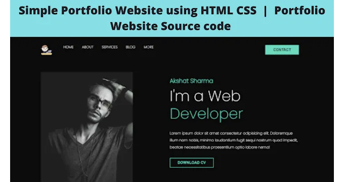
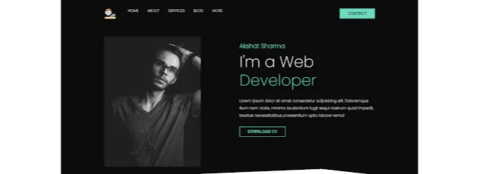
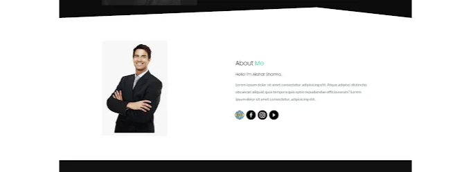
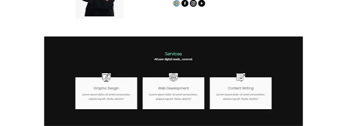
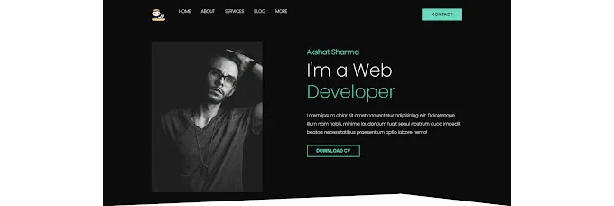
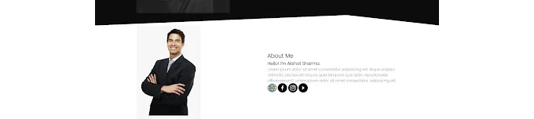
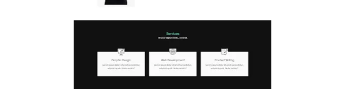
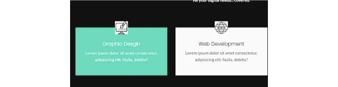

자, 오늘은 Html과 CSS 소스 코드를 사용하여 시각적으로 맛있는 포트폴리오 웹사이트를 만들어볼 거에요. 이 글에서는 Html과 CSS를 사용한 포트폴리오 웹사이트의 완성된 코드와 설명을 얻을 수 있어요.



# 포트폴리오 웹사이트란?

<!-- ui-log 수평형 -->
<ins class="adsbygoogle"
  style="display:block"
  data-ad-client="ca-pub-4877378276818686"
  data-ad-slot="9743150776"
  data-ad-format="auto"
  data-full-width-responsive="true"></ins>
<component is="script">
(adsbygoogle = window.adsbygoogle || []).push({});
</component>

요즘에는 모두 웹사이트와 웹 애플리케이션을 필요로 합니다. 그래서 웹 개발자로 일할 경우 많은 기회가 있습니다. 그러나 웹 개발자의 직업을 얻고 싶다면, 여러분의 기술과 경험을 자랑할 수 있는 좋은 포트폴리오 웹사이트가 필요할 것입니다. 개발자 포트폴리오 웹사이트는 여러분의 기술, 경험, 그리고 참여한 프로젝트들에 관한 관련 정보를 잠재적인 고용주에게 제공합니다. 이를 온라인 이력서라고 생각할 수 있습니다.

아래는 포트폴리오 웹사이트 코드에 관한 추가 정보입니다:-

## 소스 코드와 함께 포트폴리오 웹사이트:-

그래서 이 포트폴리오 웹사이트를 만들기 위한 재료는 HTML과 CSS입니다. 둘 다 기본적인 지식이 있다고 가정합니다. 이 포트폴리오 웹사이트를 배포하려면 실제로 웹사이트를 클릭하고 원하는 페이지로 이동할 수 있도록 백엔드를 작업해야 할 것입니다.

<!-- ui-log 수평형 -->
<ins class="adsbygoogle"
  style="display:block"
  data-ad-client="ca-pub-4877378276818686"
  data-ad-slot="9743150776"
  data-ad-format="auto"
  data-full-width-responsive="true"></ins>
<component is="script">
(adsbygoogle = window.adsbygoogle || []).push({});
</component>

하지만 오늘은 외관에 대해 이야기할 차례에요, 즉 프론트 엔드에 대해요! JavaScript도 포괄 범위를 벗어났어요. 왜냐하면 HTML과 CSS만으로도 멋진 웹사이트를 만들 수 있다는 것을 알아주길 원하거든 (그리고 이것을 초보자들에게 친숙하게 유지하고 싶으니까요).

이 사이트에서 코드와 함께 50개 이상의 HTML, CSS, 그리고 JavaScript 프로젝트도 확인할 수 있어요.

참고: 제가 프로젝트를 만드는 데에는 VS Code IDE를 좋아해요 그리고 여러분에게도 추천할 거예요. 코드 작성과 서식을 쉽게 할 수 있도록 여러 확장 프로그램이 함께 제공되니까요. 이 블로그와는 상관없지만, 무료 조언은 나쁠 건 없죠? 여기서 다운로드하세요.

그래서, 더 이상의 말이 필요 없이, 우리 레시피로 곧바로 뛰어들어 봅시다!

<!-- ui-log 수평형 -->
<ins class="adsbygoogle"
  style="display:block"
  data-ad-client="ca-pub-4877378276818686"
  data-ad-slot="9743150776"
  data-ad-format="auto"
  data-full-width-responsive="true"></ins>
<component is="script">
(adsbygoogle = window.adsbygoogle || []).push({});
</component>

우선적으로, 웹사이트의 중추를 만들어야 합니다. HTML 파일을 생성했고 'index.html'로 이름을 지었습니다. 또한 CSS를 사용할 예정이므로, 동일한 폴더에 'styles.css'라는 CSS 파일을 만들었습니다. index.html 파일에는 다음과 같은 코드를 넣어야 합니다.

# 포트폴리오 HTML 코드:-

```js
<!DOCTYPE html>
<html lang="en">
<head>
<meta http-equiv="X-UA-Compatible" content="IE=edge">
<meta name="viewport" content="width=device-width, initial-scale=1.0">
<link rel="stylesheet" href="./styles.css">
<link rel="preconnect" href="https://fonts.googleapis.com">
<link rel="preconnect" href="https://fonts.gstatic.com" crossorigin>
<link rel="preconnect" href="https://fonts.googleapis.com">
<link rel="preconnect" href="https://fonts.gstatic.com" crossorigin>
<link href="https://fonts.googleapis.com/css2?family=Lato:wght@100;400;700&family=Poppins:wght@200&display=swap"
rel="stylesheet">
<link href="https://fonts.googleapis.com/css2?family=Poppins:wght@200&display=swap" rel="stylesheet">
<title>Portfolio</title>
</head>
<body>
</body>
</html>
```

만약 VS Code를 사용하고 HTML 확장 프로그램이 설치되어 있다면, '!'를 입력하고 엔터를 누르면 됩니다. 그렇지 않은 경우, 위 코드를 복사하여 붙여넣기해도 됩니다.

<!-- ui-log 수평형 -->
<ins class="adsbygoogle"
  style="display:block"
  data-ad-client="ca-pub-4877378276818686"
  data-ad-slot="9743150776"
  data-ad-format="auto"
  data-full-width-responsive="true"></ins>
<component is="script">
(adsbygoogle = window.adsbygoogle || []).push({});
</component>

그들에 대해 논의할 필요는 없어. 단지, 웹 브라우저에 웹페이지를 실행하려고 한다는 것을 알려주는 역할이야. 또한, 'styles.css'에 작성할 모든 CSS를 가져오고 있어.

이제 우리가 만들고 있는 것을 살펴보자.





<!-- ui-log 수평형 -->
<ins class="adsbygoogle"
  style="display:block"
  data-ad-client="ca-pub-4877378276818686"
  data-ad-slot="9743150776"
  data-ad-format="auto"
  data-full-width-responsive="true"></ins>
<component is="script">
(adsbygoogle = window.adsbygoogle || []).push({});
</component>



알았어, 알았어, 이건 걸작이지? 아니야, 난 그 사진 속 잘생긴 남자가 아니야... 훨씬 더 잘 생겼어. 어차피 이제는 위에만 봐봐.


여기가 내비게이션 바야. 모든 웹사이트에 필수적인 요소야. 그러니까 먼저 이걸 만들어볼게. 코드를 반드시 `body` 태그 안에 작성해야 해.

<!-- ui-log 수평형 -->
<ins class="adsbygoogle"
  style="display:block"
  data-ad-client="ca-pub-4877378276818686"
  data-ad-slot="9743150776"
  data-ad-format="auto"
  data-full-width-responsive="true"></ins>
<component is="script">
(adsbygoogle = window.adsbygoogle || []).push({});
</component>

```js
<body>  
   <header>  
     <div class="container">  
       <nav class="flex items-centre justify-between">  
           <div class="left flex justfiy-right">  
           <div class="logo">  
               
           </div>  
           <div>  
             <a href="#">Home</a>  
             <a href="#">About</a>  
             <a href="#">Services</a>  
             <a href="#">Blog</a></li>  
             <a href="#">More</a>  
           </div>  
         </div>  
         <div class="right">  
           <button class="btn btn-primary">Contact</button>  
         </div>  
       </nav>
     </div>  
   </header>
```

제가 사용한 로고는 웹 사이트에서 다운로드한 것입니다. 걱정 마세요, 무료로 이용할 수 있어요. 사실, 이 블로그에 있는 모든 아이콘과 이미지들은 다운로드한 것이에요. 이러한 아이콘과 사진들이 웹사이트의 외관에 많은 영향을 미친다는 것은 부인할 수 없지만, 제 목적은 여러분에게 이 사진들을 사이트에 어떻게 통합할지를 알려주는 것이며, 아름답고 '독창적'인 아이콘을 디자인하는 데 몇 시간을 쓰지 않도록 하는 것이었어요. 그렇지만 여러분이 웹사이트를 만들 때, 시각적으로 매력적인 이미지를 반드시 포함하는 것이 여러분의 의무에요, 그것도 "원본" 이미지를요. 만약 이 튜토리얼을 따르고 계신다면, 시간을 내셔서 여러분만의 로고를 만들어보세요. 여기서 만들 수도 있고, 여기서 다운로드할 수도 있어요. 도와드리겠습니다.

그래서 현재 저희 네비게이션 바는 이렇게 생겼어요:


```

<!-- ui-log 수평형 -->
<ins class="adsbygoogle"
  style="display:block"
  data-ad-client="ca-pub-4877378276818686"
  data-ad-slot="9743150776"
  data-ad-format="auto"
  data-full-width-responsive="true"></ins>
<component is="script">
(adsbygoogle = window.adsbygoogle || []).push({});
</component>

걱정 마세요. 광고 된 내용 그대로 받을 거에요. 따라오세요. 모델의 이미지와 표시하고 싶은 텍스트를 넣어볼게요.

```js
<div class="hero flex items-centre justify-between">
<div class="left flex-1 justify-center">

</div>
<div class="right flex-1">
<h6>여윤호</h6>
<h1>저는 웹<br> <span>개발자</span></h1>
<p>안녕하세요! 저는 여윤호라고 합니다. 웹 개발을 사랑하는 개발자예요. 함께 멋진 프로젝트를 만들어요!</p>
<div>
<button class="btn btn-secondary">이력서 다운로드</button>
</div>
</div>
</div>
```

만약 여러분의 이름이 Akshat Sharma이라면, 우리는 이름이 같은 쌍둥이랍니다. `h6` 태그에 표시되는 이름을 변경해주세요.

또한 Lorem Ipsum 텍스트를 적절한 내용으로 바꾸세요. 실제로 표시되는 모든 텍스트는 여러분의 희망대로 변경 가능합니다.

<!-- ui-log 수평형 -->
<ins class="adsbygoogle"
  style="display:block"
  data-ad-client="ca-pub-4877378276818686"
  data-ad-slot="9743150776"
  data-ad-format="auto"
  data-full-width-responsive="true"></ins>
<component is="script">
(adsbygoogle = window.adsbygoogle || []).push({});
</component>


지금쯤이면 CSS를 사용하고 싶으실 것 같아요. 제 처음 계획은 스타일링을 나중에 해야했지만, 개발자는 언제든지 자신의 웹사이트가 어떻게 보이는지 알아야 추가 변경을 할 수 있기 때문에 중요합니다. 그러니 바로 CSS로 넘어가 봅시다!

한 가지 조언: 하나의 파일에 계속 작성하다 보면 CSS 파일이 영원히 계속될 거에요. 그래서 저는 'styles.css'라는 파일을 만들었고, 이 파일은 모든 클래스 및 요소의 스타일을 정의합니다. 그리고 'utilities.css'라는 파일은 둘 이상의 요소에 필요한 스타일을 정의합니다. 계속 진행하면서 이를 보게 될 거예요.

```js
@import 'utilities.css';
:root{
--primary: rgb(29, 221, 189);
--bgDark: rgb(12, 12, 12);
--white: rgb(250, 250, 250);
--secondary: rgb(0, 59, 50);
--bgLight: rgb(190, 181, 181);
}
``` 


<!-- ui-log 수평형 -->
<ins class="adsbygoogle"
  style="display:block"
  data-ad-client="ca-pub-4877378276818686"
  data-ad-slot="9743150776"
  data-ad-format="auto"
  data-full-width-responsive="true"></ins>
<component is="script">
(adsbygoogle = window.adsbygoogle || []).push({});
</component>

'styles.css'의 시작입니다. 모든 스타일링을 적용하기 위해 'utilities.css'를 import해야합니다. 미리 색상 구성표를 결정하여 색을 생각하는 데 따로 고민하지 않도록 해놨어요.

필요한 색에 대응하는 변수를 ':root'를 사용해서 선언했어요. CSS는 색상을 RGB 값으로만 인식합니다. 이 값들은 해당 색상에 해당하는 것을 기억하기 어려워요.

VS Code의 HTML CSS Support 확장 기능을 사용하여 쉽게 색상을 선택할 수 있었어요. 멋진 IDE가 얼마나 도움이 되는지 알죠? 그걸 사용할 수 없다면 여기서 색상의 RGB, HSV 또는 16진수 값을 얻을 수 있어요.

# 포트폴리오용 CSS 코드:

<!-- ui-log 수평형 -->
<ins class="adsbygoogle"
  style="display:block"
  data-ad-client="ca-pub-4877378276818686"
  data-ad-slot="9743150776"
  data-ad-format="auto"
  data-full-width-responsive="true"></ins>
<component is="script">
(adsbygoogle = window.adsbygoogle || []).push({});
</component>

```css
*{
padding: 0;
margin: 0;
box-sizing: border-box;
-webkit-font-smoothing: antialiased;
}
header{
background-color: var(--bgDark);
clip-path: polygon(0 0, 100% 0, 100% 100%, 73% 94%, 0 100%);
}
header nav .left a{
color: var(--white);
text-decoration: none;
margin-right: 2rem;
text-transform: uppercase;
transition: all .2s ease;
}
header nav .left a:hover{
color: var(--primary);
}
header nav {
padding: 2rem 0;
}
header nav .logo{
margin-right: 3rem;
}
```

해당 CSS는 헤더와 내비게이션 바를 위한 것이며 코드는 'styles.css'에 들어갑니다. 이게 제품입니다:


검은색이 저의 좋아하는 색상입니다! 배경을 어떻게 할지 모를 때 정말 큰 도움이 됩니다. 이제 'hero' 클래스에 대한 CSS를 살펴보세요.
```

<!-- ui-log 수평형 -->
<ins class="adsbygoogle"
  style="display:block"
  data-ad-client="ca-pub-4877378276818686"
  data-ad-slot="9743150776"
  data-ad-format="auto"
  data-full-width-responsive="true"></ins>
<component is="script">
(adsbygoogle = window.adsbygoogle || []).push({});
</component>

```css
body{
font-family: 'Poppins', sans-serif;
}
.container{
max-width: 1152px;
padding: 0 15px;
margin: 0 auto;
}
.hero{
padding-top: 2rem;
padding-bottom: 3rem;
}
.hero .left img{
width: 400px;
}
.hero .right {
color: var(--white);
margin-top: -7rem;
}
.hero .right h6{
font-size: 1.6rem;
color: var(--primary);
margin-bottom: 0.5rem;
}
.hero .right h1{
font-size: 4rem;
font-weight: 100;
line-height: 1.2;
margin-bottom: 2rem;
}
.hero .right h1 span{
color: var(--primary);
}
.hero .right p{
line-height: 1.9;
margin-bottom: 2rem;
```

픽셀 값 사용을 최대한 피하는 것을 주목했나요? 픽셀은 절대 단위이기 때문에 값 변경이 px 값을 변경하지 않으며 이경이 상당히 구식으로 만듭니다. 그에 비해 'em'과 'rem'은 부모나 루트 요소를 기준으로 값이 변경되어 반응형으로 만들어 줍니다. 이 둘은 값을 조정하므로 더욱 유연해집니다. 차이에 대해 더 많은 정보를 알아보려면 여기서 더 읽어보세요. 설명이 꽤 좋습니다.

이제 버튼과 전체 정렬 작업을 진행하겠습니다. CSS 중 마법같은 주문을 할 차례군요. 그것이 바로 'utilities.css' 파일입니다. 파일을 열어 다음을 입력하세요:

```css
.flex{
display: flex;
}
.items-centre{
align-items: center;
}
.justify-between{
justify-content: space-between;
}
.justify-center{
justify-content: center;
}
.justify-right{
justify-content: right;
}
.btn{
padding: 0.6rem 2rem;
font-size: 1rem;
font-weight: 600;
border: 2px solid transparent;
outline: none;
cursor: pointer;
text-transform: uppercase;
transition: all .2s ease;
}
.btn-primary{
background-color: var(--primary);
color: var(--secondary);
margin-top: -15rem;
}
.btn-primary:hover{
background: transparent;
border-color: var(--primary);
color: var(--primary);
}
.flex-1{
flex: 1;
}
.btn-secondary{
background: transparent;
color: var(--primary);
border-color: var(--primary);
}
.btn-secondary:hover{
background: var(--primary);
color: var(--secondary);
}
```

<!-- ui-log 수평형 -->
<ins class="adsbygoogle"
  style="display:block"
  data-ad-client="ca-pub-4877378276818686"
  data-ad-slot="9743150776"
  data-ad-format="auto"
  data-full-width-responsive="true"></ins>
<component is="script">
(adsbygoogle = window.adsbygoogle || []).push({});
</component>

최종 결과물? 여기 있어요!



```js
<section class="about">
<div class="container flex items-centre">
<div class="left flex-1 justify-right">

</div>
<div class="right flex-1">
<h1>About <span>Me</span></h1>
<h3>안녕하세요! 저는 Akshat Sharma입니다.</h3>
<p>Lorem ipsum dolor sit amet consectetur adipisicing elit. Atque adipisci distinctio obcaecati aliquid,
quia tempora quis optio repudiandae officia earum?
Lorem ipsum dolor sit amet consectetur, adipisicing elit.
</p>
<div class="socials">
<a href="#"></a>
<a href="#"></a>
<a href="#"></a>
<a href="#"></a>
</div>
</div>
</div>
</section>
```

'px', 'em', 그리고 'rem'이 어떻게 동작하는지 이해하는 것이 매우 중요합니다. 이를 직접 실험하고 차이를 이해해보는 것이 더 좋은 학습 방법일 텐데요. 원하는 모양에 따라 이 값들을 변경하고 코드를 망치는 것을 걱정하지 마세요. 여러 번 이 페이지로 돌아올 수 있습니다. 코드를 복사하여 붙여넣기하거나 코드가 어떻게 동작하는지 이해하려면 걱정하지 마세요. 여러 분을 완벽하게 지원하고 있습니다.

<!-- ui-log 수평형 -->
<ins class="adsbygoogle"
  style="display:block"
  data-ad-client="ca-pub-4877378276818686"
  data-ad-slot="9743150776"
  data-ad-format="auto"
  data-full-width-responsive="true"></ins>
<component is="script">
(adsbygoogle = window.adsbygoogle || []).push({});
</component>

다시 한 번, 아이콘과 이미지는 무료 사이트에서 다운로드 받았습니다. 마음에 드는 이미지를 선택하시고, 'img src=""' 부분에 전체 경로를 제공해주세요. 레이아웃 작업을 용이하게 하기 위해 'utilities.css' 파일에서 정의된 클래스를 사용했고, 앞으로도 계속 사용할 것입니다. 그래서 이렇게 두 개의 CSS 파일을 만든 이유를 이해하셨죠.



비록 특별하지는 않지만, 이 디자인은 웹사이트에 부여하고자 하는 공식적인 느낌과 잘 어울립니다.

```js
section{
padding: 6rem;
}
section.about h1{
margin-bottom: 1rem;
font-size: 1.6rem;
font-weight: 600;
}
section.about h1 span{
color: var(--primary);
}
section.about h3{
font-size: 1rem;
margin-bottom: 1rem;
font-weight: 600;
}
section.about p{
font-family: 'Lato', sans-serif;
color: var(--secondary);
line-height: 1.9rem;
margin-bottom: 2rem;
}
section.about .socials{
display: flex;
}
section.about .socials a{
display: flex;
align-items: center;
justify-content: center;
width: 35px;
margin-right: 0.8rem;
border-radius: 50%;
}
section.about .socials a:hover{
background: var(--primary);
}
```

<!-- ui-log 수평형 -->
<ins class="adsbygoogle"
  style="display:block"
  data-ad-client="ca-pub-4877378276818686"
  data-ad-slot="9743150776"
  data-ad-format="auto"
  data-full-width-responsive="true"></ins>
<component is="script">
(adsbygoogle = window.adsbygoogle || []).push({});
</component>

이 CSS 코드는 'styles.css'에 들어갑니다. 여백과 안쪽 여백을 개별적으로 다룹니다. 하지만 우리가 이미 이전에 정의한 클래스가 대부분의 레이아웃을 처리하므로 많은 작업을 할 필요가 없습니다.

우리 웹사이트를 조금 반응형으로 만들기 위해 'hover' 선택자를 많이 사용했습니다. 모든 버튼과 소셜 미디어 아이콘에 사용했습니다. 기본적으로 커서가 특정 요소를 가리키거나 해당 요소 위에 '가리킬 때' 어떻게 변하는지 정의합니다. 약간의 색상 전환은 웹페이지에 생명을 불어넣는 데 충분합니다.

음... 이거 좋은 냄새가 나네요! 이제 마지막 부분에 작업할 예정이지만 확실히 중요합니다. CV가 여러분의 기술과 성취를 정확히 기록한 것이라면, 우리는 여러분의 서비스가 빠르게 살펴볼 수 있는 뷰어에게 보이기를 원합니다.
'index.html'에 다음과 같이 코드를 입력하고 다른 섹션을 정의하세요:

```js
<section class="services">
<div class="container">
<h1 class="services-head">Services</h1>
<p>All your digital needs... covered.</p>
<div class="card-grid">
<div class="card">

<h2>Graphic Desgin</h2>
<p>Lorem ipsum dolor sit amet consectetur, adipisicing elit. Nulla, debitis?</p>
</div>
<div class="card">

<h2>Web Development</h2>
<p>Lorem ipsum dolor sit amet consectetur, adipisicing elit. Nulla, debitis?</p>
</div>
<div class="card">

<h2>Content Writing</h2>
<p>Lorem ipsum dolor sit amet consectetur, adipisicing elit. Nulla, debitis?</p>
</div>
</div>
</div>
</section>
```

<!-- ui-log 수평형 -->
<ins class="adsbygoogle"
  style="display:block"
  data-ad-client="ca-pub-4877378276818686"
  data-ad-slot="9743150776"
  data-ad-format="auto"
  data-full-width-responsive="true"></ins>
<component is="script">
(adsbygoogle = window.adsbygoogle || []).push({});
</component>


굵은 글씨는 아름답지. 하지만 이 것은 너무 시끄럽고 사실 우리 개발 실력에 불명예를 가져다줄 수도 있어. 정렬하고 스타일링을 해서 조금은 눈에 띄지 않게 만들어보자.

실제로 flexbox는 레이아웃을 구성하는 데 아주 좋은 도구긴 하지만, 우리에게 한 가지 더 있는 게 있다. 친구들아, CSS 그리드 레이아웃이라고 해. 간단히 말해서, 그리드는 레이아웃과 디자인을 다루는 우리의 최강 카드야. 사실, 우리 사이트에 필요한 반응형 요소까지 갖추고 있다고. 너가 긴 문서를 읽는 것을 얼마나 좋아하는지 잘 알아. 여기 있어! 학습할 수 있는 여러 YouTube 튜토리얼이 있으니 참고해봐!

우리의 'styles.css' 파일에는 이제 다음과 같은 코드 블록만 필요하다.

<!-- ui-log 수평형 -->
<ins class="adsbygoogle"
  style="display:block"
  data-ad-client="ca-pub-4877378276818686"
  data-ad-slot="9743150776"
  data-ad-format="auto"
  data-full-width-responsive="true"></ins>
<component is="script">
(adsbygoogle = window.adsbygoogle || []).push({});
</component>

```js
section.services{
background: rgb(17, 17, 17)
}
.services-head{
color: rgb(10, 9, 9);
text-align: center;
margin-bottom: 1rem;
line-height: 0.5rem;
color: var(--primary);
}
.services-head + p{
color: var(--white);
font-family: 'Lato', sans-serif;
margin-bottom: 1rem;
text-align: center;
margin-bottom: 6rem;
font-weight: 400;
}
.card img{
width: 50px;
background:white;
}
section.services .card-grid{
display: grid;
grid-template-columns: repeat(3,1fr);
column-gap: 2rem;
}
section.services .card-grid .card{
background: var(--white);
padding: 3rem 2rem;
position: relative;
text-align: center;
transition: all .2s ease;
}
section.services .card-grid .card img{
position: absolute;
top: -1.5rem;
left: 50%;
transform: translateX(-50%);
color: var();
}
section.services .card-grid .card h2{
font-weight: 600;
font-size: 1.2rem;
margin-bottom: 0.5rem;
}
section.services .card-grid .card p{
font-family: 'Lato', sans-serif;
color: var(--seconday);
line-height: 1.6;
}
section.services .card-grid .card:hover{
background: var(--primary);
}
section.services .card-grid .card:hover h2{
color: var(--white);
}
section.services .card-grid .card:hover p{
color: var(--white);
}
```

그리고 친애하는 친구들, 우리는 성공했어요! 정말이에요. 여기까지입니다. 우리 아름다운 포트폴리오 웹사이트가 세상에 공개되기 ready!

# 포트폴리오 웹사이트 소스 코드:-


```

<!-- ui-log 수평형 -->
<ins class="adsbygoogle"
  style="display:block"
  data-ad-client="ca-pub-4877378276818686"
  data-ad-slot="9743150776"
  data-ad-format="auto"
  data-full-width-responsive="true"></ins>
<component is="script">
(adsbygoogle = window.adsbygoogle || []).push({});
</component>

이 카드들은 호버 속성도 가지고 있어. 그래서 커서를 가져가면 배경색과 텍스트 색이 모두 바뀌어.



우리의 요리가 드디어 준비 완료됐어! 재미있었죠? 이제 전체 코드와 최종 제품이 모두 당신 것이야. 색상을 변경하고 속성을 변경하고 싶은대로 마음대로 바꾸세요. 무언가를 배우는 가장 좋은 방법이라고 믿어요. 아래 댓글에서 궁금증을 많이 물어보셔도 돼요. 또는 인스타그램에서 제게 연락해도 돼요. DM이 가득 차는 걸 좋아해요.

그럼 이만 살짝 떠날게요. 하지만 아! 더 많은 블로그를 준비 중이니까 어디가지 말고 기다려 줘요! CodeWithRandom에 방문해 주셔서 감사합니다. 안녕!

<!-- ui-log 수평형 -->
<ins class="adsbygoogle"
  style="display:block"
  data-ad-client="ca-pub-4877378276818686"
  data-ad-slot="9743150776"
  data-ad-format="auto"
  data-full-width-responsive="true"></ins>
<component is="script">
(adsbygoogle = window.adsbygoogle || []).push({});
</component>

- Akshat Sharma

# 포트폴리오 웹사이트 코딩에 어떤 코드 에디터를 사용하시나요?

저는 개인적으로 VS Code Studio를 사용하는 것을 추천드립니다. 직관적이고 사용하기 쉽습니다.

# 이 포트폴리오 웹사이트는 반응형인가요?

<!-- ui-log 수평형 -->
<ins class="adsbygoogle"
  style="display:block"
  data-ad-client="ca-pub-4877378276818686"
  data-ad-slot="9743150776"
  data-ad-format="auto"
  data-full-width-responsive="true"></ins>
<component is="script">
(adsbygoogle = window.adsbygoogle || []).push({});
</component>

네! 이 포트폴리오 웹사이트는 반응형 프로젝트입니다.

외부 링크를 사용하여 이 프로젝트를 만드셨나요?

아니요! 포트폴리오 웹사이트를 만드는 데 순수한 HTML과 CSS를 사용했습니다.