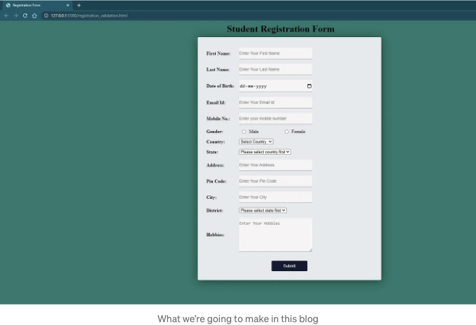

동적 등록 양식은 사용자 등록을 필요로 하는 모든 웹사이트나 애플리케이션의 필수 요소입니다. 사용자 데이터를 수집하고 데이터를 데이터베이스나 다른 백엔드 저장소에 저장하는 과정을 말합니다. 하지만 이 튜토리얼에서는 백엔드 저장 프로세스를 사용하지 않을 것입니다. 여기서는 사용자가 제출 버튼을 클릭한 후 모든 필드를 유효성 검사하고, 유효성을 검사한 후에는 간단한 성공 메시지를 표시할 것입니다. 이 단계별 가이드에서 HTML, CSS 및 JavaScript를 사용하여 등록 양식을 만드는 과정을 안내하겠습니다.

HTML은 웹 페이지의 구조를 만드는 데 사용되는 마크업 언어입니다. HTML을 사용하여 양식 필드, 레이블 및 버튼을 만들 것입니다.

CSS는 양식을 스타일링하여 시각적으로 매력적으로 만듭니다. CSS는 양식의 외관과 느낌을 담당하며, 글꼴 스타일, 색상 및 기타 시각적 요소를 포함합니다.

<!-- ui-log 수평형 -->
<ins class="adsbygoogle"
  style="display:block"
  data-ad-client="ca-pub-4877378276818686"
  data-ad-slot="9743150776"
  data-ad-format="auto"
  data-full-width-responsive="true"></ins>
<component is="script">
(adsbygoogle = window.adsbygoogle || []).push({});
</component>

JavaScript은 양식에 상호 작용성을 추가하는 데 사용됩니다. JavaScript를 사용하면 양식을 유효성 검사하고 오류 처리를 수행하며 실시간 데이터 유효성 검사 및 피드백을 추가하여 양식을 동적으로 만들 수 있습니다.

다음은 HTML, CSS 및 JavaScript를 사용하여 동적 등록 양식을 만드는 단계입니다:

- HTML 양식 구조 만들기: 첫 번째 단계는 HTML 양식 구조를 만드는 것입니다. HTML 양식 태그를 사용하여 양식을 만들고, 입력 태그를 사용하여 텍스트 상자, 라디오 버튼, 확인란 및 드롭다운 목록과 같은 양식 필드를 만듭니다.
- 양식에 CSS 스타일 추가: HTML 양식 구조가 마련되면 다음 단계는 양식에 CSS 스타일을 추가하는 것입니다. CSS를 사용하여 글꼴 스타일, 배경색 등 시각적 요소를 설정합니다. 또한 CSS를 사용하여 애니메이션 및 기타 대화형 요소를 추가할 수 있습니다.
- JavaScript를 사용하여 양식 유효성 검사: 다음 단계는 JavaScript를 사용하여 양식을 유효성 검사하는 것입니다. JavaScript를 사용하여 오류 처리, 데이터 유효성 검사 및 사용자에게 실시간 피드백을 제공합니다. 예를 들어 JavaScript를 사용하여 이메일 주소를 유효성 검사하거나 필수 필드가 모두 작성되었는지 확인하고, 양식이 올바르게 작성되지 않았을 경우 오류 메시지를 표시할 수 있습니다.
- 양식 데이터 제출: 양식이 유효성 검사된 후 최종 단계는 양식 데이터를 제출하는 것입니다. 제출 후 성공 메시지가 표시됩니다.

## 단계 1 → HTML 양식 구조 만들기:

<!-- ui-log 수평형 -->
<ins class="adsbygoogle"
  style="display:block"
  data-ad-client="ca-pub-4877378276818686"
  data-ad-slot="9743150776"
  data-ad-format="auto"
  data-full-width-responsive="true"></ins>
<component is="script">
(adsbygoogle = window.adsbygoogle || []).push({});
</component>

main.html

```html
<!DOCTYPE html>
<html lang="en">
<head>
    <meta charset="UTF-8">
    <meta http-equiv="X-UA-Compatible" content="IE=edge">
    <meta name="viewport" content="width=device-width, initial-scale=1.0">
    <link rel="stylesheet" href="style.css">
    <title>등록 양식</title>
</head>
<body>

    <div class="form-container">
        <h1>학생 등록 양식</h1>
        <form action="registration-success.html">
          <div class="input-group">
            <label><strong>이름:</strong></label>
            <input type="text" placeholder="이름을 입력하세요" id="fname">
          </div>
    
          <div class="input-group">
            <label><strong>성:</strong></label>
            <input type="text" placeholder="성을 입력하세요" id="lname">
          </div>
    
          <div class="input-group">
            <label><strong>생년월일:</strong></label>
            <input type="date" id="dob">
          </div> 

          <div class="input-group">
            <label><strong>이메일:</strong></label>
            <input type="email" placeholder="이메일 주소를 입력하세요" id="email-id">
          </div>

          <div class="input-group">
            <label><strong>휴대전화 번호:</strong></label>
            <input type="tel" placeholder="휴대전화 번호를 입력하세요" id="phone-no">
          </div>

          <div class="input-group">
            <label><strong>성별:</strong></label>
            <input type="radio" style="flex-basis: 0%; margin: 0 10px;" name="gender" value="male" id="male">
            <label for="male">남성</label> 
            <input type="radio" style="flex-basis: 0%; margin: 0 10px;"name="gender" value="female" id="female">
            <label for="female">여성</label> 
          </div> 

          <div class="input-group">
            <label><strong>국가:</strong></label>
            <select name="country" id="country-name">
              <option value="" selected="selected" >국가 선택</option>
            </select>
          </div> 

          <div class="input-group">
            <label><strong>주:</strong></label>
            <select name="state" id="state-name">
              <option value="" selected="selected">먼저 국가를 선택하세요</option>
            </select>
          </div> 

          <div class="input-group">
            <label><strong>주소:</strong></label>
            <input type="text" placeholder="주소를 입력하세요" id="address">
          </div>

          <div class="input-group">
            <label><strong>우편번호:</strong></label>
            <input type="text" placeholder="우편번호를 입력하세요" id="pincode">
          </div> 

          <div class="input-group">
            <label><strong>도시:</strong></label>
            <input type="text" placeholder="도시를 입력하세요" id="city">
          </div>

          <div class="input-group">
            <label><strong>지역:</strong></label>
            <select name="district" id="district-name" >
              <option value="" selected="selected">먼저 주를 선택하세요</option>
            </select>
          </div> 
    
          <div class="input-group">
            <label><strong>취미:</strong></label>
            <textarea rows="5" placeholder="취미를 입력하세요" id="hobbies" ></textarea>
          </div>
    
        <button >제출</button>
       
      </form>

      </div>
      <script src="script.js"></script>
</body>
</html>
```

sucess.html

```html
<!DOCTYPE html>
<html lang="en">
<head>
    <meta charset="UTF-8">
    <meta http-equiv="X-UA-Compatible" content="IE=edge">
    <meta name="viewport" content="width=device-width, initial-scale=1.0">
    <title>Document</title>
</head>
<body>
    <h2 style="font-family: 'Poppins', sans-serif; color: green; text-align: center;">모든 유효성 검사가 성공적으로 완료되었습니다.</h2><br><hr>
    <h2 style="font-family: 'Poppins', sans-serif; color: rgb(45, 143, 88); text-align: center;">등록이 성공적으로 완료되었으며 등록 ID는 ABCD1234입니다.</h2><br>
    
</body>
</html>
```

<!-- ui-log 수평형 -->
<ins class="adsbygoogle"
  style="display:block"
  data-ad-client="ca-pub-4877378276818686"
  data-ad-slot="9743150776"
  data-ad-format="auto"
  data-full-width-responsive="true"></ins>
<component is="script">
(adsbygoogle = window.adsbygoogle || []).push({});
</component>

## 단계 2→ 폼에 CSS 스타일 추가:

```js
body{
    background-color: #18796c;
    display: flex;
    justify-content: center;
    align-items: center;
}

.form-container form{
    background-color: rgb(230, 234, 238);
    padding: 20px 30px 20px;
    position: relative;
    width: 100%;
    border-radius: 4px;
    box-shadow: 0 4px 30px rgba(0, 0, 0, 0.5);

}

h1{
    margin: 0px 0px 10px 0px;
    padding: 0 100px;
}

.input-group{
    width: 110%;
    display: flex;
    align-items: center;
    margin: 16px 0;
    position: relative;
}
.input-group label{
    flex-basis: 18%;
}
.input-group input, .input-group textarea{
    flex-basis: 40%;
    border: 0;
    outline: 0;
    padding: 10px 0;
    border-bottom: 1px solid #999;
    background-color: rgb(247, 244, 244);
    color: rgb(0, 0, 0);
    font-size: 16px;
}
::placeholder{
    font-size: 14px;
}

form button{
    background: #141a34;
    color: #fff;
    border-radius: 4px;
    border: 1px solid rgba(255, 255, 255, 0.7);
    padding: 10px 40px;
    outline: 0;
    cursor: pointer;
    display: block;
    margin: 30px auto 10px;
}
```

이게 우리 폼의 기본 구조입니다. 이제 오류 메시지를 표시하기 위해 html의 span 태그를 사용할 것입니다. 이제 span 태그를 추가한 코드는 다음과 같습니다:

```js
<div class="input-group">
    <label><strong>Last Name:</strong></label>
    <input type="text" placeholder="Enter Your Last Name" id="lname">
    <span id="lname-error"> **성(required 필요) 값을 입력해주세요</span>
</div>
```

<!-- ui-log 수평형 -->
<ins class="adsbygoogle"
  style="display:block"
  data-ad-client="ca-pub-4877378276818686"
  data-ad-slot="9743150776"
  data-ad-format="auto"
  data-full-width-responsive="true"></ins>
<component is="script">
(adsbygoogle = window.adsbygoogle || []).push({});
</component>

우리의 main.html 파일에 위와 같이 span 태그를 추가할 거에요. 비슷하게 모든 언급된 입력 영역에도 이 태그를 추가할 거예요. 그리고 JavaScript를 사용해서 그것을 표시할 예정이기 때문에 span 태그 요소를 삭제할 거에요.

```js
<!DOCTYPE html>
<html lang="en">
<head>
    <meta charset="UTF-8">
    <meta http-equiv="X-UA-Compatible" content="IE=edge">
    <meta name="viewport" content="width=device-width, initial-scale=1.0">
    <link rel="stylesheet" href="style.css">
    <title>Registration Form</title>
</head>
<body>

    <div class="form-container">
        <h1>학생 등록 양식</h1>
        <form action="registration-success.html">
          <div class="input-group">
            <label><strong>이름:</strong></label>
            <input type="text" placeholder="이름을 입력하세요" id="fname">
            <span id="fname-error"></span>
          </div>
    
          <div class="input-group">
            <label><strong>성:</strong></label>
            <input type="text" placeholder="성을 입력하세요" id="lname">
            <span id="lname-error"></span>
          </div>
    
          <div class="input-group">
            <label><strong>생년월일:</strong></label>
            <input type="date" id="dob" onchange="validateDOB()">
            <span id="dob-error"></span>
          </div> 

          <div class="input-group">
            <label><strong>이메일 주소:</strong></label>
            <input type="email" placeholder="이메일 주소를 입력하세요" id="email-id">
            <span id="email-error"></span>
          </div>

          <div class="input-group">
            <label><strong>전화번호:</strong></label>
            <input type="tel" placeholder="전화번호를 입력하세요" id="phone-no">
            <span id="mobile-error"></span>
          </div>

          <div class="input-group">
            <label><strong>성별:</strong></label>
            <input type="radio" style="flex-basis: 0%; margin: 0 10px;" name="gender" value="male" id="male">
            <label for="male">남성</label> 
            <input type="radio" style="flex-basis: 0%; margin: 0 10px;"name="gender" value="female" id="female">
            <label for="female">여성</label> 
            <span id="gender-error"></span>
          </div> 

          <div class="input-group">
            <label><strong>국가:</strong></label>
            <select name="country" id="country-name">
              <option value="" selected="selected" >국가 선택</option>
            </select>
            <span id="country-error"></span>
          </div> 

          <div class="input-group">
            <label><strong>주:</strong></label>
            <select name="state" id="state-name">
              <option value="" selected="selected">먼저 국가를 선택하세요</option>
            </select>
            <span id="state-error"></span>
          </div> 

          <div class="input-group">
            <label><strong>주소:</strong></label>
            <input type="text" placeholder="주소를 입력하세요" id="address">
            <span id="address-error"></span>
          </div>

          <div class="input-group">
            <label><strong>우편번호:</strong></label>
            <input type="text" placeholder="우편번호를 입력하세요" id="pincode">
            <span id="pin-error"></span>
          </div> 

          <div class="input-group">
            <label><strong>도시:</strong></label>
            <input type="text" placeholder="도시를 입력하세요" id="city">
            <span id="city-error"></span>
          </div>

          <div class="input-group">
            <label><strong>지구:</strong></label>
            <select name="district" id="district-name">
              <option value="" selected="selected">먼저 주를 선택하세요</option>
            </select>
            <span id="district-error"></span>
          </div> 
    
          <div class="input-group">
            <label><strong>취미:</strong></label>
            <textarea rows="5" placeholder="취미를 입력하세요" id="hobbies"></textarea>
            <span id="hobbies-error"></span>
          </div>
    
        <button>제출</button>
        <span id="submit-error"></span>
       
      </form>

      </div>
      <script src="script.js"></script>
</body>
</html>
```

또한 아래와 같이 css 파일에 span 태그에 대해 몇 가지 스타일을 추가할 거에요:

```js
.input-group span{
    font-size: 14px;
    color: red;
}

#submit-error{
    color: red;
}

img{
    width: 100%;
    height: 30px;
}
```

<!-- ui-log 수평형 -->
<ins class="adsbygoogle"
  style="display:block"
  data-ad-client="ca-pub-4877378276818686"
  data-ad-slot="9743150776"
  data-ad-format="auto"
  data-full-width-responsive="true"></ins>
<component is="script">
(adsbygoogle = window.adsbygoogle || []).push({});
</component>

## 단계 3→ JavaScript를 사용하여 양식을 유효성 검사하기:

오류 메시지를 표시할 때 사용할 변수를 선언합니다. 여기서는 main.html 파일에서 사용된 id를 가진 요소들을 가져옵니다.

```js
var fnameError = document.getElementById('fname-error');
var lnameError = document.getElementById('lname-error');
var dobError = document.getElementById('dob-error');
var emailError = document.getElementById('email-error');
var genderError = document.getElementById('gender-error');
var mobileError = document.getElementById('mobile-error');
var countryError = document.getElementById('country-error');
var stateError = document.getElementById('state-error');
var addressError = document.getElementById('address-error');
var pinCodeError = document.getElementById('pin-error');
var cityError = document.getElementById('city-error');
var districtError = document.getElementById('district-error');
var hobbiesError = document.getElementById('hobbies-error');
var submitError = document.getElementById('submit-error');
```

주소 필드에 대해 캐스케이딩 드롭다운을 사용할 것이므로 이를 선언합니다.

<!-- ui-log 수평형 -->
<ins class="adsbygoogle"
  style="display:block"
  data-ad-client="ca-pub-4877378276818686"
  data-ad-slot="9743150776"
  data-ad-format="auto"
  data-full-width-responsive="true"></ins>
<component is="script">
(adsbygoogle = window.adsbygoogle || []).push({});
</component>

```js
var addressObject = {
    "INDIA": {
        "Assam": ["Bongaigaon", "Jorhat", "Kokrajhar", "Lakhimpur", "Tinsukia", "Kamrup Metropolitan"],
        "Goa": ["North Goa", "South Goa"],
        "Himachal Pradesh": ["Kangra", "Kullu", "Mandi", "Shimla", "Lahaul and Spiti", "Kinnaur"],
        "Kerela": ["Kollam", "Malappuram", "Thiruvananthapuram", "Kannur", "Palakkad"],
        "Tripura": ["Dhalai", "North Tripura", "South Tripura", "West Tripura"],
        "Sikkim": ["Gangtok", "Mangan", "Namchi", "Geyzing", "Pakyong", "Soreng"],
        "West Bengal": ["Malda", "Alipurduar", "Howrah", "Kolkata", "Bankura", "Nadia"],
        "Delhi": ["Central Delhi", "East Delhi", "New Delhi", "North Delhi", "South Delhi", "West Delhi"]
      },
      "USA": {
        "Arizona": ["Gila", "Yuma", "Apache", "Mohave", "Santa Cruz", "Greenlee"],
        "California": ["San Francisco", "Los Angeles", "Sacramento", "San Diego", "Riverside", "San Jose"],
        "Georgia": ["Atlanta", "Augusta", "Columbus", "Savannah"],
        "Michigan": ["Watersmeet", "Holland", "Flint", "Holly", "Dearborn"],
        "New York": ["Shirley", "Brooklyn", "Manhattan", "Bronx", "Yonkers"],
        "Washington": ["Pierce", "Yakima", "Thurston", "Snohomish"],
        "New Mexico": ["Alamogordo", "Santa Fe", "Albuquerque"]
      },
      "BANGLADESH": {
          "Barisal": ["Barisal", "Barguna", "Bhola", "Pirojpur", "Jhalokati", "Patuakhali"],
          "Khulna": ["Bagerhat", "Jashore", "Khulna", "Narail", "Satkhira", "Meherpur"],
          "Rajshahi": ["Natore", "Sirajganj", "Pabna", "Bogura", "Naogaon", "Joypurhat"],
          "Rangpur": ["Dinajpur", "Kurigram", "Rangpur", "Thakurgaon", "Panchagarh", "Gaibandha"],
          "Sylhet": ["Habiganj", "Moulvibazar", "Sunamganj", "Sylhet"],
          "Dhaka": ["Gazipur", "Tangail", "Rajbari", "Gopalganj", "Faridpur", "Narayanganj"],
          "Chittagong": ["Rangamati", "Cox's Bazar", "Chattogram", "Lakshmipur", "Chandpur", "Brahmanbaria"]
      }
}
```

이제 다음과 같이 해당 드롭다운을 연결하겠습니다:

```js
window.onload = function(){
    var countrySel = document.getElementById("country-name");
    var stateSel = document.getElementById("state-name");
    var districtSel = document.getElementById("district-name");

    for(var x in addressObject){
        countrySel.options[countrySel.options.length] = new Option(x, x);
    }

    countrySel.onchange = function(){
        //Empty districts and States dropdown
        districtSel.length = 1;
        stateSel.length = 1;

        //Display correct values
        for(var y in addressObject[this.value]){
            stateSel.options[stateSel.options.length] = new Option(y, y);
        }
    }

    stateSel.onchange = function(){
        //Empty Districts dropdown
        districtSel.length = 1;

        //display correct values
        var z = addressObject[countrySel.value][this.value];
        console.log(z);
        for(var i=0; i<z.length; i++){
            districtSel.options[districtSel.options.length] = new Option(z[i], z[i]);
        }
    }

}
```

마지막으로 이러한 함수들을 main.html 파일의 해당 입력 요소 태그와 링크해야 합니다.```

<!-- ui-log 수평형 -->
<ins class="adsbygoogle"
  style="display:block"
  data-ad-client="ca-pub-4877378276818686"
  data-ad-slot="9743150776"
  data-ad-format="auto"
  data-full-width-responsive="true"></ins>
<component is="script">
(adsbygoogle = window.adsbygoogle || []).push({});
</component>

```js
<!DOCTYPE html>
<html lang="en">
<head>
    <meta charset="UTF-8">
    <meta http-equiv="X-UA-Compatible" content="IE=edge">
    <meta name="viewport" content="width=device-width, initial-scale=1.0">
    <link rel="stylesheet" href="style.css">
    <title>등록 양식</title>
</head>
<body>

    <div class="form-container">
        <h1>학생 등록 양식</h1>
        <form action="registration-success.html">
          <div class="input-group">
            <label><strong>이름:</strong></label>
            <input type="text" placeholder="이름을 입력하세요" id="fname" onkeyup="validateFName()">
            <span id="fname-error"></span>
          </div>
    
          <div class="input-group">
            <label><strong>성:</strong></label>
            <input type="text" placeholder="성을 입력하세요" id="lname" onkeyup="validateLName()">
            <span id="lname-error"></span>
          </div>
    
          <div class="input-group">
            <label><strong>생년월일:</strong></label>
            <input type="date" id="dob" onchange="validateDOB()">
            <span id="dob-error"></span>
          </div> 

          <div class="input-group">
            <label><strong>이메일:</strong></label>
            <input type="email" placeholder="이메일 주소를 입력하세요" id="email-id" onkeyup="validateEmail()">
            <span id="email-error"></span>
          </div>

          <div class="input-group">
            <label><strong>전화번호:</strong></label>
            <input type="tel" placeholder="휴대폰 번호를 입력하세요" id="phone-no" onkeyup="validatePhone()">
            <span id="mobile-error"></span>
          </div>

          <div class="input-group">
            <label><strong>성별:</strong></label>
            <input type="radio" style="flex-basis: 0%; margin: 0 10px;" name="gender" value="male" id="male" onkeyup="validateGender()">
            <label for="male">남자</label> 
            <input type="radio" style="flex-basis: 0%; margin: 0 10px;"name="gender" value="female" id="female" onkeyup="validateGender()">
            <label for="female">여자</label> 
            <span id="gender-error"></span>
          </div> 

          <div class="input-group">
            <label><strong>국가:</strong></label>
            <select name="country" id="country-name" onclick="validateCountry()">
              <option value="" selected="selected" >국가를 선택하세요</option>
            </select>
            <span id="country-error"></span>
          </div> 

          <div class="input-group">
            <label><strong>도시:</strong></label>
            <select name="state" id="state-name" onclick="validateState()">
              <option value="" selected="selected">먼저 국가를 선택하세요</option>
            </select>
            <span id="state-error"></span>
          </div> 

          <div class="input-group">
            <label><strong>주소:</strong></label>
            <input type="text" placeholder="주소를 입력하세요" id="address" onkeyup="validateAddress()">
            <span id="address-error"></span>
          </div>

          <div class="input-group">
            <label><strong>우편번호:</strong></label>
            <input type="text" placeholder="우편번호를 입력하세요" id="pincode" onkeyup="validatePinCode()">
            <span id="pin-error"></span>
          </div> 

          <div class="input-group">
            <label><strong>도시:</strong></label>
            <input type="text" placeholder="도시를 입력하세요" id="city" onkeyup="validateCity()">
            <span id="city-error"></span>
          </div>

          <div class="input-group">
            <label><strong>지역:</strong></label>
            <select name="district" id="district-name" onclick="validateDistrict()">
              <option value="" selected="selected">먼저 주를 선택하세요</option>
            </select>
            <span id="district-error"></span>
          </div> 
    
          <div class="input-group">
            <label><strong>취미:</strong></label>
            <textarea rows="5" placeholder="취미를 입력하세요" id="hobbies" onkeyup="validateHobbies()"></textarea>
            <span id="hobbies-error"></span>
          </div>
    
        <button onclick="return validateForm()">제출</button>
        <span id="submit-error"></span>
       
      </form>

      </div>
      <script src="script.js"></script>
</body>
</html>
```

여기까지입니다.

이제 HTML, CSS 및 JavaScript로 등록 양식을 성공적으로 만들었습니다.

감사합니다.```