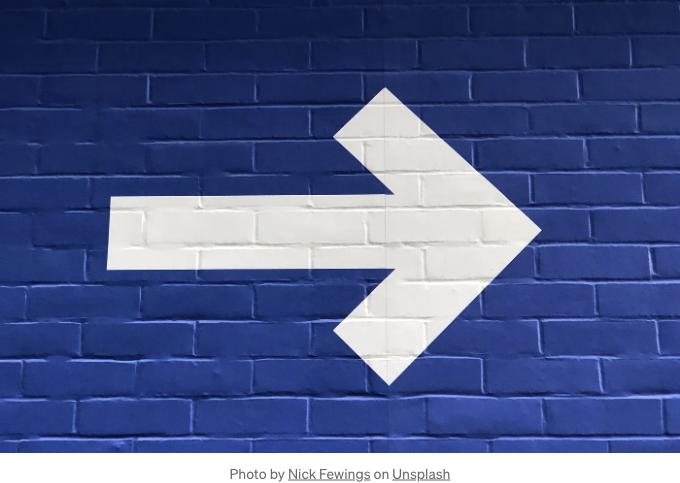

## 화려한 마키 효과를 만들어 사용자들을 매료시키세요. 지금 웹 디자인을 업그레이드하세요! 😍🌟 #CSSAnimation #WebDesign ✨🎉

웹 디자인에서 동적이고 화려한 요소를 추가하면 사용자 경험을 크게 향상시킬 수 있습니다. 인기 있는 효과 중 하나는 마키인데, 마키는 텍스트가 화면을 가로로 스크롤하는 것을 의미합니다. 이 글에서는 CSS 애니메이션을 사용하여 간단한 마키 효과를 만드는 방법에 대해 알아볼 것입니다. 코드를 한 단계씩 살펴보고 핵심 CSS 속성과 사용된 애니메이션 기술을 설명할 것입니다.



HTML 구조:

<!-- ui-log 수평형 -->
<ins class="adsbygoogle"
  style="display:block"
  data-ad-client="ca-pub-4877378276818686"
  data-ad-slot="9743150776"
  data-ad-format="auto"
  data-full-width-responsive="true"></ins>
<component is="script">
(adsbygoogle = window.adsbygoogle || []).push({});
</component>

먼저, 마퀴의 HTML 구조를 살펴봅시다. "marquee" 클래스를 가진 `div` 요소가 포함된 `span` 요소가 있습니다. `span` 안의 텍스트가 화면을 가로지르는 내용이 됩니다.

## CSS 스타일링:

CSS 스타일은 마퀴의 모양과 동작을 정의합니다. "marquee" 클래스는 너비를 100%로 설정하고 가시성을 위해 빨간 테두리를 적용합니다. white-space: nowrap; 속성은 텍스트가 줄 바꿈되지 않고 한 줄에 유지되도록 합니다. overflow: hidden; 속성은 오버플로우된 내용을 숨기며, position: relative;은 위치 지정에 사용됩니다.

## CSS 애니메이션:

<!-- ui-log 수평형 -->
<ins class="adsbygoogle"
  style="display:block"
  data-ad-client="ca-pub-4877378276818686"
  data-ad-slot="9743150776"
  data-ad-format="auto"
  data-full-width-responsive="true"></ins>
<component is="script">
(adsbygoogle = window.adsbygoogle || []).push({});
</component>

노출 보호를 위해 `span` 요소에 애니메이션 속성이 적용되어 있습니다. 애니메이션은 "marquee"로 명명되었으며 지속 시간은 10초입니다. 이를 선형으로 실행되고 무한히 반복하도록 설정했습니다.

## Keyframes Animation:

@keyframes 규칙은 애니메이션의 중간 상태를 정의합니다. 이 경우, 0%와 100% 두 개의 키프레임이 있습니다. 0%에서 텍스트는 뷰포트의 너비(100vw)만큼 오른쪽으로 변환됩니다. 이로써 텍스트는 화면 밖에 위치합니다. 100%에서는 텍스트가 자체 너비의 -100%만큼 왼쪽으로 이동하여(100%) 화면에 다시 표시됩니다.

## 코드 스니펫:

<!-- ui-log 수평형 -->
<ins class="adsbygoogle"
  style="display:block"
  data-ad-client="ca-pub-4877378276818686"
  data-ad-slot="9743150776"
  data-ad-format="auto"
  data-full-width-responsive="true"></ins>
<component is="script">
(adsbygoogle = window.adsbygoogle || []).push({});
</component>

```js
<!DOCTYPE html>
<html>
<head>
  <style>
    .marquee {
      width: 100%;
      border: 1px solid red;
      white-space: nowrap;
      overflow: hidden;
      position: relative;
    }

    .marquee span {
      display: inline-block;
      animation: marquee 10s linear infinite;
    }

    @keyframes marquee {
      0% {
        transform: translateX(100vw);
      }
      100% {
        transform: translateX(-100%);
      }
    }
  </style>
</head>
<body>
  <div class="marquee">
    <span>This is a marquee text. </span>
  </div>
</body>
</html>
```

## 요약:

CSS 애니메이션과 keyframes를 결합하여 간단하지만 효과적인 마퀴 효과를 만들었습니다. 텍스트가 화면을 부드럽게 스크롤하여 웹페이지에 시각적 흥미를 더했습니다. 지속 시간이나 타이밍 함수를 조정하거나 다양한 효과를 위해 추가 keyframes를 추가함으로써 애니메이션을 사용자 정의할 수 있습니다.

CSS 애니메이션을 통해 다양한 웹 요소에 적용할 수 있는 이 마퀴 효과는 웹사이트의 헤드라인, 공지사항 또는 주요 콘텐츠와 같이 다양한 부분에 적용할 수 있습니다. CSS 애니메이션은 매혹적이고 상호작용적인 웹 경험을 만들 수 있는 강력한 도구 세트를 제공합니다.```

<!-- ui-log 수평형 -->
<ins class="adsbygoogle"
  style="display:block"
  data-ad-client="ca-pub-4877378276818686"
  data-ad-slot="9743150776"
  data-ad-format="auto"
  data-full-width-responsive="true"></ins>
<component is="script">
(adsbygoogle = window.adsbygoogle || []).push({});
</component>

희망 했던 기사가 더 나은 이해를 돕기를 바랍니다. 이 기사에서 논의한 내용이나 개선할 부분에 대한 질문이 있다면 주저하지 말고 아래에 댓글을 남겨주세요.