최근에 나는 아래 이미지에서 볼 수 있는 것과 같은 특정 현대적 형식을 따르는 이력서를 가지고 싶었습니다. 이 기사에서는 몇 가지 기술적인 과제를 해결한 방법과 세부 정보를 추가하는 단계별 프로세스를 공유하겠습니다.

내 개인적인 목표는 몇 가지 변수가 있는 간단한 템플릿을 가지고 있어서, 글꼴 패밀리나 글꼴 크기를 조정함으로써 큰 변화의 느낌을 갖고 싶을 때 쉽게 할 수 있도록 하는 것이었습니다.

내가 위대한 디자이너이거나 간결하고 확장 가능한 HTML 및 CSS 코드를 작성한 것은 아니기 때문에 이 프로젝트에서 개선해야 할 부분이 많을 것으로 예상합니다. 그러나 내 필요에는 충분했고, 다른 사람들에게도 도움이 될 수 있기를 희망합니다.

글꼴과 이력서 레이아웃을 선택하기 전에 디자인에 관한 몇 가지 기사를 읽는 것이 유용할 수 있다고 제안하고 싶습니다. 나는 특히 99design.com의 이 기사가 매우 유용하다고 생각했습니다.

<!-- ui-log 수평형 -->
<ins class="adsbygoogle"
  style="display:block"
  data-ad-client="ca-pub-4877378276818686"
  data-ad-slot="9743150776"
  data-ad-format="auto"
  data-full-width-responsive="true"></ins>
<component is="script">
(adsbygoogle = window.adsbygoogle || []).push({});
</component>

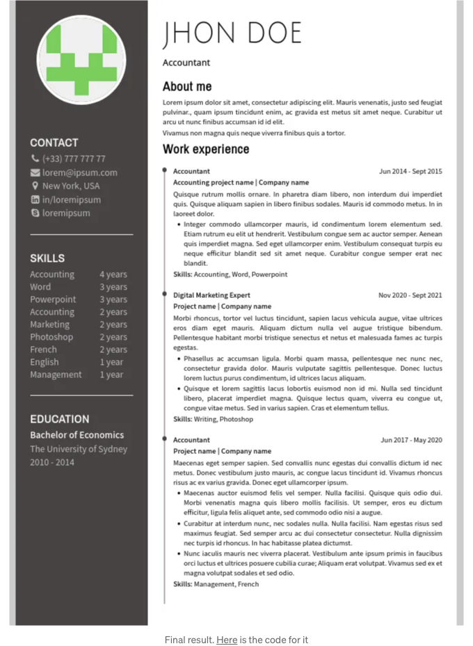

지금까지 난 더 간단한 형식을 선호해 왔고, 기업에 보낸 이력서 대부분은 LaTeX로 작성한 것이었습니다. 그러나 이제 스타일을 변경할 좋은 기회라고 생각했어요.

# 코드 단계별로

이제 어떻게 시작했는지 공유하겠어요. 첫 번째로 다중 페이지 이력서를 작성할 수 있도록 기본적인 설정을 구성하는 것이었습니다.

<!-- ui-log 수평형 -->
<ins class="adsbygoogle"
  style="display:block"
  data-ad-client="ca-pub-4877378276818686"
  data-ad-slot="9743150776"
  data-ad-format="auto"
  data-full-width-responsive="true"></ins>
<component is="script">
(adsbygoogle = window.adsbygoogle || []).push({});
</component>

## 레이아웃

대부분의 렌더링 문제를 피할 수 있게 한 주요한 요소는 CSS 단위로 어디서나 센티미터를 사용한 것입니다. 브라우저에서 나에게 충분히 좋아 보이고 PDF로 변환해도 큰 문제가 없습니다.

그리고 여기 결과가 있습니다. 그다지 인상적이지는 않지만, 마우스 오른쪽 버튼을 클릭하고 인쇄하면 PDF에서 동일한 형식을 얻을 수 있습니다.

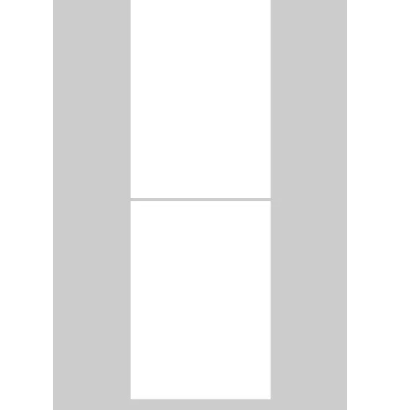

<!-- ui-log 수평형 -->
<ins class="adsbygoogle"
  style="display:block"
  data-ad-client="ca-pub-4877378276818686"
  data-ad-slot="9743150776"
  data-ad-format="auto"
  data-full-width-responsive="true"></ins>
<component is="script">
(adsbygoogle = window.adsbygoogle || []).push({});
</component>

다음에는 일부 div를 만들고 CSS를 추가하려고 했어요.

이제부터 CSS와 HTML 코드 일부를 추가할 거예요. 각 HTML 코드 스니펫은 이전 것과 연결돼 있는 것 같은 조각이 있어요. 예를 들어 `div`나 다른 요소 같은 거죠. 이렇게 하면 혼란스러워 질 걱정은 하지 않겠죠.

index.css

```js
.container {
  display: flex;
  flex-direction: row;
  width: 100%;
  height: 100%;
}

.leftPanel {
  width: 27%;
  background-color: #484444;
  padding: 0.7cm;
  display: flex;
  flex-direction: column;
  align-items: center;
}

.rightPanel {
  width: 73%;
  padding: 0.7cm;
}
```

<!-- ui-log 수평형 -->
<ins class="adsbygoogle"
  style="display:block"
  data-ad-client="ca-pub-4877378276818686"
  data-ad-slot="9743150776"
  data-ad-format="auto"
  data-full-width-responsive="true"></ins>
<component is="script">
(adsbygoogle = window.adsbygoogle || []).push({});
</component>

index.html

```html
```
페이지 사이즈를 'A4'로 설정:
<div class="container">
<div class="leftPanel">
</div>
<div class="rightPanel">
</div>
</div> 

장면이 조금씩 모양을 잡기 시작했다.

이미지를 참고하실래요: 
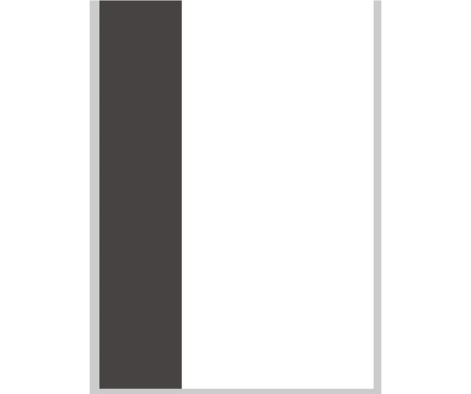

<!-- ui-log 수평형 -->
<ins class="adsbygoogle"
  style="display:block"
  data-ad-client="ca-pub-4877378276818686"
  data-ad-slot="9743150776"
  data-ad-format="auto"
  data-full-width-responsive="true"></ins>
<component is="script">
(adsbygoogle = window.adsbygoogle || []).push({});
</component>

## 왼쪽 패널

여기에 HTML과 CSS와 함께 Google 폰트 링크를 조금 추가하여 좀 더 멋있게 만들어 보았어요.

index.css

```js
.item {
  padding-bottom: 0.7cm;
  padding-top: 0.7cm;
}
.item h2 {
  margin-top: 0;
}
.bottomLineSeparator {
  border-bottom: 0.05cm solid white;
}
h2 {
  font-family: 'Archivo Narrow', sans-serif;
}
.leftPanel h2 {
  color: white;
}
img {
  width: 4cm;
  height: 4cm;
  margin-bottom: 0.7cm;
  border-radius: 50%;
  border: 0.15cm solid white;
  object-fit: cover;
  object-position: 50% 50%;
}
.details {
  width: 100%;
  display: flex;
  flex-direction: column;
}
```

<!-- ui-log 수평형 -->
<ins class="adsbygoogle"
  style="display:block"
  data-ad-client="ca-pub-4877378276818686"
  data-ad-slot="9743150776"
  data-ad-format="auto"
  data-full-width-responsive="true"></ins>
<component is="script">
(adsbygoogle = window.adsbygoogle || []).push({});
</component>

index.html

```js
<link rel="preconnect" href="https://fonts.googleapis.com">
<link rel="preconnect" href="https://fonts.gstatic.com" crossorigin
<link href="https://fonts.googleapis.com/css2?family=Archivo+Narrow&family=Julius+Sans+One&family=Open+Sans&family=Source+Sans+Pro&display=swap" rel="stylesheet">
<div class="leftPanel">
  
  <div class="details">
    <div class="item bottomLineSeparator">
      <h2>
        연락처
      </h2>
    </div>
    <div class="item bottomLineSeparator">
      <h2>
        기술
      </h2>
    </div>
    <div class="item">
      <h2>
        학력
      </h2>
    </div>
  </div>
</div>
```

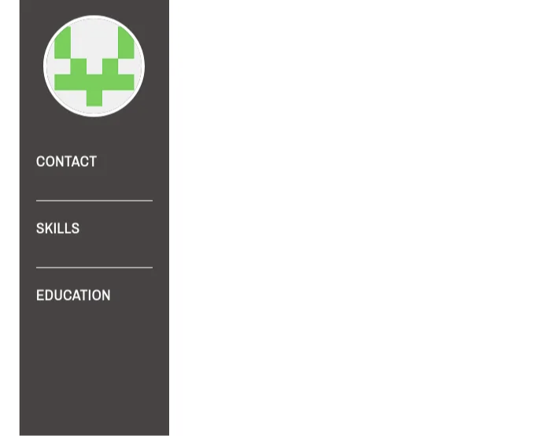

## Font Awesome 사용하기

<!-- ui-log 수평형 -->
<ins class="adsbygoogle"
  style="display:block"
  data-ad-client="ca-pub-4877378276818686"
  data-ad-slot="9743150776"
  data-ad-format="auto"
  data-full-width-responsive="true"></ins>
<component is="script">
(adsbygoogle = window.adsbygoogle || []).push({});
</component>

다음으로, 예쁘고 쉽게 설정할 수 있는 아이콘을 추가하기 위해 Font Awesome를 사용했습니다.

index.css

```js
.leftPanel .smallText, 
.leftPanel .smallText, 
.leftPanel .smallText span, 
.leftPanel .smallText p, 
.smallText a {
  font-size: 0.45cm;
}
.smallText, 
.smallText span, 
.smallText p, 
.smallText a {
  font-family: 'Source Sans Pro', sans-serif;
  text-align: justify;
}
.contactIcon {
  width: 0.5cm;
  text-align: center;
}
.leftPanel, 
.leftPanel a {
  color: #bebebe;
  text-decoration: none;
}
```

index.html

<!-- ui-log 수평형 -->
<ins class="adsbygoogle"
  style="display:block"
  data-ad-client="ca-pub-4877378276818686"
  data-ad-slot="9743150776"
  data-ad-format="auto"
  data-full-width-responsive="true"></ins>
<component is="script">
(adsbygoogle = window.adsbygoogle || []).push({});
</component>

```js
<link href="https://maxcdn.bootstrapcdn.com/font-awesome/4.2.0/css/font-awesome.min.css" rel="stylesheet">

<div class="item bottomLineSeparator">
  <h2>
    연락처
  </h2>
  <div class="smallText">
    <p>
      <i class="fa fa-phone contactIcon" aria-hidden="true"></i>
      (+33) 777 777 77
    </p>
    <p>
      <i class="fa fa-envelope contactIcon" aria-hidden="true"></i>
      <a href="lorem@ipsum.com@gmail.com">
        lorem@ipsum.com
      </a>
    </p>
    <p>
      <i class="fa fa-map-marker contactIcon" aria-hidden="true"></i>
      미국 뉴욕
    </p>
    <p>
      <i class="fa fa-linkedin-square contactIcon" aria-hidden="true"></i>
      <a href="#">
        in/loremipsum
      </a>
    </p>
    <p class="lastParagrafNoMarginBottom">
      <i class="fa fa-skype contactIcon" aria-hidden="true"></i>
      <a href="#">
        loremipsum
      </a>
    </p>
  </div>
</div>
```

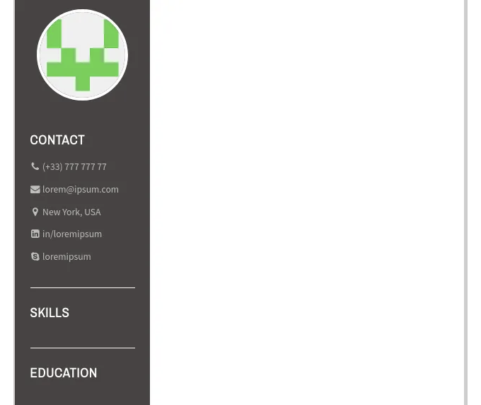

## 숫자와 단어를 정렬해보세요

다음으로 하고 싶은 작은 디테일은 경력의 년수를 정렬하고 "year" 단어의 단수와 복수를 맞추는 것이었습니다.

<!-- ui-log 수평형 -->
<ins class="adsbygoogle"
  style="display:block"
  data-ad-client="ca-pub-4877378276818686"
  data-ad-slot="9743150776"
  data-ad-format="auto"
  data-full-width-responsive="true"></ins>
<component is="script">
(adsbygoogle = window.adsbygoogle || []).push({});
</component>

index.css

```js
.skill {
  display: flex;
  flex-direction: row;
  justify-content: space-between;
}
.yearsOfExperience {
  width: 1.6cm;
  display: flex;
  flex-direction: row;
  justify-content: center;
}
.alignleft {
  text-align: left !important;
  width: 1cm;
}
.alignright {
  text-align: right !important;
  width: 0.6cm;
  margin-right: 0.1cm;
}
```

index.html

```js
<div class="item bottomLineSeparator">
  <h2>
    기술
  </h2>
  <div class="smallText">
    <div class="skill">
      <div>
        <span>회계</span>
      </div>
      <div class="yearsOfExperience">
        <span class="alignright">14</span>
        <span class="alignleft">년</span>
      </div>
    </div>
    <div class="skill">
      <div>
        <span>워드</span>
      </div>
      <div class="yearsOfExperience">
        <span class="alignright">3</span>
        <span class="alignleft">년</span>
      </div>
    </div>
    <div class="skill">
      <div>
        <span>파워포인트</span>
      </div>
      <div class="yearsOfExperience">
        <span class="alignright">1</span>
        <span class="alignleft">년</span>
      </div>
    </div>
  </div>
</div>
```

<!-- ui-log 수평형 -->
<ins class="adsbygoogle"
  style="display:block"
  data-ad-client="ca-pub-4877378276818686"
  data-ad-slot="9743150776"
  data-ad-format="auto"
  data-full-width-responsive="true"></ins>
<component is="script">
(adsbygoogle = window.adsbygoogle || []).push({});
</component>


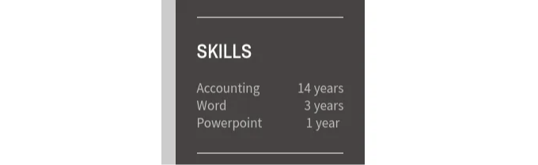

## Filler section

다음 섹션은 기술적인 도전이 없지만 이력서의 매우 중요한 부분입니다.

index.css

<!-- ui-log 수평형 -->
<ins class="adsbygoogle"
  style="display:block"
  data-ad-client="ca-pub-4877378276818686"
  data-ad-slot="9743150776"
  data-ad-format="auto"
  data-full-width-responsive="true"></ins>
<component is="script">
(adsbygoogle = window.adsbygoogle || []).push({});
</component>

```js
.bolded {
  font-weight: bold;
}
.white {
  color: white;
}
```

index.html

```html
<div class="item">
  <h2>
    교육
  </h2>
  <div class="smallText">
    <p class="bolded white">
      경제학 학사
    </p>
    <p>
      시드니 대학교
    </p>
    <p>
      2010 - 2014
    </p>
  </div>
</div>
```

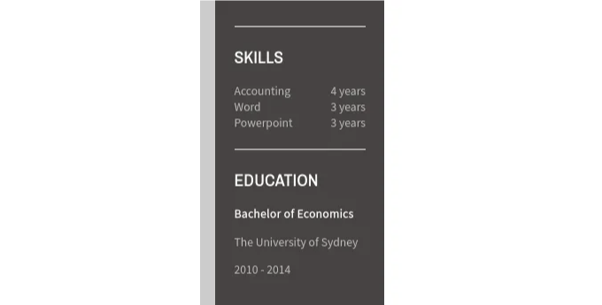
```

<!-- ui-log 수평형 -->
<ins class="adsbygoogle"
  style="display:block"
  data-ad-client="ca-pub-4877378276818686"
  data-ad-slot="9743150776"
  data-ad-format="auto"
  data-full-width-responsive="true"></ins>
<component is="script">
(adsbygoogle = window.adsbygoogle || []).push({});
</component>

## 오른쪽 패널

다음 부분에서 제가 분석한 다른 이력서 모델들에서 조금 더 길게 된 사람의 이름을 발견했어요. 그래서 h1 CSS에 transform을 추가하여 똑같이 해보았습니다. 더 쉽게 이루어질 수 있었는지 또는 더 나은 아이디어가 있었는지 확신할 수는 없지만, 제게는 도움이 되었어요.

index.css

```js
h1 { 
  font-family: 'Julius Sans One', sans-serif;
}
h1 { 
  font-weight: 300; 
  font-size: 1.2cm;
  transform:scale(1,1.15); 
  margin-bottom: 0.2cm;
  margin-top: 0.2cm;
  text-transform: uppercase; 
}
h3 {
  font-family: 'Open Sans', sans-serif;
}
```

<!-- ui-log 수평형 -->
<ins class="adsbygoogle"
  style="display:block"
  data-ad-client="ca-pub-4877378276818686"
  data-ad-slot="9743150776"
  data-ad-format="auto"
  data-full-width-responsive="true"></ins>
<component is="script">
(adsbygoogle = window.adsbygoogle || []).push({});
</component>

index.html

```md
```js
<div class="rightPanel">
  <div>
    <h1>
      Jhon Doe
    </h1>
    <div class="smallText">
      <h3>
        Accountant
      </h3>
    </div>
  </div>
</div>
```
```

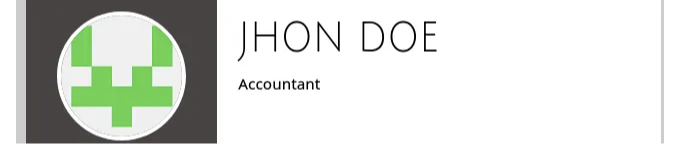

index.html
```

<!-- ui-log 수평형 -->
<ins class="adsbygoogle"
  style="display:block"
  data-ad-client="ca-pub-4877378276818686"
  data-ad-slot="9743150776"
  data-ad-format="auto"
  data-full-width-responsive="true"></ins>
<component is="script">
(adsbygoogle = window.adsbygoogle || []).push({});
</component>

```js
<div>
  <h2>
    나에 대해
  </h2>
  <div class="smallText">
    <p>
      Lorem ipsum dolor sit amet, consectetur adipiscing elit. Mauris venenatis, justo sed feugiat pulvinar., quam ipsum tincidunt enim, ac gravida est metus sit amet neque. Curabitur ut arcu ut nunc finibus accumsan id id elit. 
    </p>
    <p>
      Vivamus non magna quis neque viverra finibus quis a tortor. 
    </p>
  </div>
</div>
```

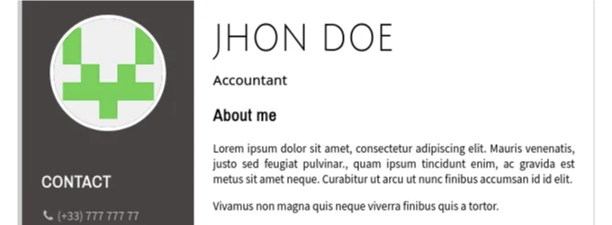

## 연결된 글머리 기호

아래 마지막 도전 과제는 작업 경험 섹션 항목의 글머리 기호를 연결하는 예쁜 선을 추가하는 것이었습니다. 이를 구현하기 위해 이 좋은 기사를 참고했습니다.```

<!-- ui-log 수평형 -->
<ins class="adsbygoogle"
  style="display:block"
  data-ad-client="ca-pub-4877378276818686"
  data-ad-slot="9743150776"
  data-ad-format="auto"
  data-full-width-responsive="true"></ins>
<component is="script">
(adsbygoogle = window.adsbygoogle || []).push({});
</component>

index.css

```js
.workExperience>ul>li ul {
  padding-left: 0.5cm;
  list-style-type: disc;
}
.workExperience>ul {
  list-style-type: none;
  padding-left: 0;
}
.workExperience>ul>li {
  position: relative;
  margin: 0;
  padding-bottom: 0.5cm;
  padding-left: 0.5cm;
}
.workExperience>ul>li:before {
  background-color: #b8abab;
  width: 0.05cm;
  content: '';
  position: absolute;
  top: 0.1cm;
  bottom: -0.2cm; /* 테두리 제거 후 수정 */
  left: 0.05cm;
}
.workExperience>ul>li::after {
  content: '';
  position: absolute;
  background-image: url("data:image/svg+xml,%3Csvg xmlns='http://www.w3.org/2000/svg' aria-hidden='true' viewBox='0 0 32 32' focusable='false'%3E%3Ccircle stroke='none' fill='%23484444' cx='16' cy='16' r='10'%3E%3C/circle%3E%3C/svg%3E");
  background-repeat: no-repeat;
  background-size: contain;
  left: -0.09cm;
  top: 0;
  width: 0.35cm;
  height: 0.35cm;
}
.jobPosition {
  display: flex;
  flex-direction: row;
  justify-content: space-between;
}
.jobPosition span, 
.projectName span {
  font-family: 'Source Sans Pro', sans-serif;
}
```	

index.html

```js
<div class="workExperience">
  <h2>
    Work experience
  </h2>
  <ul>
    <li>
      <div class="jobPosition">
        <span class="bolded">
          회계사
        </span>
        <span>
          2014년 6월 - 2015년 9월
        </span>
      </div>
      <div class="projectName bolded">
        <span>
          회계 프로젝트명 | 회사명
        </span>
      </div>
    </li>
    <li>
      <div class="jobPosition">
        <span class="bolded">
          디지털 마케팅 전문가
        </span>
        <span>
          2020년 11월 - 2021년 9월
        </span>
      </div>
      <div class="projectName bolded">
        <span>
          프로젝트명 | 회사명
        </span>
      </div> 
    </li>
    <li>
      <div class="jobPosition">
        <span class="bolded">
          회계사
        </span>
        <span>
          2017년 6월 - 2020년 5월
        </span>
      </div>
      <div class="projectName bolded">
        <span>
          프로젝트명 | 회사명
        </span>
      </div>
    </li>
  </ul>
</div>
```

<!-- ui-log 수평형 -->
<ins class="adsbygoogle"
  style="display:block"
  data-ad-client="ca-pub-4877378276818686"
  data-ad-slot="9743150776"
  data-ad-format="auto"
  data-full-width-responsive="true"></ins>
<component is="script">
(adsbygoogle = window.adsbygoogle || []).push({});
</component>

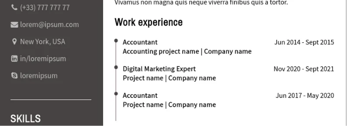

이 기사에서는 작업 경험의 세부 정보를 건너 뜀으로써 가치를 추가하지 않았습니다. 프로젝트의 핵심 작업이 이전 단계에서 완료되었기 때문입니다.

## 스타일 빠르게 변경하기

마지막 부분에서는 CSS 섹션을 기능별로 정렬하여 글꼴 패밀리, 색상 및 크기에 대한 하위 섹션을 만들었습니다. 이제 몇 가지 수정만으로 완전히 새로운 스타일 느낌을 줄 수 있습니다.

<!-- ui-log 수평형 -->
<ins class="adsbygoogle"
  style="display:block"
  data-ad-client="ca-pub-4877378276818686"
  data-ad-slot="9743150776"
  data-ad-format="auto"
  data-full-width-responsive="true"></ins>
<component is="script">
(adsbygoogle = window.adsbygoogle || []).push({});
</component>

아래 이미지에서 등간 고정폭 글꼴을 사용했어요. 글꼴 크기 조정하는 데 약 2분 정도 걸렸어요. 가독성이 좋지 않기 때문에 이 글꼴을 사용해서 이력서를 어떤 채용 담당자에게도 보내지 않겠죠.

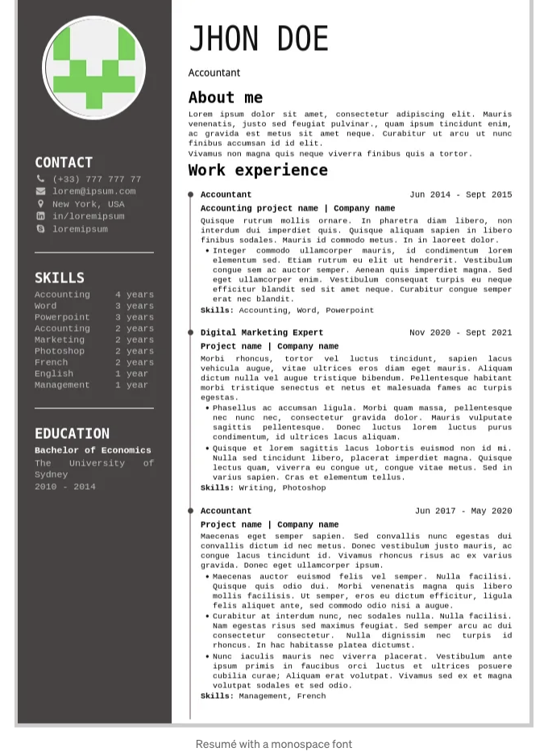

# 결론

인쇄용 문서를 HTML과 CSS를 사용해 작성하는 것은 확실히 가능하지만, 나쁜 결과물을 만들지 않도록 각 변경 사항을 주의깊게 살펴봐야 해요.

<!-- ui-log 수평형 -->
<ins class="adsbygoogle"
  style="display:block"
  data-ad-client="ca-pub-4877378276818686"
  data-ad-slot="9743150776"
  data-ad-format="auto"
  data-full-width-responsive="true"></ins>
<component is="script">
(adsbygoogle = window.adsbygoogle || []).push({});
</component>

저는 디자인 스킬을 향상시키는 데 도움이 된 재미있는 연습이었고, 이 글도 작성할 수 있어서 기쁩니다. HTML과 CSS로 이력서를 작성하는 것이 오랫동안 제 해야할 일 목록에 있었는데, 이번 도전은 목록에서 또 다른 항목을 해결할 수 있는 완벽한 기회였습니다.