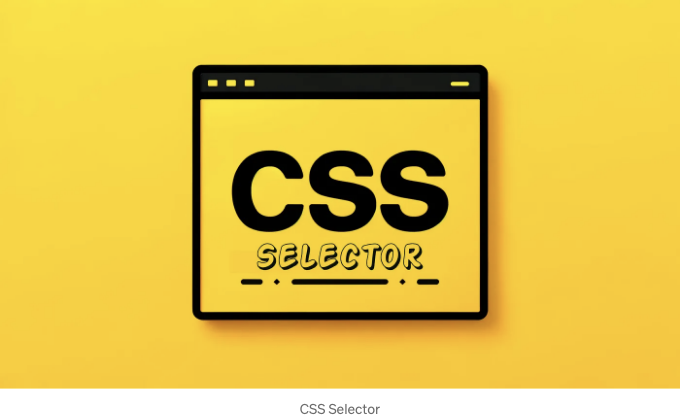

웹 애플리케이션에 스타일을 만들 때 CSS 선택자를 이해하는 것은 정교하고 효율적인 스타일링을 위해 매우 중요합니다. 아래에는 전문 개발자를 위한 다양한 CSS 선택자에 관한 심층 안내서가 있습니다. 이것은 그들의 웹 디자인 전략을 향상시키고자 하는 전문 개발자를 위한 것입니다.



이 개요에서는 여러 가지 중요한 선택자를 다루며, 실제 응용 프로그램에서의 활용 방법에 대한 통찰력을 제공할 것입니다.

# 타입 선택자

<!-- ui-log 수평형 -->
<ins class="adsbygoogle"
  style="display:block"
  data-ad-client="ca-pub-4877378276818686"
  data-ad-slot="9743150776"
  data-ad-format="auto"
  data-full-width-responsive="true"></ins>
<component is="script">
(adsbygoogle = window.adsbygoogle || []).push({});
</component>


| Header 1 | Header 2 |
| -------- | -------- |
| Data 1   | Data 2   |

<!-- ui-log 수평형 -->
<ins class="adsbygoogle"
  style="display:block"
  data-ad-client="ca-pub-4877378276818686"
  data-ad-slot="9743150776"
  data-ad-format="auto"
  data-full-width-responsive="true"></ins>
<component is="script">
(adsbygoogle = window.adsbygoogle || []).push({});
</component>

클래스 선택자는 특정 HTML 태그에 묶이지 않고 공통 특성을 공유하는 요소들을 스타일링하는 다재다능한 도구입니다.

 ```js
 /* 경고 메시지에 대한 스타일 */
 .warning {
     font-weight: bold;
     color: maroon;
 }
 ```

버튼, 알림 또는 뱃지와 같은 재사용 가능한 스타일 패턴에 완벽하게 적합합니다.

# ID 선택자

<!-- ui-log 수평형 -->
<ins class="adsbygoogle"
  style="display:block"
  data-ad-client="ca-pub-4877378276818686"
  data-ad-slot="9743150776"
  data-ad-format="auto"
  data-full-width-responsive="true"></ins>
<component is="script">
(adsbygoogle = window.adsbygoogle || []).push({});
</component>

ID 선택자는 단일 요소를 스타일링하는 데 사용되는 고유 식별자입니다. 클래스와 유형보다 우선 순위가 높아 강력하지만 융통성이 떨어집니다. 메인 네비게이션 바나 페이지 푸터와 같이 고유한 요소에 가장 적합합니다.

```js
/* 고유한 헤더 스타일 */
#main-header {
    background-color: black;
    color: white;
}
```

## 속성 선택자

속성 선택자는 요소의 속성의 존재나 값에 따라 스타일 옵션을 제공하여 높은 수준의 제어와 명확성을 제공합니다.

<!-- ui-log 수평형 -->
<ins class="adsbygoogle"
  style="display:block"
  data-ad-client="ca-pub-4877378276818686"
  data-ad-slot="9743150776"
  data-ad-format="auto"
  data-full-width-responsive="true"></ins>
<component is="script">
(adsbygoogle = window.adsbygoogle || []).push({});
</component>

```js
/* 'text' 타입의 모든 input 요소를 대상으로 함 */
input[type="text"] {
    border: 1px solid grey;
    padding: 5px;
}
```

입력 또는 버튼과 같은 폼 컨트롤에 유용합니다.

# 후손 선택자

후손 선택자는 특정 부모 요소 안에 중첩된 요소를 대상으로 하여 디자이너가 계층적인 스타일을 만들 수 있습니다.

<!-- ui-log 수평형 -->
<ins class="adsbygoogle"
  style="display:block"
  data-ad-client="ca-pub-4877378276818686"
  data-ad-slot="9743150776"
  data-ad-format="auto"
  data-full-width-responsive="true"></ins>
<component is="script">
(adsbygoogle = window.adsbygoogle || []).push({});
</component>

```css
/* 기사 내 단락 스타일링 */
article p {
    text-indent: 20px;
    margin-bottom: 10px;
}
```

페이지의 특정 섹션 내 텍스트 콘텐츠를 스타일링하는 데 유용합니다.

# 자식 선택자

자식 선택자는 지정된 요소의 직계 자식에 집중하며, 깊은 중첩된 요소에 영향을주지 않고 직계 자손에 스타일을 적용하는 데 유용합니다.

<!-- ui-log 수평형 -->
<ins class="adsbygoogle"
  style="display:block"
  data-ad-client="ca-pub-4877378276818686"
  data-ad-slot="9743150776"
  data-ad-format="auto"
  data-full-width-responsive="true"></ins>
<component is="script">
(adsbygoogle = window.adsbygoogle || []).push({});
</component>

```js
/* 목록 요소의 직접 자식들을 대상으로 함 */
ul > li {
    list-style-type: none;
    margin: 5px 0;
}
```

사용 사례: 중첩된 목록의 스타일을 다르게 지정해야 할 때 유용함.

# 인접 형제 선택자

이 선택자는 다른 특정 요소 바로 뒤에 위치한 요소를 대상으로 하며, 중첩되지 않은 관련된 요소를 디자인하는 데 도움을 줌.

<!-- ui-log 수평형 -->
<ins class="adsbygoogle"
  style="display:block"
  data-ad-client="ca-pub-4877378276818686"
  data-ad-slot="9743150776"
  data-ad-format="auto"
  data-full-width-responsive="true"></ins>
<component is="script">
(adsbygoogle = window.adsbygoogle || []).push({});
</component>

```js
/* H1 다음의 문단에는 특별한 스타일이 적용됩니다 */
h1 + p {
    font-size: large;
    color: darkslategray;
}
```

사용 사례: 다른 콘텐츠와 구분하여 소개 문단을 설정하는 데 유용합니다.

# 가상 클래스

:hover나 :focus와 같은 가상 클래스는 사용자 상호작용에 대응하여 스타일을 적용함으로써 UI의 동적인 측면을 향상시킵니다.

<!-- ui-log 수평형 -->
<ins class="adsbygoogle"
  style="display:block"
  data-ad-client="ca-pub-4877378276818686"
  data-ad-slot="9743150776"
  data-ad-format="auto"
  data-full-width-responsive="true"></ins>
<component is="script">
(adsbygoogle = window.adsbygoogle || []).push({});
</component>

```js
/* 링크 컬러가 호버시 변경됩니다 */
a:hover {
    color: coral;
}
```

사용자의 액션에 시각적 피드백을 제공해 상호작용 요소를 강조합니다.

# 결론

이 CSS 선택자에 대한 상세한 논해는 웹 디자인 기술을 갖추고, 확장 가능하며 유지보수 가능한 스타일시트를 만들고자 하는 개발자를 위해 작성되었습니다.

<!-- ui-log 수평형 -->
<ins class="adsbygoogle"
  style="display:block"
  data-ad-client="ca-pub-4877378276818686"
  data-ad-slot="9743150776"
  data-ad-format="auto"
  data-full-width-responsive="true"></ins>
<component is="script">
(adsbygoogle = window.adsbygoogle || []).push({});
</component>

각 셀렉터는 정확히 대상을 지정하고 스타일을 적용하는 데 도움이 되는 것뿐만 아니라 웹 인터페이스의 의미론적 구조와 상호 작용 능력을 향상시킵니다.

# 관련 기사