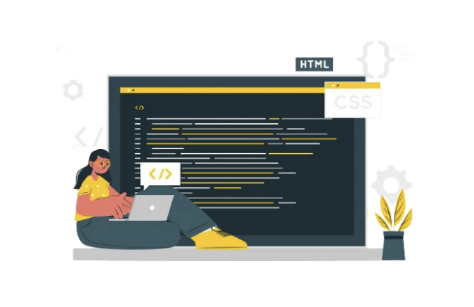
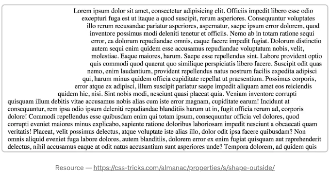
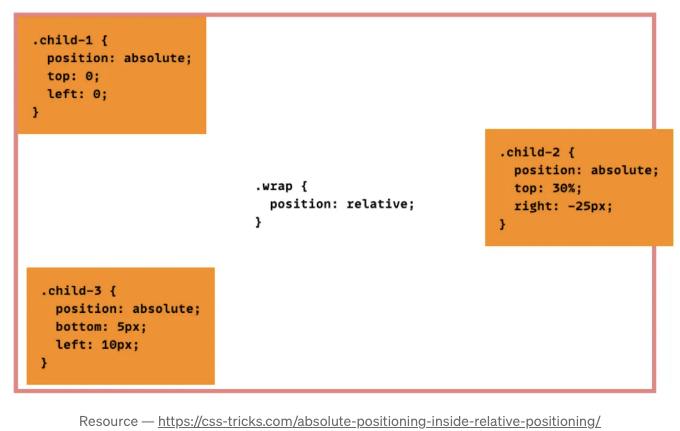
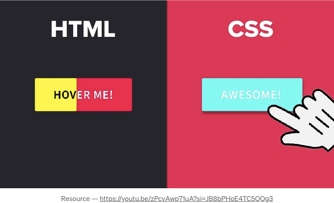
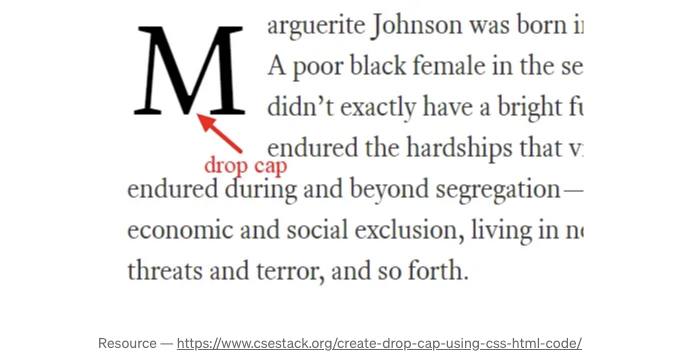

웹 디자인 기술을 향상시키기 위한 몇 가지 똑똑한 CSS 기술을 발견하고 싶으신가요? 아래에는 이를 위한 13가지 쉬운 팁이 있습니다!

## 1. 부유 이미지 주변에 텍스트 곡선 처리하기

shape-outside는 기하학적 모양을 설정하여 주변에 텍스트가 부유할 수 있는 텍스트 영역을 생성할 수 있는 CSS 속성입니다. 웹 페이지에서 기하학적 모양을 사용하며 텍스트가 해당 모양 주변에 동적으로 감싸지도록 하려는 경우 도움이 될 수 있습니다. 아래는 샘플 코드 스니펫과 출력물입니다.

<!-- ui-log 수평형 -->
<ins class="adsbygoogle"
  style="display:block"
  data-ad-client="ca-pub-4877378276818686"
  data-ad-slot="9743150776"
  data-ad-format="auto"
  data-full-width-responsive="true"></ins>
<component is="script">
(adsbygoogle = window.adsbygoogle || []).push({});
</component>

```js
.circle{
  width: 100px;
  float: left;
  shape-outside: circle(50%);
}
```



## 2. 이미지 크기 조정하기

가끔 이미지가 주어진 너비에 맞게 비례적으로 크기를 조정해야 할 때가 있습니다. 이를 쉽게 구현하는 방법 중 하나는 최대 너비를 사용하는 것입니다. 아래는 이를 처리하는 간단한 코드 스니펫입니다.

<!-- ui-log 수평형 -->
<ins class="adsbygoogle"
  style="display:block"
  data-ad-client="ca-pub-4877378276818686"
  data-ad-slot="9743150776"
  data-ad-format="auto"
  data-full-width-responsive="true"></ins>
<component is="script">
(adsbygoogle = window.adsbygoogle || []).push({});
</component>

```css
img {
    max-width:100%;
    height:auto;
}
```

## 3. 절대 위치 지정

특정 위치에 웹 페이지의 객체를 정적으로 배치하려면 아래 예시와 같이 절대 위치 지정을 사용할 수 있습니다.

```css
position:absolute
```

<!-- ui-log 수평형 -->
<ins class="adsbygoogle"
  style="display:block"
  data-ad-client="ca-pub-4877378276818686"
  data-ad-slot="9743150776"
  data-ad-format="auto"
  data-full-width-responsive="true"></ins>
<component is="script">
(adsbygoogle = window.adsbygoogle || []).push({});
</component>



## 4. 아이콘 및 로고에 SVG 사용하기

웹 페이지에 JPG, PNG 또는 GIF 이미지를 사용하면 크기를 조정하면 때로는 픽셀화될 수 있습니다. 이 문제를 해결하기 위해 로고를 픽셀화시키지 않은 모든 해상도 스타일로 지원하는 SVG 이미지를 사용할 수 있습니다. 아래 코드는 웹사이트 로고를 표시하는 CSS 코드입니다.

```js
#로고 {
  display: block;
  text-indent: -9999px;
  width: 100px;
  height: 80px;
  background: url(logo.svg);
  background-size: 100px 80px;
}
```

<!-- ui-log 수평형 -->
<ins class="adsbygoogle"
  style="display:block"
  data-ad-client="ca-pub-4877378276818686"
  data-ad-slot="9743150776"
  data-ad-format="auto"
  data-full-width-responsive="true"></ins>
<component is="script">
(adsbygoogle = window.adsbygoogle || []).push({});
</component>

## 5. 모든 스타일 덮어씌우기

특정 요소에 대해 다른 CSS 스타일을 덮어쓰고 싶다면 CSS 테마에서 !important를 사용하세요. 아래 예시에서는 H2 제목의 색상을 파란색 대신 빨간색으로 덮어씁니다.

```js
.section h2 { color:red !important; }
```

## 6. 수직 정렬

<!-- ui-log 수평형 -->
<ins class="adsbygoogle"
  style="display:block"
  data-ad-client="ca-pub-4877378276818686"
  data-ad-slot="9743150776"
  data-ad-format="auto"
  data-full-width-responsive="true"></ins>
<component is="script">
(adsbygoogle = window.adsbygoogle || []).push({});
</component>

여기서 중요한 점은 메뉴 높이와 텍스트 행 높이를 동일하게 유지하는 것입니다. 아래는 코드 스니펫입니다.

```js
.nav li{
    line-height:40px;
    height:40px;
}
```

## 7. 호버 시 강조 표시

이 기술은 누군가 해당 요소 위로 마우스를 올릴 때 버튼, 텍스트 링크, 사이트 블록, 아이콘 등의 색상을 변경할 수 있는 강조 표시 기술입니다. 아래는 샘플 코드 스니펫과 결과물입니다.

<!-- ui-log 수평형 -->
<ins class="adsbygoogle"
  style="display:block"
  data-ad-client="ca-pub-4877378276818686"
  data-ad-slot="9743150776"
  data-ad-format="auto"
  data-full-width-responsive="true"></ins>
<component is="script">
(adsbygoogle = window.adsbygoogle || []).push({});
</component>

```js
.a h2{
    font-size:42px;
    color:#000;
    font-weight:600;
}

.a h2:hover{
    color:#f00;
}
```



## 8. 여러 클래스 또는 셀렉터에 CSS 적용하기

모든 사진, 블로그 및 사이드바에 동일한 경계를 설정하려면 정확히 동일한 CSS를 세 번 쓸 필요가 없고 쉼표로 구분된 항목을 나열할 수 있습니다. 아래는 예시입니다.```  

<!-- ui-log 수평형 -->
<ins class="adsbygoogle"
  style="display:block"
  data-ad-client="ca-pub-4877378276818686"
  data-ad-slot="9743150776"
  data-ad-format="auto"
  data-full-width-responsive="true"></ins>
<component is="script">
(adsbygoogle = window.adsbygoogle || []).push({});
</component>

```css
.blog, img, .sidebar {
    border: 1px solid #000;
}
```

## 이전 9. 

이 CSS는 특정 클래스의 각 발생 앞에 컨텐츠를 삽입하도록 선택자입니다. 아래 예제에서는 H2 태그 앞에 추가적인 섹션이 추가되었습니다.

```css
h2:before { 
    content: "계속: ";
    <span class="Apple-converted-space"> color: #F00;</span>
}
```

<!-- ui-log 수평형 -->
<ins class="adsbygoogle"
  style="display:block"
  data-ad-client="ca-pub-4877378276818686"
  data-ad-slot="9743150776"
  data-ad-format="auto"
  data-full-width-responsive="true"></ins>
<component is="script">
(adsbygoogle = window.adsbygoogle || []).push({});
</component>

## 10. 이후

선택한 섹션 뒤에 콘텐츠를 삽입하는 이전 것과 유사합니다. 아래는 예시입니다.

```js
p:after{ 
    content: " -Read more… ";
    color:#f00;
}
```

## 11. 드롭 캡

<!-- ui-log 수평형 -->
<ins class="adsbygoogle"
  style="display:block"
  data-ad-client="ca-pub-4877378276818686"
  data-ad-slot="9743150776"
  data-ad-format="auto"
  data-full-width-responsive="true"></ins>
<component is="script">
(adsbygoogle = window.adsbygoogle || []).push({});
</component>

기사 안에서 첫 번째 큰 글자는 정말 눈에 띕니다, 그렇죠? CSS로도 가상 요소 :first-letter를 사용하여 같은 효과를 낼 수 있어요. 아래는 샘플 코드 스니펫과 출력 결과입니다.

```js
a:first-letter{
    display:block;
    float:left;
    margin:5px;
    color:#f00;
    font-size:500%;
}
```



## 12. 텍스트를 모두 대문자, 모두 소문자로 또는 대문자로 강제로 변경하기

<!-- ui-log 수평형 -->
<ins class="adsbygoogle"
  style="display:block"
  data-ad-client="ca-pub-4877378276818686"
  data-ad-slot="9743150776"
  data-ad-format="auto"
  data-full-width-responsive="true"></ins>
<component is="script">
(adsbygoogle = window.adsbygoogle || []).push({});
</component>

이 CSS 트릭을 사용하면 특정 유형의 텍스트를 특정 케이스로 강제할 수 있어요. 대문자, 소문자 또는 대문자로 변환하는 예제가 아래에 있어요.

```js
h2 { 
   text-transform: uppercase;
}
```

```js
h2 { 
  text-transform: lowercase; 
}
```

```js
h2 { 
  text-transform: capitalize; 
}
```

<!-- ui-log 수평형 -->
<ins class="adsbygoogle"
  style="display:block"
  data-ad-client="ca-pub-4877378276818686"
  data-ad-slot="9743150776"
  data-ad-format="auto"
  data-full-width-responsive="true"></ins>
<component is="script">
(adsbygoogle = window.adsbygoogle || []).push({});
</component>

## 13. 링크

이 CSS 코드 스니펫은 이미 방문한 링크를 다른 색상으로 강조하여 방문자가 어떤 링크를 이미 방문했는지 파악할 수 있도록 도와줍니다. 아래 예시는 이미 방문한 링크가 파란색 대신 보라색으로 강조되는 것을 보여줍니다.

```js
a:link { color: blue; }
a:visited { color: purple; }
```