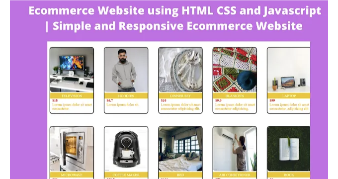
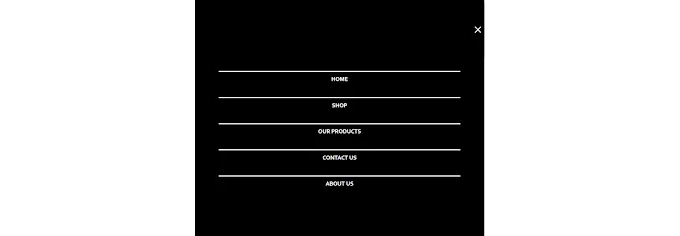

## HTML, CSS 및 JavaScript를 사용한 전자상거래 웹사이트



안녕하세요, 코더 여러분! 이 문서에서는 HTML, CSS 및 JavaScript를 사용하여 소스 코드와 함께 전자상거래 웹사이트를 만드는 방법을 살펴볼 것입니다. 이 간단한 전자상거래 웹사이트에는 이미지를 사용한 제품 슬라이더, 제품 카드가 있는 제품 섹션 및 전자상거래 웹사이트가 가져야 할 모든 필수 기능이 포함되어 있습니다.

친애하는 코더 여러분: HTML, CSS 및 JavaScript를 사용하여 전자상거래 웹사이트 소스 코드를 만드는 방법을 살펴봅시다. HTML 코드를 사용하여 전자상거래 웹사이트의 기초를 구축하고, CSS 코드를 사용하여 스타일을 입혀봅니다. 각 코드에 대해 자세히 설명합니다. 그런 다음 전자상거래 웹사이트에서 특정 기능을 활용하기 위해 JavaScript 코드를 작성합니다.

<!-- ui-log 수평형 -->
<ins class="adsbygoogle"
  style="display:block"
  data-ad-client="ca-pub-4877378276818686"
  data-ad-slot="9743150776"
  data-ad-format="auto"
  data-full-width-responsive="true"></ins>
<component is="script">
(adsbygoogle = window.adsbygoogle || []).push({});
</component>

전자 상거래 웹사이트란 무엇인가요?

전자 상거래 웹사이트는 사용자가 자신의 집에서 편하게 다양한 종류의 상품을 주문할 수 있는 온라인 또는 디지털 쇼핑 센터입니다. 이 온라인 쇼핑 웹사이트를 통해 전자기기부터 식료품까지 24시간 365일 옷을 선택할 수 있으며, 모든 물건이 집으로 배달될 수 있습니다.

전자 상거래 웹사이트의 장점은 무엇인가요?

전자 상거래 웹사이트의 이점은 다음과 같습니다:

<!-- ui-log 수평형 -->
<ins class="adsbygoogle"
  style="display:block"
  data-ad-client="ca-pub-4877378276818686"
  data-ad-slot="9743150776"
  data-ad-format="auto"
  data-full-width-responsive="true"></ins>
<component is="script">
(adsbygoogle = window.adsbygoogle || []).push({});
</component>

- 24시간 365일 고객 지원
- 다양한 결제 방법
- 완전한 반품 정책
- 전 세계로 배송

아마존, 플립카트 또는 다른 전자 상거래 웹사이트에서 구매에 지쳤다면 새로운 경험을 해보고 싶을 때, 이제 당신의 전자 상거래 웹사이트로 이동할 때입니다.

100가지 이상의 HTML, CSS 및 JavaScript 프로젝트 소스 코드 (초보부터 고급까지)

잠시만 기다려주세요. 여러분은 아직 자신의 웹사이트가 없나요? 실망하지 마세요. 전자 상거래 웹사이트를 만드는 방법을 배울 수 있도록 도와드리겠습니다. 블로그와 계속 연결 유지하여 모험을 끝까지 즐기세요. 여러분의 전자 상거래 웹사이트가 완성되면 자유롭게 쇼핑을 즐기세요.

<!-- ui-log 수평형 -->
<ins class="adsbygoogle"
  style="display:block"
  data-ad-client="ca-pub-4877378276818686"
  data-ad-slot="9743150776"
  data-ad-format="auto"
  data-full-width-responsive="true"></ins>
<component is="script">
(adsbygoogle = window.adsbygoogle || []).push({});
</component>

웹 사이트의 외관을 살펴보고, 만드는 과정에 들어가기 전에 먼저 확인해 보세요. 제 우아한 온라인 상점을 둘러보실 수 있습니다.

라이브 미리보기 온라인 전자 상거래 웹사이트 소스 코드:- 여기서 확인해보세요.

반응형 전자 상거래 웹사이트 계획을 본 후에는 이미 귀하만의 웹사이트에 대한 아이디어를 가지고 계실겁니다.

전자 상거래 웹사이트 코드

<!-- ui-log 수평형 -->
<ins class="adsbygoogle"
  style="display:block"
  data-ad-client="ca-pub-4877378276818686"
  data-ad-slot="9743150776"
  data-ad-format="auto"
  data-full-width-responsive="true"></ins>
<component is="script">
(adsbygoogle = window.adsbygoogle || []).push({});
</component>

아래는 이 웹페이지를 만드는 데 필요한 기술들입니다. 이것들은 전자 상거래 웹사이트를 만들기 위해 반드시 가져야 할 필수 구성 요소들입니다:

1. HTML.
2. CSS.
3. JavaScript(기초).

## 전자 상거래 웹사이트용 HTML 코드:-

인간의 몸의 골격 시스템(뼈의 구조/구조)은 인간의 몸에 구조/레이아웃을 제공합니다. 마찬가지로 HTML 코드도 마찬가지입니다. 그것은 웹사이트의 레이아웃을 제공합니다.

<!-- ui-log 수평형 -->
<ins class="adsbygoogle"
  style="display:block"
  data-ad-client="ca-pub-4877378276818686"
  data-ad-slot="9743150776"
  data-ad-format="auto"
  data-full-width-responsive="true"></ins>
<component is="script">
(adsbygoogle = window.adsbygoogle || []).push({});
</component>

걱정하지 마세요. 이 웹 사이트를 위해 생물학적 지식이 필요하지 않아요.

HTML과 CSS를 사용한 레스토랑 웹 사이트

각 웹 페이지에는 세 가지 주요 섹션이 있어요:
1. 헤더(내비게이션 바/메뉴/로고 등)
2. 주요 섹션(주 콘텐츠)
3. 푸터


<!-- ui-log 수평형 -->
<ins class="adsbygoogle"
  style="display:block"
  data-ad-client="ca-pub-4877378276818686"
  data-ad-slot="9743150776"
  data-ad-format="auto"
  data-full-width-responsive="true"></ins>
<component is="script">
(adsbygoogle = window.adsbygoogle || []).push({});
</component>

## 1. 헤더:-

아래에는 브랜드 이름/로고, 검색 바 및 메뉴 항목이 포함된 내비게이션 바의 그림이 있습니다. 이 모든 것은 헤더 안에 포함됩니다.


1. 헤더 섹션에서, 먼저 로고용, 검색 바용 두 개의 div를 만드세요 그리고 메뉴 목록용 세 번째 div를 만드세요.

<!-- ui-log 수평형 -->
<ins class="adsbygoogle"
  style="display:block"
  data-ad-client="ca-pub-4877378276818686"
  data-ad-slot="9743150776"
  data-ad-format="auto"
  data-full-width-responsive="true"></ins>
<component is="script">
(adsbygoogle = window.adsbygoogle || []).push({});
</component>

두 번째 수업에서는 Ionicon을 통해 가져온 검색 아이콘을 사용했어요. 웹사이트 개발에서 사용되는 모든 종류의 아이콘을 사용할 수 있어요.

HTML 및 CSS를 사용한 체육관 웹사이트 소스 코드

Input은 체크박스, 라디오, 이메일 입력, 날짜, 시간 등 여러 용도로 사용되는 태그에요. 여기서는 검색 창으로 사용하고 있어서 타입은 텍스트로 지정되어 있어요. 더 많은 아이디어를 원하신다면, 다른 블로그를 참고해보세요.

```js
<header>
    <div class="logo"><a href="#">ShoPperZ</a></div>
    <div class="search">
        <a href="">
            <input type="text" placeholder="제품을 검색해보세요" id="input" />
            <ion-icon class="s" name="search"></ion-icon>
        </a>
    </div>
    <div class="heading">
        <ul>
            <li><a href="#" class="under">홈</a></li>
            <li><a href="#" class="under">쇼핑</a></li>
            <li><a href="#" class="under">우리 제품</a></li>
            <li><a href="#" class="under">문의</a></li>
            <li><a href="#" class="under">회사 소개</a></li>
        </ul>
    </div>
</header>
```

<!-- ui-log 수평형 -->
<ins class="adsbygoogle"
  style="display:block"
  data-ad-client="ca-pub-4877378276818686"
  data-ad-slot="9743150776"
  data-ad-format="auto"
  data-full-width-responsive="true"></ins>
<component is="script">
(adsbygoogle = window.adsbygoogle || []).push({});
</component>

우리 웹사이트는 반응형이어야 해요 (반응형 웹사이트는 다양한 화면 크기와 뷰포트에 자동으로 맞춰져요).

예를 들어, Blogger 웹사이트도 반응형이라서 핸드폰(작은 화면)과 PC(큰 화면)에서 편안하게 사용할 수 있어요.

그래서 웹사이트를 사용할 때 네비게이션 바에 모든 메뉴 목록을 표시하지 못하는 문제가 있었어요. 결국, 버튼을 클릭해서 동작하는 메뉴 목록을 만들기로 했어요. 그래서 메뉴 아이콘을 클릭하면 다음 이미지에서 볼 수 있는 메뉴 목록이 열릴 거에요.

HTML CSS 초보자를 위한 10가지 이상의 프로젝트 (소스 코드)

<!-- ui-log 수평형 -->
<ins class="adsbygoogle"
  style="display:block"
  data-ad-client="ca-pub-4877378276818686"
  data-ad-slot="9743150776"
  data-ad-format="auto"
  data-full-width-responsive="true"></ins>
<component is="script">
(adsbygoogle = window.adsbygoogle || []).push({});
</component>




문제 해결 방법을 보셨습니다. 이제 코딩할 시간입니다. 위 이미지에서 보이는 닫기 아이콘이 있는 메뉴 클래스를 추가하고, heading1 클래스에 메뉴 아이콘을 추가하세요.

```js
<header>
    <div class="logo"><a href="#">ShoPperZ</a></div>
    <div class="menu">
        <a href=""><ion-icon name="close" class="close"></ion-icon></a>
        <ul>
            <li><a href="#" class="under">HOME</a></li>
            <li><a href="#" class="under">SHOP</a></li>
            <li><a href="#" class="under">OUR PRODUCTS</a></li>
            <li><a href="#" class="under">CONTACT US</a></li>
            <li><a href="#" class="under">ABOUT US</a></li>
        </ul>
    </div>
    <div class="search">
        <a href=""><input type="text" placeholder="제품 검색" id="input" />
        <ion-icon class="s" name="search"></ion-icon></a>
    </div>
    <div class="heading">
        <ul>
            <li><a href="#" class="under">HOME</a></li>
            <li><a href="#" class="under">SHOP</a></li>
            <li><a href="#" class="under">OUR PRODUCTS</a></li>
            <li><a href="#" class="under">CONTACT US</a></li>
            <li><a href="#" class="under">ABOUT US</a></li>
        </ul>
    </div>
    <div class="heading1"><ion-icon name="menu" class="ham"></ion-icon></div>
</header>
```

<!-- ui-log 수평형 -->
<ins class="adsbygoogle"
  style="display:block"
  data-ad-client="ca-pub-4877378276818686"
  data-ad-slot="9743150776"
  data-ad-format="auto"
  data-full-width-responsive="true"></ins>
<component is="script">
(adsbygoogle = window.adsbygoogle || []).push({});
</component>

이제 헤더 섹션이 끝났어요. 이제 본문 섹션으로 넘어가볼게요.

## 2. 섹션:-

웹사이트의 내용을 주로 담고 있는 섹션 부분은 주로 두 부분으로 나뉩니다:-

이미지 슬라이더가 있는 섹션1입니다. 이미지를 담고 있어요. 컨테이너 클래스를 포함한 섹션 2입니다. 서로 다른 항목들을 담고 있어요.

<!-- ui-log 수평형 -->
<ins class="adsbygoogle"
  style="display:block"
  data-ad-client="ca-pub-4877378276818686"
  data-ad-slot="9743150776"
  data-ad-format="auto"
  data-full-width-responsive="true"></ins>
<component is="script">
(adsbygoogle = window.adsbygoogle || []).push({});
</component>


이미지 태그를 사용하여 이미지 슬라이더에 다양한 이미지를 추가하세요. 섹션 2 내에 "클래스"라는 컨테이너를 추가하여 웹 사이트에 "클래스"라는 항목을 원하는 만큼 추가할 수 있습니다. 모든 항목에 아이템 이름, 아이템 가격, 아이템 이미지 및 아이템 데이터 클래스를 추가하세요. 원하시면 하나의 추가 카테고리를 더 추가할 수도 있습니다.

```js
<section>
    <div class="section">
        <div class="section1">
            <div class="img-slider">
                
                <!-- 이하 생략 -->
            </div>
        </div>
        <div class="section2">
            <div class="container">
                <div class="items">
                    <!-- 아이템 예시들 -->
                </div>
            </div>
        </div>
    </div>
</section>
```

이로써 섹션 부분이 종료되었습니다.

<!-- ui-log 수평형 -->
<ins class="adsbygoogle"
  style="display:block"
  data-ad-client="ca-pub-4877378276818686"
  data-ad-slot="9743150776"
  data-ad-format="auto"
  data-full-width-responsive="true"></ins>
<component is="script">
(adsbygoogle = window.adsbygoogle || []).push({});
</component>

주석: 안녕하세요. 이 태그에 클래스 이름을 지정한 이유에 대해 아직 궁금해 하고 계신가요? 올바른 답은 해당 태그의 스타일링을 지원하기 때문입니다. 동일한 스타일링을 적용하여 여러 태그를 스타일링하려는 경우에는 각 태그를 따로 스타일링해야 합니다. 각 태그에 동일한 이름을 부여하면 한 클래스에 스타일이 적용될 때 해당 이름을 가진 모든 태그가 스타일이 적용됩니다.

HTML, CSS, JavaScript을 사용한 Tic Tac Toe 게임

### 3. 푸터:-

푸터는 웹 사이트의 마지막 섹션입니다. 일부 세부 정보를 추가합니다. 위 웹 사이트의 푸터는 아래 그림에서 보여집니다.

<!-- ui-log 수평형 -->
<ins class="adsbygoogle"
  style="display:block"
  data-ad-client="ca-pub-4877378276818686"
  data-ad-slot="9743150776"
  data-ad-format="auto"
  data-full-width-responsive="true"></ins>
<component is="script">
(adsbygoogle = window.adsbygoogle || []).push({});
</component>


그럼 어떻게 구현해볼까요??

위의 사진이 구현 방법을 이해하는 데 도움이 될 것입니다. 먼저, 푸터를 footer0, footer1, footer2 및 footer3이라는 4가지 주요 클래스로 나누어 주세요.

이제 코드를 구현할 시간입니다.

<!-- ui-log 수평형 -->
<ins class="adsbygoogle"
  style="display:block"
  data-ad-client="ca-pub-4877378276818686"
  data-ad-slot="9743150776"
  data-ad-format="auto"
  data-full-width-responsive="true"></ins>
<component is="script">
(adsbygoogle = window.adsbygoogle || []).push({});
</component>

순수 CSS로 크리스마스 트리 만들기


footer1 클래스 안에 소셜 미디어 아이콘을 위한 하나의 클래스를 추가한 다음, 해당 아이콘을 추가하세요.

비슷하게 footer2와 footer3에 아래 코드에 제공된 클래스들을 추가하세요.

<!-- ui-log 수평형 -->
<ins class="adsbygoogle"
  style="display:block"
  data-ad-client="ca-pub-4877378276818686"
  data-ad-slot="9743150776"
  data-ad-format="auto"
  data-full-width-responsive="true"></ins>
<component is="script">
(adsbygoogle = window.adsbygoogle || []).push({});
</component>

더 많이 읽고 완전한 소스 코드를 얻으세요