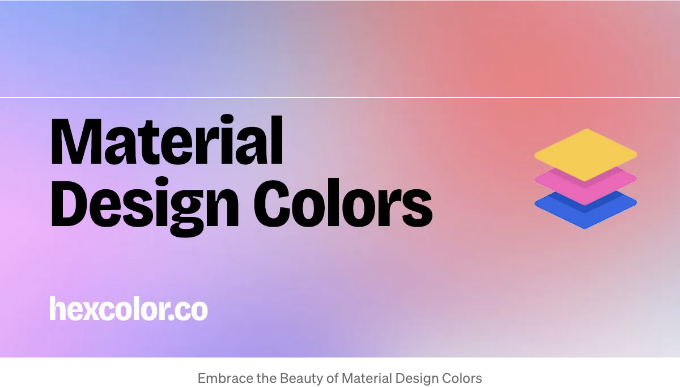

안녕하세요, 디자인 열정가 및 컬러 애호가 여러분! 오늘은 여러분을 위해 흥미진진한 필수 자원을 소개해 드리려고 합니다. 바로 hexcolor.co의 Material Design Colors 섹션입니다. 이 도구는 구글의 Material Design 색상 팔레트의 아름다움과 기능성을 디자인에 불어넣고자 하는 누구에게나 안성맞춤인 곳입니다.

## Material Design Colors란 무엇인가요?

Material Design Colors는 구글의 Material Design 언어의 일부로, 깔끔하고 사용자 친화적이며 시각적으로 매력적인 인터페이스 디자인으로 유명합니다. 이 색상들은 디지털 인터페이스에서의 조화, 사용성 및 미적 매력을 고려하여 특별히 선택되었습니다.

<!-- ui-log 수평형 -->
<ins class="adsbygoogle"
  style="display:block"
  data-ad-client="ca-pub-4877378276818686"
  data-ad-slot="9743150776"
  data-ad-format="auto"
  data-full-width-responsive="true"></ins>
<component is="script">
(adsbygoogle = window.adsbygoogle || []).push({});
</component>

## 매터리얼 디자인 색상이 게임 체인저인 이유

- 조화로운 색상 계획: 매터리얼 디자인 색상은 시각적으로 매력적이고 조화로운 인터페이스를 만들기 위해 정교하게 제작되었습니다. 사용자 경험을 향상시킵니다.
- 디자인의 다재다능함: 웹 프로젝트, 모바일 앱 또는 디지턈 아트워크를 작업하고 있든, 이러한 색상은 어떤 디자인 요구에도 맞는 다양한 옵션을 제공합니다.
- 플랫폼 간 일관성: 매터리얼 디자인 색상을 사용하면 다양한 디지턈 플랫폼 사이에서 일관성을 유지함으로써 일관된 느낌과 외관을 제공합니다.

## 프로젝트에서 매터리얼 디자인 색상 사용 방법

매터리얼 디자인 색상을 사용하는 것은 매우 쉽습니다.

<!-- ui-log 수평형 -->
<ins class="adsbygoogle"
  style="display:block"
  data-ad-client="ca-pub-4877378276818686"
  data-ad-slot="9743150776"
  data-ad-format="auto"
  data-full-width-responsive="true"></ins>
<component is="script">
(adsbygoogle = window.adsbygoogle || []).push({});
</component>

- https://hexcolor.co/material-design-colors에서 방문해보세요.
- 밝고 세련된, 그리고 약간 다른 색상들을 포함한 색상 배열을 둘러보세요.
- 디자인 프로젝트에서 사용할 수 있는 RGBA 및 HEX 코드를 확인하려면 색상을 선택하세요.

## 색상 선택 이상: 디자인 마스터리를 위한 허브

Hexcolor.co는 단순히 색상 라이브러리 이상의 것을 제공합니다. 그것은 오피스 페인트 색상, 브랜딩에서의 색상 역할, 색상 심리학 등에 대한 통찰을 제공하는 종합적인 디자인 지식 허브입니다. 디자인과 색이론에 대한 이해를 깊게 하고자 하는 모든 사람에게 완벽한 목적지입니다.

## 마지막으로 생각해보세요

<!-- ui-log 수평형 -->
<ins class="adsbygoogle"
  style="display:block"
  data-ad-client="ca-pub-4877378276818686"
  data-ad-slot="9743150776"
  data-ad-format="auto"
  data-full-width-responsive="true"></ins>
<component is="script">
(adsbygoogle = window.adsbygoogle || []).push({});
</component>

경험이 풍부한 디자이너든 막 시작한 디자이너든, hexcolor.co의 Material Design Colors 섹션은 귀중한 자원입니다. 이것은 그냥 도구가 아니라, 더 매력적이고 시각적으로 매력적이며 사용자 친화적인 디자인을 만드는 한 걸음입니다.

## 마무리

디지털 디자인의 역동적인 세계에서 손 끝에 적합한 색 팔레트가 있는 것은 중요합니다. hexcolor.co의 Material Design Colors는 디자이너들이 자신감과 창의력으로 색의 언어를 탐색, 학습 및 적용할 수 있는 독특한 자원을 제공합니다.

✱ 당신은 우리의 무료 색상 도구를 좋아하고 사용하시나요? 저희가 hexcolor.co의 개발 및 호스팅 비용을 지불할 수 있도록 도와주세요!