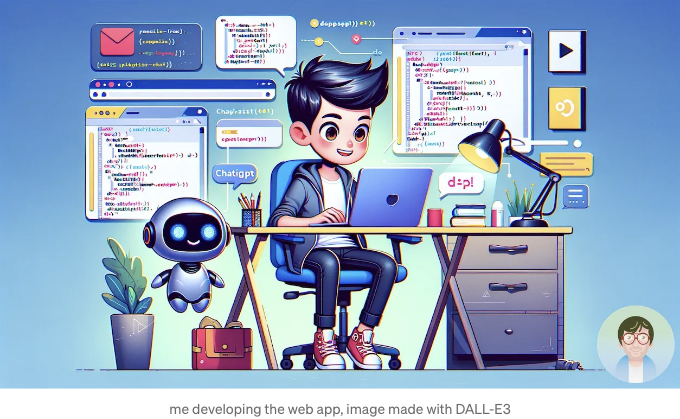
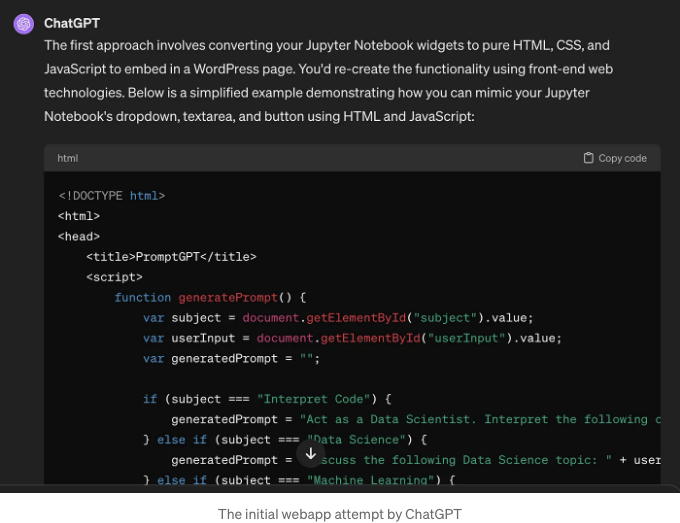
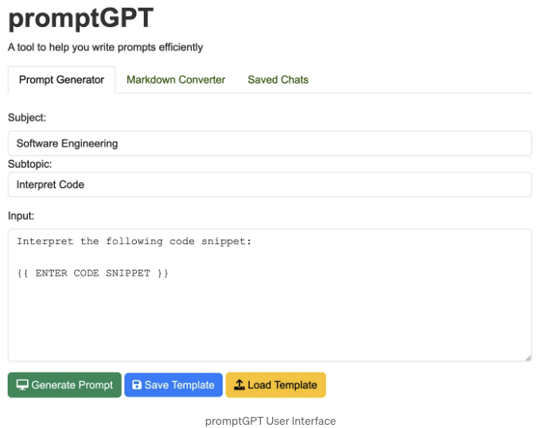

이 기사는 HTML, CSS 및 JavaScript를 사용하여 하루 만에 아이디어를 웹 앱으로 변환한 내 경험을 탐구합니다. ChatGPT가 웹 앱 제작을 간편하게 해 주어 모든 사람들에게 웹 개발을 쉽게 만든 방법을 발견해보세요.

# 당신의 개인 코딩 도우미

나는 chatGPT 구독을 몇 달 동안 가지고 있으며, 이를 데이터 과학자로서 루틴에 통합하는 방법을 탐구하고 주말 웹 개발자로 활용하고 있습니다.

<!-- ui-log 수평형 -->
<ins class="adsbygoogle"
  style="display:block"
  data-ad-client="ca-pub-4877378276818686"
  data-ad-slot="9743150776"
  data-ad-format="auto"
  data-full-width-responsive="true"></ins>
<component is="script">
(adsbygoogle = window.adsbygoogle || []).push({});
</component>

아직 의미 있는 텍스트 생성에 대한 한계가 있습니다. "굉장한 탐구"와 "해명"이라는 식이 과하게 쓰이지 않는 것이 장점이에요. 지금까지 웹 앱과 데이터 분석에 대한 아이디어를 떠올리고 발전시키는 데 가장 적합하다고 느꼈습니다.

이 기사에서는 어떤 날에 아이디어를 떠올려 웹 앱으로 만들어 본 경험에 대해 알아보고자 합니다. HTML, CSS, Javascript를 사용했습니다. 제 기술 글을 보신다면 알 수 있듯이, 웹 개발자는 아닙니다.

예전에 HTML, CSS, Javascript 강좌를 듣고 기초를 배웠을 뿐입니다. 그런데 웹 개발 분야에는 많은 변화가 일어나고 있습니다. 변화를 따라가고 최신 내용을 파악하는 것이 어렵습니다. 그래서 chatGPT의 코드 도우미가 제공되자, 제게는 큰 도움이 되었습니다. 이 도구는 아이디어를 웹 앱으로 구현하는 데 도움을 줍니다.

# 초기 문제

<!-- ui-log 수평형 -->
<ins class="adsbygoogle"
  style="display:block"
  data-ad-client="ca-pub-4877378276818686"
  data-ad-slot="9743150776"
  data-ad-format="auto"
  data-full-width-responsive="true"></ins>
<component is="script">
(adsbygoogle = window.adsbygoogle || []).push({});
</component>

웹 앱을 만들어 챗지피티에 연결하고 싶었어요. 게다가, 챗지피티를 다룰 때 겪는 주요 문제를 해결하고 싶었어요:

- 반복되는 프롬프트 저장하기
- 마크다운 결과 파싱하기
- 대화를 카테고리별로 저장하기

이 문제들을 하나씩 살펴봅시다.

# 반복되는 프롬프트 저장하기

<!-- ui-log 수평형 -->
<ins class="adsbygoogle"
  style="display:block"
  data-ad-client="ca-pub-4877378276818686"
  data-ad-slot="9743150776"
  data-ad-format="auto"
  data-full-width-responsive="true"></ins>
<component is="script">
(adsbygoogle = window.adsbygoogle || []).push({});
</component>

이미 잘 알고 계시다시피 chatGPT(또는 다른 LLMs)를 사용하여 반복 작업을 위한 완벽한 프롬프트를 만드는 데 시간이 걸립니다. 자주 사용하신다면 한 번에 끝나는 작업이 아님을 알 수 있습니다. 나의 도구에 접근하는 방식도 우발적인 성격을 띠고 있습니다. 나는 주로 관련이 없는 모든 주제에 관한 긴 대화를 가지는 편입니다. 그래서 내가 좋아하는 프롬프트를 모두 저장하고 카테고리를 만들 수 있는 옵션을 갖는 것이 중요합니다.

# chatGPT Markdown 구문 분석

작성 시점에서 대부분 chatGPT에 질문을 하고 목록과 같은 구조화된 답변을 요청할 때, chatGPT가 markdown으로 회신할 때가 많습니다. 이는 나가 markdown을 렌더링하여 복사/붙여넣기 해야 한다는 것을 의미합니다.

# 대화 내용 카테고리별 저장

<!-- ui-log 수평형 -->
<ins class="adsbygoogle"
  style="display:block"
  data-ad-client="ca-pub-4877378276818686"
  data-ad-slot="9743150776"
  data-ad-format="auto"
  data-full-width-responsive="true"></ins>
<component is="script">
(adsbygoogle = window.adsbygoogle || []).push({});
</component>

위에서 언급한대로, 나는 아이디어를 떠올리고 탐구하기 위해 chatGPT를 사용합니다. 이는 나가 여러 날 동안 주제를 탐구하는 것을 의미합니다. 나는 많은 채팅에서 chatGPT에게 질문을 한다. 나는 이 모든 채팅을 분류할 수 있기를 원했습니다. 그러면 필요한 콘텐츠를 모을 수 있을 것이었습니다. 나는 해결하려고 했던 문제를 알았기 때문에, 이것을 하나의 웹앱으로 구현할 수 있는 가능성을 탐구하고 싶었습니다. 그렇게 promptGPT가 나오게 되었습니다.

문제를 해결하려고 시도하던 것이 무엇인지 명확히 알고 나서, 나는 이것을 한 손에 갖고 있는 것의 가능성을 탐구하고 싶었기 때문에, promptGPT를 고안해 냈습니다.

# 개발 단계

어플리케이션을 개발하는 것은 chatGPT에게 내가 찾고 있는 것을 물어보고 코드를 조정하는 것만큼 쉬웠습니다. 전체 채팅 내용을 보여주지는 않겠습니다. 스크린샷이 넘치는 목록이 될 것입니다. 하지만, 몇 가지를 보여주어 프로세스를 설명하겠습니다.

<!-- ui-log 수평형 -->
<ins class="adsbygoogle"
  style="display:block"
  data-ad-client="ca-pub-4877378276818686"
  data-ad-slot="9743150776"
  data-ad-format="auto"
  data-full-width-responsive="true"></ins>
<component is="script">
(adsbygoogle = window.adsbygoogle || []).push({});
</component>

전에 소프트웨어 이름 짓기를 잘 못 했거든요. 그래서 먼저 앱에 좋은 이름을 지어보고 싶었어요. 처음에 제 생각을 기반으로 몇 가지 이름을 chatGPT에게 요청해 보았어요.

그리고 promptGPT라고 이름 짖기로 결정했어요. 짧고 쉽게 기억할 수 있는 이름이라서요.

실제 개발을 하면서 처음에는 주피터 노트북으로 만드는 게 좋을 것 같았어요. 제가 일하는 환경과 더 가까울 텐데 말이에요. 그런데, 웹 앱으로 개발하는 게 더 나을 것 같다고 결정했어요. 그래야 더 멋지게 보일 텐데요.

<!-- ui-log 수평형 -->
<ins class="adsbygoogle"
  style="display:block"
  data-ad-client="ca-pub-4877378276818686"
  data-ad-slot="9743150776"
  data-ad-format="auto"
  data-full-width-responsive="true"></ins>
<component is="script">
(adsbygoogle = window.adsbygoogle || []).push({});
</component>

그럼 chatGPT에게 초기 파이썬 코드를 HTML, CSS 및 Javascript 웹 앱으로 변환하도록 요청했어요.

먼저 chatGPT가 원래 Jupyter 노트북 버전의 몇 가지 기능을 구현하는 것을 잊었어요. 그래서 전체로 재현하기 위해 코드를 다시 공유했어요.

배포 및 테스트의 12번의 반복과 chatGPT에게 변경사항을 요청한 뒤, 제가 원하는 앱을 실행할 수 있었어요. 앱은 아직 진행 중이지만, 제가 원하는 세 가지 주요 기능을 제공하고 있어요.

<!-- ui-log 수평형 -->
<ins class="adsbygoogle"
  style="display:block"
  data-ad-client="ca-pub-4877378276818686"
  data-ad-slot="9743150776"
  data-ad-format="auto"
  data-full-width-responsive="true"></ins>
<component is="script">
(adsbygoogle = window.adsbygoogle || []).push({});
</component>

# 프롬프트GPT

아래 그림과 같이 프롬프트GPT는 간단한 웹 앱입니다. 이 앱을 사용하면 사용자가 반복하는 프롬프트를 저장하고, 마크다운 출력을 구문 분석하고, 채팅을 정렬할 수 있습니다.

만약 한 번 시도해보고 싶거나 제안 사항을 하고 싶다면, 자유롭게 참여하셔서 promptGPT를 사용해보세요.

<!-- ui-log 수평형 -->
<ins class="adsbygoogle"
  style="display:block"
  data-ad-client="ca-pub-4877378276818686"
  data-ad-slot="9743150776"
  data-ad-format="auto"
  data-full-width-responsive="true"></ins>
<component is="script">
(adsbygoogle = window.adsbygoogle || []).push({});
</component>

chatGPT을 창의적으로 활용하는 것에 관심이 있으신가요? Every가 제작한 팟캐스트 'How do you use chatGPT?'를 강력히 추천해요.

원문은 2024년 4월 18일에 https://viscioletti.com에서 원본으로 게시되었습니다.