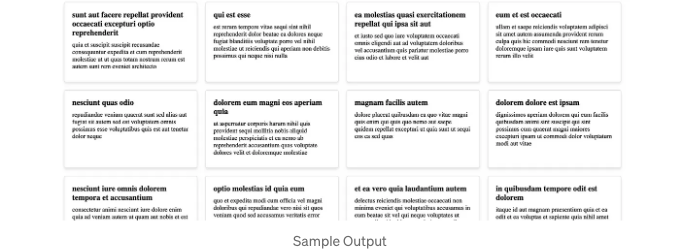

샘플 API에서 데이터를 가져와 JavaScript와 CSS를 사용하여 카드에 렌더링하려면 다음 단계를 따라하실 수 있어요:

단계 1: 카드를 위한 HTML 구조를 만들고 데이터를 렌더링할 컨테이너를 포함하세요.

```js
<!DOCTYPE html>
<html lang="en">
<head>
    <meta charset="UTF-8">
    <meta name="viewport" content="width=device-width, initial-scale=1.0">
    <title>샘플 API 데이터</title>
    <link rel="stylesheet" href="styles.css">
</head>
<body>
    <div class="container">
        <!-- 데이터가 여기에 렌더링됩니다 -->
    </div>

    <script src="script.js"></script>
</body>
</html>
```

단계 2: CSS 파일(styles.css)을 만들어 카드를 스타일링하세요.

<!-- ui-log 수평형 -->
<ins class="adsbygoogle"
  style="display:block"
  data-ad-client="ca-pub-4877378276818686"
  data-ad-slot="9743150776"
  data-ad-format="auto"
  data-full-width-responsive="true"></ins>
<component is="script">
(adsbygoogle = window.adsbygoogle || []).push({});
</component>

```js
.container {
    display: flex;
    flex-wrap: wrap;
    justify-content: center;
    gap: 20px;
}

.card {
    border: 1px solid #ddd;
    border-radius: 5px;
    padding: 20px;
    width: 300px;
    box-shadow: 0px 4px 6px rgba(0, 0, 0, 0.1);
    background-color: #fff;
}

.card h2 {
    font-size: 20px;
    margin: 0;
}

.card p {
    margin: 10px 0;
}
```

Step 3: 샘플 API에서 데이터를 가져와 카드에 렌더링하는 JavaScript 파일 (script.js)을 생성합니다.

```js
// API에서 데이터를 가져오는 함수
async function fetchData() {
    try {
        const response = await fetch('https://jsonplaceholder.typicode.com/posts');
        const data = await response.json();
        return data;
    } catch (error) {
        console.error('데이터 가져오기 오류:', error);
    }
}

// 데이터를 카드에 렌더링하는 함수
async function renderData() {
    const container = document.querySelector('.container');
    const data = await fetchData();

    if (!data) {
        return;
    }

    data.forEach(item => {
        const card = document.createElement('div');
        card.classList.add('card');

        const title = document.createElement('h2');
        title.textContent = item.title;

        const body = document.createElement('p');
        body.textContent = item.body;

        card.appendChild(title);
        card.appendChild(body);
        container.appendChild(card);
    });
}

// renderData 함수를 호출하여 데이터를 표시합니다
renderData();
```


```

<!-- ui-log 수평형 -->
<ins class="adsbygoogle"
  style="display:block"
  data-ad-client="ca-pub-4877378276818686"
  data-ad-slot="9743150776"
  data-ad-format="auto"
  data-full-width-responsive="true"></ins>
<component is="script">
(adsbygoogle = window.adsbygoogle || []).push({});
</component>

이 코드에서:

- 우리는 'fetchData' 함수를 만들어 샘플 API에서 데이터를 가져오는데 사용합니다(이 경우 JSONPlaceholder API를 사용하고 있습니다).
- 'renderData' 함수를 만들어 가져온 데이터를 카드로 렌더링합니다. 먼저 데이터를 가져온 다음 동적으로 카드 요소를 생성하고 컨테이너 div에 추가합니다.
- CSS 파일인 'styles.css'는 카드와 컨테이너를 스타일링하는데 사용됩니다.

API 엔드포인트와 스타일링을 귀하의 특정 요구사항에 맞게 조정해주세요. 브라우저에서 HTML 파일을 열면 API에서 데이터를 가져와 스타일이 적용된 카드로 렌더링될 것입니다.

실시간 예제는 다음을 확인해주세요: 

<!-- ui-log 수평형 -->
<ins class="adsbygoogle"
  style="display:block"
  data-ad-client="ca-pub-4877378276818686"
  data-ad-slot="9743150776"
  data-ad-format="auto"
  data-full-width-responsive="true"></ins>
<component is="script">
(adsbygoogle = window.adsbygoogle || []).push({});
</component>

https://codepen.io/gauravprof27/pen/ExGXWXW