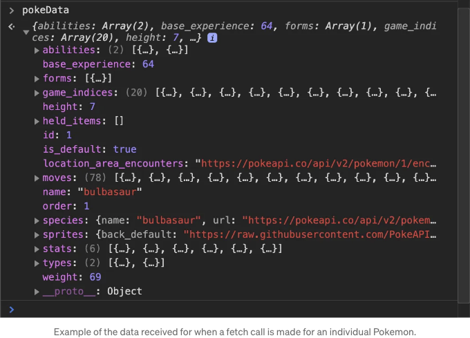
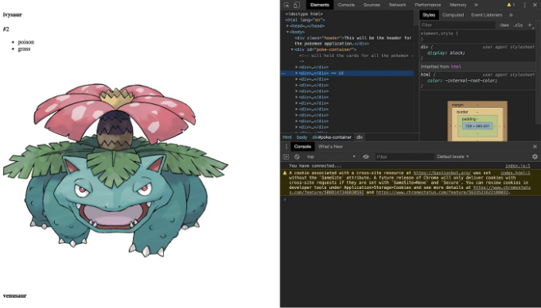

Flatiron에 합류한 후 배우고 싶었던 주요한 것 중 하나는 API를 조작하고 해당 데이터를 사용하여 웹 애플리케이션을 만드는 방법이었습니다. 사용하려고 했던 주요 API 중 하나가 포켓몬 API였습니다. 놀랍게도, 포켓몬 API와 관련해 대화를 나눈 모두가 그것을 작업하기가 번거롭다고 말했습니다. 중첩 API이므로 여러 번의 호출을 수행해야 한다고 합니다.

먼저 Poke API 문서(https://pokeapi.co/docs/v2.html)를 읽어 API 호출 방법을 이해하고 필요한 데이터를 가져오는 방법에 대해 파악합니다. 다른 API와 마찬가지로 Poke API에는 사용하지 않을 많은 데이터가 있습니다.

<!-- ui-log 수평형 -->
<ins class="adsbygoogle"
  style="display:block"
  data-ad-client="ca-pub-4877378276818686"
  data-ad-slot="9743150776"
  data-ad-format="auto"
  data-full-width-responsive="true"></ins>
<component is="script">
(adsbygoogle = window.adsbygoogle || []).push({});
</component>

I will be making a small application that shows the original 151 Pokemon on a single page. Every Pokemon will have a card-like styling. Every Pokemon card will include the name, picture, number, and type. I will use Semantic to create the card stylings.

The setup for this application will include one HTML file, a JavaScript file, and a CSS file. I will fetch the data from the API and use DOM manipulation to create the individual cards.

## Starting to code out the Application

The first fetch will be to `https://pokeapi.co/api/v2/pokemon?limit=151`. Luckily, the Poke API allows us to use a query parameter, 'limit', which limits the Pokemon to 151, just as we need.

<!-- ui-log 수평형 -->
<ins class="adsbygoogle"
  style="display:block"
  data-ad-client="ca-pub-4877378276818686"
  data-ad-slot="9743150776"
  data-ad-format="auto"
  data-full-width-responsive="true"></ins>
<component is="script">
(adsbygoogle = window.adsbygoogle || []).push({});
</component>

```js
function fetchKantoPokemon(){
  fetch('https://pokeapi.co/api/v2/pokemon?limit=151')
  .then(response => response.json())
  .then(allpokemon => console.log(allpokemon))
}
```

일단 받은 API 데이터를 확인하기 위해 console.log를 사용하는 것이 좋습니다. 위의 예제에서 콘솔에 모든 151마리의 포켓몬이 로깅된 것을 볼 수 있습니다. 불행히도, 이 첫 번째 호출은 각 포켓몬 데이터 세트마다 포켓몬의 이름과 다른 URL을 제공했을 뿐입니다. 각 포켓몬의 URL로 가서 데이터(타입, 번호 등)를 가져오기 위해 추가로 fetch를 해야합니다. 예를 들어, Bulbasaur의 정보를 얻고 싶다면 다음 URL로 추가 fetch 호출을 해야합니다: https://pokeapi.co/api/v2/pokemon/1/. 정보가 해시 배열에 있기 때문에 배열을 훑고 해당 URL로 fetch 호출을 하는 메서드를 만들 수 있습니다.

```js
function fetchKantoPokemon(){
 fetch('https://pokeapi.co/api/v2/pokemon?limit=151')
  .then(response => response.json())
  .then(function(allpokemon){
  allpokemon.results.forEach(function(pokemon){
    fetchPokemonData(pokemon); 
  })
 })
}
```

위의 코드 예제에서는 forEach 메서드를 사용하여 결과 배열의 모든 포켓몬을 반복하며 해시({name: "bulbasaur", url: "https://pokeapi.co/api/v2/pokemon/1/"})를 fetchPokemonData 함수로 보냅니다. 여기서 두 번째 fetch 호출을 통해 각 포켓몬의 세부 정보를 가져올 것입니다.

<!-- ui-log 수평형 -->
<ins class="adsbygoogle"
  style="display:block"
  data-ad-client="ca-pub-4877378276818686"
  data-ad-slot="9743150776"
  data-ad-format="auto"
  data-full-width-responsive="true"></ins>
<component is="script">
(adsbygoogle = window.adsbygoogle || []).push({});
</component>

```js
function fetchPokemonData(pokemon){
let url = pokemon.url // <--- fetch에 사용할 포켓몬 URL을 변수에 저장합니다. (예: https://pokeapi.co/api/v2/pokemon/1/)
  fetch(url)
  .then(response => response.json())
  .then(function(pokeData){
  console.log(pokeData)
  })
}
```

위의 코드 예제에서 fetchPokemonData 메서드는 파라미터로 Pokemon 해시를 받습니다. fetch 호출에 사용되는 pokemon.url을 변수에 저장했습니다. 다시 한 번 console.log를 사용하여 정확한 데이터를 수신하는지 확인했습니다. 이 경우 스크린샷에 표시된 데이터입니다.



이제 데이터가 올바른 방식으로 수신되는 것을 알았으므로 해시에서 데이터를 추출하고 HTML에 출력하는 작업을 시작할 수 있습니다.

<!-- ui-log 수평형 -->
<ins class="adsbygoogle"
  style="display:block"
  data-ad-client="ca-pub-4877378276818686"
  data-ad-slot="9743150776"
  data-ad-format="auto"
  data-full-width-responsive="true"></ins>
<component is="script">
(adsbygoogle = window.adsbygoogle || []).push({});
</component>

```js
function renderPokemon(pokeData){
let allPokemonContainer = document.getElementById('poke-container');
let pokeContainer = document.createElement("div") //div는 개별 포켓몬의 데이터/세부 정보를 보유하는 데 사용될 것입니다.{}
let pokeName = document.createElement('h4')
pokeName.innerText = pokeData.name
let pokeNumber = document.createElement('p')
pokeNumber.innerText = `#${pokeData.id}`
let pokeTypes = document.createElement('ul') 
//ul 목록은 포켓몬 유형을 보유할 것입니다.
createTypes(pokeData.types, pokeTypes) 
// 각 유형에 대한 li 태그를 생성하는 유틸리티 함수
pokeContainer.append(pokeName, pokeNumber, pokeTypes);   
// 모든 세부 정보를 pokeContainer div에 추가합니다.
allPokemonContainer.appendChild(pokeContainer);       
// 모든 포켓몬 카드를 보유할 기본 div에 해당 pokeContainer div를 추가합니다.
}
```

위의 코드 예제에서 HTML 요소를 모두 만들었고 각각의 inner text를 파라미터로 전달된 포켓몬 데이터에 할당했습니다. 함수의 끝에서 모든 요소를 컨테이너 DIV에 추가하여 DOM에 표시합니다. 또한, 각 포켓몬의 유형을 위해 createTypes라는 도우미 메서드를 사용했습니다. 여러 유형을 가진 포켓몬을 위해 유형이 배열로 제공됩니다. 해당 함수에서는 배열의 각 유형을 forEach를 사용하여 반복하고 새로운 Li(list item) 요소를 만든 후 해당 Li의 inner text를 유형 이름으로 만들고 해당 Li를 Ul(비정렬 목록)에 추가합니다.

```js
function createTypes(types, ul){
  types.forEach(function(type){
  let typeLi = document.createElement('li');
  typeLi.innerText = type['type']['name'];
  ul.append(typeLi)
  })
}
```

마침내 HTML에 일부 정보가 표시됩니다! 위에 표시된 스크린샷에서 봤을 때. 그러나 포켓몬의 이미지가 누락된 것처럼 보입니다. Poke API에는 렌더링할 수 있는 스프라이트가 있지만 다소 작게 보이며, 스프라이트는 오래된 느낌이 있습니다. 이미지는 https://pokeres.bastionbot.org 포켓몬 (Pokeres) API를 사용할 것입니다. 그들의 API를 사용하려면 일반적으로 일부 헤더를 요구하지만, 이미지만 가져 오기 때문에 헤더를 추가하거나 fetch 호출을 만들 필요가 없습니다.

<!-- ui-log 수평형 -->
<ins class="adsbygoogle"
  style="display:block"
  data-ad-client="ca-pub-4877378276818686"
  data-ad-slot="9743150776"
  data-ad-format="auto"
  data-full-width-responsive="true"></ins>
<component is="script">
(adsbygoogle = window.adsbygoogle || []).push({});
</component>

각 포켓몬에 대해 새 이미지 태그를 생성하여 소스를 포켓의 URL로 설정하고 해당 이미지 태그를 컨테이너 DIV에 추가합니다. 예를 들어, 이미지 소스를 https://pokeres.bastionbot.org/images/pokemon/1.png 로 설정하면 Bulbasaur의 이미지가 생성됩니다. 아래 코드를 살펴보세요.

```js
function createPokeImage(pokeID, containerDiv){
  let pokeImage = document.createElement('img')
  pokeImage.srcset = `https://pokeres.bastionbot.org/images/pokemon/${pokeID}.png`
  containerDiv.append(pokeImage);
}
```

이제 각 포켓몬에 대한 이미지가 로드되었습니다.



<!-- ui-log 수평형 -->
<ins class="adsbygoogle"
  style="display:block"
  data-ad-client="ca-pub-4877378276818686"
  data-ad-slot="9743150776"
  data-ad-format="auto"
  data-full-width-responsive="true"></ins>
<component is="script">
(adsbygoogle = window.adsbygoogle || []).push({});
</component>

그게 다입니다! HTML 페이지는 이제 포켓몬 이름, 번호, 유형 및 그림을 보여줍니다. 이제 일부 시맨틱 클래스를 사용하여 시각적으로 매력적인 페이지로 만들어 보겠습니다. 디자인 프로세스를 자세히 다루지는 않겠지만 참고가 필요하다면 하단 게시물의 링크된 GitHub를 확인해주세요. 시맨틱을 사용하지 않고 다른 CSS 프레임워크로 원하는 대로 스타일링할 수도 있습니다.

Github 저장소: https://github.com/Nihaprezz/kanto-pokemon

시맨틱 UI의 미니멀한 스타일링으로 제 페이지가 어떻게 보이게 되었는지 예시를 보여드릴게요.