CSS Flexbox, "CSS Flexible Box Layout"로 줄여진 것은 CSS에서 요소들을 보다 효율적이고 유연하게 구성하고 정렬하기 위해 설계된 레이아웃 모델입니다.

기존 CSS 레이아웃과 달리 블록 및 인라인 방향에 의존하는 것 대신, Flexbox는 단일 방향(수평 또는 수직)에 기반하여 컨테이너 내 항목들 사이의 정렬과 여백 분배를 더 쉽게 제어할 수 있습니다.

# 기본 용어

<!-- ui-log 수평형 -->
<ins class="adsbygoogle"
  style="display:block"
  data-ad-client="ca-pub-4877378276818686"
  data-ad-slot="9743150776"
  data-ad-format="auto"
  data-full-width-responsive="true"></ins>
<component is="script">
(adsbygoogle = window.adsbygoogle || []).push({});
</component>

플렉스 레이아웃의 주요 아이디어를 설명하는 도표가 있어요:

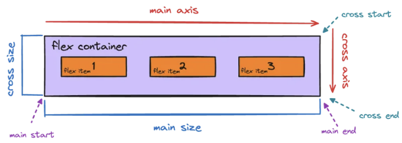

주축: 플렉스 항목이 컨테이너 내에서 정렬되는 주요 방향(왼쪽에서 오른쪽 또는 위에서 아래로).
주 축 시작 | 주 축 끝: 주 축의 시작점과 끝점.
교차 축: 주축과 수직인 방향.
교차 시작 | 교차 끝: 교차 축의 시작점과 끝점.
주 사이즈: 주 축에서의 플렉스 항목의 크기(너비 또는 높이).
교차 사이즈: 교차 축에서의 플렉스 항목의 크기(너비 또는 높이).

# 플렉스박스 속성

<!-- ui-log 수평형 -->
<ins class="adsbygoogle"
  style="display:block"
  data-ad-client="ca-pub-4877378276818686"
  data-ad-slot="9743150776"
  data-ad-format="auto"
  data-full-width-responsive="true"></ins>
<component is="script">
(adsbygoogle = window.adsbygoogle || []).push({});
</component>


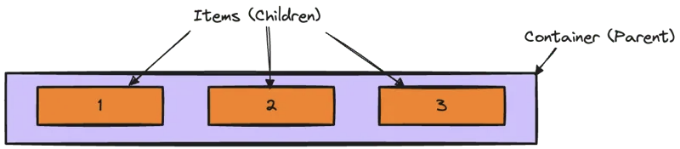

부모 요소에 대한 속성:

1. display
Flexbox를 활성화하려면 컨테이너의 display 속성을 flex 또는 inline-flex로 설정하세요. flex 값을 사용하면 블록 수준의 플렉스 컨테이너가 생성되며, inline-flex를 사용하면 인라인 수준의 플렉스 컨테이너가 생성됩니다.

```css
div {
    display: flex;
}
```

<!-- ui-log 수평형 -->
<ins class="adsbygoogle"
  style="display:block"
  data-ad-client="ca-pub-4877378276818686"
  data-ad-slot="9743150776"
  data-ad-format="auto"
  data-full-width-responsive="true"></ins>
<component is="script">
(adsbygoogle = window.adsbygoogle || []).push({});
</component>

2. flex-direction
이 속성은 플렉스 아이템의 방향을 설정합니다.
가능한 값은 :

- row (기본값)
- row-reverse
- column
- column-reverse

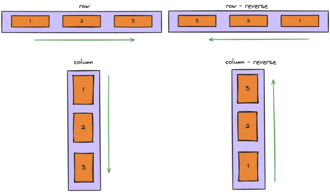

```css
div {
  flex-direction: row | row-reverse | column | column-reverse;
}
```

<!-- ui-log 수평형 -->
<ins class="adsbygoogle"
  style="display:block"
  data-ad-client="ca-pub-4877378276818686"
  data-ad-slot="9743150776"
  data-ad-format="auto"
  data-full-width-responsive="true"></ins>
<component is="script">
(adsbygoogle = window.adsbygoogle || []).push({});
</component>

3. flex-wrap  
flex-wrap 속성은 flex 아이템이 여러 줄로 랩핑되는지 여부를 결정합니다.  
가능한 값은:

- nowrap (기본값)
- wrap
- wrap-reverse


```css
.div {
  flex-wrap: nowrap | wrap | wrap-reverse;
}
```

<!-- ui-log 수평형 -->
<ins class="adsbygoogle"
  style="display:block"
  data-ad-client="ca-pub-4877378276818686"
  data-ad-slot="9743150776"
  data-ad-format="auto"
  data-full-width-responsive="true"></ins>
<component is="script">
(adsbygoogle = window.adsbygoogle || []).push({});
</component>

4. 내용 정렬
이 속성은 플렉스 항목을 주 축에 따라 정렬합니다.
가능한 값은 다음과 같습니다:

- flex-start (기본값)
- flex-end
- center
- space-between
- space-around
- space-evenly

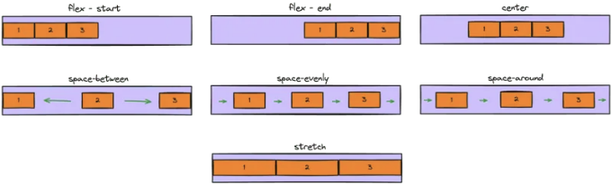

```js
div {
  justify-content: flex-start | flex-end | center | space-between | space-around | space-evenly | start | end | left | right ... + safe | unsafe;
}
```

<!-- ui-log 수평형 -->
<ins class="adsbygoogle"
  style="display:block"
  data-ad-client="ca-pub-4877378276818686"
  data-ad-slot="9743150776"
  data-ad-format="auto"
  data-full-width-responsive="true"></ins>
<component is="script">
(adsbygoogle = window.adsbygoogle || []).push({});
</component>

5. align-items
이 속성은 플렉스 항목들을 교차 축을 따라 정렬합니다.
가능한 값은:

- flex-start (기본값)
- flex-end
- center
- baseline

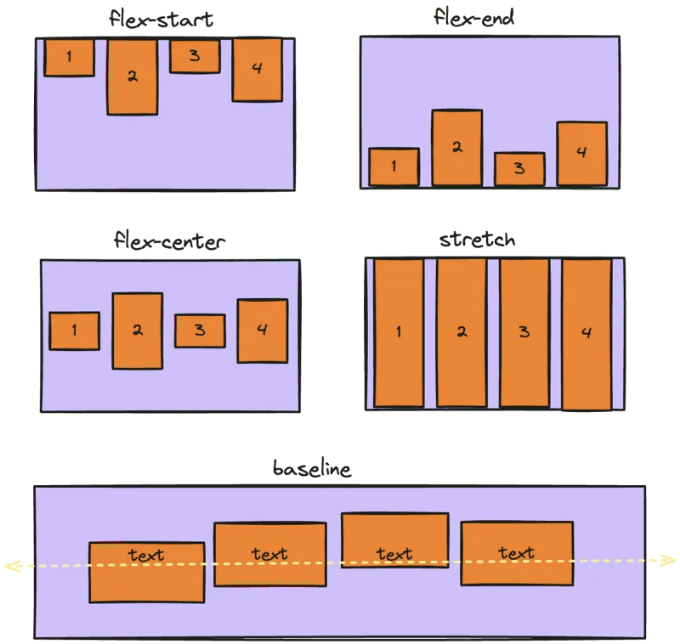

```js
div {
  align-items: stretch | flex-start | flex-end | center | baseline | first baseline | last baseline | start | end | self-start | self-end + ... safe | unsafe;
}
```

<!-- ui-log 수평형 -->
<ins class="adsbygoogle"
  style="display:block"
  data-ad-client="ca-pub-4877378276818686"
  data-ad-slot="9743150776"
  data-ad-format="auto"
  data-full-width-responsive="true"></ins>
<component is="script">
(adsbygoogle = window.adsbygoogle || []).push({});
</component>

6. align-content
축 방향에서 여분의 공간이 있을 때 플렉스 아이템의 라인을 정렬합니다.
가능한 값은:

- flex-start (기본값)
- flex-end
- center
- space-between
- space-around
- space-evenly

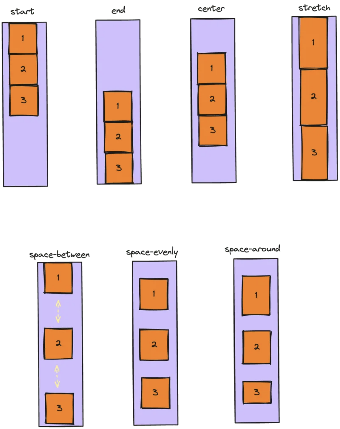

```js
div {
  align-content: flex-start | flex-end | center | space-between | space-around | space-evenly | stretch | start | end | baseline | first baseline | last baseline + ... safe | unsafe;
}
```

<!-- ui-log 수평형 -->
<ins class="adsbygoogle"
  style="display:block"
  data-ad-client="ca-pub-4877378276818686"
  data-ad-slot="9743150776"
  data-ad-format="auto"
  data-full-width-responsive="true"></ins>
<component is="script">
(adsbygoogle = window.adsbygoogle || []).push({});
</component>

7. 갭, 행 갭, 열 갭
플렉스 아이템 사이의 간격을 명시적으로 제어합니다.

```css
.div {
  display: flex;
  ...
  gap: 10px;
  gap: 10px 20px; /* 행 갭 열 갭 */
  row-gap: 10px;
  column-gap: 20px;
}
```

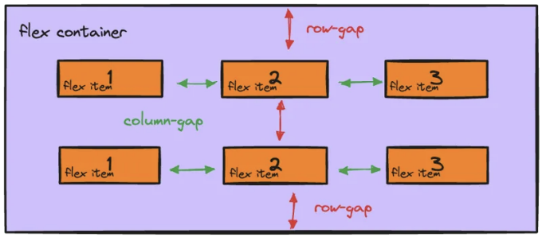

자식 속성 (플렉스 아이템)용 속성들:

<!-- ui-log 수평형 -->
<ins class="adsbygoogle"
  style="display:block"
  data-ad-client="ca-pub-4877378276818686"
  data-ad-slot="9743150776"
  data-ad-format="auto"
  data-full-width-responsive="true"></ins>
<component is="script">
(adsbygoogle = window.adsbygoogle || []).push({});
</component>

1. order
flex 항목의 순서를 설정합니다. 기본값은 0입니다.

```js
.item1 {
    order: 2;
}
```

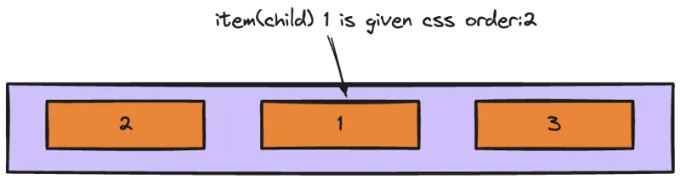

2. flex-grow
flex 항목이 형제 항목에 비해 얼마나 더 늘어날지를 제어합니다. 기본값은 0입니다.

<!-- ui-log 수평형 -->
<ins class="adsbygoogle"
  style="display:block"
  data-ad-client="ca-pub-4877378276818686"
  data-ad-slot="9743150776"
  data-ad-format="auto"
  data-full-width-responsive="true"></ins>
<component is="script">
(adsbygoogle = window.adsbygoogle || []).push({});
</component>

```js
.item2 {
    flex-grow: 2;
}
```

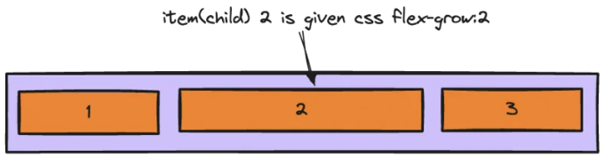

3. flex-shrink
다른 요소와 비교했을 때 flex 요소가 얼마나 축소될지를 제어합니다. 기본값은 1입니다.

```js
.item2 {
    flex-shrink: 0;
}
```

<!-- ui-log 수평형 -->
<ins class="adsbygoogle"
  style="display:block"
  data-ad-client="ca-pub-4877378276818686"
  data-ad-slot="9743150776"
  data-ad-format="auto"
  data-full-width-responsive="true"></ins>
<component is="script">
(adsbygoogle = window.adsbygoogle || []).push({});
</component>

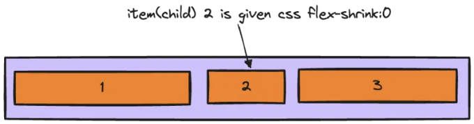

4. align-self
컨테이너의 align-items 속성을 무시하고 flex 항목이 자체 정렬을 설정할 수 있습니다.

```js
.item {
    align-self: center;
}
```

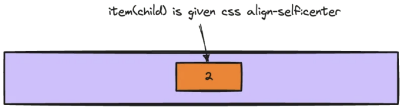  

<!-- ui-log 수평형 -->
<ins class="adsbygoogle"
  style="display:block"
  data-ad-client="ca-pub-4877378276818686"
  data-ad-slot="9743150776"
  data-ad-format="auto"
  data-full-width-responsive="true"></ins>
<component is="script">
(adsbygoogle = window.adsbygoogle || []).push({});
</component>

5. flex-basis
선택한 flex 항목의 성장 또는 축소 전 초기 크기를 설정합니다.

```js
.item2 {
    flex-basis: 2;
}
```

# 추가 정보

CSS 유연한 박스 레이아웃 모듈 레벨 1 (W3C): CSS Flexbox의 공식 명세서입니다.
CSS Flexbox Cheatsheet (DigitalOcean): 예제와 설명이 담긴 편리한 가이드입니다.
CSS Flexbox를 사용하여 요소 가운데 정렬하기 (DigitalOcean): 요소를 가운데 정렬하기 위한 Flexbox 사용 설명서입니다.

<!-- ui-log 수평형 -->
<ins class="adsbygoogle"
  style="display:block"
  data-ad-client="ca-pub-4877378276818686"
  data-ad-slot="9743150776"
  data-ad-format="auto"
  data-full-width-responsive="true"></ins>
<component is="script">
(adsbygoogle = window.adsbygoogle || []).push({});
</component>

그게 전부야! 이제 CSS 플렉스박스에 대한 뛰어난 기초 지식을 가졌어. 궁금한 점이 있거나 추가 도움이 필요하면 언제든지 말해줘!

행복한 코딩하자! 😊